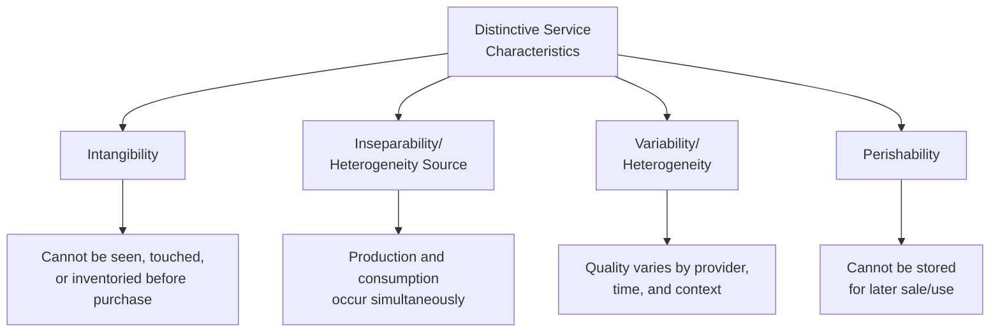
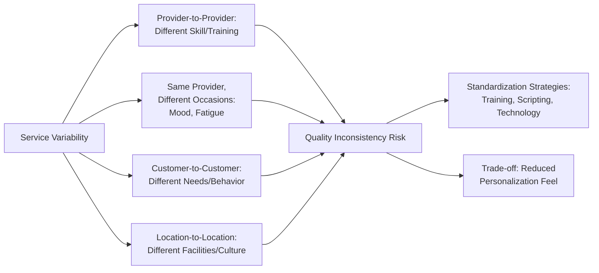

## Distinctive Characteristics of Services

### Overview

Services marketing theory distinguishes services from physical goods along several dimensions that carry direct psychological and managerial implications for how marketing, quality perception, and customer experience must be approached. These distinguishing characteristics — most commonly summarized as **Intangibility, Inseparability, Variability, and Perishability (IHIP)** — explain why services require fundamentally different marketing strategies than tangible products, and why customer psychology plays an outsized role in service evaluation compared to goods evaluation.

---

### The IHIP Framework

**Diagram (svg_diagram): IHIP Framework Overview**

---

### Intangibility

**Definition**: Services cannot be seen, touched, tasted, or physically possessed before purchase, unlike physical goods which can be inspected prior to the buying decision.

**Key Points**

- Because customers cannot directly evaluate a service before purchase, they rely heavily on **surrogate indicators** — physical evidence, provider reputation, price, and word-of-mouth — to infer likely quality.
- **[Inference]** This reliance on surrogate cues elevates the psychological weight of perceived risk in service purchases relative to goods purchases, since the core uncertainty-reduction mechanisms available for tangible products (physical inspection, sampling) are largely unavailable.
- Intangibility also complicates communication: marketing must describe an experience or outcome rather than depict a physical object, often requiring **tangibilization strategies** (e.g., using physical evidence like branded uniforms, facility design, or certificates to make intangible quality feel more concrete).

**Example**

A financial advisory firm cannot let a prospective client "try before buying" the actual advisory relationship. Instead, it tangibilizes trust and competence through professional certifications displayed prominently, polished client-facing materials, testimonials, and the physical environment of its offices — all serving as proxies for otherwise unobservable expertise.

**[Inference]** Marketing communications for highly intangible services (e.g., consulting, insurance, education) generally place greater emphasis on trust signals, credentials, and social proof relative to goods marketing, which can rely more directly on product demonstration and sensory appeal.

---

### Inseparability (Simultaneous Production and Consumption)

**Definition**: Unlike goods, which are typically produced, stored, and later sold and consumed at different times, most services are produced and consumed simultaneously — the customer is often present during service delivery and can directly influence the outcome.

**Key Points**

- Inseparability means the service provider (often a specific individual employee) is inextricably linked to the service itself in the customer's perception — the employee effectively *is* the product at the moment of delivery.
- Customers frequently participate directly in service production (e.g., providing information, following instructions, cooperating with staff), making them **co-producers** rather than passive recipients — a dynamic largely absent in goods consumption.
- **[Inference]** Because customers can witness and influence production directly, service failures are often immediately visible and personally experienced in real time, unlike a defective physical product which can sometimes be identified and corrected before reaching the customer (e.g., through quality control inspection prior to shipment).

**Example**

A poor server interaction at a restaurant is experienced by the customer at the exact moment of service failure, with limited opportunity for the business to intercept or correct the problem before the customer perceives it — unlike a manufacturing defect that might be caught during quality inspection before a product ever reaches a customer.

**[Inference]** Inseparability elevates the importance of frontline employee training and empowerment in services marketing, since employee behavior during the service encounter (sometimes called the "moment of truth") often determines the customer's overall quality perception more directly than any prior marketing communication.

---

### Variability (Heterogeneity)

**Definition**: Service quality can vary significantly depending on who provides it, when, where, and under what circumstances — even within the same organization or from the same provider across different occasions.

**Key Points**

- Variability arises from the human element central to most service delivery: individual employee skill, mood, fatigue, and interpersonal dynamics with each specific customer all introduce quality variation that is largely absent in standardized manufactured goods.
- **[Inference]** This variability creates a persistent gap-management challenge for service organizations, commonly addressed through standardization efforts (training protocols, scripting, technology-enabled consistency) balanced against the risk that excessive standardization can reduce the personalization and human warmth that customers often value in service interactions.
- Variability directly affects customer expectation management: prior positive experiences with a specific provider create expectations that may not be met by a different employee or location, creating potential dissonance between anticipated and actual quality.

**Diagram (svg_diagram): Sources of Service Variability**

**[Inference]** The tension between standardization (consistency) and customization (personalization, human warmth) represents a genuine, unresolved strategic trade-off in services marketing rather than a problem with a single correct solution — the optimal balance varies by service category and target customer expectations (e.g., a luxury hospitality brand may deliberately favor customization despite variability risk, while a quick-service context may favor standardization despite reduced personalization).

---

### Perishability

**Definition**: Services cannot be produced in advance and stored for later sale or use — unused service capacity (an empty hotel room, an unbooked consulting hour, an empty airline seat) is permanently lost once the time period passes.

**Key Points**

- Perishability creates a fundamental **capacity-demand matching problem**: unlike goods, excess service capacity cannot be inventoried during low-demand periods to sell during high-demand periods.
- **[Inference]** This drives widespread adoption of demand-management strategies in service industries — dynamic/yield pricing, reservation systems, off-peak discounting, and capacity flexibility mechanisms — specifically because the alternative (unused capacity) represents permanently lost revenue rather than deferred sale.
- Perishability also has direct psychological implications for customer behavior: scarcity-based pricing (e.g., "only 2 rooms left at this rate") leverages genuine capacity constraints, connecting directly to the scarcity principle in persuasion psychology, provided the scarcity communicated is genuine rather than fabricated.

**Example**

An airline seat unsold at departure time cannot be stored and sold on a later flight; this economic reality drives the extensive use of dynamic pricing and overbooking strategies specific to service industries, which have no direct equivalent in most physical goods retailing.

---

### Extended Characteristics: Ownership and Perceived Risk

Beyond the classic IHIP framework, services marketing literature commonly notes two additional distinguishing features:

- **Lack of ownership**: customers typically gain access to or use of a service (a hotel room for a night, a consultant's expertise for a project) without acquiring permanent ownership of any physical asset, unlike goods purchases.
- **Elevated perceived risk**: the combination of intangibility (limited pre-purchase evaluation), inseparability (real-time, unrecoverable delivery), and variability (inconsistent quality) collectively produces higher perceived risk in service purchases relative to comparable-value goods purchases.

$$\text{Perceived Service Risk} \propto \text{Intangibility} \times \text{Inseparability} \times \text{Variability}$$

**[Inference]** This is a conceptual relationship rather than a literal measured formula — the underlying finding in services marketing research is that these characteristics interact to compound perceived risk, not that they combine according to a precise mathematical function.

---

### Managerial and Psychological Implications Summary

| Characteristic | Core Challenge | Common Strategic Response |
| --- | --- | --- |
| Intangibility | Difficulty pre-evaluating quality | Tangibilization: physical evidence, credentials, testimonials |
| Inseparability | Real-time production; employee-as-product | Frontline employee training, empowerment, service recovery protocols |
| Variability | Inconsistent quality across providers/occasions | Standardization (SOPs, technology) balanced with personalization |
| Perishability | Unused capacity is permanently lost | Demand management: dynamic pricing, reservations, off-peak incentives |

---

### Critiques and Evolving Perspectives on IHIP

**[Inference]** While IHIP remains the dominant teaching framework in services marketing curricula, some services marketing scholars have noted that the goods-services distinction is increasingly blurred in practice — many offerings combine substantial goods and service elements (e.g., software-as-a-service products with both tangible interface elements and ongoing service delivery), and some traditionally "pure" services have become more standardized and less variable through technology (e.g., automated banking transactions). This has led some academic literature to treat IHIP characteristics as a spectrum along which offerings vary in degree, rather than a strict binary distinction between goods and services.

**[Speculation]** The continued growth of digitally-delivered and AI-mediated services may be gradually reducing certain traditional service characteristics — for example, AI-driven service delivery can reduce variability (consistent automated responses) while potentially increasing perceived intangibility concerns (reduced human presence); the extent and implications of this shift for classical services marketing theory remain an actively developing area of academic and practitioner discussion rather than a settled reformulation of the framework.

---

### Related Topics

- Servicescape and Physical Evidence Design
- Service Quality Models (SERVQUAL and the Gaps Model)
- Service Recovery and the Service Recovery Paradox
- Moments of Truth and Critical Incident Technique
- Demand Management and Yield/Revenue Management
- Customer Co-Production and Participation in Service Delivery
- Frontline Employee Training and Emotional Labor
- Perceived Risk Theory in Service Purchases
- Trust and Commitment in Long-Term Relationships
- Experiential Marketing and the Customer Journey