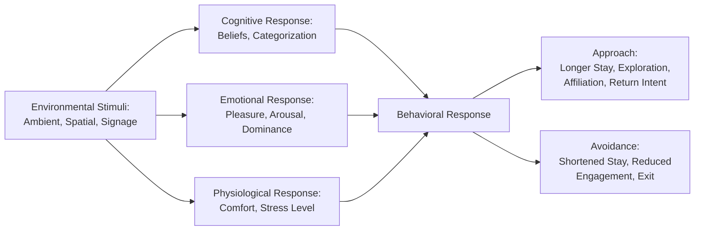
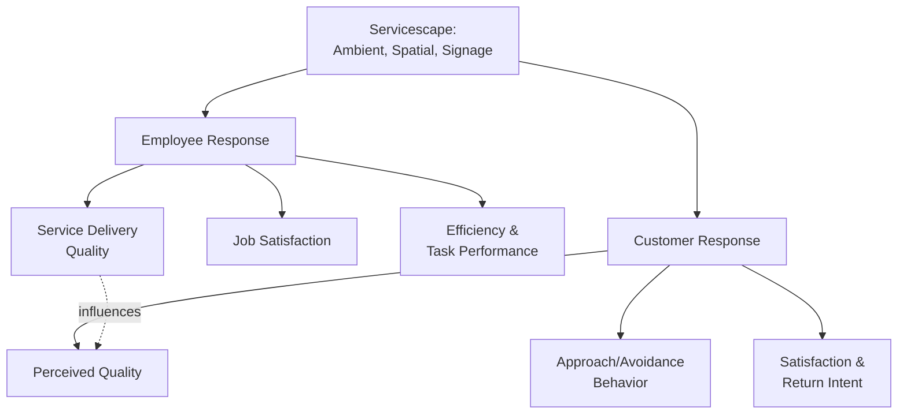

## The Servicescape and Its Psychological Effects

### Overview

The servicescape refers to the built physical environment in which a service is delivered and consumed — encompassing ambient conditions, spatial layout, and signs/symbols/artifacts — and the theory examining how this environment shapes customer and employee emotions, cognitions, and behaviors. Coined by Bitner (1992), the servicescape framework directly addresses the intangibility challenge in services marketing: because services cannot be physically inspected before purchase, the physical environment becomes a primary psychological cue customers use to infer quality, form expectations, and regulate their behavior during the service encounter.

---

### Theoretical Foundation: The Stimulus-Organism-Response (S-O-R) Model

Bitner's servicescape model is grounded in environmental psychology's Stimulus-Organism-Response framework (originally developed by Mehrabian and Russell), which holds that environmental stimuli (S) trigger internal emotional and cognitive states in the individual (O), which in turn produce approach or avoidance behaviors (R).

**Diagram (svg_diagram): S-O-R Model Applied to Servicescape**

**Key Points**

- The **Pleasure-Arousal-Dominance (PAD)** dimensions, drawn from Mehrabian and Russell's environmental psychology research, are commonly used to characterize the emotional response evoked by an environment: pleasure (happy vs. unhappy), arousal (stimulated vs. unstimulated), and dominance (in-control vs. controlled).
- **[Inference]** Of these three dimensions, pleasure and arousal are generally treated in servicescape research as the primary predictors of approach-avoidance behavior, with dominance playing a comparatively secondary role in most consumer service contexts (though it may be more salient in specific contexts involving perceived autonomy, such as self-service environments).

---

### The Three Core Dimensions of the Servicescape

Bitner's original framework identifies three composite environmental dimensions:

#### 1. Ambient Conditions

Background environmental characteristics that affect the five senses, often operating below conscious awareness but still shaping mood and behavior.

| Element | Psychological Effect |
| --- | --- |
| Lighting | Bright lighting increases arousal and can support alertness; dim lighting can support relaxation or intimacy depending on context |
| Music/sound | Tempo affects perceived pace of time and can influence dwell time and spending behavior; volume affects arousal and communication ease |
| Temperature | Discomfort from extreme temperature reduces dwell time and negatively colors overall evaluation |
| Scent | Can trigger mood elevation, memory association, and even purchase intent, largely through nonconscious processing |
| Color | Warm colors (red, orange) tend to increase arousal; cool colors (blue, green) tend to support calm and relaxation |

**[Inference]** Many ambient effects operate largely outside conscious customer awareness — customers rarely attribute their mood explicitly to background music tempo or ambient scent, yet these factors are documented in environmental psychology and marketing research as measurably influencing behavior, making them powerful but ethically sensitive tools (see ethical considerations below).

#### 2. Spatial Layout and Functionality

The arrangement of furniture, equipment, and pathways, and how effectively this arrangement supports the intended customer and employee activities.

**Key Points**

- **Layout** affects wayfinding ease, perceived efficiency, and the natural flow of customer movement through a space.
- **Functionality** refers to whether the physical arrangement actually supports the tasks customers and employees need to accomplish (e.g., adequate counter space, accessible seating, logical queue design).
- **[Inference]** Poor spatial layout can create frustration and perceived incompetence even when service quality itself (staff skill, product quality) is otherwise strong, since navigational difficulty is directly and immediately experienced by the customer, coloring their overall service evaluation through a halo effect.

#### 3. Signs, Symbols, and Artifacts

Explicit and implicit communicative elements that convey information, establish norms, and signal identity/quality.

| Element | Function |
| --- | --- |
| Explicit signage | Directional guidance, rules, wayfinding |
| Décor and design style | Implicit quality and brand-positioning signal (e.g., minimalist luxury vs. casual/vibrant) |
| Materials and finishes | Quality inference (e.g., marble vs. laminate surfaces implying different price/quality tiers) |
| Staff uniforms/appearance | Professionalism and role clarity signals |

**Example**

A boutique hotel using natural materials (wood, stone), soft ambient lighting, and curated art positions itself psychologically as a premium, design-conscious brand before a guest interacts with any staff member — the servicescape itself communicates positioning and sets quality expectations that subsequent service delivery must then meet or exceed.

---

### Servicescape Effects on Both Customers and Employees

**Key Points**

- Bitner's original framework explicitly notes that the servicescape simultaneously affects **both customers and employees**, since both groups occupy and respond to the same physical environment.
- **[Inference]** Employee responses to the servicescape (comfort, efficiency support, morale effects of workplace aesthetics) can indirectly affect customer experience through employee mood and performance — meaning servicescape design decisions optimized purely for customer perception without considering employee experience may create unintended service-quality trade-offs (e.g., aesthetically striking but ergonomically poor workspaces that increase employee fatigue).

**Diagram (svg_diagram): Dual-Audience Servicescape Effects**

---

### Servicescape Typology by Complexity and Usage Pattern

Bitner's framework further distinguishes servicescapes by usage complexity, which affects appropriate design emphasis:

| Type | Description | Example | Design Priority |
| --- | --- | --- | --- |
| Self-service | Customer performs most activities without staff involvement | ATM, self-checkout kiosk | Clear wayfinding, intuitive functionality |
| Interpersonal service | Both customer and employee present and interact | Restaurant, retail store, hospital | Balance customer comfort and employee functionality |
| Remote service | Employee present, customer largely absent from physical space | Call center, back-office processing | Primarily employee-focused design; minimal direct customer servicescape exposure |

**[Inference]** As service delivery increasingly incorporates digital and hybrid channels (e.g., in-app interfaces functioning as a "digital servicescape" for otherwise self-service or remote interactions), some services marketing scholarship has extended servicescape concepts to virtual and digital environments, examining how interface design, loading speed, and visual aesthetics of digital touchpoints produce analogous psychological effects to physical environmental design — though this remains a less mature research area than physical servicescape theory.

---

### Servicescape and Quality Inference (Signaling Theory Connection)

Because intangibility limits direct pre-purchase evaluation, the servicescape functions as a signaling mechanism customers use to infer otherwise unobservable service quality.

**[Inference]** This connects directly to signaling theory in economics and marketing: physical environment investment (higher-quality materials, more elaborate design, meticulous maintenance) functions as a costly, hard-to-fake signal of organizational quality and stability, since lower-quality or less-established providers may be less able or willing to invest comparably in their physical environment — making servicescape quality a genuine (if imperfect) proxy for underlying service quality in the customer's inferential process.

---

### Practical Applications and Design Considerations

**Key Points**

- **Congruence with brand positioning**: servicescape design should align with intended brand identity; a luxury positioning undermined by inconsistent or low-quality physical environment creates dissonance between marketing messaging and lived experience.
- **Target segment calibration**: different customer segments may respond differently to identical environmental stimuli (e.g., high arousal environments like loud music and bright lighting may suit a youth-oriented retail brand but conflict with a spa's relaxation positioning).
- **Crowding and personal space considerations**: perceived crowding (a function of both actual density and layout-driven perceived spaciousness) generally reduces satisfaction, though optimal crowding levels vary by service context (e.g., a busy, popular restaurant can signal desirability through moderate crowding, while excessive crowding produces discomfort).

---

### Ethical Considerations in Servicescape Design

**[Inference]** Because many ambient effects (scent, music tempo, lighting) operate on customer behavior largely outside conscious awareness, servicescape design raises similar ethical considerations to other forms of nonconscious behavioral influence discussed elsewhere in this course (e.g., choice architecture, sensory marketing). Widely accepted practice distinguishes between using environmental design to create a genuinely pleasant, functional experience (broadly considered ethically acceptable) versus using environmental manipulation specifically to induce behavior against the customer's own interest (e.g., deliberately disorienting layouts to increase unplanned purchases, or environments designed to discourage customers from leaving a service they wish to exit) — a distinction paralleling ethical persuasion boundaries covered under closing and negotiation psychology.

---

### Common Pitfalls and Misapplications

- **Treating servicescape as purely decorative rather than functionally purposeful**: aesthetic investment without attention to spatial functionality can create a visually appealing but frustrating customer experience.
- **Ignoring employee experience in servicescape design**: environments optimized solely for customer perception at the expense of employee ergonomics or workflow efficiency can create hidden service-quality costs.
- **Misaligned arousal-positioning fit**: applying high-arousal ambient design (bright lighting, upbeat music) to a service context where customers expect calm and reduced stimulation (e.g., healthcare waiting areas) can create dissonance and reduce satisfaction.
- **Assuming universal ambient effects across all customer segments**: individual and cultural variation in sensory preference and environmental sensitivity means specific ambient choices effective for one target segment may not generalize to others.
- **[Speculation]** As hybrid physical-digital service experiences become more prevalent (e.g., in-store digital kiosks, augmented reality retail features), the boundary between physical servicescape and digital interface design may increasingly blur, requiring integrated design approaches that address both dimensions simultaneously; the theoretical and practical frameworks for this integration remain an actively developing area rather than a settled discipline.

---

### Related Topics

- Distinctive Characteristics of Services
- Service Quality Models (SERVQUAL and the Gaps Model)
- Sensory Marketing and Ambient Scent/Sound Research
- Moments of Truth and Critical Incident Technique
- Choice Architecture and Nudge Theory
- Environmental Psychology and the Stimulus-Organism-Response Model
- Signaling Theory in Marketing and Quality Perception
- Frontline Employee Training and Emotional Labor
- Digital Servicescape and User Interface Psychology
- Perceived Risk Theory in Service Purchases