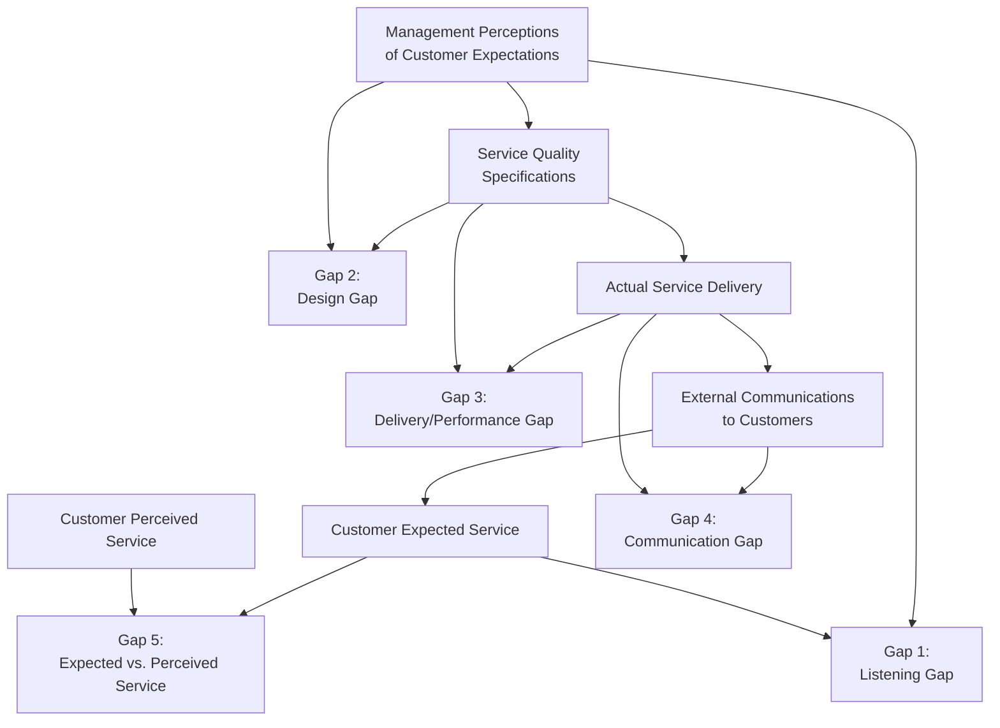
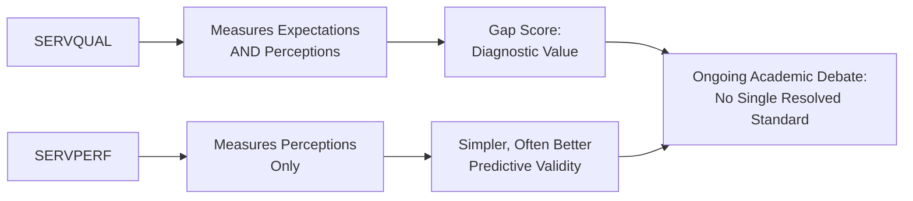

## Service Quality Models

### Overview

Service quality models provide structured frameworks for understanding how customers evaluate service performance and where organizational breakdowns occur between intended and delivered service. Because services are intangible, heterogeneous, and simultaneously produced and consumed (per the IHIP characteristics), quality cannot be assessed through the same objective, pre-verifiable standards used for physical goods — customers instead form quality judgments through a comparison process between expectations and perceptions. The dominant frameworks in this domain — the **Gaps Model** and **SERVQUAL** — formalize this comparison process and identify the specific organizational failure points that produce quality shortfalls.

---

### The Expectation-Disconfirmation Paradigm

The theoretical foundation underlying most service quality models is the **expectation-disconfirmation paradigm**, which holds that satisfaction and quality perception result from comparing perceived performance against prior expectations.

$$\text{Perceived Service Quality} = \text{Perceived Performance} - \text{Expected Performance}$$

**Key Points**

- **Positive disconfirmation** occurs when perceived performance exceeds expectations, generally producing satisfaction and positive quality perception.
- **Negative disconfirmation** occurs when perceived performance falls below expectations, generally producing dissatisfaction, regardless of the service's objective or absolute quality level.
- **[Inference]** Because this model is comparative rather than absolute, managing customer expectations is itself a legitimate and important service quality lever — an objectively identical service experience can be perceived as excellent or poor depending entirely on the expectations a customer held beforehand, which is why service marketing places significant emphasis on accurate, not necessarily maximized, expectation-setting in pre-purchase communication.

---

### The Gaps Model of Service Quality (Parasuraman, Zeithaml, and Berry)

The Gaps Model, developed by Parasuraman, Zeithaml, and Berry (PZB) in the 1980s, identifies five specific gaps where breakdowns between customer expectations and organizational delivery can occur.

**Diagram (svg_diagram): The Five Service Quality Gaps**

#### Gap 1: The Listening Gap

**Definition**: The difference between what customers actually expect and management's perception of what customers expect.

**[Inference]** This gap arises from insufficient market research, inadequate upward communication from frontline employees (who often have the most direct insight into customer expectations), or excessive organizational layers between customer-facing staff and decision-makers — closing it generally requires structured customer research and mechanisms for frontline insight to reach management.

#### Gap 2: The Design/Standards Gap

**Definition**: The difference between management's accurate understanding of customer expectations and the actual service quality specifications/standards set for delivery.

**[Inference]** This gap can occur even when management correctly understands customer expectations, if resource constraints, feasibility limitations, or inadequate translation of understood expectations into concrete, actionable service standards prevent those expectations from being properly encoded into operational specifications.

#### Gap 3: The Delivery/Performance Gap

**Definition**: The difference between established service quality specifications and the actual service delivered by employees.

**Key Points**

- This gap is often the most directly visible to customers, since it represents the discrepancy between what the organization intended to deliver and what employees actually deliver in practice.
- **[Inference]** Given the inseparability characteristic of services (employee behavior directly constitutes the service at the point of delivery), this gap is heavily influenced by employee training adequacy, role clarity, motivation, and the presence of adequate support systems and technology — making frontline employee management a central lever for closing this specific gap.

#### Gap 4: The Communication Gap

**Definition**: The difference between what is promised through external marketing communications and what is actually delivered.

**[Inference]** This gap is particularly consequential because it directly inflates customer expectations beyond what the organization can reliably deliver, meaning overpromising in advertising or sales communication can paradoxically reduce perceived quality even when actual service delivery is objectively strong but simply fails to match exaggerated promotional claims.

#### Gap 5: The Customer Gap

**Definition**: The overall difference between customer expectations and customer perceptions of actual service received — this is the cumulative gap that customers directly experience and that the other four gaps collectively determine.

**[Inference]** Gap 5 is generally treated as the outcome variable in the model — the actual perceived service quality experienced by the customer — while Gaps 1 through 4 represent the internal organizational diagnostic tools for understanding and addressing the root causes contributing to Gap 5.

---

### SERVQUAL: Measuring Service Quality

**SERVQUAL**, developed by the same PZB research team, operationalizes Gap 5 into a multi-item survey instrument measuring the difference between customer expectations and perceptions across five specific quality dimensions.

**The Five SERVQUAL Dimensions (RATER):**

| Dimension | Definition | Example Item Focus |
| --- | --- | --- |
| **R**eliability | Ability to perform the promised service dependably and accurately | Consistent, error-free service delivery |
| **A**ssurance | Employee knowledge, courtesy, and ability to inspire trust and confidence | Staff competence and professionalism |
| **T**angibles | Physical facilities, equipment, and appearance of personnel | Servicescape elements (see related topic) |
| **E**mpathy | Caring, individualized attention provided to customers | Personalized service, understanding specific needs |
| **R**esponsiveness | Willingness to help customers and provide prompt service | Speed and attentiveness of service response |

$$\text{SERVQUAL Score} = \text{Perception Score} - \text{Expectation Score}$$

**[Inference]** A negative SERVQUAL score on any dimension indicates perceived performance below expectations on that dimension, while a positive score indicates performance exceeding expectations; the instrument is typically administered across multiple items per dimension using paired expectation and perception statements on a Likert scale.

---

### Reliability as the Most Consistently Weighted Dimension

**[Inference]** Across the substantial body of empirical SERVQUAL research since its introduction, Reliability is frequently identified as the most heavily weighted dimension in overall service quality perception across many service categories — consistent with the intuitive finding that customers generally prioritize a service simply working as promised over other quality dimensions like empathy or tangibles. However, the specific relative weighting of dimensions is documented to vary meaningfully across service industries (e.g., empathy may weigh more heavily in healthcare or personal services than in utility services), so this should be treated as a general tendency rather than a fixed, universal ranking.

---

### Critiques of SERVQUAL

SERVQUAL has faced substantial academic critique since its introduction, and understanding these critiques is important for accurately representing its current standing in services marketing scholarship:

- **Dimensionality concerns**: some empirical studies have found that the five dimensions do not consistently emerge as distinct factors across different service contexts, suggesting the RATER structure may not generalize uniformly across all industries.
- **Expectation measurement problems**: critics (notably Cronin and Taylor, 1992) argue that measuring expectations separately from perceptions is methodologically problematic and that expectations themselves are difficult for respondents to articulate accurately, particularly before versus after service experience.
- **SERVPERF alternative**: Cronin and Taylor proposed **SERVPERF**, a performance-only measure (dropping the expectation component entirely) arguing that perceived performance alone predicts satisfaction and quality perception better than the expectation-minus-performance gap score.

$$\text{SERVPERF Score} = \text{Perception Score only}$$

**[Inference]** The SERVQUAL versus SERVPERF debate remains genuinely unresolved in services marketing academic literature; some studies find SERVPERF has superior predictive validity and lower measurement complexity, while SERVQUAL retains value specifically for diagnostic purposes (identifying which dimensions fall short of expectations, useful for targeted improvement) even if its predictive performance for overall satisfaction is contested. Practitioners should treat the choice between these instruments as context-dependent rather than assume one is universally superior.

---

### Diagram: SERVQUAL vs. SERVPERF Comparison

**Diagram (svg_diagram): Measurement Approach Comparison**

---

### Practical Application of the Gaps Model

**Key Points**

- The Gaps Model's primary practical value is diagnostic: when Gap 5 (overall customer-perceived quality shortfall) is identified, managers can systematically investigate which of Gaps 1–4 is the primary contributing cause, rather than addressing quality problems through generic, undifferentiated interventions.
- **Example diagnostic sequence**: if customer satisfaction surveys reveal a quality shortfall (Gap 5), management should investigate whether this stems from misunderstanding customer needs (Gap 1), inadequate service standards (Gap 2), inconsistent employee execution (Gap 3), or overpromising marketing communication (Gap 4) — each requiring a distinct corrective intervention.

---

### Common Pitfalls and Misapplications

- **Treating all five SERVQUAL dimensions as equally weighted across all service contexts**: applying a uniform weighting scheme ignores documented industry-specific variation in which dimensions most strongly drive overall quality perception.
- **Addressing Gap 5 symptoms without diagnosing the specific contributing gap**: generic quality improvement initiatives that do not identify whether the root cause lies in research, design, delivery, or communication often fail to resolve the underlying problem efficiently.
- **Overpromising in marketing to differentiate from competitors**: inflating customer expectations through communication (widening the risk of Gap 4) can reduce perceived quality even when absolute service delivery is strong, since the disconfirmation model evaluates performance relative to expectations, not in absolute terms.
- **Applying SERVQUAL uncritically without acknowledging its measurement debates**: presenting SERVQUAL as a definitively validated, unambiguous standard without noting the SERVPERF critique and ongoing dimensionality concerns overstates the current academic consensus.
- **[Speculation]** As service delivery increasingly incorporates AI-driven and self-service digital channels, some services marketing scholars suggest that the RATER dimensions may require adaptation or reweighting for digital contexts (e.g., "Tangibles" translating to interface design quality, "Empathy" being harder to convey through automated interactions); the extent to which existing service quality models require substantial revision for digital and AI-mediated service contexts remains an actively developing research question rather than a settled reformulation.

---

### Related Topics

- Distinctive Characteristics of Services
- The Servicescape and Its Psychological Effects
- Customer Satisfaction and the Expectation-Disconfirmation Model
- Service Recovery and the Service Recovery Paradox
- Moments of Truth and Critical Incident Technique
- Net Promoter Score and Alternative Loyalty Metrics
- Frontline Employee Training and Emotional Labor
- Trust and Commitment in Long-Term Relationships
- Digital Service Quality and E-Service Quality Frameworks
- Perceived Risk Theory in Service Purchases