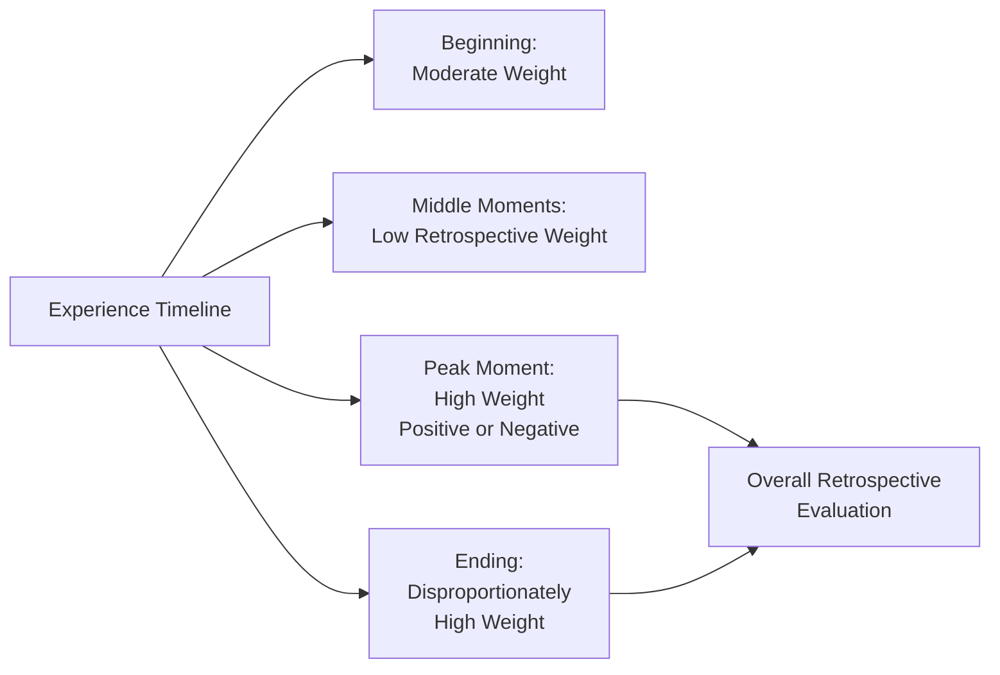
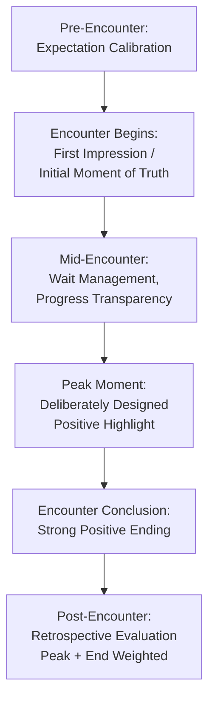

## Managing Perception During Service Encounters

### Overview

Managing perception during service encounters addresses the deliberate psychological and operational techniques organizations use to shape how customers interpret and evaluate service experiences as they unfold in real time, rather than relying solely on delivering objectively high-quality service. Because service quality is fundamentally a perceptual, comparative judgment (per the expectation-disconfirmation paradigm), organizations can meaningfully influence customer satisfaction not only through actual performance improvements but through managing the psychological framing, timing, and sequencing of the service experience itself.

---

### The Service Encounter as a "Moment of Truth"

The concept of the **moment of truth** — originally popularized by Jan Carlzon at Scandinavian Airlines — refers to any specific point of interaction between a customer and an organization where the customer forms or revises their quality perception, often within seconds.

**Key Points**

- Each moment of truth is an independent opportunity to confirm, exceed, or violate customer expectations, and cumulative moments of truth across a service journey collectively determine overall quality perception.
- **[Inference]** Because services are produced and consumed simultaneously (inseparability), moments of truth occur in real time with limited opportunity for correction, making proactive perception management (anticipating and shaping these moments) more valuable than purely reactive quality control.
- Organizations commonly map the full sequence of moments of truth through **service blueprinting** — documenting every customer touchpoint alongside the supporting backstage processes — to identify where perception management interventions are most needed.

---

### Peak-End Rule and Experience Sequencing

One of the most extensively applied behavioral psychology findings in service encounter management is Kahneman's **peak-end rule**: people's retrospective evaluation of an experience is disproportionately determined by the most intense moment (peak, positive or negative) and the final moment (end), rather than by the average quality across the entire experience or its total duration.

**Diagram (svg_diagram): Peak-End Rule in Service Experience**

**Key Points**

- **[Inference]** The practical implication widely drawn from peak-end research in services marketing is that organizations should strategically prioritize (1) creating a strong positive peak moment somewhere in the service journey and (2) ensuring the final moments of the encounter are positive, even if this requires disproportionate resource allocation relative to a purely average-quality-maximizing approach.
- Duration neglect (the finding that total experience length has surprisingly little effect on retrospective evaluation) suggests that a shorter but well-sequenced experience can be remembered more favorably than a longer experience with an equivalent or even higher average quality but a weak ending.

**Example**

A hotel that experiences a minor service delay early in a guest's stay but delivers an exceptional, personalized checkout experience (unexpected small gift, genuine warm farewell, seamless billing) may achieve stronger overall satisfaction ratings than a hotel with uniformly adequate but unremarkable service throughout, illustrating how ending experience quality can outweigh average performance in shaping final perception.

---

### Managing the Waiting Experience

Waiting time is one of the most extensively studied perception-management challenges in services marketing, since perceived wait duration and actual wait duration are often only loosely correlated.

**Principles of wait psychology (drawing substantially from Maister's foundational work on the psychology of waiting lines):**

| Principle | Description | Application |
| --- | --- | --- |
| Occupied time feels shorter | Unoccupied waiting feels longer than occupied waiting | Providing menus, entertainment, or informational displays during waits |
| Uncertain waits feel longer | Not knowing wait duration increases perceived wait time and anxiety | Providing estimated wait times or queue position updates |
| Anxiety increases perceived wait | Worry about being forgotten or overlooked amplifies perceived duration | Clear queue management systems, visible staff acknowledgment |
| Unexplained waits feel longer | Waits without a clear reason feel more frustrating | Proactively communicating reasons for delays |
| Unfair waits feel longer | Perceived queue-jumping or inequity amplifies frustration | Transparent, visibly fair queuing systems (e.g., single-line systems) |
| Solo waits feel longer | Waiting alone feels longer than waiting with others | Group waiting areas, shared engagement opportunities |
| Pre-process waits feel longer than in-process waits | Waiting before service begins feels longer than waiting during service delivery | Beginning some visible aspect of service as early as possible |

**[Inference]** These principles collectively support a broader psychological finding: perceived wait time is more strongly influenced by cognitive and emotional framing (occupation, certainty, fairness, explanation) than by objective clock duration alone, making wait-experience design a legitimate and often underutilized lever for improving overall service perception independent of actually reducing wait times.

---

### Framing and Expectation Calibration

Because service quality perception is inherently comparative (performance relative to expectation), organizations can influence perceived quality by managing the expectations customers hold before and during the encounter, in addition to managing actual performance.

**Key Points**

- **Underpromise, overdeliver**: setting conservative expectations (e.g., a longer quoted delivery time than typically required) increases the likelihood of positive disconfirmation upon actual delivery.
- **[Inference]** This strategy carries a genuine trade-off: excessively conservative expectation-setting risks reducing initial purchase appeal or competitive positioning (a competitor promising faster service may win the initial choice) even if it improves post-purchase satisfaction — meaning expectation management must balance pre-purchase competitiveness against post-purchase satisfaction optimization rather than simply minimizing promised performance.
- **Progress and transparency framing**: proactively communicating status updates during a service process (e.g., order tracking, real-time progress indicators) reduces uncertainty-driven anxiety and can improve perceived quality even without changing actual completion time.

---

### Sequencing Positive and Negative Elements

Building on prospect theory and mental accounting research, the order in which positive and negative elements of a service encounter are presented affects overall evaluation, independent of their aggregate sum.

**Documented sequencing principles from behavioral economics research on multi-outcome experiences:**

- Segregating multiple gains (presenting positive elements separately rather than combined) tends to be perceived more favorably than aggregating them into a single positive event.
- Combining multiple losses (aggregating negative elements into a single acknowledgment) tends to be perceived less negatively than experiencing them as separate, sequential negative events.
- Ending a mixed sequence on a positive note, consistent with the peak-end rule, generally improves overall retrospective evaluation even when a negative element occurred earlier in the sequence.

**[Inference]** These sequencing principles have direct practical application in service recovery scenarios: rather than delivering a single combined apology covering multiple service failures, and rather than following a resolved problem with additional minor negative interactions, service recovery is generally more effective when negative elements are acknowledged together and the encounter concludes with a clear positive resolution.

---

### Diagram: Perception Management Levers Across the Encounter

**Diagram (svg_diagram): Encounter-Wide Perception Management**

---

### Employee Role in Real-Time Perception Management

Because inseparability means employees directly constitute much of the service experience, frontline employee behavior is a central, real-time perception-management tool.

**Key Points**

- **Emotional labor**: employees are frequently required to display organizationally prescribed emotions (warmth, patience, enthusiasm) regardless of their genuine internal emotional state, directly shaping customer perception of the encounter's tone.
- **Service recovery empowerment**: employees equipped with the authority and training to resolve problems immediately during the encounter (rather than escalating through slow, multi-step processes) can convert a potential negative peak into a positive one through prompt, visible resolution.
- **[Inference]** Empowerment-based service recovery is particularly consequential given the peak-end rule: an employee's ability to promptly and visibly resolve a problem can transform what would otherwise become a negative peak or negative ending into a demonstration of organizational responsiveness, potentially producing a net positive retrospective evaluation despite the initial failure (a dynamic closely related to the service recovery paradox).

---

### Common Pitfalls and Misapplications

- **Focusing exclusively on average quality rather than peak and ending moments**: allocating resources evenly across an entire service journey while neglecting the ending or failing to create any distinct positive peak underperforms relative to strategically concentrated investment in these specific moments.
- **Ignoring wait psychology in favor of purely reducing objective wait time**: organizations that invest exclusively in reducing actual wait duration while neglecting occupation, transparency, and fairness framing often underachieve relative to the resources invested, since perceived wait time is only loosely tied to objective duration.
- **Overpromising to win initial purchase decisions**: prioritizing competitive positioning through aggressive service promises at the expense of realistic expectation-setting increases the risk of negative disconfirmation and dissatisfaction upon actual delivery.
- **Ending service recovery on a neutral or procedural note rather than a genuine positive resolution**: failing to apply peak-end sequencing principles to recovery scenarios specifically can leave a net negative impression even after the underlying problem has been technically resolved.
- **[Speculation]** As service encounters increasingly incorporate automated and AI-mediated touchpoints (chatbots, self-service kiosks, algorithmic queue management), the applicability of peak-end and wait-psychology principles derived largely from human-to-human service research may require reexamination — for instance, whether customers respond to automated transparency/status updates with the same anxiety-reduction effect documented for human-staffed waiting contexts remains a genuinely open and actively studied question rather than an established finding.

---

### Related Topics

- Service Quality Models
- The Servicescape and Its Psychological Effects
- Service Recovery and the Service Recovery Paradox
- Peak-End Rule and Prospect Theory (Kahneman)
- The Psychology of Waiting Lines (Maister's Principles)
- Service Blueprinting and Journey Mapping
- Emotional Labor and Frontline Employee Management
- Customer Satisfaction and the Expectation-Disconfirmation Model
- Distinctive Characteristics of Services
- Trust and Commitment in Long-Term Relationships