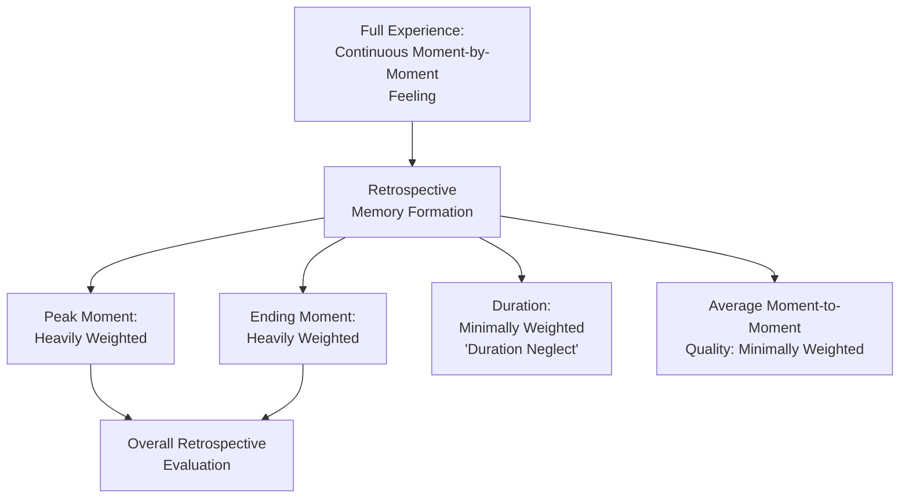
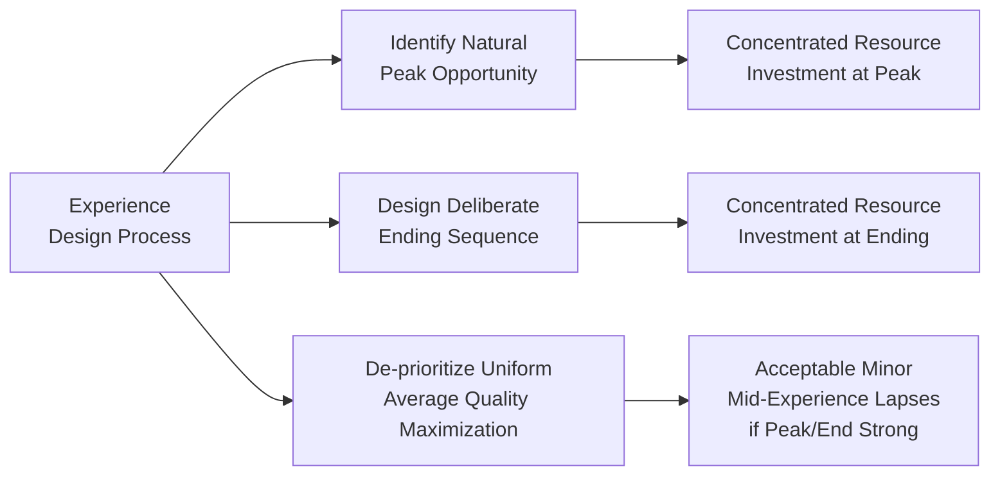

## Experiential Consumption and Peak-End Evaluation

### Overview

Experiential consumption refers to the paradigm in consumer behavior that treats purchases — particularly services, entertainment, travel, and hedonic experiences — as consumption of subjective, felt experiences rather than mere acquisition of objective attributes or outcomes. Peak-end evaluation, derived from Daniel Kahneman's behavioral economics research, is the specific psychological mechanism explaining how these experiences are retrospectively judged: not by their average quality or total duration, but disproportionately by their most intense moment (the peak) and their final moment (the end). Together, these frameworks form a foundational lens for understanding why customer memory and satisfaction with experiential offerings often diverge substantially from moment-by-moment experiential reality.

---

### Experiential Consumption: Theoretical Foundations

The experiential consumption perspective, most prominently associated with Holbrook and Hirschman's foundational 1982 work, argued that consumer behavior research had historically overemphasized rational, information-processing models of decision-making while neglecting the hedonic, symbolic, and emotionally-driven aspects of consumption.

**Key Points**

- Experiential consumption emphasizes **fantasies, feelings, and fun** as central to many consumption decisions, particularly for hedonic categories (entertainment, travel, dining, live events) as opposed to purely utilitarian categories.
- This perspective treats consumption as generating a **subjective stream of consciousness** — encompassing sensory pleasure, emotional arousal, and symbolic meaning — rather than simply the acquisition of a bundle of objective product attributes.
- **[Inference]** This theoretical shift has substantial practical implications for services and experience-based marketing: value is created not solely through functional performance but through the total subjective quality of the lived experience, including elements (ambiance, emotional narrative, social context) that traditional attribute-based value models do not directly capture.

---

### The Experience Economy Framework

Pine and Gilmore's **Experience Economy** concept extends experiential consumption theory into a strategic framework, arguing that businesses increasingly compete by staging memorable experiences as a distinct economic offering beyond goods and services.

| Economic Offering | Example | Customer Relationship |
| --- | --- | --- |
| Commodities | Raw coffee beans | Fungible, undifferentiated |
| Goods | Packaged ground coffee | Tangible, differentiated by brand |
| Services | Coffee made to order at a café | Intangible, customized delivery |
| Experiences | A themed café with ambiance, ritual, and social atmosphere | Memorable, personally engaging |

**[Inference]** This progression suggests that experience-based differentiation commands premium pricing precisely because it engages customers on memorable, emotionally resonant dimensions that commodity, goods, and even standard service offerings do not fully address — though the applicability and pricing premium of this framework vary considerably by category and target customer segment.

---

### Kahneman's Peak-End Rule: Core Mechanism

The peak-end rule, developed through Kahneman's experimental research (notably including studies on pain perception during medical procedures), demonstrates that retrospective evaluation of an experience is determined primarily by two data points: the most intense moment of the experience (positive or negative) and how the experience ends — largely independent of the experience's total duration or moment-by-moment average.

**Diagram (svg_diagram): Peak-End Rule Mechanism**

**Key Points**

- **Duration neglect**: the surprising and well-documented finding that the length of an experience has minimal effect on its retrospective evaluation — a shorter experience with a strong peak and good ending can be remembered more favorably than a longer experience with equivalent average quality.
- **The "experiencing self" versus the "remembering self"**: Kahneman's broader dual-self framework distinguishes between the self that lives through moment-to-moment experience (the experiencing self) and the self that later evaluates and remembers that experience (the remembering self) — and argues that most consumer decision-making about future experiences (including repeat purchase decisions) is driven by the remembering self's retrospective evaluation, not by an accurate aggregate of actual moment-to-moment experienced utility.
- **[Inference]** This distinction has significant implications for experiential marketing: because future purchase decisions are driven by remembered evaluation rather than experienced utility, optimizing for memorable peaks and strong endings may be more commercially effective than optimizing for the highest possible average moment-to-moment satisfaction throughout an experience.

---

### Empirical Basis and Appropriate Scope of Application

**[Unverified]** The peak-end rule is grounded in genuine, well-replicated behavioral economics and psychology research, including Kahneman's original colonoscopy-duration studies and related experimental work. However, the extensive extrapolation of these findings into broad, prescriptive marketing and service-design guidance (as commonly presented in business and marketing literature) extends considerably beyond the original experimental contexts (which focused substantially on physical discomfort/pain evaluation), and the precise generalizability of peak-end effects to all categories of positive hedonic and service experiences is a genuinely active area of ongoing behavioral research rather than a uniformly settled finding across every experience type.

**[Inference]** The core directional finding (peaks and endings disproportionately shape retrospective evaluation relative to duration and average) appears robust across a range of studied contexts, but practitioners should treat specific quantitative claims about peak-end effect magnitude in marketing contexts with appropriate caution, since much of the popularized business application is inferential extension rather than direct experimental replication in commercial service settings.

---

### Applying Peak-End Evaluation to Experience Design

**Diagram (svg_diagram): Experience Design for Peak-End Optimization**

**Common applications across experiential industries:**

| Industry | Peak Design Example | Ending Design Example |
| --- | --- | --- |
| Hospitality | Unexpected upgrade or personalized gesture mid-stay | Warm, personalized checkout farewell |
| Theme parks | A signature, high-intensity flagship attraction | Fireworks/closing spectacle before departure |
| Retail | An engaging, high-energy in-store demonstration or event | Positive, efficient checkout and departure experience |
| Live events/concerts | The headline performance or emotional climax | A memorable encore or closing moment |
| Dining | A standout signature dish or presentation moment | Complimentary dessert or genuine closing interaction |

**Example**

A theme park may accept moderate wait times and average-quality secondary attractions throughout a visitor's day, provided the visit includes one clearly memorable flagship experience (the peak) and concludes with a well-produced closing event before guests leave — reflecting a peak-end-informed resource allocation strategy rather than attempting uniform excellence across every moment of the visit.

---

### Connection to Service Recovery and the Service Recovery Paradox

Peak-end evaluation provides part of the psychological explanation for the **service recovery paradox** — the documented phenomenon where a customer who experiences a service failure that is then exceptionally well-resolved can sometimes report higher satisfaction than a customer who experienced no failure at all.

**[Inference]** If a service failure is promptly and impressively resolved, the resolution itself can become the experience's positive peak, and if the recovery concludes the interaction on a strong positive note, both the peak and ending effects favor a positive overall retrospective evaluation — potentially outweighing the negative memory of the initial failure itself, consistent with peak-end mechanics rather than simple additive satisfaction accounting.

---

### Emotional Intensity and Memorability

Beyond the specific peak-end mechanism, experiential consumption research more broadly emphasizes that **emotional intensity** (rather than simply positive valence) drives memorability and word-of-mouth generation.

**Key Points**

- Highly emotionally arousing experiences (whether positive excitement or, in some contexts, even certain negative emotions like fear in entertainment contexts such as haunted attractions) tend to be more memorable and more likely to be shared than emotionally flat experiences, even if the flat experience was rated as pleasant.
- **[Inference]** This suggests that experiential marketing strategies aiming to maximize word-of-mouth and repeat-visit intention may benefit from deliberately engineering moments of heightened emotional intensity, rather than pursuing uniformly pleasant but emotionally muted experiences — though this must be balanced against genuine customer preference and cultural/individual tolerance for high-arousal experiences.

---

### Common Pitfalls and Misapplications

- **Over-extrapolating peak-end findings without regard to context**: treating the peak-end rule as a universally precise predictive formula for all experience types, when the empirical base is strongest for specific studied contexts (e.g., discomfort/duration evaluation) and more inferential for broad positive-experience marketing applications.
- **Neglecting overall baseline quality entirely**: while duration and average quality carry less retrospective weight than peaks and endings, an experience with persistently poor baseline quality throughout can still generate negative peaks or undermine the credibility of an otherwise strong ending.
- **Designing artificial or forced peaks**: manufacturing a peak moment that feels contrived rather than genuinely engaging can fail to produce the intended emotional intensity, or can even generate negative reactions if perceived as manipulative or insincere.
- **Ending on a procedural or transactional note despite a strong overall experience**: neglecting the ending sequence (e.g., a frustrating checkout or exit process) can retroactively diminish an otherwise well-executed peak experience.
- **[Speculation]** As experience design increasingly incorporates personalization technology (e.g., AI-driven identification of individually optimal "peak" moments based on behavioral data), some practitioners suggest peak-end optimization may become more individually tailored rather than uniformly designed for all customers; the practical effectiveness and ethical considerations (e.g., around behavioral data usage) of such personalized peak-end engineering remain an emerging and unsettled area of both research and practice.

---

### Related Topics

- Managing Perception During Service Encounters
- Service Recovery and the Service Recovery Paradox
- The Experience Economy (Pine and Gilmore)
- Hedonic vs. Utilitarian Consumption
- Prospect Theory and Behavioral Economics (Kahneman and Tversky)
- The Servicescape and Its Psychological Effects
- Customer Satisfaction and the Expectation-Disconfirmation Model
- Emotional Intensity and Word-of-Mouth Generation
- Service Quality Models
- Distinctive Characteristics of Services