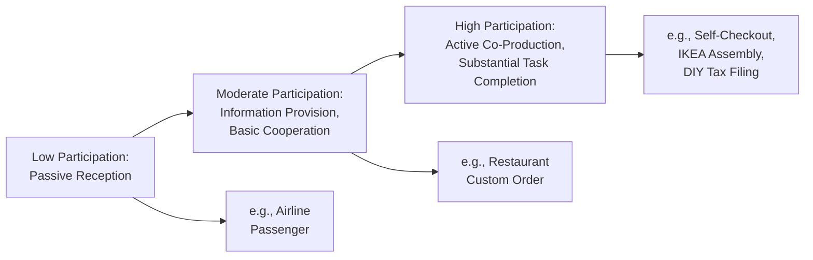
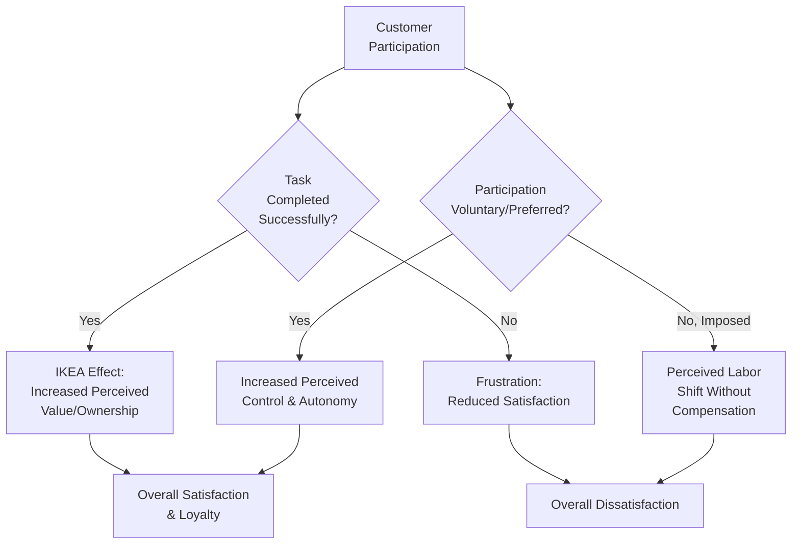

## Co-Production and Customer Participation

### Overview

Co-production and customer participation refer to the degree to which customers actively contribute labor, information, or decision-making to the creation and delivery of a service, rather than passively receiving a finished output as in most goods consumption. This concept follows directly from the inseparability characteristic of services (simultaneous production and consumption): because customers are frequently present during service delivery, they are structurally positioned to influence — and often necessarily must influence — the resulting service outcome, creating distinct psychological dynamics around perceived control, effort, ownership, and satisfaction.

---

### Conceptual Foundations: Customers as Partial Employees

**Key Points**

- Services marketing scholarship, notably work by Bowen and others, has characterized customers in co-production contexts as functioning as **"partial employees"** of the service organization — contributing labor and decision inputs that traditional employees would otherwise need to provide.
- **[Inference]** This reframing has significant managerial implications: if customers function partly as labor inputs, then customer training, motivation, and role clarity become legitimate operational management concerns analogous to employee management, rather than purely marketing or customer-experience concerns.
- The degree of required customer participation exists on a spectrum, from minimal (a passenger sitting passively during a flight) to extensive (a customer fully assembling furniture, entering all data into a self-service system, or actively co-designing a custom product).

---

### Spectrum of Customer Participation

**Diagram (svg_diagram): Customer Participation Spectrum**

| Participation Level | Customer Role | Example |
| --- | --- | --- |
| Low | Passive recipient; minimal required input | Airline passenger, passive audience at a performance |
| Moderate | Provides necessary information or makes selections | Restaurant customer specifying order modifications, medical patient describing symptoms |
| High | Performs substantial task components previously done by staff | Self-checkout, self-assembly furniture, self-service software configuration, DIY tax preparation |

---

### Psychological Drivers and Effects of Co-Production

#### The IKEA Effect

**[Inference]** A well-documented behavioral economics finding, informally termed the "IKEA effect" (following research by Norton, Mochon, and Ariely), demonstrates that customers who invest their own labor into creating or assembling a product tend to value the resulting output more highly than an identical, professionally pre-assembled equivalent — even when the customer's own construction is objectively imperfect. This suggests that co-production, rather than purely representing a cost or inconvenience to customers, can under certain conditions increase perceived value and psychological ownership.

**Key Points**

- The IKEA effect appears to depend on the customer successfully completing the task (an abandoned or failed self-assembly attempt does not appear to generate the same value-enhancement effect).
- **[Inference]** This suggests that co-production strategies benefit from ensuring customers can realistically succeed at the required participation (clear instructions, appropriate complexity calibration) — poorly designed co-production tasks risk frustration and negative evaluation rather than the intended ownership-enhancement effect.

#### Perceived Control and Autonomy

- Increased customer participation, when voluntary and well-supported, can enhance perceived control over the service outcome, which is generally associated with increased satisfaction, consistent with broader psychological research on autonomy and self-determination.
- **[Inference]** However, this effect is conditional: participation imposed on customers who prefer full-service delivery (e.g., a customer who would prefer staff assistance over mandatory self-checkout) can produce the opposite effect — perceived loss of service quality or a sense that labor has been shifted to the customer without corresponding value compensation (e.g., price reduction).

#### Effort Justification and Cognitive Dissonance

- Consistent with cognitive dissonance theory, customers who invest significant effort into a co-produced outcome may retrospectively justify that effort by rating the outcome more favorably than an objective assessment might warrant — a psychological mechanism to maintain consistency between effort invested and perceived value received.

---

### Diagram: Psychological Mechanisms of Co-Production

**Diagram (svg_diagram): Co-Production Psychological Pathways**

---

### Benefits of Co-Production for Service Organizations

| Benefit | Mechanism |
| --- | --- |
| Cost reduction | Shifting labor from paid employees to customers reduces direct service delivery costs |
| Increased customization | Direct customer input often produces more accurately tailored outcomes than staff-inferred preferences |
| Reduced service variability | Standardized self-service processes can reduce the heterogeneity introduced by variable employee performance |
| Increased perceived value/ownership | The IKEA effect and effort-justification can increase customer valuation of the outcome |
| Faster service delivery | Self-service options often reduce wait times for straightforward transactions |
| Enhanced data/information accuracy | Customers providing information directly (rather than through employee intermediation) can reduce transcription or interpretation errors |

**[Inference]** These benefits are not unconditional; they generally depend on the co-production task being appropriately designed, adequately supported (clear instructions, accessible assistance when needed), and aligned with the target customer segment's preferences and capabilities — poorly designed or inappropriately imposed co-production can produce net negative effects on both cost efficiency (through errors requiring correction) and customer satisfaction.

---

### Risks and Costs of Co-Production

**Key Points**

- **Increased variability from customer input**: because customers vary substantially in skill, attention, and understanding, customer-contributed inputs can introduce their own source of quality variability distinct from employee-driven variability, sometimes exacerbating rather than reducing the heterogeneity challenge in services.
- **Customer role ambiguity**: customers unfamiliar with expected participation requirements (e.g., unclear self-checkout instructions) can experience frustration, errors, and negative service perception.
- **Effort perception without compensation**: customers who perceive that increased participation requirements simply shift labor costs onto them without corresponding price reduction or added value may experience reduced satisfaction and perceived fairness, particularly under low customer-participation-preference conditions.
- **[Inference]** The net psychological and financial effect of co-production strategies appears highly dependent on careful task design and communication of the participation's purpose and value (e.g., clearly communicating cost savings passed to the customer, or framing participation as enabling faster/more customized service) rather than participation itself being uniformly positive or negative.

---

### Customer Training and Socialization for Co-Production

Because customers effectively function as partial employees in co-production contexts, service organizations increasingly invest in **customer socialization** — analogous to employee onboarding — to prepare customers for their required role.

**Common customer socialization mechanisms:**

- Clear, accessible instructions and visual cues at the point of required participation (e.g., self-checkout screen prompts)
- Onboarding tutorials for ongoing service relationships requiring sustained customer input (e.g., software platforms, subscription services)
- Staff support availability for customers who encounter difficulty during self-service processes, preserving a safety net that reduces the risk of task failure and the associated negative psychological effects
- Progressive disclosure of complexity (introducing simple participation requirements first, more complex options later) to build customer competence and confidence over time

**[Inference]** Effective customer socialization appears particularly important for successfully realizing the IKEA effect and autonomy benefits of co-production, since these positive effects are conditional on successful task completion — inadequate customer preparation increases the risk of failed co-production attempts, which appear to produce negative rather than positive psychological outcomes.

---

### Co-Production in Digital and Self-Service Contexts

**[Inference]** The proliferation of digital self-service technologies (mobile banking apps, self-service kiosks, chatbot-mediated support, self-configured software platforms) has substantially expanded the scope and prevalence of customer co-production across nearly all service categories, extending the concept beyond its traditional applications (e.g., self-service gas stations, buffet dining) into most modern digitally-mediated service experiences. This expansion raises ongoing questions about optimal task design, digital literacy variation across customer segments, and the risk of excluding or disadvantaging customers less comfortable with required digital participation — considerations that are actively evolving alongside digital service technology itself rather than fully resolved in current services marketing literature.

---

### Common Pitfalls and Misapplications

- **Imposing co-production without adequate support or preference alignment**: mandating self-service participation on customer segments who prefer full-service delivery, without adequate justification or compensation (price reduction, speed benefit), risks reduced satisfaction.
- **Underestimating customer-introduced variability**: assuming co-production automatically reduces service variability without accounting for the new variability introduced by inconsistent customer skill and attention levels.
- **Poor task design leading to failure rather than ownership**: designing co-production tasks too complex or poorly instructed for the target customer segment risks triggering frustration and failure rather than the intended IKEA-effect value enhancement.
- **Failing to communicate the rationale or benefit of participation**: customers who do not understand why they are being asked to participate (cost savings, customization, speed) are more likely to perceive the requirement as an imposed burden rather than a value-enhancing opportunity.
- **[Speculation]** As AI-assisted interfaces increasingly mediate co-production tasks (e.g., conversational AI guiding customers through self-service processes), some practitioners suggest this may reduce the failure risk associated with poorly designed traditional self-service interfaces by providing more adaptive, real-time guidance; however, the extent to which AI-mediated co-production preserves or alters the psychological ownership and autonomy effects documented in traditional co-production research remains an open and actively studied question rather than an established finding.

---

### Related Topics

- Distinctive Characteristics of Services
- The Servicescape and Its Psychological Effects
- Managing Perception During Service Encounters
- The IKEA Effect and Effort Justification
- Cognitive Dissonance Theory and Post-Purchase Behavior
- Service Blueprinting and Journey Mapping
- Self-Determination Theory and Perceived Autonomy
- Frontline Employee Training and Emotional Labor
- Service Quality Models
- Digital Servicescape and Self-Service Technology Design