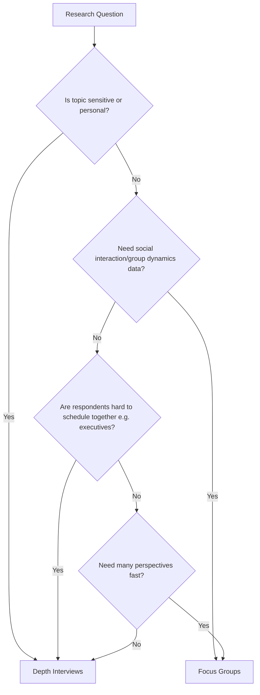

## Focus Groups and Depth Interviews

### Overview

Focus groups and in-depth interviews (IDIs) are the two core techniques of qualitative marketing research. Both aim to surface the *why* behind consumer behavior — motivations, emotions, mental models, and language — rather than the *what* or *how many* that quantitative surveys provide. They are exploratory and diagnostic tools used across the product and campaign lifecycle: concept generation, message testing, usability probing, brand positioning, and post-launch diagnostics.

**Key Points**

- Both methods produce non-generalizable, hypothesis-generating data, not statistically projectable results.
- Focus groups leverage group dynamics; depth interviews leverage individual depth and privacy.
- Choice between them depends on the sensitivity of the topic, the need for social interaction data, and logistical constraints.

---

### Focus Groups

#### Definition and Structure

A focus group is a moderated discussion with typically 6–10 participants, guided by a trained moderator using a semi-structured discussion guide, usually lasting 60–120 minutes.

#### Core Components

- **Recruitment screener**: A questionnaire used to select participants matching target segment criteria (demographics, category usage, psychographics) while excluding professional respondents and competitors' employees.
- **Discussion guide**: A moderator's roadmap organized in funnel structure — broad warm-up questions narrowing to specific probes — with approximate time allocations per section.
- **Moderator**: Facilitates without leading; uses techniques like laddering (asking "why" repeatedly to move from attributes to values), projective techniques, and silence to surface unspoken attitudes.
- **Observation room / one-way mirror**: Allows client stakeholders to observe live without influencing dynamics; increasingly replaced by video streaming.
- **Stimulus materials**: Concept boards, prototypes, ads, or packaging shown to elicit reactions.

#### Group Composition Principles

- **Homogeneity within groups**: Participants should share relevant characteristics (life stage, usage level) to reduce status-based inhibition and encourage disclosure.
- **Heterogeneity across groups**: Running multiple groups (typically 3–6) across different segments or geographies to check for pattern consistency.
- **Group dynamics**: Social facilitation can surface ideas participants wouldn't generate alone (piggybacking), but also risks groupthink, dominance by vocal members, and social desirability bias.

#### Variants

- **Mini-groups**: 4–5 participants, used for more depth per person while retaining interaction, often for professional or elite audiences.
- **Dyads/triads**: Two or three participants, useful for couples or co-decision-makers (e.g., B2B buying pairs).
- **Online/virtual focus groups**: Conducted via video conferencing or dedicated platforms (e.g., discussion boards over several days — "bulletin board focus groups"), reducing geographic constraints and cost.
- **Extended creative groups**: Incorporate projective and enabling techniques (collage-making, role play, sentence completion) to bypass rational filtering.

**Example**

A beverage brand testing three new flavor concepts runs 4 groups of 8 participants each, segmented by age (18–24 vs. 35–44) and consumption frequency (heavy vs. light users). Each 90-minute session follows a funnel guide: warm-up on category habits (15 min) → unaided reactions to concept boards (30 min) → structured comparison and ranking (30 min) → pricing and packaging probes (15 min).

---

### Depth Interviews (IDIs)

#### Definition and Structure

A depth interview is a one-on-one, semi-structured conversation between a trained interviewer and a single respondent, typically lasting 30–90 minutes, conducted in person, by phone, or via video.

#### When to Prefer IDIs Over Groups

- **Sensitive or stigmatized topics**: financial hardship, health conditions, personal hygiene products — where social presence suppresses honest disclosure.
- **Complex individual decision journeys**: B2B purchasing, high-involvement purchases (homes, cars) with long, idiosyncratic paths.
- **Expert or elite respondents**: executives, physicians — where scheduling groups is impractical and individual expertise should not be diluted by group consensus.
- **Need to avoid social influence**: when the goal is to capture unfiltered individual cognition rather than socially negotiated opinion.

#### Interviewing Techniques

- **Laddering**: Moving from concrete product attributes → functional benefits → emotional benefits → core values (means-end chain theory).
- **Critical Incident Technique**: Asking respondents to recall and narrate specific past experiences in detail rather than generalize.
- **Projective techniques**: Word association, sentence completion, picture sorts, and personification ("If this brand were a person...") to access associations respondents can't articulate directly.
- **Laddering probes example**: "Why is [low sugar] important to you?" → "It helps me manage weight" → "Why does that matter?" → "I feel more in control" → "Why is control important?" → "It's tied to my self-respect."

#### Ethnographic and Contextual Variants

- **Contextual inquiry / home visits**: Interviews conducted in the respondent's natural environment (home, store), combining observation with dialogue to reveal behavior-attitude gaps.
- **Shop-alongs**: Interviewer accompanies the respondent during actual purchase behavior, probing decisions in real time.
- **Diary studies / experience sampling**: Respondents log behavior or reactions over days or weeks, often followed by a debrief IDI to unpack entries.

**Example**

A B2B software company wants to understand IT procurement friction. Instead of a group (which would compress hierarchy differences and encourage guarded answers), researchers conduct 12 IDIs with IT directors across company sizes, each 45 minutes, using critical incident technique: "Walk me through the last time you evaluated a vendor and it fell through."

---

### Comparative Framework

| Dimension | Focus Groups | Depth Interviews |
| --- | --- | --- |
| Sample size (typical study) | 3–6 groups × 6–10 = 24–60 | 8–20 individuals |
| Depth per respondent | Lower | Higher |
| Social dynamics captured | Yes | No |
| Disclosure on sensitive topics | Lower | Higher |
| Cost per respondent | Lower | Higher |
| Logistics complexity | Higher (scheduling groups) | Lower per session, but more sessions |
| Risk of dominant-member bias | Present | Absent |
| Best for | Concept reaction, message testing, brand imagery | Journey mapping, sensitive topics, expert insight |

---

### Sampling and Recruitment

- **Purposive/judgmental sampling**: Participants selected deliberately to match defined criteria, not randomly — appropriate because qualitative research seeks depth and pattern variety, not statistical representativeness.
- **Screener design pitfalls**: Leading questions that telegraph the "correct" answer, over-screening that produces homogeneous "professional respondents," and failure to disguise the sponsor/topic to avoid bias.
- **Incidence and quota management**: For low-incidence populations (e.g., users of a niche product), recruitment timelines and costs increase substantially; recruiters often use a "recency of participation" quota to exclude serial research participants.
- **Saturation**: The point at which additional interviews/groups stop yielding new themes — commonly used as a stopping rule for sample size in qualitative designs. [Inference: exact saturation points vary by topic complexity and are determined iteratively rather than fixed in advance.]

---

### Analysis Methods

- **Verbatim transcription and coding**: Transcripts are coded thematically, often using qualitative software (e.g., NVivo, ATLAS.ti) to tag recurring concepts.
- **Thematic analysis**: Identifying patterns across transcripts, distinguishing between manifest content (explicitly stated) and latent content (underlying meaning).
- **Constant comparative method**: Continuously comparing new data against previously coded data to refine categories (rooted in grounded theory).
- **Triangulation**: Cross-checking findings against other data sources (quantitative surveys, behavioral data, sales figures) to validate qualitative insights before acting on them.
- **Deliverables**: Typically a findings report organized by research objective, illustrated with anonymized verbatim quotes, video highlight reels, and strategic implications — not raw transcripts.

---

### Moderator/Interviewer Bias and Mitigation

- **Moderator effects**: Tone, body language, and question phrasing can unintentionally lead respondents; mitigated through moderator training, standardized guides, and pilot-testing the guide.
- **Social desirability bias**: Respondents give answers they believe are more acceptable; projective techniques and rapport-building reduce this.
- **Acquiescence bias**: Tendency to agree with the interviewer or dominant group members; mitigated by directly inviting dissent ("Does anyone see it differently?").
- **Observer bias in analysis**: Researchers may selectively interpret data to confirm hypotheses; mitigated via independent double-coding and inter-coder reliability checks.

---

### Limitations

- Findings are **not statistically generalizable** to the broader population; sample sizes are too small and non-random for projection.
- **Groupthink and dominant participants** can distort group data even with skilled moderation.
- **Artificiality of setting**: facility-based groups (especially with observation rooms) may prime unnatural self-presentation.
- **Recall and rationalization bias**: respondents often reconstruct or rationalize past decisions rather than accurately reporting them, particularly for low-involvement or habitual behaviors. [Inference: the degree of distortion varies by topic and time elapsed since the behavior.]

---

### Applications in Marketing & Consumer Psychology

- **Concept and message testing**: Gauging emotional and cognitive reactions to early-stage ideas before quantitative validation.
- **Brand positioning and imagery research**: Uncovering associative networks and brand personality perceptions via projective techniques.
- **Customer journey mapping**: Depth interviews reconstruct decision sequences, pain points, and emotional highs/lows across touchpoints.
- **Ad pretesting**: Diagnosing comprehension, likability, and unintended interpretations of creative executions before media spend.
- **New product development**: Early-stage ideation groups and later-stage concept refinement interviews.

---

**Related Topics**

- Projective techniques in qualitative research (word association, collage, personification)
- Laddering and means-end chain theory
- Ethnographic research and netnography
- Quantitative survey design (for triangulation)
- Sample size and saturation in qualitative research
- Qualitative data coding software and thematic analysis
- Customer journey mapping methodologies
- Segmentation research and persona development