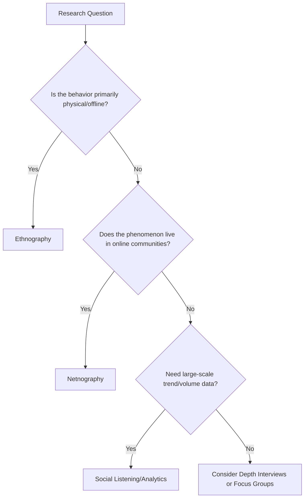

## Ethnography and Netnography

### Overview

Ethnography and netnography are observational, immersive qualitative research methods that study consumers within their natural behavioral context — physical environments for ethnography, online communities and digital spaces for netnography — rather than relying on self-reported attitudes elicited in artificial settings like focus groups. Both methods prioritize what people *do* over what they *say* they do, addressing the well-documented gap between stated and actual behavior.

**Key Points**

- Rooted in cultural anthropology; adapted to commercial marketing research from the late 20th century onward.
- Emphasize naturalistic observation, thick description, and cultural interpretation over direct questioning.
- Netnography extends ethnographic principles to computer-mediated communication and online communities.

---

### Ethnography

#### Definition and Origins

Marketing ethnography adapts anthropological fieldwork methods to study consumers in situ — homes, stores, workplaces — to understand how products and brands fit into lived routines, rituals, and social contexts. The approach draws on the work of anthropologists like Clifford Geertz, whose concept of "thick description" (interpreting behavior within its full cultural context, not just recording surface actions) underpins the method.

#### Core Techniques

- **Participant observation**: The researcher observes, and sometimes participates in, the subject's routine activities, ranging from a passive "fly on the wall" stance to active co-participation (e.g., cooking alongside a respondent).
- **Home visits / "living with"**: Extended in-home observation sessions, sometimes multi-day, capturing product usage, storage, disposal, and family negotiation around purchases.
- **Shop-alongs**: Researchers accompany shoppers through the actual purchase journey, observing real-time decision-making, wayfinding, and in-store triggers rather than retrospective recall.
- **Video ethnography**: Participants or researchers record daily routines, product usage, or "a day in the life," providing footage for later thematic review by the research team.
- **Artifact/material culture analysis**: Studying possessions, product arrangements, and personal environments (e.g., what's in a pantry, how products are displayed) as evidence of values and habits.
- **Photo elicitation and diary studies**: Respondents photograph or journal moments relevant to a category over time, later discussed in a debrief interview to unpack meaning.

#### Fieldwork Process

1. **Scoping and research questions**: Defining the cultural or behavioral phenomenon under study (e.g., "How do busy parents negotiate snack decisions with children?").
2. **Site and participant selection**: Purposive sampling of settings and individuals representative of the phenomenon of interest.
3. **Immersion and fieldnotes**: Systematic recording of observations, quotes, and researcher reflections, often using a structured fieldnote template distinguishing description from interpretation.
4. **Debrief interviewing**: Combining observation with in-context questioning ("Why did you reach for that first?") to access participants' own explanations.
5. **Cross-case analysis**: Synthesizing patterns across multiple sites/participants into cultural themes.

**Example**

A household cleaning brand wants to understand why a new spray isn't gaining repeat purchase despite strong trial. Ethnographers conduct 10 in-home visits, observing actual cleaning routines rather than asking about them. They discover the spray's scent lingers in ways that clash with users' routine of opening windows afterward — a friction point no survey had surfaced, because respondents didn't consciously register it as a "problem" when asked directly.

---

### Netnography

#### Definition and Origins

Netnography (a portmanteau of "internet" and "ethnography") is a qualitative research methodology adapting ethnographic techniques to study cultures and communities that form and interact online, formalized as a distinct methodology by marketing researcher Robert Kozinets in the late 1990s and elaborated across subsequent editions of his work.

#### Core Techniques

- **Passive/unobtrusive observation ("lurking")**: Analyzing publicly available forum threads, social media discussions, reviews, and community posts without direct researcher participation, subject to platform terms of service and ethical disclosure norms.
- **Active/participative netnography**: The researcher engages directly in the online community (posting, commenting, asking questions) as a disclosed or, in limited and ethically constrained cases, an observant member.
- **Data sources**: Branded and unbranded online communities, forums (e.g., Reddit subreddits), social media platforms, review sites, blogs, and user-generated content archives.
- **Symbolic and linguistic analysis**: Examining community-specific language, memes, in-jokes, and symbols as indicators of shared identity and values.
- **Netnographic fieldnotes**: As with ethnography, researchers maintain reflective notes distinguishing raw data from interpretation.

#### Kozinets' Procedural Framework (commonly cited stages)

1. **Research planning**: Defining research questions suited to online cultural inquiry.
2. **Entrée**: Identifying relevant online sites/communities and gaining appropriate access.
3. **Data collection**: Archiving relevant posts/threads and, where applicable, conducting online interviews or direct engagement.
4. **Interpretation**: Analyzing data for cultural meaning, not just sentiment or frequency counts.
5. **Ensuring ethical standards**: Applying disclosure and privacy norms appropriate to the venue (see Ethics below).
6. **Research representation**: Reporting findings, typically anonymizing or paraphrasing direct quotes to protect participant identity per ethical guidelines.

[Inference: exact stage names and counts vary slightly across editions of Kozinets' work and subsequent scholarly adaptations; the sequence above reflects the commonly cited structure rather than a single fixed standard.]

#### Distinguishing Netnography from Social Listening/Social Media Analytics

| Dimension | Netnography | Social Listening / Analytics |
| --- | --- | --- |
| Primary goal | Cultural/interpretive understanding | Volume, sentiment, trend tracking |
| Method | Qualitative, researcher-immersed | Largely automated, tool-driven |
| Scale | Smaller, curated communities/threads | Large-scale, platform-wide |
| Output | Thick description, cultural themes | Dashboards, sentiment scores, trend graphs |
| Typical tools | Manual coding, qualitative software | Brandwatch, Sprinklr, Talkwalker, native platform analytics |

**Example**

A skincare brand studying "skin cycling" as an emerging trend conducts netnography across a dedicated skincare subreddit and TikTok comment threads over six weeks, archiving representative threads and analyzing the community's own vocabulary, escalation rituals (before/after posts), and gatekeeping norms (how newcomers are corrected), rather than just counting how often the term "skin cycling" is mentioned.

---

### Comparative Framework

---

### Analysis and Rigor

- **Thick description**: Recording behavior alongside its cultural context and meaning, avoiding thin, decontextualized behavioral logs.
- **Emic vs. etic perspectives**: Emic analysis captures meaning from the participants' own cultural frame; etic analysis interprets behavior through the researcher's external theoretical lens — rigorous ethnography typically triangulates both.
- **Triangulation**: Cross-validating observational findings with interviews, artifacts, and secondary data to strengthen interpretive claims.
- **Reflexivity**: Researchers document their own potential biases and positionality, since the researcher is the primary data-collection instrument in ethnographic work.
- **Inter-coder reliability**: When multiple analysts code fieldnotes or netnographic data, comparing independent codings helps guard against idiosyncratic interpretation.

---

### Ethical Considerations

- **Informed consent**: Traditional ethnography requires explicit consent from observed participants; netnography's ethics are more contested because much online content is technically public.
- **Public vs. private online space**: Closed groups, private forums, and communities with an expectation of privacy generally require different ethical handling (disclosure, consent, or exclusion) than fully public posts — practices here vary by platform terms of service, institutional review norms, and applicable data protection regulation. [Inference: specific ethical thresholds are governed by evolving platform policies and regional regulation rather than a single universal standard.]
- **Anonymization**: Best practice is to paraphrase or aggregate quotes rather than reproduce verbatim, searchable text that could be traced back to an individual via search engines.
- **Disclosure in active participation**: When researchers actively post or engage, ethical guidance generally favors disclosing researcher identity/purpose to the community, though covert netnography remains a debated practice in the field.

---

### Limitations

- **Time and resource intensity**: Both methods require extended fieldwork periods and skilled analysts, making them slower and costlier than surveys or even focus groups.
- **Small, non-random samples**: Findings are context-rich but not statistically generalizable.
- **Researcher interpretive bias**: The researcher's cultural background and assumptions can shape what is noticed and how it's interpreted; mitigated through reflexivity and multiple coders.
- **Platform bias in netnography**: Online community members may not represent the broader target market; vocal, highly engaged users often skew younger, more brand-passionate, or more critical than typical customers. [Inference: the degree of skew depends heavily on the specific platform and community studied.]
- **Observer effect**: Awareness of being observed (in ethnography) can alter behavior, even with rapport-building; mitigated by longer immersion periods that allow natural behavior to resume.

---

### Applications in Marketing & Consumer Psychology

- **Unmet needs discovery**: Identifying friction points and workarounds consumers don't articulate in surveys because they've normalized them.
- **Cultural trend spotting**: Netnography is widely used to detect emerging subcultures, consumption rituals, and meme-driven trends before they reach mainstream analytics visibility.
- **Brand community research**: Understanding how brand loyalists construct identity and social bonds around a brand (e.g., enthusiast forums, fan communities).
- **New product development and innovation**: Observing actual usage contexts to identify design opportunities standard concept testing would miss.
- **Positioning and messaging refinement**: Borrowing the community's own authentic language for use in campaign copy, ensuring resonance rather than marketer-imposed terminology.

---

**Related Topics**

- Thick description and Geertzian interpretive theory
- Kozinets' netnography methodology (editions and updates)
- Social listening tools and sentiment analysis
- Focus groups and depth interviews (for triangulation)
- Consumer culture theory (CCT)
- Brand community and tribal marketing
- Research ethics and data privacy regulation (GDPR, platform ToS)
- Emic vs. etic analysis frameworks