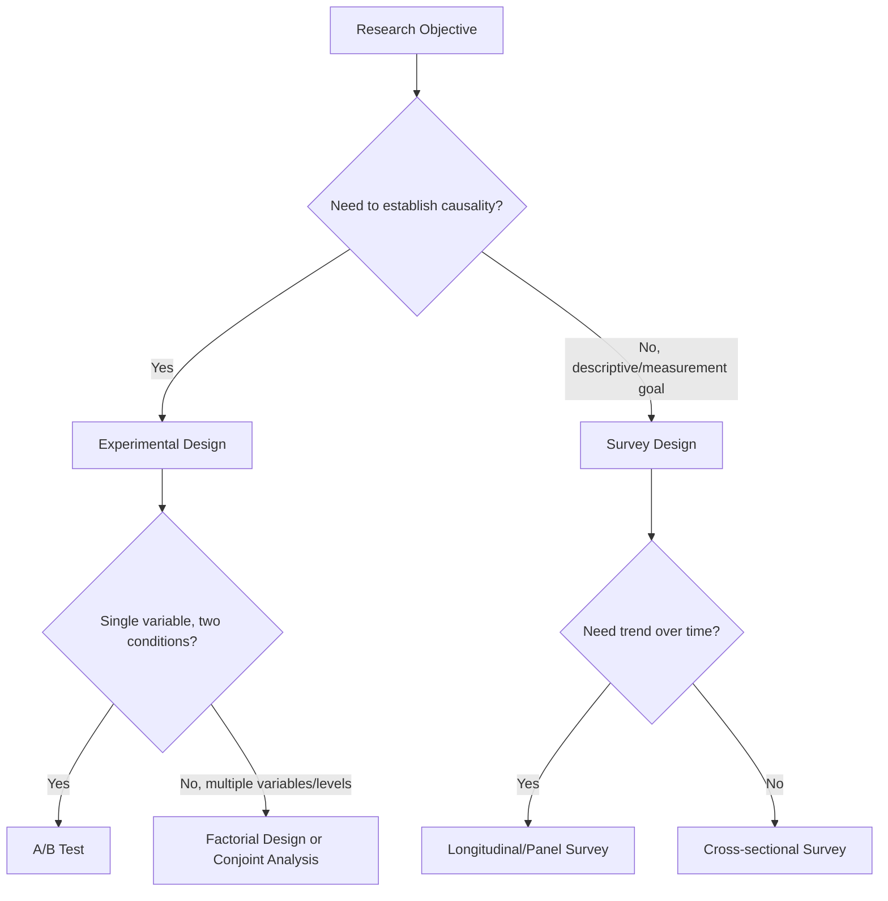

## Survey Design and Experimental Methods

### Overview

Surveys and experiments constitute the core quantitative methodologies in marketing research, enabling researchers to measure attitudes and behaviors at scale (surveys) and establish causal relationships between marketing variables (experiments). Together they complement qualitative methods by providing statistically generalizable, numerically precise data suitable for hypothesis testing, market sizing, and ROI estimation.

**Key Points**

- Surveys are primarily descriptive/correlational; experiments are designed for causal inference.
- Rigor in both depends heavily on sampling, question/stimulus design, and control of bias — not just sample size.
- The two are often combined: experiments frequently use survey instruments to measure outcomes (e.g., purchase intent after exposure to a stimulus).

---

### Survey Design

#### Types of Surveys by Method

- **Cross-sectional surveys**: Single point-in-time data collection across a sample, used for snapshots of attitudes or behavior (e.g., brand tracking waves).
- **Longitudinal surveys**: Repeated measurement of the same or comparable samples over time.
  - **Panel studies**: Same respondents surveyed repeatedly, enabling individual-level change tracking.
  - **Cohort/trend studies**: Different samples from the same population surveyed at each wave, tracking aggregate trend rather than individual change.
- **Modes of administration**: Online panels, telephone (CATI), in-person/intercept (CAPI), mail, and mixed-mode designs; online panels dominate current commercial marketing research due to cost and speed, though they introduce coverage bias toward internet-active populations.

#### Questionnaire Design Principles

- **Question wording**: Avoid double-barreled questions (asking two things at once), leading language, and loaded terms that bias responses.
- **Question order effects**: Earlier questions can anchor or prime responses to later ones; sensitive or potentially biasing questions are typically placed after core measures, and randomized question/block order is used where feasible to distribute order effects across the sample.
- **Response scale design**:
  - **Likert scales**: Ordinal agreement scales (e.g., 5- or 7-point, "strongly disagree" to "strongly agree"), commonly summed or averaged across item batteries to form composite constructs.
  - **Semantic differential scales**: Bipolar adjective pairs (e.g., "Cheap ... Expensive") rated on a continuum, often used for brand image mapping.
  - **Likelihood/intent scales**: E.g., 5-point or 11-point purchase intent scales ("Definitely would not buy" to "Definitely would buy"), foundational to concept and ad testing norms databases.
- **Scale balance and midpoints**: Balanced scales (equal positive/negative options) reduce directional bias; whether to include a neutral midpoint is a design choice affecting forced-choice behavior.
- **Skip logic and branching**: Routing respondents through relevant question paths based on prior answers, reducing irrelevant question burden.
- **Piloting**: Pretesting the questionnaire with a small sample to catch comprehension issues, awkward wording, and abnormal skip patterns before fielding.

#### Sampling Methodology

- **Probability sampling**: Simple random, stratified, systematic, and cluster sampling — each unit has a known, nonzero chance of selection, enabling calculation of sampling error and statistically valid population inference.
- **Non-probability sampling**: Convenience, quota, and panel-based online sampling — more common in commercial practice due to cost/speed, but does not support formal margin-of-error claims in the strict statistical sense.
- **Sample size determination**: Driven by desired confidence level, margin of error, and population variance; larger samples reduce sampling error but do not correct for non-sampling (bias-based) error.
- **Weighting**: Post-hoc adjustment of sample data to match known population parameters (e.g., census demographics) to correct for over/under-representation.

#### Sources of Survey Error

| Error Type | Description |
| --- | --- |
| Sampling error | Random variation due to studying a sample rather than the full population |
| Coverage error | Sampling frame excludes part of the target population (e.g., online-only panels missing non-internet users) |
| Non-response error | Systematic differences between respondents and non-respondents |
| Measurement error | Poor question wording, scale design, or respondent misunderstanding |
| Social desirability bias | Respondents answer in ways they believe are more socially acceptable |
| Satisficing / straightlining | Low-effort responding, especially in long online surveys (e.g., selecting the same scale point repeatedly) |

**Example**

A CPG brand runs an annual brand tracker with an online panel of 1,200 respondents per wave, stratified by age, gender, and region to match census benchmarks, then weighted post-collection to correct minor stratum imbalances. The questionnaire uses a rotated block design for brand image batteries to control for order effects across a 15-brand competitive set.

---

### Experimental Methods

#### Core Logic

Experiments manipulate one or more independent variables (e.g., price, ad creative, packaging) while measuring effects on a dependent variable (e.g., purchase intent, recall, choice share), using random assignment to isolate causal effect from confounds.

#### Key Design Elements

- **Independent variable(s)**: The factor(s) manipulated by the researcher (e.g., price point, message framing).
- **Dependent variable(s)**: The outcome measured (e.g., purchase intent, attitude change, conversion rate).
- **Control group**: A baseline condition receiving no treatment or a standard/placebo treatment, against which treatment effects are measured.
- **Random assignment**: Randomly allocating participants to conditions to equalize confounding variables across groups on average, distinguishing true experiments from quasi-experiments.
- **Extraneous/confounding variables**: Factors other than the independent variable that could affect the dependent variable; controlled through randomization, matching, or statistical control.

#### Common Experimental Designs

- **Between-subjects design**: Each participant experiences only one condition (e.g., one price point); avoids carryover effects but requires larger samples and is more susceptible to between-group individual differences.
- **Within-subjects design**: Each participant experiences multiple conditions (e.g., rates several ad executions); more statistically efficient per participant but risks order and carryover effects, typically mitigated by counterbalancing condition order across participants.
- **Factorial designs**: Manipulating two or more independent variables simultaneously (e.g., a 2×2 design testing price level × message framing) to measure both main effects and interaction effects.
- **A/B testing**: A simplified two-condition, between-subjects field experiment comparing a control (A) against a single variant (B), widely used in digital marketing for landing pages, email subject lines, and ad creative.
- **Multivariate testing (MVT)**: Simultaneously testing multiple element variations (e.g., headline × image × CTA button) to identify optimal combinations, requiring larger traffic volumes than simple A/B tests due to the combinatorial number of cells.
- **Conjoint analysis**: A trade-off-based experimental method where respondents evaluate product profiles combining varying attribute levels (e.g., price, brand, features), enabling estimation of the relative importance (part-worth utilities) of each attribute in driving preference — a specialized hybrid of experimental design and statistical modeling widely used for pricing and feature prioritization.

#### Validity Considerations

- **Internal validity**: The degree to which the experiment accurately isolates the causal effect of the independent variable, threatened by confounds, selection bias, or poor randomization.
- **External validity**: The degree to which findings generalize beyond the specific experimental sample and setting; lab-based experiments often trade external validity for internal validity control, while field experiments (e.g., live A/B tests) offer more realistic conditions at some cost to control.
- **Construct validity**: Whether the manipulation and measures actually represent the theoretical constructs intended (e.g., does the "price increase" stimulus genuinely represent the construct of perceived value threat).

**Example**

An e-commerce retailer runs a 2×2 factorial field experiment testing free shipping threshold ($35 vs. $50) × checkout page layout (single-page vs. multi-step) across live site traffic, randomly assigning visitors to one of four cells and measuring conversion rate and average order value as dependent variables, allowing the team to detect not just main effects but whether the shipping threshold's impact depends on checkout layout (interaction effect).

---

### Survey vs. Experiment: Comparative Framework

---

### Statistical Foundations

- **Descriptive statistics**: Means, frequencies, and cross-tabulations summarizing survey response patterns.
- **Inferential statistics**: t-tests and ANOVA for comparing group means (common in experimental analysis); chi-square tests for categorical association; regression for modeling relationships between continuous variables.
- **Statistical significance and effect size**: A statistically significant result (commonly at $p < 0.05$) indicates the observed effect is unlikely due to chance alone, but effect size (e.g., Cohen's $d$) indicates practical/managerial magnitude — both should be reported together, as large samples can produce statistically significant but practically trivial effects.
- **Confidence intervals**: Provide a range within which the true population parameter likely falls, offering more interpretive nuance than a single point estimate.

$$\bar{x} \pm z \cdot \frac{s}{\sqrt{n}}$$

where $\bar{x}$ is the sample mean, $z$ is the critical value for the desired confidence level, $s$ is the sample standard deviation, and $n$ is the sample size — the standard formula for a confidence interval around a sample mean.

---

### Limitations

- **Surveys**: Measure stated attitudes/intentions, which are known to diverge from actual behavior (the attitude-behavior gap); vulnerable to social desirability and satisficing bias, especially in long instruments.
- **Lab experiments**: Artificial settings may not replicate real purchase-decision conditions, limiting external validity.
- **Field experiments**: Harder to control for confounding external events (e.g., competitor promotions, seasonality) that coincide with the test period.
- **Conjoint analysis**: Part-worth utilities are estimated from stated trade-offs in a simplified task, which may not perfectly predict real-world purchase behavior under full market complexity. [Inference: the degree of divergence depends on how closely the conjoint task design mirrors actual purchase context.]

---

### Applications in Marketing & Consumer Psychology

- **Brand tracking**: Longitudinal surveys measuring awareness, consideration, and brand equity metrics over time.
- **Pricing research**: Conjoint analysis and experimental price testing to estimate demand elasticity and optimal price points.
- **Advertising effectiveness**: Pre/post experimental designs measuring recall, persuasion, and purchase intent shifts from ad exposure.
- **Digital optimization**: A/B and multivariate testing of website elements, email campaigns, and ad creative at scale.
- **Customer satisfaction measurement**: Cross-sectional and longitudinal surveys (e.g., NPS, CSAT) tracking relationship health over time.

---

**Related Topics**

- Conjoint analysis and discrete choice modeling
- Sampling theory and margin of error calculation
- A/B testing platforms and statistical power analysis
- Scale development and psychometric validity (Cronbach's alpha)
- Regression and multivariate statistical analysis
- Survey mode effects and online panel quality
- Behavioral vs. attitudinal data triangulation
- Marketing mix modeling (as a complement to experimental methods)