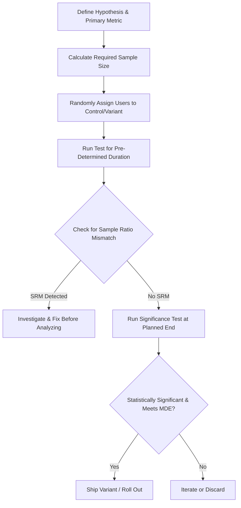

## A/B Testing and Causal Inference

### Overview

A/B testing (also called split testing or randomized controlled experimentation) is the practical application of experimental design to digital marketing environments, using random assignment of users to control and variant experiences to estimate the causal effect of a specific change. Causal inference is the broader statistical discipline concerned with determining whether an observed association between variables reflects a true cause-and-effect relationship — a concern that extends beyond controlled experiments into methods for estimating causal effects from observational data when randomization isn't feasible.

**Key Points**

- A/B testing's core value is that random assignment breaks the link between the treatment and any confounding variable, allowing causal attribution rather than mere correlation.
- Not all marketing questions can be answered with clean A/B tests; causal inference techniques exist precisely to handle cases where randomization is impossible or impractical.
- Statistical rigor (proper sample sizing, correct handling of multiple comparisons, avoiding peeking) separates valid A/B testing from misleading results.

---

### Correlation vs. Causation

- **Correlation**: A statistical association between two variables, which may arise from a true causal link, a confounding third variable, reverse causation, or pure chance.
- **Causation**: A relationship where changes in one variable directly produce changes in another, holding all else constant.
- **Confounding variable**: A third factor that influences both the independent and dependent variable, creating a spurious association (e.g., ice cream sales and drowning rates both rise with summer heat — a classic confound, not a causal link between the two).
- **Why marketing needs causal rigor**: Observational marketing data (e.g., "customers who saw the ad bought more") is routinely confounded by selection effects — people who see remarketing ads, for instance, already showed higher purchase intent by visiting the site, so naive comparison overstates the ad's true causal lift.

---

### A/B Testing Fundamentals

#### Core Mechanics

1. **Hypothesis formulation**: A specific, falsifiable prediction (e.g., "Changing the CTA button color from blue to orange will increase click-through rate").
2. **Random assignment**: Users are randomly allocated to control (A, existing experience) or variant (B, modified experience), typically via a randomization unit (user ID, session, or cookie) to ensure consistent experience per user.
3. **Sample size and duration planning**: Calculated in advance using baseline conversion rate, minimum detectable effect (MDE), statistical power, and significance threshold — not simply "run until it feels done."
4. **Traffic allocation**: Determining what percentage of eligible traffic is included in the test and how it's split (commonly 50/50, though unequal splits are used to limit variant risk).
5. **Metric definition**: Pre-specifying a primary success metric and secondary/guardrail metrics (e.g., primary: conversion rate; guardrail: page load time, unsubscribe rate) before launch.
6. **Statistical analysis and decision**: Comparing outcome metrics between groups using appropriate significance tests, then deciding whether to ship, iterate, or discard the variant.

#### Sample Size and Power Calculation

Sample size depends on four inputs:

- **Baseline conversion rate** ($p$): The current performance of the control.
- **Minimum detectable effect (MDE)**: The smallest lift considered practically meaningful to detect.
- **Statistical significance level** ($\alpha$, commonly $0.05$): The acceptable false-positive rate (Type I error).
- **Statistical power** ($1-\beta$, commonly $0.80$): The probability of correctly detecting a true effect if one exists (avoiding Type II error, a false negative).

$$n = \frac{2 \cdot (z_{\alpha/2} + z_{\beta})^2 \cdot p(1-p)}{d^2}$$

where $n$ is sample size per group, $z_{\alpha/2}$ and $z_{\beta}$ are the critical z-values for the chosen significance and power levels, $p$ is the baseline conversion rate, and $d$ is the minimum detectable effect (absolute difference) — a standard formula for comparing two proportions.

**Key Points**

- Smaller MDEs require dramatically larger sample sizes — detecting a 1% lift requires far more traffic than detecting a 10% lift.
- Underpowered tests risk false negatives (missing real effects) as much as improperly run tests risk false positives.

#### Common Statistical Pitfalls

- **Peeking / optional stopping**: Repeatedly checking results and stopping as soon as significance is reached inflates the false-positive rate well above the nominal $\alpha$, because each additional look constitutes another chance for a spurious significant result. [Inference: the magnitude of inflation depends on how frequently and how many times the test is checked.]
- **Multiple comparisons problem**: Testing many variants or many metrics simultaneously increases the chance of at least one false positive by chance alone; mitigated with corrections (e.g., Bonferroni correction) or by pre-registering a single primary metric.
- **Simpson's paradox**: A trend present in aggregated data can reverse or disappear when the data is broken into subgroups (e.g., segments, devices), making segment-level checks important before drawing conclusions.
- **Novelty and primacy effects**: Users may respond differently to a change simply because it's new (novelty effect, often fading) or because early adopters differ systematically from later ones (primacy/selection effect over test duration) — mitigated by running tests for full business cycles (e.g., at least one full week to capture weekday/weekend variation).
- **Sample ratio mismatch (SRM)**: When the actual observed traffic split deviates significantly from the intended allocation (e.g., 48/52 instead of 50/50), signaling a bug in randomization or logging that invalidates results until resolved.
- **Network effects / interference**: In social or marketplace contexts, one user's treatment condition can affect another user's outcome (e.g., a referral feature test), violating the assumption that units are independent — addressed via cluster-based or switchback randomization designs. [Inference: applicability depends on the specific product context and the degree of user interconnection.]

**Example**

An e-commerce site tests a new checkout flow. Baseline conversion is 4%, and the team wants to detect a minimum 10% relative lift (0.4 percentage points) with 95% confidence and 80% power. The required sample size calculation indicates roughly 24,000 visitors per arm are needed — informing the team that the test must run for at least two weeks given current traffic levels, rather than being called early after three days of favorable-looking results.

---

### Beyond Simple A/B: Related Experimental Designs

- **A/B/n testing**: Testing more than two variants simultaneously against a shared control, requiring multiple-comparison correction.
- **Multivariate testing (MVT)**: Testing combinations of multiple elements (e.g., headline × image) simultaneously to detect interaction effects, requiring substantially more traffic than single-factor tests.
- **Multi-armed bandit algorithms**: An adaptive alternative to fixed-allocation A/B testing that dynamically shifts traffic toward better-performing variants during the test itself, trading strict statistical inference rigor for reduced "regret" (opportunity cost of serving underperforming variants) — well suited to short-lived content (e.g., headline optimization) where speed matters more than precise effect-size estimation.
- **Switchback (time-based) experiments**: Alternating the treatment on and off across time periods for the same unit (e.g., a whole market or region), used when individual-level randomization is infeasible due to interference effects, common in marketplace and logistics contexts.
- **Holdout groups**: A group permanently excluded from a marketing treatment (e.g., a campaign or channel) over an extended period, used to measure the channel's true incremental contribution rather than a single feature's effect.

---

### Causal Inference Beyond Randomized Experiments

When true randomization is infeasible (e.g., testing a national TV campaign, or effects of past pricing changes), researchers use quasi-experimental methods to approximate causal estimates from observational data:

- **Difference-in-differences (DiD)**: Compares the change in outcomes over time between a treatment group and a control group, isolating the treatment effect from broader trends affecting both groups (e.g., comparing sales trends in a test market that received a new campaign versus a similar market that didn't).
- **Regression discontinuity design (RDD)**: Exploits a threshold-based rule (e.g., customers just above vs. just below a loyalty-tier spending cutoff) to compare units just on either side of the cutoff, which are assumed similar except for treatment assignment.
- **Propensity score matching**: Statistically pairs treated and untreated individuals with similar observed characteristics (propensity to receive treatment) to approximate the balance random assignment would have achieved, reducing (but not eliminating) confounding from observed variables.
- **Instrumental variables (IV)**: Uses a variable that affects treatment assignment but has no direct effect on the outcome except through treatment, to isolate causal effect in the presence of unobserved confounding.
- **Geo-experiments / matched market tests**: Randomizing treatment (e.g., ad spend) at the geographic market level rather than individual level, commonly used for measuring incrementality of offline or broad-reach media (TV, out-of-home) where individual-level randomization isn't possible.
- **Media Mix Modeling (MMM)**: A regression-based approach estimating the contribution of various marketing channels to sales using historical, aggregated data — an observational (non-randomized) method often calibrated or validated against experimental incrementality tests. [Inference: MMM's accuracy is sensitive to model specification and the availability of sufficient variation in historical spend data.]

**Example**

A retailer wants to measure the true incremental sales lift from a national TV campaign, where individual-level randomization is impossible. Using a geo-experiment design, comparable media markets are randomly assigned to "TV on" vs. "TV held out" at the market level, and a difference-in-differences analysis compares sales trend changes between the two groups, isolating the campaign's causal lift from seasonal and macroeconomic trends affecting all markets.

---

### A/B Testing vs. Quasi-Experimental Methods

| Dimension | A/B Testing (RCT) | Quasi-Experimental / Observational Causal Inference |
| --- | --- | --- |
| Randomization | Explicit, researcher-controlled | Absent; approximated statistically |
| Causal confidence | Highest (gold standard) | Lower, dependent on untestable assumptions |
| Feasibility | Requires controllable, individually-assignable treatment | Used when randomization is impossible/unethical/impractical |
| Common marketing use | Website/app features, email, ad creative | TV/offline media, pricing history, macro campaigns |
| Key risk | Implementation bugs (SRM), peeking, interference | Unobserved confounding, model misspecification |

---

### Limitations

- **A/B testing**: Requires sufficient traffic/conversion volume to reach statistical power in a reasonable time; not well suited to low-frequency, high-consideration purchases (e.g., enterprise software) without very long test windows.
- **External validity**: Digital A/B test results reflect the specific site/audience/time period tested and may not generalize to other channels, seasons, or markets without replication.
- **Quasi-experimental methods**: All rely on assumptions (parallel trends for DiD, continuity for RDD, instrument validity for IV) that cannot be directly tested and, if violated, can produce misleading causal estimates. [Inference: the practical severity of assumption violations varies by context and is typically assessed through robustness checks rather than definitive proof.]
- **Short-term vs. long-term effects**: Many A/B tests measure short-window metrics (e.g., 2-week conversion) that may not capture longer-term effects like retention, brand perception, or cannibalization of other channels.

---

### Applications in Marketing & Consumer Psychology

- **Conversion rate optimization (CRO)**: Systematic testing of landing pages, checkout flows, and CTAs to improve funnel performance.
- **Pricing and promotion testing**: Measuring causal price elasticity and promotional lift through controlled or geo-based experiments.
- **Ad creative and channel incrementality**: Determining the true causal contribution of specific ads or channels versus organic/baseline behavior, correcting for the common bias of attributing conversions to ads seen by already-high-intent users.
- **Email and lifecycle marketing**: Testing subject lines, send times, and content variations against defined engagement and conversion metrics.
- **Product and UX experimentation**: Feature rollout testing within product-led growth and app-based marketing contexts.

---

**Related Topics**

- Survey design and experimental methods (foundational experimental theory)
- Statistical power analysis and Type I/II error
- Multi-armed bandit algorithms
- Media mix modeling and marketing attribution
- Difference-in-differences and quasi-experimental design
- Conversion rate optimization frameworks
- Customer lifetime value measurement
- Marketing analytics dashboards and experimentation platforms