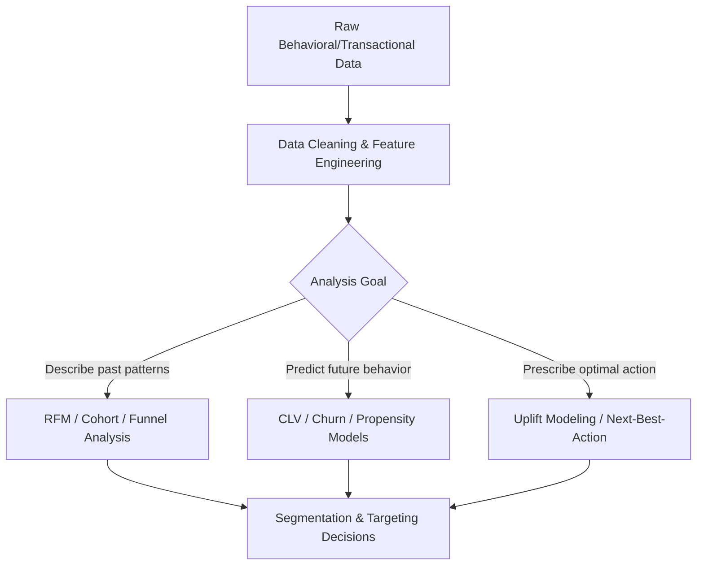

## Behavioral and Transactional Data Analysis

### Overview

Behavioral and transactional data analysis examines what customers actually do — clicks, purchases, browsing paths, app usage, loyalty transactions — as opposed to what they say in surveys or interviews. Because this data is captured passively as a byproduct of real interactions, it avoids self-report biases (social desirability, recall error) inherent in stated-preference methods, but introduces its own analytical challenges: volume, noise, and the need to infer intent and motivation from action alone.

**Key Points**

- Behavioral data reveals *revealed preference* (what people actually choose) versus *stated preference* (what people say they'd choose) — the two frequently diverge.
- Transactional data is typically structured and high-volume (POS, e-commerce, CRM systems); behavioral data spans structured (clickstream) and semi-structured (session logs, app events) formats.
- Analysis ranges from descriptive reporting (what happened) to predictive modeling (what will happen) to prescriptive optimization (what should be done).

---

### Data Types and Sources

#### Transactional Data

- **Point-of-sale (POS) data**: Item-level purchase records including SKU, price, quantity, timestamp, and store/channel location.
- **E-commerce order data**: Cart contents, order value, payment method, shipping choices, and fulfillment status.
- **CRM/loyalty transaction data**: Purchase history linked to individual customer profiles, often the backbone of customer lifetime value (CLV) and RFM analysis.
- **Subscription/billing data**: Recurring transaction records used for churn and retention analysis in subscription business models.

#### Behavioral Data

- **Clickstream data**: Sequential record of pages/screens visited, including timestamps, referral source, and on-page actions (clicks, scrolls, hovers).
- **App event data**: Discrete in-app actions (feature usage, session starts/ends, in-app purchases) typically captured via event-tracking SDKs.
- **Search and query data**: On-site and external search terms used, revealing intent signals not captured by page views alone.
- **Email/marketing engagement data**: Opens, clicks, and conversion paths tied to specific campaigns and sends.
- **Loyalty and engagement signals**: App logins, points redemption, referral activity, and customer service contact history.

---

### Core Analytical Frameworks

#### RFM Analysis (Recency, Frequency, Monetary)

A foundational segmentation technique scoring each customer on three transactional dimensions:

- **Recency**: How recently the customer made a purchase.
- **Frequency**: How often the customer purchases within a given period.
- **Monetary value**: How much the customer has spent in total or on average.

Customers are typically scored on each dimension (e.g., quintiles 1–5) and combined into segments (e.g., "Champions" = high R, high F, high M; "At Risk" = low R, previously high F/M).

**Example**

A subscription retailer scores its customer base on RFM quintiles and identifies a segment of customers with high historical frequency and monetary value but declining recency ("At Risk — High Value"). This segment is targeted with a distinct win-back campaign, rather than being lumped in with generally inactive low-value customers who receive a lower-cost, lower-touch treatment.

#### Cohort Analysis

Groups customers by a shared starting event (e.g., signup month, first purchase date) and tracks their behavior over subsequent time periods, isolating trends from mere population growth effects.

- **Retention cohort tables**: Track the percentage of each cohort still active/purchasing at each subsequent period (commonly visualized as a triangular heatmap).
- **Revenue cohort analysis**: Tracks cumulative or per-period revenue contribution by cohort, useful for evaluating whether newer acquisition channels/campaigns produce more or less valuable customers over time.

#### Funnel Analysis

Maps the sequential steps a customer takes toward a defined conversion goal (e.g., product view → add to cart → checkout initiated → purchase completed), measuring drop-off rates at each stage to identify friction points.

- **Conversion rate at each step**: The percentage of users progressing from one stage to the next.
- **Funnel segmentation**: Comparing funnel performance across traffic source, device type, or customer segment to isolate where and for whom friction occurs.

#### Path/Sequence Analysis

Examines the actual sequences of actions or pages customers navigate through, often using:

- **Sankey diagrams**: Visualizing volume flow between sequential states (e.g., which pages users visit after the homepage).
- **Markov chain modeling**: Modeling the probability of transitioning from one state (page/action) to the next, useful for both descriptive path analysis and multi-touch attribution modeling.

#### Market Basket Analysis

Identifies co-purchase patterns — which products are frequently bought together — commonly using association rule mining (e.g., the Apriori algorithm), generating rules evaluated by:

- **Support**: How frequently the itemset appears across all transactions.
- **Confidence**: The likelihood that a customer who buys item A also buys item B.
- **Lift**: How much more likely items are purchased together than expected by chance alone; a lift value greater than 1 indicates a positive association.

$$\text{Lift}(A \rightarrow B) = \frac{\text{Support}(A \cup B)}{\text{Support}(A) \times \text{Support}(B)}$$

**Example**

A grocery retailer's market basket analysis reveals a lift value of 2.8 between diapers and a specific snack category, well above the 1.0 baseline expected by chance — informing a cross-merchandising decision to place the items in proximity, distinct from lower-lift pairings that occur mainly due to both items' general popularity.

---

### Predictive Modeling on Behavioral Data

- **Customer Lifetime Value (CLV) modeling**: Predicting the total future value a customer will generate, using either historical-aggregate methods or probabilistic models (e.g., BG/NBD for purchase frequency combined with a gamma-gamma model for monetary value) applied to transactional history.
- **Churn/attrition prediction**: Classification models (logistic regression, random forest, gradient boosting) trained on behavioral and transactional features (recency, engagement decline, support contacts) to flag at-risk customers before they churn.
- **Propensity modeling**: Predicting the likelihood a customer will take a specific action (purchase, upgrade, respond to an offer), used to prioritize targeting and personalization.
- **Next-best-action / recommendation systems**: Collaborative filtering and content-based models suggesting products or content based on behavioral similarity to other customers or items.
- **Uplift modeling**: Distinct from standard propensity modeling, uplift models predict the *incremental* effect of a marketing action on an individual (i.e., who would only convert *because* of the treatment), directly informing more efficient targeting than propensity alone.

---

### Data Infrastructure Considerations

- **Event tracking architecture**: Behavioral data collection typically relies on tagging (e.g., tag management systems) or SDK-based event logging, defining a consistent event taxonomy (event name, properties, user/session identifiers) across web and app platforms.
- **Identity resolution**: Stitching together behavior across devices, sessions, and channels into a unified customer profile, using deterministic matching (login credentials, email) and/or probabilistic matching (device fingerprinting) — an area with growing method diversity as third-party cookie deprecation and privacy regulation reshape available signals. [Unverified: specific identity-resolution vendor techniques and accuracy rates evolve continuously and are not reliably characterized in general terms.]
- **Customer Data Platforms (CDPs)**: Systems designed to unify behavioral, transactional, and demographic data into persistent customer profiles accessible for activation across marketing channels.
- **Data warehousing and query layers**: Behavioral/transactional data at scale is typically stored in columnar data warehouses (e.g., Snowflake, BigQuery, Redshift) and queried via SQL or business intelligence layers for analysis.

---

### Statistical and Analytical Considerations

- **Survivorship bias**: Analyzing only currently active customers can overstate typical behavior patterns, since churned customers (who may have exhibited warning signs) are excluded from the active dataset.
- **Regression to the mean**: Customers with extreme behavior in one period (e.g., unusually high spend) often naturally revert toward average levels in subsequent periods, which can be mistakenly attributed to an intervention rather than statistical regression.
- **Seasonality and trend decomposition**: Raw transactional time series often require decomposition into trend, seasonal, and residual components before meaningful period-over-period comparisons can be drawn.
- **Sparse data and cold-start problems**: New customers or products with limited transaction history pose challenges for behavioral models (e.g., recommendation systems), often addressed with hybrid models incorporating demographic or content-based features until sufficient behavioral data accumulates.

---

### Limitations

- **Behavior without motivation**: Transactional and behavioral data show *what* happened but not *why*, requiring triangulation with qualitative or survey methods to fully interpret drivers (e.g., a drop in purchase frequency could reflect price sensitivity, competitive switching, or life-stage change — indistinguishable from transaction data alone).
- **Privacy and regulatory constraints**: Collection and use of individual-level behavioral data is subject to evolving privacy regulation (e.g., GDPR, CCPA) and platform policy changes (e.g., cookie deprecation, app tracking transparency), which can restrict data availability and granularity over time. [Inference: the specific practical impact varies by jurisdiction, platform, and is subject to ongoing regulatory and technical change.]
- **Data quality and attribution ambiguity**: Cross-device and cross-channel behavior is often incompletely captured, leading to fragmented or duplicated customer records absent robust identity resolution.
- **Correlation vs. causation**: Behavioral patterns and outcomes (e.g., "customers who use feature X churn less") are frequently correlational rather than causal, requiring experimental validation (see A/B testing) before acting on them as if the behavior *causes* the outcome.

---

### Applications in Marketing & Consumer Psychology

- **Segmentation and targeting**: RFM, behavioral clustering, and propensity scores driving differentiated marketing treatment by customer value and intent.
- **Personalization**: Real-time behavioral signals feeding recommendation engines and dynamic content/offer personalization.
- **Retention and lifecycle marketing**: Churn prediction and cohort analysis informing timed interventions across the customer lifecycle.
- **Merchandising and cross-sell**: Market basket analysis informing product placement, bundling, and cross-sell recommendation logic.
- **Marketing measurement**: Behavioral funnel and path data underpinning attribution modeling and channel performance evaluation.

---

**Related Topics**

- RFM segmentation and customer value modeling
- Customer Lifetime Value (CLV) estimation methods
- Marketing attribution modeling
- Customer Data Platforms (CDPs) and identity resolution
- Uplift modeling and incrementality measurement
- A/B testing and causal inference (for validating behavioral correlations)
- Data privacy regulation and first-party data strategy
- Recommendation systems and collaborative filtering