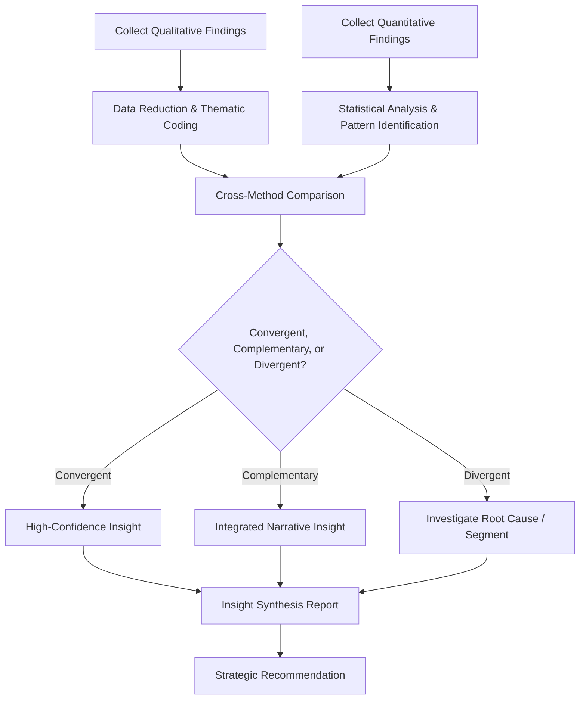

## Synthesizing Insight from Mixed Methods

### Overview

Mixed methods synthesis is the discipline of integrating qualitative findings (focus groups, depth interviews, ethnography) with quantitative findings (surveys, experiments, behavioral data) into a single, coherent, decision-actionable insight — rather than treating each research stream as a standalone deliverable. Because no single method fully captures consumer reality (qualitative methods offer depth but not generalizability; quantitative methods offer scale but not explanatory richness), synthesis is the step where the research function converts disparate data into strategic narrative.

**Key Points**

- Mixed methods research is not simply running both a survey and some interviews — it requires a deliberate integration design defining how and when the methods inform each other.
- Good synthesis distinguishes between data that *corroborates*, data that *complements*, and data that *contradicts* across sources — each requires a different interpretive response.
- The output of synthesis is a decision-ready insight, not a compiled stack of separate method reports.

---

### Mixed Methods Design Typologies

Marketing research commonly draws on established mixed methods design logic (adapted from social science methodology, notably Creswell's typology):

#### Sequential Explanatory Design (Quant → Qual)

Quantitative data is collected and analyzed first, and qualitative research follows to explain unexpected, ambiguous, or noteworthy quantitative findings in depth.

**Example**

A brand tracker survey shows a sharp, unexplained drop in purchase intent among a specific age segment following a rebrand. Rather than speculating, the team runs a small set of depth interviews with respondents from that segment to understand the specific perceptual shift driving the decline — discovering the new packaging was being confused with a lower-tier private-label competitor.

#### Sequential Exploratory Design (Qual → Quant)

Qualitative research is conducted first to generate hypotheses, themes, or language, which are then tested for prevalence and statistical significance via a subsequent quantitative survey or experiment.

**Example**

Ethnographic fieldwork in a category surfaces four candidate unmet needs among consumers. Rather than acting on ethnographic impressions alone (which are not generalizable), the team fields a quantitative survey to a representative sample to size how prevalent and important each need is across the broader target population before committing product development resources.

#### Concurrent (Convergent) Triangulation Design

Qualitative and quantitative data are collected in parallel, independently analyzed, and then merged and compared during interpretation to cross-validate or complicate findings.

**Example**

A brand simultaneously fields a large-scale image-attribute survey and conducts parallel depth interviews on brand perception. The survey establishes which attributes are statistically associated with preference at scale; the interviews reveal the emotional and narrative context behind why those specific attributes matter — the two streams are merged into a single positioning recommendation rather than reported separately.

#### Embedded Design

One method plays a primary role while the other is embedded as a supporting component within a larger single-method study (e.g., open-ended qualitative questions embedded within an otherwise quantitative survey instrument).

---

### Triangulation Framework

Triangulation is the core analytical technique for cross-checking findings across sources. When comparing findings from different methods, three general outcomes are possible:

| Outcome | Meaning | Analytical Response |
| --- | --- | --- |
| **Convergence** | Different methods point to the same conclusion | Strengthens confidence in the finding; can be reported with higher certainty |
| **Complementarity** | Methods reveal different but compatible facets of the same phenomenon | Combine into a fuller picture (e.g., survey shows *what* changed, interviews explain *why*) |
| **Divergence/Contradiction** | Methods produce conflicting findings | Requires investigation — may reflect a real attitude-behavior gap, a methodological artifact, or a segment-level difference masked by aggregation |

#### Handling Divergence

Divergent findings are not necessarily a research failure — they're often the most valuable output of mixed methods work, since they surface the well-documented gap between stated attitudes and actual behavior. Common causes of divergence include:

- **Social desirability bias** inflating stated survey responses relative to observed behavioral data.
- **Segment heterogeneity**: aggregated quantitative results mask opposing patterns within subgroups (related to Simpson's paradox).
- **Different sampling frames or timeframes** between the qualitative and quantitative components, reducing true comparability.
- **Construct mismatch**: the qualitative and quantitative instruments may be measuring subtly different constructs despite surface-level similarity in topic.

**Example**

Survey data shows 68% of respondents rate "sustainability" as a top purchase driver, but transactional data shows minimal price premium tolerance for sustainably certified products, and depth interviews reveal respondents genuinely value sustainability but deprioritize it at the actual point of purchase under budget constraints. The synthesis conclusion is not "consumers are lying" but a specific insight: sustainability functions as a values-signal and tie-breaker rather than a primary purchase driver — a materially different strategic implication than either data source alone would suggest.

---

### The Synthesis Process

#### Key Synthesis Steps

1. **Independent analysis first**: Each method's data should be analyzed within its own methodological framework (thematic coding for qualitative; statistical testing for quantitative) before cross-comparison, to avoid prematurely forcing one method's frame onto the other.
2. **Joint display construction**: Organizing qualitative and quantitative findings side by side against shared research questions or themes (a "joint display" or matrix) to visually identify where they align, complement, or conflict.
3. **Meta-inference**: Drawing an overarching conclusion that could not have been reached from either data source alone — the defining output of genuine synthesis rather than parallel reporting.
4. **Weighting by method fitness-for-purpose**: Not all findings carry equal evidentiary weight for all questions — behavioral/transactional data is generally weighted more heavily for "what actually happens" questions, while qualitative data is weighted more heavily for "why" and "how it feels" questions.
5. **Stakeholder-ready narrative construction**: Translating the synthesized meta-inference into a clear strategic story with supporting evidence from multiple sources, rather than presenting sequential method-by-method findings.

---

### Insight vs. Finding: A Critical Distinction

- **Finding**: A factual observation from a single data source (e.g., "42% of survey respondents cite price as a barrier"; "several interview respondents mentioned feeling overwhelmed by options").
- **Insight**: A synthesized, non-obvious explanation of underlying consumer motivation that connects multiple findings and implies a specific action (e.g., "Price sensitivity is a proxy for decision-paralysis — customers cite price as a rejection reason when the deeper barrier is an inability to differentiate between too many similar options, which suggests simplifying the assortment rather than discounting").

**Key Points**

- A common failure mode in research synthesis is delivering a "findings dump" (a report listing observations method by method) rather than genuine synthesized insight.
- Strong insights are typically: non-obvious, evidence-triangulated across sources, and directly actionable by a specific business decision.

---

### Practical Synthesis Techniques

- **Joint display matrices**: Tabulating qualitative themes against quantitative metrics for the same research question, enabling direct visual comparison.
- **Insight statements with an evidence trail**: Writing each insight as a claim explicitly annotated with which data sources support it (e.g., "[Survey: n=1200] + [IDI: 8/12 respondents]"), maintaining traceability and avoiding unsupported claims.
- **Persona/segment integration**: Using quantitative segmentation (cluster analysis, RFM) to define segment boundaries, then enriching each quantitative segment with qualitative depth-interview narrative to make segments memorable and actionable for stakeholders (a common technique in persona development).
- **Journey mapping as an integration artifact**: Customer journey maps often serve as the primary synthesis vehicle, overlaying quantitative funnel/behavioral data (drop-off rates per stage) with qualitative emotional and motivational context (pain points, quotes) at each journey stage.

---

### Common Pitfalls in Synthesis

- **Cherry-picking convergent evidence**: Selectively citing whichever data source supports a preferred conclusion while downplaying contradictory evidence from another source.
- **False equivalence**: Treating a handful of interview quotes as equally weighty evidence as a statistically robust survey finding, or vice versa, without acknowledging each method's appropriate evidentiary scope.
- **Premature closure**: Stopping analysis at the first plausible-sounding explanation for a divergence rather than probing further (e.g., attributing all stated-behavior gaps generically to "social desirability bias" without checking for genuine segment differences).
- **Siloed reporting**: Qualitative and quantitative teams (or vendors) producing separate, unintegrated reports that are never actually synthesized, leaving stakeholders to do the integration work themselves — or not at all.
- **Ignoring sample and method limitations during integration**: Treating small-sample qualitative findings as if they carry the same generalizability as the quantitative sample when constructing the joint narrative.

---

### Limitations

- **Resource and timeline cost**: Well-executed mixed methods synthesis requires more time, budget, and cross-functional research expertise than single-method studies.
- **Integration skill gap**: Effective synthesis requires researchers fluent in both qualitative interpretive analysis and quantitative statistical reasoning — a skill combination not uniformly available across research teams. [Inference: the degree of this gap varies substantially by organization and research team structure.]
- **Risk of false precision**: Presenting a synthesized insight with unified confidence can obscure the fact that its qualitative and quantitative components carry different levels of statistical certainty.
- **Timing misalignment**: Sequential designs in particular can suffer if market conditions shift meaningfully between the qualitative and quantitative phases, undermining the validity of combining them as if collected simultaneously.

---

### Applications in Marketing & Consumer Psychology

- **Brand positioning development**: Combining large-scale attribute/perception surveys with depth interviews to build a positioning statement that is both statistically defensible and emotionally resonant.
- **Customer journey mapping**: Integrating behavioral/funnel data with qualitative pain-point interviews into a single actionable journey artifact.
- **New product development**: Using sequential exploratory design — qualitative ideation and concept refinement followed by quantitative concept testing and sizing.
- **Segmentation and persona development**: Quantitative cluster-based segments enriched with qualitative narrative to drive internal stakeholder empathy and usage.
- **Post-launch diagnostics**: Explaining unexpected quantitative performance shifts (sales, tracking metrics) through targeted qualitative follow-up.

---

**Related Topics**

- Focus groups and depth interviews
- Ethnography and netnography
- Survey design and experimental methods
- Behavioral and transactional data analysis
- Customer journey mapping methodologies
- Segmentation and persona development
- Insight-to-strategy translation frameworks
- Research report and stakeholder storytelling techniques