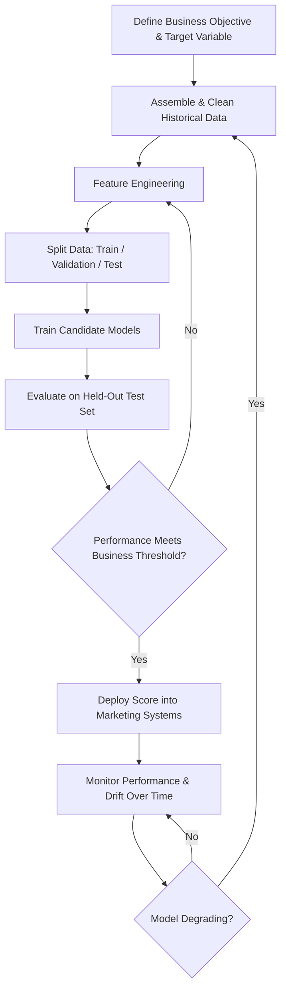

## Predictive Analytics and Customer Scoring

### Overview

Predictive analytics applies statistical and machine learning models to historical customer data to forecast future behavior — who will buy, who will churn, who will respond to an offer, and how much a customer is worth over time. Customer scoring is the operational output of this discipline: assigning each customer a numeric or categorical score (a propensity, risk, or value score) that marketing systems use to prioritize, segment, and personalize treatment at scale.

**Key Points**

- Predictive analytics moves marketing from reactive/descriptive reporting ("what happened") to forward-looking decisioning ("what will happen, and what should we do about it").
- A "score" is not a single technique but a modeling output format — the underlying model can be logistic regression, gradient boosting, or a neural network, among others.
- Model value depends as much on the feature engineering and business integration as on model architecture choice.

---

### Core Types of Customer Scores

#### Propensity Scores

Estimate the probability that a customer will take a specific action within a defined time window (e.g., purchase, upgrade, respond to an offer, click an email).

- **Purchase propensity**: Likelihood of converting within a given period, used to prioritize outreach or ad targeting spend toward high-propensity prospects.
- **Response propensity**: Likelihood of responding to a specific campaign or offer, distinct from purchase propensity because it accounts for channel/message fit, not just general purchase intent.
- **Upsell/cross-sell propensity**: Likelihood an existing customer will purchase an additional product or upgrade tier.

#### Churn/Attrition Risk Scores

Estimate the probability a customer will stop purchasing, cancel a subscription, or become inactive within a defined window, typically built as a binary or time-to-event classification problem using behavioral decay signals (declining frequency, reduced engagement, support complaints) as predictive features.

#### Customer Lifetime Value (CLV) Scores

Predict the total future value (revenue or profit) a customer will generate, using either:

- **Historical/aggregate models**: Extrapolating from past purchase behavior using heuristics or regression on historical cohorts.
- **Probabilistic models**: E.g., the BG/NBD (Beta-Geometric/Negative Binomial Distribution) model for predicting future purchase frequency combined with a Gamma-Gamma model for predicting average transaction value, producing a probabilistic CLV estimate grounded in purchase-pattern theory rather than simple historical averaging.

#### Lead/Engagement Scores

Common in B2B and high-consideration marketing, combining behavioral signals (content downloads, email engagement, site visits) and firmographic/demographic fit criteria into a composite score used to prioritize sales follow-up (often built on frameworks like BANT — Budget, Authority, Need, Timeline — as a qualifying overlay to the behavioral score).

#### Risk and Fraud Scores

Estimate the likelihood a transaction or account represents fraudulent or high-risk activity, typically built with anomaly detection and classification techniques on transactional and behavioral pattern data. [Note: this scoring type sits at the intersection of marketing and risk/fraud functions and often involves specialized modeling teams.]

**Example**

A telecom provider builds a churn risk score for its postpaid subscriber base using gradient boosting on features including declining monthly usage, days since last customer service contact resolution, competitor promotional activity in the customer's area, and contract renewal proximity. Customers scoring in the top decile of churn risk are routed to a proactive retention offer, while low-risk customers receive standard lifecycle communication, focusing retention budget on the segment where it has the highest expected impact.

---

### Modeling Approaches

#### Statistical/Traditional Methods

- **Logistic regression**: Models the probability of a binary outcome (e.g., churn yes/no) as a function of predictor variables; valued for interpretability (coefficients indicate direction and relative magnitude of each feature's effect) and remains widely used where model explainability is required (e.g., regulated industries, stakeholder trust).
- **Linear/multiple regression**: Used for continuous outcome prediction (e.g., predicted spend amount).
- **Survival analysis / time-to-event models**: Models the *time until* an event occurs (e.g., time until churn) rather than simply whether it occurs, accounting for censored data (customers who haven't churned yet at the time of analysis).

#### Machine Learning Methods

- **Decision trees and random forests**: Tree-based models that split data on feature thresholds; random forests aggregate many trees to reduce overfitting and improve predictive accuracy relative to a single tree, at some cost to direct interpretability.
- **Gradient boosting machines (e.g., XGBoost, LightGBM)**: Sequentially build trees that correct the errors of prior trees, frequently delivering strong predictive performance on structured/tabular marketing data and widely used in production propensity and churn models.
- **Neural networks / deep learning**: Applied particularly where input data includes unstructured elements (text, images, sequential clickstream data) or very large feature spaces; generally requires larger training datasets and more computational infrastructure than tree-based methods, with lower inherent interpretability.
- **Collaborative filtering / matrix factorization**: Common for propensity-to-purchase-specific-item scoring in recommendation contexts, inferring preference from patterns of similar customers' behavior.

#### Model Selection Considerations

| Factor | Favors Traditional/Interpretable Models | Favors Complex ML Models |
| --- | --- | --- |
| Need for explainability (stakeholder trust, regulation) | Higher | Lower |
| Data volume available | Lower | Higher |
| Feature relationships (linear vs. complex/non-linear) | Linear | Non-linear, interactive |
| Team's model maintenance capability | Lower complexity tolerance | Higher MLOps maturity required |
| Marginal accuracy gain needed | Smaller gains acceptable | Larger accuracy gains justify complexity |

---

### The Predictive Modeling Pipeline

#### Feature Engineering

The process of transforming raw data into predictive input variables, often the most impactful step in model performance:

- **RFM-derived features**: Recency, frequency, and monetary value metrics as direct model inputs.
- **Trend/velocity features**: Rate of change in engagement or spend over recent periods, often more predictive of churn than static snapshot values.
- **Interaction/derived features**: Combinations of raw variables (e.g., spend-per-visit) that better capture underlying behavioral patterns than raw variables alone.
- **Temporal windowing**: Defining consistent lookback periods (e.g., "purchases in the last 90 days") for feature calculation to avoid data leakage and ensure features are computable at actual prediction time.

#### Target Variable Definition

Precisely defining what the model predicts and over what time window is critical — e.g., "churn" must be operationally defined (e.g., no purchase within 90 days for a non-contractual business, or explicit cancellation for a subscription business) before modeling can proceed meaningfully.

#### Train/Validation/Test Splitting

- **Training set**: Data used to fit model parameters.
- **Validation set**: Data used to tune model hyperparameters and select among candidate models without touching the final test set.
- **Test set**: Held-out data used only for final, unbiased performance evaluation, simulating how the model will perform on genuinely unseen future customers.
- **Temporal (out-of-time) validation**: In marketing contexts, splitting by time period (training on older data, testing on more recent data) rather than purely random splitting better simulates real deployment conditions, where models must predict genuinely future behavior.

---

### Model Evaluation Metrics

#### Classification Scores (Propensity, Churn)

- **AUC-ROC (Area Under the Receiver Operating Characteristic Curve)**: Measures the model's ability to rank positive cases higher than negative cases across all possible classification thresholds; commonly used as a headline metric for propensity/churn models.
- **Precision and Recall**: Precision measures the proportion of predicted-positive cases that are truly positive; recall measures the proportion of actual positive cases the model correctly identifies — there is typically a trade-off between the two, tuned according to business cost of false positives vs. false negatives.
- **Lift and Gains charts**: Measure how much better the model performs at identifying positive cases within top-ranked deciles compared to random selection — a business-friendly way of communicating model value for targeting use cases (e.g., "the top decile captures 4x the response rate of random targeting").
- **Calibration**: Assesses whether predicted probabilities match actual observed outcome frequencies (e.g., among customers scored at 70% purchase probability, roughly 70% should actually purchase) — important when scores are used for expected-value calculations, not just rank-ordering.

#### Regression/Value Scores (CLV)

- **Mean Absolute Error (MAE) / Root Mean Squared Error (RMSE)**: Measure average prediction error magnitude for continuous value predictions like predicted spend.
- **$R^2$ (coefficient of determination)**: Measures the proportion of variance in the outcome explained by the model.

$$\text{RMSE} = \sqrt{\frac{1}{n}\sum_{i=1}^{n}(y_i - \hat{y}_i)^2}$$

where $y_i$ is the actual value, $\hat{y}_i$ is the predicted value, and $n$ is the number of observations.

---

### Operationalizing Scores in Marketing Systems

- **Score integration with CDPs/CRM**: Predictive scores are typically written back into a Customer Data Platform or CRM as a customer attribute, enabling activation across email, ads, and personalization systems.
- **Scoring cadence**: Batch scoring (e.g., nightly/weekly recalculation) versus real-time scoring (recalculated at the moment of interaction, e.g., for real-time offer personalization) — chosen based on how quickly the underlying behavior changes and the latency requirements of the activation use case.
- **Threshold setting and action mapping**: Translating a continuous score into discrete marketing actions requires defining business-relevant thresholds (e.g., top 10% propensity = premium offer tier), typically set through a combination of statistical distribution analysis and expected-value/ROI modeling rather than arbitrary cutoffs.
- **Model monitoring and drift detection**: Ongoing tracking of model performance and input feature distributions over time to detect degradation (concept drift, when the relationship between features and outcome changes; or data drift, when the input feature distributions shift) that necessitates retraining. [Inference: appropriate monitoring cadence and retraining triggers vary by use case volatility and are typically determined empirically per deployment.]

---

### Limitations

- **Feature availability constraints**: Predictive power is capped by the quality and completeness of available historical data; sparse or fragmented customer data (especially without strong identity resolution) limits model accuracy.
- **Cold-start problem**: New customers with little to no transaction history cannot be scored reliably using behavioral models alone, often requiring hybrid approaches using demographic/acquisition-channel proxies until sufficient behavioral data accumulates.
- **Correlation-based, not inherently causal**: Propensity and churn models predict association-based likelihood, not the causal driver of behavior — a high propensity score indicates likely purchase, not necessarily that a specific marketing action will change that likelihood (uplift modeling addresses this distinction specifically).
- **Model drift and changing market conditions**: Models trained on historical patterns can degrade in accuracy as market conditions, competitive dynamics, or customer preferences shift, requiring ongoing monitoring and retraining rather than a one-time deployment.
- **Privacy and regulatory constraints**: Use of individual-level behavioral and transactional data for scoring is subject to data privacy regulation and, in some jurisdictions, specific disclosure or consent requirements for automated decision-making that affects consumers. [Inference: specific regulatory obligations vary by jurisdiction and use case and require legal/compliance review rather than general characterization.]

---

### Applications in Marketing & Consumer Psychology

- **Campaign targeting and budget allocation**: Directing marketing spend toward customers with the highest propensity and expected value, improving return on marketing investment relative to undifferentiated targeting.
- **Retention and lifecycle marketing**: Churn scores triggering proactive retention workflows before at-risk customers actually lapse.
- **Personalization**: Propensity and preference scores feeding real-time content, offer, and product recommendation personalization.
- **Customer prioritization in service and sales**: Lead and engagement scores directing sales and service resource allocation toward the highest-value or highest-intent customers.
- **Marketing mix and budget planning**: Aggregate CLV and propensity distributions informing overall customer acquisition cost (CAC) thresholds and channel investment decisions.

---

**Related Topics**

- Behavioral and transactional data analysis
- Customer Lifetime Value (CLV) modeling methods
- Uplift modeling and incrementality measurement
- Customer Data Platforms (CDPs) and MarTech architecture
- Machine learning model evaluation and MLOps
- Personalization and recommendation systems
- A/B testing and causal inference (for validating score-driven actions)
- Data privacy regulation and algorithmic decision-making ethics