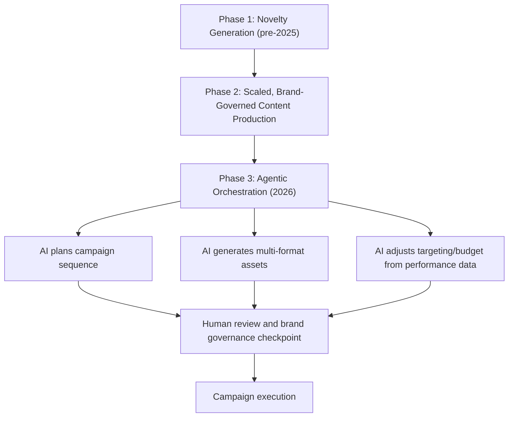
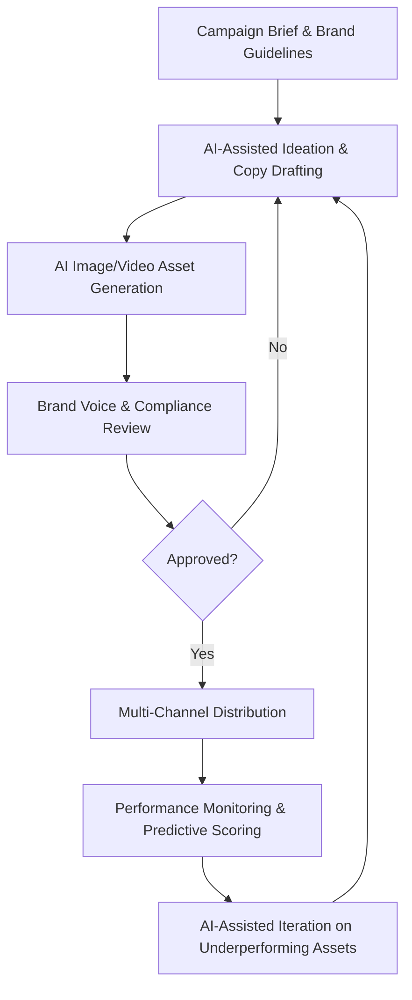

## Generative AI in Content and Campaign Creation

### Overview

Generative AI in marketing refers to the use of large language models (LLMs), diffusion-based image/video generators, and multimodal AI systems to produce marketing assets — copy, visuals, video, audio — and increasingly to orchestrate entire campaign workflows. The field has moved through a clear maturity arc: from novelty content generation, to brand-governed scaled production, to what the industry is now framing as **agentic orchestration**, where AI systems don't just draft assets but plan, sequence, and adjust campaign actions with reduced human intervention at each step.

**Key Points**

- By early 2026, industry commentary describes a shift from generative AI to agentic AI in marketing technology, with orchestration and strategic intelligence emphasized over raw content output. [Martech Cube](https://www.martechcube.com/top-10-ai-martech-tools-2026/)
- Marketing leaders increasingly report "AI fatigue" not because they reject the technology, but because they now expect integrated tools with measurable results rather than experimental generation for its own sake. [Martech Cube](https://www.martechcube.com/top-10-ai-martech-tools-2026/)
- A major 2026 development is multimodal AI, where writing, image, video, and audio generation are converging into unified platforms rather than requiring separate point tools. [AItheMag](https://www.aithemag.com/blog/generative-ai-content-creation-2026)

---

### Core Content Generation Capabilities

#### Text and Copy Generation

- **LLM-based copywriting platforms**: Purpose-built platforms take inputs such as keywords, topic prompts, and style preferences and generate structured content, offering templates and customizable workflows spanning long-form articles to concise product descriptions. [Demandbase](https://www.demandbase.com/blog/best-ai-tools-b2b-marketing/)
- **Guided content workflows**: Some platforms use pre-built step-by-step workflows ("recipes") covering specific content types like blog posts, product reviews, sales emails, and video scripts. [Demandbase](https://www.demandbase.com/blog/best-ai-tools-b2b-marketing/)
- **General-purpose LLM assistants**: General conversational AI models are also widely used directly for marketing copy, customer-facing chat content, blogs, emails, and ad copy, valued for natural, human-like text generation at scale. [Gwi](https://www.gwi.com/blog/ai-marketing-tools)
- **Brand voice training**: Dedicated marketing writing platforms combine LLM-powered generation with brand voice training, campaign management, and team collaboration features, learning a company's specific communication style rather than producing generic output. [BuildMVPFast](https://www.buildmvpfast.com/blog/best-generative-ai-tools-content-marketing-2026)

#### Image Generation

- **Diffusion-based image generators**: Leading image generation tools have advanced significantly in photorealism, accurate rendering of hands and text, and understanding of complex spatial compositions. [BuildMVPFast](https://www.buildmvpfast.com/blog/best-generative-ai-tools-content-marketing-2026)
- **Brand consistency features**: For marketing use specifically, a key feature is the ability to create a brand character, product mockup, or visual style and reproduce it consistently across campaigns, often via a style-reference system that uses existing brand assets to guide new generations. [BuildMVPFast](https://www.buildmvpfast.com/blog/best-generative-ai-tools-content-marketing-2026)
- **Usage patterns**: Marketers use AI image generation tools for tasks like blog thumbnails and general marketing visuals, often saving reusable prompts to keep output "on brand" against defined brand guidelines. [Marketer Milk](https://www.marketermilk.com/blog/ai-marketing-tools)

#### Video and Audio Generation

- **Short-form video automation**: Tools aimed at streamlining video creation help marketers ideate, produce, and generate videos using AI voiceovers and graphics for short-form, attention-optimized storytelling. [Marketer Milk](https://www.marketermilk.com/blog/ai-marketing-tools)
- **Content repurposing pipelines**: Some platforms take a single long-form recording (e.g., a podcast) and automatically generate a transcript, blog post draft, social clips, audiogram, and show notes from it — turning one content asset into multiple derivative formats. [BuildMVPFast](https://www.buildmvpfast.com/blog/best-generative-ai-tools-content-marketing-2026)
- **AI avatar-driven ad video**: Some platforms specialize in turning scripts or product URLs directly into short-form video ads using AI avatars. [G2](https://learn.g2.com/best-ai-content-creation-platforms)

---

### Campaign-Level and Performance Applications

#### AI-Driven Advertising Optimization

- AI advertising tools are used to maximize ROI and reduce manual tuning, with AI-driven marketing technology able to predict results before spend is committed, helping teams move faster with less risk. [Canto](https://www.canto.com/blog/best-ai-marketing-tools/)
- **Dynamic budget and bid optimization**: Specialized tools handle dynamic budget allocation and bid optimization across ad platforms. [Canto](https://www.canto.com/blog/best-ai-marketing-tools/)
- **Data-driven ad copy testing**: Other platforms focus specifically on data-driven ad copy testing and refinement, applying generative and predictive techniques together to iterate creative based on performance signals. [Canto](https://www.canto.com/blog/best-ai-marketing-tools/)
- **Embedded CRM/pipeline AI**: AI capabilities are increasingly embedded directly within CRM platforms for pipeline forecasting and pattern surfacing from marketing data. [Canto](https://www.canto.com/blog/best-ai-marketing-tools/)

#### Multi-Channel Content Distribution

- Beyond generation, AI-powered tools increasingly automate content creation alongside multi-channel distribution, while digital asset management (DAM) software ensures ad creative remains discoverable, transformable, and automatically deliverable across channels. [Canto](https://www.canto.com/blog/best-ai-marketing-tools/)

---

### The 2026 Shift: From Generation to Orchestration

Content creation has stopped being the primary differentiator; authority, orchestration, and strategic intelligence have become the metrics that define successful marketing use of AI. This reflects a broader industry recognition that generation speed alone doesn't translate to better campaign performance without integration into measurement and decision systems — echoing the earlier chapter theme that predictive scoring and causal validation must anchor any AI-generated output before it's trusted at scale. [Martech Cube](https://www.martechcube.com/top-10-ai-martech-tools-2026/)

---

### Governance, Brand Consistency, and Quality Control

#### Brand Voice and Style Governance

- **Brand voice/style training**: Dedicated marketing AI platforms increasingly allow organizations to train a persistent "brand voice" profile, aiming to ensure generated copy matches established tone rather than producing generic LLM output.
- **Style reference systems**: For visual content, uploading brand assets to guide new image generations helps maintain visual consistency across large volumes of AI-produced creative.
- **Human-in-the-loop review**: Despite generation automation, brand and legal review checkpoints remain standard practice before publishing AI-generated content, particularly for regulated claims, competitive comparisons, or sensitive topics.

#### Quality and Differentiation Risk

- By 2025, the broader market experienced "AI fatigue" from an influx of synthetic content, which shaped the 2026 shift toward valuing orchestration and measurable results over sheer content volume. [Martech Cube](https://www.martechcube.com/top-10-ai-martech-tools-2026/)
- **Homogenization risk**: [Inference: as more brands adopt similar generative tools and default model outputs, there is a plausible risk of stylistic convergence across brand content unless deliberate brand-voice differentiation is actively maintained — though the magnitude of this effect across categories is not established with precision in current industry reporting.]

---

### Adoption and Market Context

- Industry survey data cited in 2026 reporting indicates 43% of marketers now use generative AI to create content, with a 57% user adoption rate specifically for dedicated AI content creation platforms according to G2's Winter 2026 Grid Report. [G2](https://learn.g2.com/best-ai-content-creation-platforms)
- Businesses adopting generative AI in content workflows commonly cite reduced production time and reduced need for expensive production pipelines as primary drivers, enabling smaller teams and solo creators to generate visuals, voiceovers, scripts, and marketing materials without large creative teams. [AItheMag](https://www.aithemag.com/blog/generative-ai-content-creation-2026)

---

### Practical Workflow Integration

**Example**

A DTC apparel brand uses a brand-voice-trained copy platform to draft initial ad copy variants, an image generator with a saved brand style reference to produce consistent product lifestyle imagery, and an ad optimization tool to allocate budget dynamically across the resulting creative set based on early performance signals — with a human marketer reviewing all copy and imagery against brand and compliance guidelines before each variant goes live, rather than publishing AI output unreviewed.

---

### Limitations

- **Output requires human governance**: Despite improved fluency and photorealism, generated content still requires brand, factual, and compliance review before publication — generative fluency doesn't guarantee factual accuracy or brand appropriateness.
- **Differentiation pressure**: As adoption scales, the competitive advantage shifts from having access to generative tools (increasingly commoditized) toward proprietary data, brand voice distinctiveness, and orchestration quality. [Inference: this reflects a reasonable extrapolation from the current shift toward "agentic" and "orchestration" framing, though the precise competitive dynamics will continue to evolve.]
- **Attribution and measurement gaps**: Generated content volume does not automatically translate into performance; without integration into the predictive scoring and experimentation frameworks discussed elsewhere in this chapter, teams risk generating content without validating its actual incremental impact.
- **Tool landscape volatility**: [Unverified: specific tool names, pricing, and feature sets in this space change frequently; capabilities described here reflect the general state of the market as of early-to-mid 2026 reporting and should be reverified against current vendor documentation before procurement decisions.]

---

### Applications in Marketing & Consumer Psychology

- **Scaled personalization**: Generative AI enables producing many message/creative variants tailored to different audience segments without proportional increases in production headcount.
- **Rapid creative testing**: Fast generation of copy and visual variants feeds directly into A/B and multivariate testing pipelines, increasing the volume of hypotheses that can be tested.
- **Content repurposing for omnichannel reach**: Automated reformatting of core content assets (e.g., long-form to short-form, text to video) extends reach across channels without separate production efforts per format.
- **Predictive-generative integration**: Propensity and CLV scores increasingly inform which AI-generated creative variant is served to which customer segment, connecting the generation and scoring disciplines within this chapter.

---

**Related Topics**

- Predictive analytics and customer scoring
- Personalization and recommendation systems
- A/B testing and causal inference (for validating AI-generated creative)
- Marketing automation and MarTech stack architecture
- AI content governance and brand safety frameworks
- Multimodal AI and content repurposing pipelines
- Agentic AI systems in marketing operations
- Ethical and disclosure considerations for AI-generated content