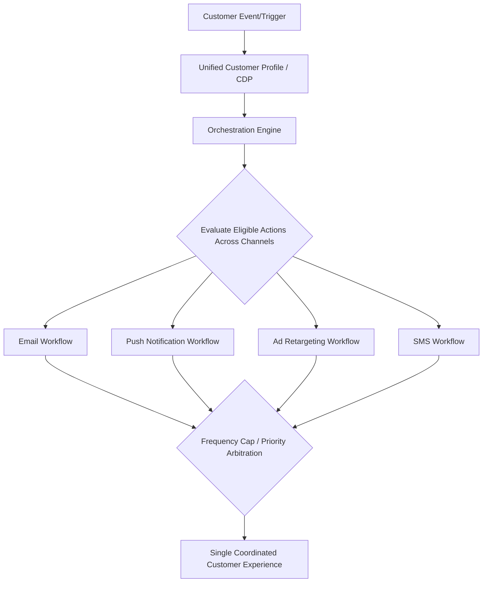

## Marketing Automation and Orchestration

### Overview

Marketing automation refers to software systems that execute predefined, rule-based marketing actions (emails, triggers, lead scoring updates) without manual intervention for each instance. Orchestration extends this concept to the coordinated sequencing of messages and actions across multiple channels and systems in real time, ensuring a customer receives a coherent, non-redundant experience regardless of which channel or touchpoint they interact with next. Together, these disciplines form the operational backbone that turns predictive scores and generated content (covered elsewhere in this chapter) into actual, timed, cross-channel customer interactions.

**Key Points**

- Automation is fundamentally about executing rules at scale; orchestration is about coordinating those rules across channels and over time so actions don't conflict or duplicate.
- Modern platforms increasingly blend both with AI-driven decisioning, shifting from static rule trees toward adaptive, real-time next-best-action logic.
- Effective orchestration depends on unified customer data (see Customer Data Platforms) — fragmented data across channels is the most common cause of orchestration failure.

---

### Marketing Automation Fundamentals

#### Core Capabilities

- **Trigger-based workflows**: Automated sequences initiated by a defined event (e.g., form submission, cart abandonment, subscription anniversary) or a scheduled time.
- **Lead scoring and routing**: Automatically updating a lead's engagement/propensity score based on behavior and routing it to sales or a nurture track once it crosses a defined threshold.
- **Drip and nurture campaigns**: Pre-sequenced series of messages delivered over time to move a prospect through a defined journey stage (e.g., awareness to consideration).
- **Segmentation automation**: Dynamically updating audience segment membership as customer attributes or behavior change, without manual list rebuilding.
- **A/B testing within workflows**: Automatically splitting traffic within an automated sequence to test subject lines, send times, or content variants (connecting directly to the experimental methods covered earlier in this course).

#### Workflow/Journey Builder Architecture

Most automation platforms are built around a visual, node-based workflow builder consisting of:

- **Entry/trigger nodes**: Define what event or condition adds a customer to the workflow.
- **Decision/branch nodes**: Route customers down different paths based on attributes, behavior, or score thresholds (e.g., "if opened email, send X; if not, send Y after 3 days").
- **Action nodes**: Execute a specific action — send email, update a CRM field, trigger a webhook, push a push notification.
- **Wait/delay nodes**: Pause the workflow for a defined period or until a specific condition is met.
- **Exit conditions**: Define when a customer should be removed from a workflow (e.g., upon conversion, unsubscribe, or reaching a goal).

**Example**

An e-commerce brand builds a cart abandonment workflow: entry trigger fires when a cart is abandoned for 1 hour; a decision node checks cart value (high vs. standard); high-value carts receive a personalized email from a named support rep after 2 hours, while standard carts receive a templated reminder email after 4 hours followed by a 10%-off incentive at 24 hours if still unconverted; the workflow exits immediately upon purchase completion, preventing the incentive from firing on customers who already converted.

---

### From Automation to Orchestration

#### Key Distinction

| Dimension | Marketing Automation | Marketing Orchestration |
| --- | --- | --- |
| Scope | Typically single-channel or single-workflow execution | Cross-channel coordination across simultaneous workflows |
| Logic | Predefined rules and sequences | Real-time, often AI-assisted arbitration across competing messages |
| Goal | Execute the right action at the right trigger | Ensure the *combination* of actions across channels is coherent and non-conflicting |
| Failure mode without it | Missed triggers, manual bottlenecks | Message collision, redundant contact, channel conflict |

#### Cross-Channel Coordination Problems Orchestration Solves

- **Message collision**: Preventing a customer from receiving a promotional email and a conflicting retention offer simultaneously because two separate automated workflows triggered independently.
- **Frequency/contact capping**: Enforcing a maximum number of marketing touches per customer within a given period across all channels combined, not just within a single channel's automation rules.
- **Channel prioritization and suppression**: Determining which channel should "win" when a customer is eligible for multiple messages at once (e.g., suppressing an email send if the customer already engaged with the same offer via app push).
- **Journey state consistency**: Ensuring a customer's position in a broader journey (e.g., onboarding, win-back) is consistently reflected across all channels and systems, rather than each channel/tool maintaining its own disconnected view.

---

### AI-Driven Decisioning in Orchestration

#### Next-Best-Action (NBA) Systems

Rather than routing customers through static, pre-designed workflow branches, next-best-action systems use predictive models (propensity scores, CLV, churn risk — see the prior item in this chapter) to dynamically determine, in real time, which single action is likely to produce the best outcome for a given customer at a given moment, across all available channels and offers simultaneously.

- **Real-time scoring integration**: NBA systems query live or near-live propensity/churn/value scores to inform the decision rather than relying solely on static segment rules.
- **Arbitration logic**: When multiple candidate actions are eligible (e.g., a retention offer and a cross-sell offer), the system selects based on expected value, business priority weighting, or a trained recommendation model rather than a fixed rule order.
- **Constraint layers**: Business rules (compliance requirements, frequency caps, legal suppression lists) are typically layered on top of the AI recommendation as hard constraints the model cannot override.

#### Agentic Orchestration (Emerging Practice)

Building on the generative AI capabilities discussed in the prior item, marketing technology commentary in 2026 describes a shift from generative content tools toward agentic AI systems, where the emphasis moves from producing individual content assets to unifying data, personalizing campaigns, and improving ROI through integrated orchestration rather than isolated generation. Agentic orchestration extends AI decisioning beyond selecting a single next action toward planning and adjusting multi-step campaign sequences with reduced manual configuration — though the maturity and reliability of fully autonomous campaign execution varies significantly by vendor and use case. [Inference: the degree of true autonomy versus AI-assisted human decisioning in current "agentic" marketing platforms varies substantially by vendor, and specific claims should be verified against individual platform documentation rather than treated as a uniform category standard.]

**Example**

A subscription streaming service's orchestration engine evaluates, for each customer daily, whether the highest-expected-value action is a churn-prevention offer, a content recommendation push, an upsell to a premium tier, or no contact at all (to avoid fatigue) — selecting the single action based on combined churn risk, upsell propensity, and recent contact frequency, rather than that customer separately qualifying for three different static automated campaigns simultaneously.

---

### Technical Architecture Components

#### Data Layer

- **Customer Data Platform (CDP) or equivalent unified profile store**: Provides the single customer view (identity-resolved behavioral, transactional, and demographic data) that orchestration decisions depend on; without this, orchestration typically degrades back into siloed per-channel automation.
- **Real-time event streaming**: Infrastructure (e.g., event buses, streaming pipelines) that allows behavioral triggers to reach the orchestration layer with low latency, essential for real-time next-best-action use cases.

#### Decisioning Layer

- **Rules engine**: Deterministic business-rule evaluation (eligibility, suppression, compliance constraints).
- **Predictive/ML scoring services**: The propensity, churn, and CLV models discussed in the prior chapter item, exposed as callable services the orchestration engine queries at decision time.
- **Arbitration/prioritization logic**: The layer that resolves conflicts when multiple eligible actions compete for the same customer touchpoint.

#### Execution Layer

- **Channel connectors/APIs**: Integrations with email service providers, SMS gateways, push notification services, ad platforms, and website personalization engines that actually deliver the chosen action.
- **Content assembly**: Dynamic content insertion (potentially AI-generated, per the prior item) into the selected channel's message template at send time.

#### Measurement Layer

- **Attribution and outcome tracking**: Feeding delivered-action outcomes back into the system to measure effectiveness and, ideally, retrain the predictive models driving decisioning (closing the loop described in the predictive analytics pipeline).

---

### Governance and Operational Considerations

- **Suppression and compliance management**: Centralized management of opt-outs, do-not-contact lists, and regulatory consent (e.g., marketing consent under privacy regulations) must be enforced consistently across all orchestrated channels, not managed separately per tool.
- **Workflow sprawl and technical debt**: As organizations build increasing numbers of automated workflows over time, overlapping or outdated workflows can create unintended customer experience conflicts; regular workflow audits are a common operational practice to manage this.
- **Testing and QA of automated sequences**: Automated workflows require systematic testing (including edge cases like customers qualifying for multiple triggers simultaneously) before launch, since errors compound at scale in ways manual campaigns do not.
- **Cross-functional ownership**: Orchestration decisions often span marketing, sales, and customer service functions; unclear ownership of arbitration logic (which team's priority "wins" when actions conflict) is a common organizational failure point. [Inference: the specific organizational structures used to resolve this vary considerably by company size and MarTech maturity.]

---

### Limitations

- **Data fragmentation risk**: Orchestration quality is bounded by the completeness and accuracy of the underlying unified customer profile; incomplete identity resolution across channels undermines coordinated decisioning regardless of how sophisticated the orchestration logic is.
- **Over-automation and personalization fatigue**: Excessive automated touchpoints, even when individually well-targeted, can create a cumulative sense of relentless marketing pressure from the customer's perspective if frequency governance isn't actively managed.
- **Black-box decisioning concerns**: AI-driven next-best-action and agentic systems can make it harder for marketers to understand or explain why a specific customer received a specific action, complicating both internal governance and, in some contexts, regulatory explainability expectations.
- **Vendor and platform variability**: Orchestration maturity (true real-time cross-channel arbitration vs. marketed-but-limited capability) varies significantly across MarTech vendors; capability claims should be validated against actual implementation rather than category-level marketing positioning. [Unverified: specific platform capabilities change frequently and require direct verification against current vendor documentation for any procurement decision.]

---

### Applications in Marketing & Consumer Psychology

- **Lifecycle marketing**: Coordinated onboarding, nurture, retention, and win-back sequences that adapt based on real-time behavioral and predictive signals rather than fixed calendars.
- **Reducing message fatigue**: Frequency capping and cross-channel suppression directly address the psychological reality that excessive, uncoordinated contact damages brand perception and increases opt-out/unsubscribe behavior.
- **Personalized channel selection**: Orchestration can route messages through the channel a given customer is most responsive to, rather than defaulting to a single channel uniformly.
- **Connecting scoring to action**: Serves as the operational bridge that converts the predictive scores and generated content from earlier chapter items into actual, coordinated customer-facing execution.

---

**Related Topics**

- Predictive analytics and customer scoring
- Generative AI in content and campaign creation
- Customer Data Platforms (CDPs) and identity resolution
- Next-best-action and recommendation systems
- Customer journey mapping methodologies
- A/B testing and causal inference (for workflow-level testing)
- Data privacy regulation and consent management
- MarTech stack architecture and vendor evaluation