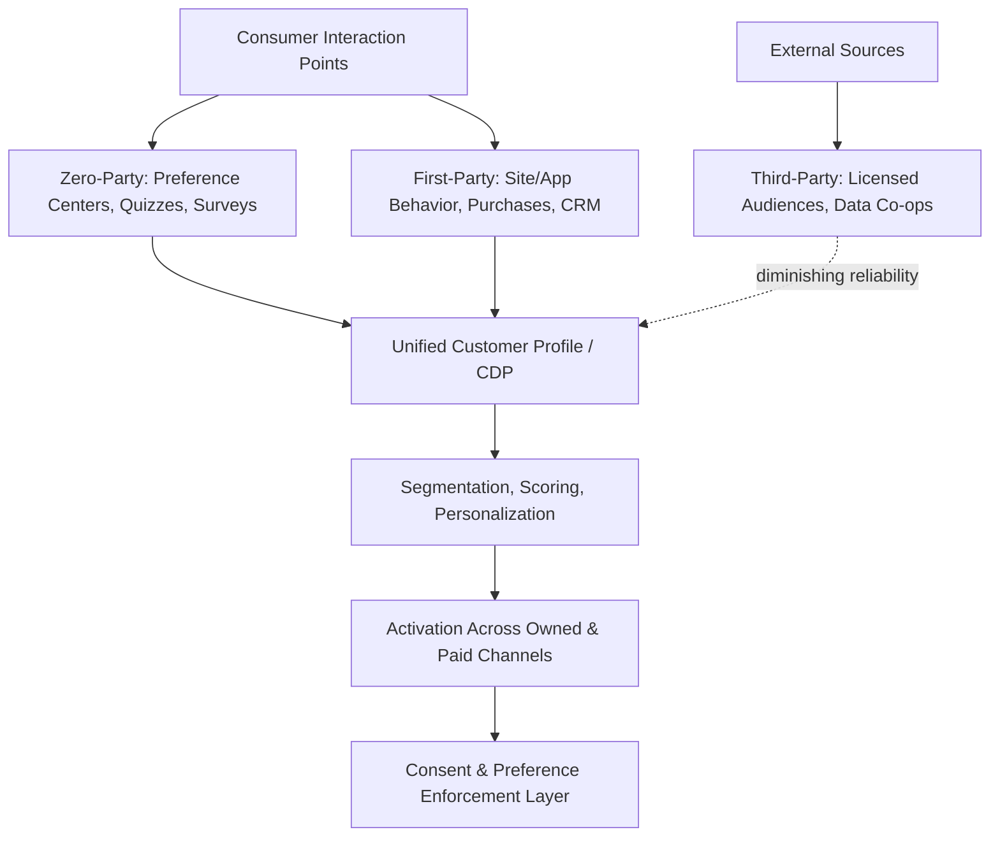

## First-Party, Zero-Party, and Third-Party Data Strategy

### Overview

Marketing data strategy is commonly organized into three categories based on data provenance and the consent relationship with the consumer: first-party data (collected directly by a brand through its own owned properties and interactions), zero-party data (explicitly and intentionally shared by the consumer with a specific stated purpose), and third-party data (aggregated from sources outside the brand's direct relationship, typically via data brokers or cross-site tracking). Strategy in this area has become increasingly consequential as regulatory pressure, browser-level tracking restrictions, and platform policy changes have made durable, brand-owned data collection a competitive necessity rather than a compliance afterthought.

**Key Points**

- The traditional hierarchy of data trust and durability runs zero-party > first-party > third-party, though each serves different strategic purposes and none fully substitutes for the others.
- Contrary to a once-common industry expectation of a clean cutoff date, third-party cookie deprecation has unfolded as a gradual, fragmented, browser-by-browser erosion rather than a single defined event.
- As of 2026, the practical guidance across the industry converges on the same point regardless of any single browser's specific policy: assume durable third-party identifiers will continue shrinking, and build measurement and targeting systems that don't depend on them.

---

### Defining the Three Data Types

#### First-Party Data

Data collected directly by a brand through its own owned channels and direct interactions with a known or anonymous visitor/customer — website behavior, app usage, purchase history, email engagement, loyalty program activity, and CRM records.

- **Collection surfaces**: Owned website and app analytics, e-commerce transaction systems, CRM and loyalty platforms, customer service interactions, and owned email/SMS engagement.
- **Strategic value**: Directly observed, behaviorally grounded, and collected under the brand's own privacy policy and consent framework, giving the brand the most control over accuracy and compliance.

#### Zero-Party Data

Data a customer proactively and intentionally shares with a brand, explicitly and with clear purpose, coined and popularized as a distinct category to describe the highest-trust, most consent-forward data type (in contrast to inferred first-party behavioral data).

- **Collection mechanisms**: Preference centers, onboarding quizzes, interactive product finders/configurators, explicit surveys, loyalty program profile fields, and stated purchase intent forms.
- **Strategic value**: Because it's explicitly stated rather than behaviorally inferred, zero-party data tends to carry lower ambiguity (the brand doesn't have to guess intent from proxy signals) and is typically collected with clear, specific consumer awareness of its use — supporting both personalization accuracy and regulatory defensibility.

#### Third-Party Data

Data aggregated by entities outside the brand's direct relationship with the consumer — data brokers, ad networks, and cross-site tracking mechanisms (most notably third-party cookies, device fingerprinting, and cross-site identity graphs) — then licensed or sold to brands and advertisers for audience targeting and measurement.

- **Collection mechanisms**: Third-party cookies, universal identity graphs, data co-ops and clean rooms, and licensed audience segments from data management platforms (DMPs).
- **Strategic value**: Historically enabled broad-reach prospecting and audience extension beyond a brand's own known customer base, but carries the lowest transparency to the end consumer and is the category most directly affected by browser and regulatory restriction.

---

### Comparative Framework

| Dimension | Zero-Party | First-Party | Third-Party |
| --- | --- | --- | --- |
| Source of data | Directly and intentionally stated by the consumer | Observed via brand's own owned properties | Aggregated from outside the brand relationship |
| Consumer awareness of collection | Highest (explicit sharing) | Moderate (implied by interaction) | Lowest (often opaque to consumer) |
| Accuracy/ambiguity | Low ambiguity (stated intent) | Behaviorally grounded but requires inference | Often outdated, probabilistic, or mismatched |
| Regulatory durability | Most resilient to privacy regulation and browser changes | Resilient if consent-compliant | Most exposed to regulatory and technical erosion |
| Primary use case | Deep personalization, preference-based segmentation | CRM, retention, lifecycle marketing, modeling | Prospecting reach, audience extension (declining reliability) |

---

### The Third-Party Cookie Deprecation Reality (2026 Status)

#### What Actually Happened

Contrary to expectations of a single defined "cookiepocalypse" event, cookie deprecation unfolded as a gradual, fragmented, multi-year erosion of cross-site tracking signal rather than a single cutoff.

- **Safari and Firefox**: Apple Safari's Intelligent Tracking Protection has blocked third-party cookies by default since 2020, and Mozilla Firefox's Enhanced Tracking Protection implemented default blocking in 2019 — meaning a substantial share of web traffic has effectively been cookieless for several years already.
- **Chrome's reversal**: In July 2024, Google abandoned its plan to force the deprecation of third-party cookies in Chrome, instead shifting to a user-choice model where Chrome lets users manage cookie preferences directly in browser privacy settings, while Google clarified that its Privacy Sandbox APIs (including Topics and Attribution Reporting) would remain active alongside cookies rather than replacing them outright.
- **Practical effect despite the reversal**: Although Chrome did not implement forced default blocking, the operational impact is described as similar to a phase-out in practice, since a substantial share of users are opting into enhanced privacy settings that restrict third-party cookies, and third-party cookies in Chrome are already blocked by default in Incognito mode.
- **No universal replacement**: As of 2026, there remains no single universal technical replacement for the third-party cookie, leaving brands to combine multiple approaches (first-party data, consented modeling, clean rooms, contextual targeting) rather than relying on one drop-in substitute.

**Key Points**

- Because Safari and Firefox have blocked third-party cookies for years, brands with meaningful traffic on non-Chrome browsers have already been operating in a substantially cookieless environment regardless of Chrome's policy evolution.
- The practical marketing guidance is consistent across sources regardless of Chrome's specific stance: assume fewer durable third-party identifiers going forward, treat user consent as non-negotiable, and modernize measurement infrastructure so reporting doesn't break when signal is lost.

#### Measurement Implications

- **Attribution drift**: Signal loss from cookie restriction rarely appears as a sudden reporting drop; it more commonly shows up gradually as attribution drift, shrinking retargeting pool sizes, and widening gaps between ad-platform-reported performance and actual backend revenue.
- **Modeled conversions**: As direct tracking signal degrades, platforms increasingly rely on statistically modeled (rather than directly observed) conversion estimates, which requires more careful validation and context when interpreting reported performance.
- **Server-side tracking**: Reinforcing pixel-based tracking with server-side data routing (sending event data from the brand's own server rather than relying solely on browser-based pixels) is increasingly used to improve signal durability and match quality as client-side tracking degrades.

---

### Data Strategy Architecture

#### First-Party Data Collection Infrastructure

- **Server-side tagging**: Routing tracking events through a brand-controlled server rather than relying solely on client-side browser scripts, improving data durability against browser-level blocking and ad-blocker interference.
- **Customer Data Platforms (CDPs)**: Unify first-party and zero-party data into a persistent customer profile, serving as the activation layer for segmentation and personalization (see the marketing automation and orchestration item in this chapter).
- **Identity resolution**: Matching anonymous behavioral data to known customer identities as consented touchpoints (login, email capture, loyalty enrollment) occur, progressively enriching the customer profile over time.

#### Zero-Party Data Collection Design

- **Value exchange framing**: Effective zero-party data collection typically offers a clear, immediate benefit to the consumer for sharing (better recommendations, relevant content, a discount) rather than requesting data with no visible return.
- **Progressive profiling**: Collecting zero-party data incrementally across multiple touchpoints rather than a single long intake form, reducing friction while building a richer profile over time.
- **Preference centers**: Centralized, consumer-facing interfaces where customers can explicitly state channel preferences, content interests, and communication frequency preferences.

**Example**

A skincare brand builds a zero-party data strategy around an interactive "skin quiz" during onboarding (skin type, concerns, routine preferences), explicitly framed as improving personalized product recommendations. This stated data is combined with first-party purchase and browsing behavior in the brand's CDP, reducing reliance on third-party audience data for retargeting — and because the quiz data was explicitly and transparently collected for personalization, it also carries clearer consent grounding for that specific use than inferred behavioral data alone would.

---

### Alternatives and Complements to Third-Party Data

- **Data clean rooms**: Privacy-preserving environments where two parties (e.g., a brand and a media platform) can analyze combined datasets for audience matching or measurement without either party directly accessing the other's raw underlying data.
- **Contextual targeting**: Targeting based on the content/context a user is currently engaging with (rather than individual tracking history), regaining relevance as an identifier-independent targeting approach.
- **Privacy Sandbox-style APIs**: Browser-native, privacy-preserving APIs (e.g., topic-based interest categorization, aggregated attribution reporting) designed to support advertising use cases without individual-level cross-site tracking, though these remain one of several coexisting approaches rather than a single universal replacement as of 2026.
- **Cooperative/consortium data**: Data-sharing arrangements among non-competing brands (data co-ops) pooling consented first-party data to extend reach without relying on third-party brokers.
- **Second-party data**: Another brand's first-party data shared directly under a negotiated partnership (e.g., a airline and a hotel chain sharing consented customer data) — distinguished from third-party data by its direct, bilateral, and typically more transparent sourcing relationship.

---

### Regulatory and Consent Considerations

- **Divergent regional frameworks**: Global brands face materially different consent requirements across regions — for example, the EU maintains strict opt-in consent requirements while a substantial number of US states operate under opt-out-based frameworks, and other jurisdictions (e.g., India's DPDP Act) impose their own distinct requirements — creating meaningful complexity for brands operating multi-region consent architecture.
- **Consent Mode compliance gaps**: Industry monitoring in 2026 has identified that a majority of a widely used consent-signaling implementation standard's real-world deployments fail to meet full compliance requirements, indicating that technical consent tooling adoption does not automatically guarantee regulatory compliance in practice. [Unverified: specific compliance failure rates cited by individual industry vendors should be treated as directional rather than authoritative without independent verification, as measurement methodology varies across reporting sources.]
- **Trend toward stricter consent UX standards**: Regulatory and platform trends in 2026 point toward mandatory, equally prominent accept/reject options in consent interfaces and continued enforcement against manipulative consent design patterns ("dark patterns"), with regional variation in strictness (EU opt-in vs. broader US opt-out models).

---

### Limitations

- **First-party data ceiling**: First-party data alone cannot support prospecting beyond a brand's existing known audience, limiting its usefulness for pure top-of-funnel reach without some form of extension strategy (second-party partnerships, contextual targeting, or privacy-preserving audience matching).
- **Zero-party data collection friction**: Requesting explicit data from consumers, even with clear value exchange, introduces friction and non-response; not all customers will complete preference-sharing interactions, leaving profile gaps.
- **Third-party data quality and currency**: Even where still available, third-party audience data is often probabilistic, aggregated, or outdated relative to a consumer's current actual behavior and intent.
- **Fragmented regulatory landscape**: Operating a globally consistent data strategy is complicated by genuinely conflicting regional consent requirements, requiring region-specific compliance architecture rather than a single global default. [Inference: the practical complexity this creates scales with the number of jurisdictions a brand operates in and is not uniform across companies.]
- **Ongoing technical volatility**: Given that Chrome's cookie policy has already reversed course multiple times and continues to evolve, specific technical details of browser-level tracking restriction should be verified against current documentation at the time of any implementation decision rather than assumed static. [Unverified: browser vendor policies in this area have changed repeatedly and are likely to continue evolving.]

---

### Applications in Marketing & Consumer Psychology

- **Trust and personalization trade-off**: Zero-party data collection directly engages consumer psychology around perceived value exchange — consumers are more willing to share data when the benefit and purpose are clear and immediate, connecting to broader privacy-calculus research on disclosure behavior.
- **Personalization accuracy**: Combining zero-party stated preferences with first-party behavioral data typically produces more accurate personalization than either source alone, since stated intent and observed behavior can validate or complicate each other.
- **Retargeting and prospecting strategy shifts**: The declining reliability of third-party identifiers is reshaping media buying strategy toward greater investment in owned-audience growth, first-party data activation, and contextual approaches.
- **Brand trust as a strategic asset**: Transparent, consent-forward data practices increasingly function as a brand differentiator and trust signal, not merely a compliance obligation.

---

**Related Topics**

- Customer Data Platforms (CDPs) and identity resolution
- Marketing automation and orchestration
- Predictive analytics and customer scoring
- Data privacy regulation (GDPR, CCPA, DPDP Act) and consent management
- Data clean rooms and privacy-preserving measurement
- Contextual advertising and targeting strategy
- Server-side tagging and tracking infrastructure
- Second-party data partnerships