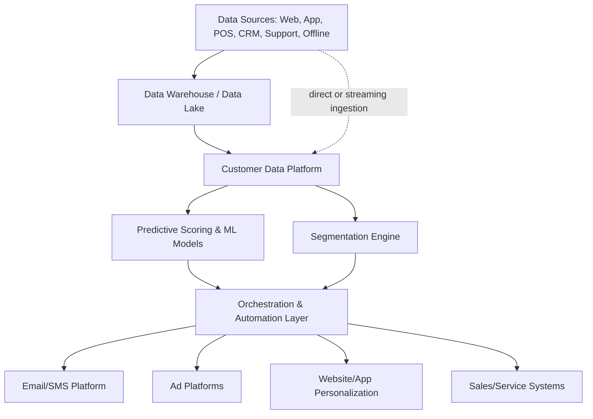

## Customer Data Platforms and MarTech Stacks

### Overview

A Customer Data Platform (CDP) is a system that unifies customer data from multiple sources into a single, persistent, customer-level database, made accessible to other marketing systems for segmentation, analysis, and activation. The MarTech stack is the broader ecosystem of marketing technology tools — CDPs, CRMs, automation platforms, analytics, advertising platforms, and content systems — that together support the full marketing data-to-execution lifecycle discussed throughout this chapter: collecting data (first/zero/third-party strategy), unifying it (CDP), scoring and predicting on it (predictive analytics), generating content, and orchestrating action.

**Key Points**

- A CDP's defining characteristic is a persistent, unified, customer-level profile accessible to other systems — distinguishing it from adjacent categories like DMPs (audience-level, cookie-based, typically third-party-oriented) and CRMs (primarily sales/service-record-oriented, often lacking behavioral granularity).
- MarTech stack architecture decisions (build vs. buy, composable vs. suite) significantly shape an organization's ability to execute the data, AI, and orchestration capabilities covered elsewhere in this chapter.
- Stack complexity and tool sprawl are widely cited practical challenges; effective architecture prioritizes integration and data flow over accumulating point solutions.

---

### CDP Core Functionality

#### Data Unification

- **Multi-source ingestion**: Collecting data from website/app behavioral tracking, transactional/POS systems, CRM records, email/marketing engagement, customer service interactions, and offline touchpoints into a single system.
- **Identity resolution**: Matching and merging records that represent the same individual across different systems and devices, using deterministic matching (shared identifiers like email or login) and probabilistic matching (behavioral/device signal correlation) to construct a unified profile.
- **Schema normalization**: Reconciling differently structured data from disparate source systems into a consistent, queryable data model.

#### Profile Management

- **Persistent unified customer profile**: A continuously updated, individual-level record combining identity, behavioral history, transactional history, and any zero-party stated preferences.
- **Real-time vs. batch profile updates**: Some CDP use cases (e.g., real-time personalization, next-best-action orchestration) require near-instant profile updates as new events occur, while others (e.g., periodic segmentation for email campaigns) can operate on batch-refreshed profiles — architecture choice depends on the activation use case's latency requirements.

#### Segmentation and Activation

- **Audience segment builder**: Tools for defining customer segments based on any combination of unified profile attributes (behavioral, transactional, demographic, predictive scores).
- **Activation connectors**: Integrations that push defined segments or individual-level data out to downstream activation systems — ad platforms, email/SMS tools, personalization engines, and the orchestration layer discussed in the prior chapter item.

---

### CDP vs. Adjacent Technology Categories

| Category | Primary Data Focus | Persistence | Typical Use Case |
| --- | --- | --- | --- |
| **CDP** | Unified individual-level profile across all sources | Persistent, long-term | Segmentation, personalization, activation across channels |
| **DMP (Data Management Platform)** | Primarily anonymous/cookie-based audience segments, historically leaning on third-party data | Typically shorter-lived, cookie-lifespan-bound | Ad audience targeting and extension (declining relevance amid third-party data erosion) |
| **CRM** | Sales and service interaction records, often account/contact-centric | Persistent but typically narrower in behavioral granularity | Sales pipeline management, customer service history |
| **Marketing Automation Platform** | Campaign execution and workflow logic | Operates on profile data but is not itself the system of record | Executing triggered campaigns and journeys (see prior chapter item) |
| **Data Warehouse** | Raw structured data at scale, often not individual-profile-oriented by default | Persistent, comprehensive | Broad analytics, BI reporting, source-of-truth for data engineering |

**Key Points**

- The decline of third-party cookie reliability (covered in the prior chapter item) has directly diminished the relevance of traditional DMPs relative to CDPs, since CDPs are architected around durable first-party and zero-party identity rather than cookie-based anonymous audiences.
- Many organizations operate both a data warehouse and a CDP, with the warehouse serving as the comprehensive raw data store and the CDP serving as the customer-profile-oriented activation layer built on top of or alongside it.

---

### MarTech Stack Architecture

#### Architecture Philosophies

- **Suite/all-in-one platforms**: A single vendor provides CDP, automation, analytics, and often content/creative tools within one integrated ecosystem, prioritizing out-of-the-box integration at the cost of flexibility to swap individual components.
- **Composable/"best-of-breed" stacks**: Organizations select individual best-in-class tools per function (a specific CDP, a specific automation platform, a specific analytics tool) and integrate them via APIs or a dedicated integration layer, prioritizing flexibility and avoiding vendor lock-in at the cost of greater integration complexity and ongoing maintenance overhead.
- **Warehouse-native / "composable CDP" approach**: An architecture pattern where the data warehouse itself (rather than a separate proprietary CDP database) serves as the system of record, with a thinner activation layer built on top to push warehouse-resident customer data out to activation tools — reducing data duplication and vendor lock-in relative to traditional CDPs, at the cost of requiring stronger internal data engineering capability. [Inference: the specific tradeoffs and adoption maturity of this pattern relative to traditional CDPs continue to evolve and vary by organizational data engineering capability.]

#### Build vs. Buy Considerations

| Factor | Favors Buying a Packaged CDP/Stack | Favors Building/Composable Approach |
| --- | --- | --- |
| Internal data engineering capability | Lower | Higher |
| Speed to initial deployment | Faster | Slower initial setup, more long-term flexibility |
| Customization needs | Lower | Higher |
| Total cost of ownership over time | Can be higher at scale (licensing) | Can be lower at scale but higher engineering overhead |
| Data portability/vendor lock-in concerns | Higher risk | Lower risk |

---

### Governance and Data Quality

- **Data governance framework**: Defined ownership, access controls, and quality standards for data flowing into and out of the CDP, typically spanning both marketing and IT/data engineering functions jointly.
- **Consent and preference enforcement**: The CDP (or a closely integrated consent management system) must enforce opt-out, do-not-contact, and regional consent requirements consistently across every downstream activation channel — a critical link to the data privacy and consent considerations discussed in the prior chapter item.
- **Data quality monitoring**: Ongoing validation for duplicate profiles, stale data, and identity resolution errors, since a CDP's value is directly bounded by the accuracy of its underlying identity matching.
- **Master data management alignment**: Ensuring the CDP's definition of a "customer" record stays consistent and reconciled with the definitions used in adjacent systems (CRM, ERP, finance) to avoid conflicting reporting or activation logic across the organization.

---

### Common Stack Challenges

- **Tool sprawl**: Organizations accumulating numerous overlapping point solutions over time without a coherent integration strategy, leading to duplicated functionality, inconsistent data, and increased total cost of ownership.
- **Integration and API maintenance burden**: Composable stacks require ongoing engineering investment to maintain integrations as individual vendor APIs change over time — a recurring operational cost not always visible at initial stack design time.
- **Siloed adoption across teams**: Different marketing sub-teams (paid media, lifecycle, product marketing) adopting separate tools independently without central coordination, undermining the unified customer view a CDP is meant to provide.
- **Skills and change management gap**: Realizing the full value of an advanced MarTech stack (particularly AI/ML-driven capabilities) often requires marketing team skill development beyond traditional campaign execution competencies. [Inference: the specific skills gap and its severity vary substantially by organization and are not uniformly characterized across the industry.]

---

### Evaluation Criteria for CDP/Stack Selection

- **Identity resolution accuracy and methodology**: How the platform matches records across sources and devices, and how transparently that methodology can be audited.
- **Real-time capability**: Whether the platform supports the latency requirements of intended use cases (e.g., real-time personalization vs. batch segmentation only).
- **Native integration breadth**: The range of pre-built connectors to common data sources and activation channels versus requiring custom integration work.
- **Data portability and export capability**: The ease of extracting the organization's own data if switching platforms, directly relevant to vendor lock-in risk.
- **Privacy and consent management capability**: Native support for consent enforcement, data subject access/deletion requests, and regional compliance requirements.
- **Total cost of ownership**: Licensing costs combined with realistic implementation, integration maintenance, and internal staffing costs over a multi-year horizon, not just initial contract price.

**Example**

A mid-sized retailer evaluating CDP options compares a suite-based platform (faster initial deployment, tightly integrated with its existing email and loyalty tools from the same vendor) against a warehouse-native composable approach (leveraging its existing data warehouse investment and stronger internal data engineering team, offering greater long-term flexibility). Given a lean data engineering team and a need for rapid time-to-value, the retailer selects the suite-based platform, while explicitly evaluating data export capabilities to mitigate long-term lock-in risk.

---

### Limitations

- **CDP is not a strategy substitute**: A CDP is enabling infrastructure, not a substitute for a defined first-party/zero-party data collection strategy (covered in the prior chapter item) — a well-implemented CDP with weak underlying data collection still produces a thin, low-value unified profile.
- **Integration complexity scales with stack size**: The more individual tools an organization operates, the more integration and maintenance overhead is required to keep the CDP's unified view accurate and current.
- **Real-time infrastructure cost**: True real-time CDP capability (as required for live next-best-action orchestration) typically requires more sophisticated and costly streaming data infrastructure than batch-oriented alternatives, and not all use cases justify that investment.
- **Vendor landscape volatility**: The CDP and broader MarTech vendor landscape changes frequently through acquisitions, feature consolidation, and new entrants; specific platform capabilities and market positioning should be verified against current vendor documentation before procurement decisions. [Unverified: specific vendor capabilities and market share are subject to frequent change and are not reliably characterized in general terms without current verification.]

---

### Applications in Marketing & Consumer Psychology

- **Foundation for personalization**: The CDP's unified profile is the technical foundation that makes cross-channel personalization and next-best-action orchestration (covered in the prior chapter item) operationally possible.
- **Consistent customer experience**: A properly unified customer view prevents the disjointed, redundant, or contradictory messaging that damages brand trust when different channels operate on fragmented data.
- **Enabling predictive scoring at scale**: The CDP serves as the data foundation feeding the propensity, churn, and CLV models discussed earlier in this chapter, since those models require clean, unified, historically complete customer-level data to train and score accurately.
- **Supporting first-party data strategy execution**: The CDP is the primary operational mechanism through which a brand's first-party and zero-party data strategy is actually unified and made usable, directly connecting to the previous chapter item's strategic framing.

---

**Related Topics**

- First-party, zero-party, and third-party data strategy
- Marketing automation and orchestration
- Predictive analytics and customer scoring
- Data governance and consent management
- Identity resolution methodologies
- Data warehouse and data lake architecture
- MarTech vendor evaluation frameworks
- Composable/warehouse-native CDP architecture patterns