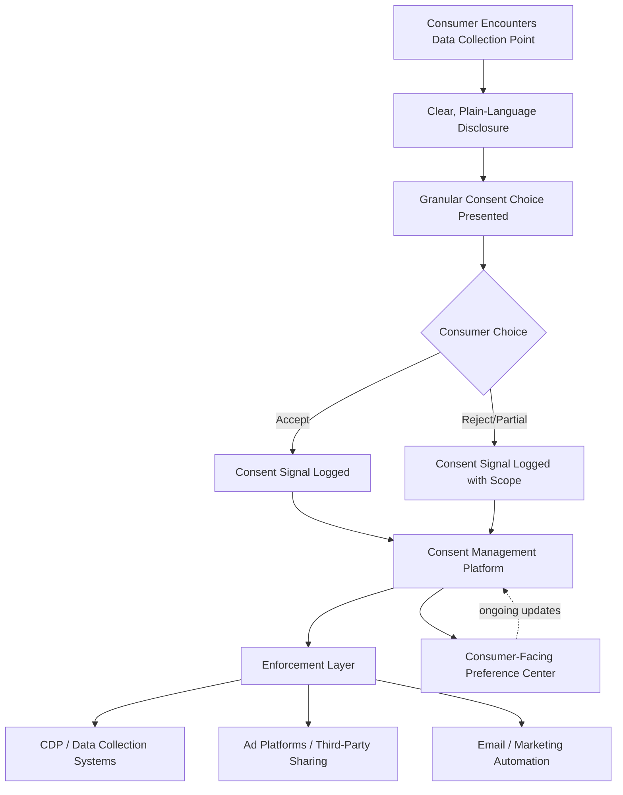

## Privacy-First Personalization and Consent Design

### Overview

Privacy-first personalization is the practice of delivering relevant, individualized marketing experiences while minimizing data collection, maximizing transparency, and giving consumers meaningful control over how their data is used. Consent design is the discipline of building the interfaces and technical systems through which that control is exercised — ensuring consent choices are genuinely informed, genuinely honored, and technically enforced across every downstream system. This item closes the chapter's data-to-execution arc: it addresses the ethical and regulatory constraints that must govern how the data strategy, predictive scoring, generative AI, and orchestration capabilities covered earlier are actually deployed.

**Key Points**

- Privacy-first personalization is not a contradiction in terms — well-designed zero-party and first-party data strategies (see earlier chapter item) can enable strong personalization with lower privacy risk than third-party-dependent approaches.
- Consent design has shifted from a legal checkbox exercise to a core UX discipline, with regulators increasingly scrutinizing the design of consent interfaces themselves, not just the underlying data practices.
- Technical enforcement of consent (ensuring a stated preference actually stops data flow) is a distinct and often underinvested challenge relative to simply capturing consent.

---

### Core Principles of Privacy-First Personalization

#### Data Minimization

Collecting and retaining only the data genuinely necessary for a specific, defined purpose, rather than accumulating data broadly on the assumption it might become useful later.

- **Purpose limitation**: Data collected for one stated purpose (e.g., order fulfillment) should not be repurposed for an unrelated use (e.g., ad targeting) without separate consent.
- **Retention limits**: Defining and enforcing how long data is retained before deletion or anonymization, rather than indefinite storage by default.

#### Transparency

Making data collection and use practices clearly understandable to the consumer, rather than technically disclosed but practically obscure.

- **Plain-language privacy communication**: Explaining data use in accessible language at the point of collection, rather than relegating explanation solely to a lengthy, separate privacy policy.
- **Just-in-time disclosure**: Providing relevant privacy context at the specific moment a data-sensitive action occurs (e.g., explaining why location access is requested at the moment it's requested), rather than only in a general upfront disclosure.

#### Meaningful Control

Giving consumers genuine, usable mechanisms to view, modify, and withdraw consent for their data — not just a one-time opt-in at signup.

- **Granular consent options**: Allowing consumers to consent to specific data uses independently (e.g., consenting to order-related communication without consenting to third-party data sharing) rather than an all-or-nothing choice.
- **Accessible preference management**: Persistent, easy-to-find interfaces (preference centers) where consumers can review and change their choices at any time after initial consent.

#### Privacy by Design

Building privacy protection into systems and processes from the outset of design, rather than adding compliance measures after a system is already built — a principle embedded in major privacy regulatory frameworks as an expected default posture rather than an optional enhancement.

---

### Consent Design Architecture

#### Consent Management Platform (CMP) Role

- **Consent capture**: Presenting the consent interface (banner, preference center, form) and recording the specific choice made, including timestamp and scope, to maintain an auditable consent record.
- **Consent signal propagation**: Passing the recorded consent status to all downstream systems (analytics tags, ad pixels, CDP, marketing automation) so that each system respects the consumer's actual choice rather than operating independently of it.
- **Preference synchronization**: Ensuring that when a consumer updates their preference later, that update propagates consistently across all connected systems rather than remaining siloed in the CMP itself.

#### Common Consent UX Anti-Patterns to Avoid

- **Dark patterns**: Interface designs that manipulate users toward consenting — for example, making "accept all" visually prominent while burying or disguising the reject/decline option — which is increasingly a specific target of regulatory enforcement rather than a purely ethical concern.
- **Asymmetric friction**: Requiring one click to accept but multiple steps to decline or withdraw consent, which undermines the legitimacy of consent given under such conditions.
- **Pre-checked boxes**: Defaulting consent toggles to "on" rather than requiring an affirmative action, which fails the "freely given, specific, informed" consent standard under stricter opt-in regulatory frameworks.
- **Consent bundling**: Combining unrelated consent purposes (e.g., "accept cookies" bundled with "agree to marketing communications") into a single toggle when they should be presented as distinct, separable choices.

**Key Points**

- Industry trends in 2026 point toward mandatory, equally prominent accept/reject options in consent interfaces as part of a broader regulatory push against manipulative consent design, alongside continued regional divergence in the strictness of consent requirements (e.g., opt-in-default regions like the EU versus opt-out-based frameworks common in a number of US states).

---

### Regional Regulatory Variation and Its Design Implications

| Region/Framework | General Consent Model | Design Implication |
| --- | --- | --- |
| EU (GDPR and related frameworks) | Strict opt-in required for non-essential data processing | Consent must be affirmative, granular, and as easy to withdraw as to give |
| Various US states (e.g., CCPA/CPRA-style frameworks) | Predominantly opt-out-based rights model | Must provide clear "do not sell/share" mechanisms even where opt-in isn't mandated |
| Other emerging frameworks (e.g., India's DPDP Act) | Distinct localized requirements, including multi-language considerations | Requires consent and disclosure interfaces adapted to local legal and linguistic requirements |

[Inference: given the pace of regulatory change in this space, brands operating across multiple regions should verify current specific requirements per jurisdiction at implementation time rather than relying on a static summary, as frameworks and enforcement priorities continue to evolve.]

---

### Privacy-Preserving Personalization Techniques

#### Techniques That Reduce Individual-Level Data Exposure

- **Cohort-based / aggregated targeting**: Grouping users into privacy-preserving interest or behavior cohorts (rather than tracking and targeting individuals directly) as an alternative to individual-level cross-site tracking, aligning with the kind of browser-native, privacy-preserving approaches discussed in the prior chapter item on third-party data strategy.
- **On-device / local processing**: Performing personalization computation on the consumer's own device rather than transmitting raw behavioral data to a central server, reducing the amount of individually identifiable data that leaves the consumer's control.
- **Differential privacy**: Adding statistical noise to aggregated datasets in a way that preserves useful pattern-level insight while making it mathematically difficult to identify or reverse-engineer any specific individual's data within the set.
- **Data clean rooms**: As covered in the prior chapter item, privacy-preserving environments that allow matching or analysis across two parties' datasets without either party directly exposing raw individual-level data to the other.

#### Zero-Party-Driven Personalization

Leaning on explicitly stated preferences (see the prior chapter item on data strategy) rather than inferred behavioral tracking is itself a privacy-first personalization strategy — the consumer directly controls the personalization input, with lower ambiguity and lower reliance on opaque inference than purely behavioral profiling.

**Example**

A media streaming service redesigns its recommendation experience to rely primarily on explicit zero-party signals (a "content preferences" onboarding step and ongoing thumbs-up/down feedback) combined with first-party viewing history collected under clear, specific consent, rather than purchasing third-party behavioral audience data to supplement recommendations. The resulting system is both more transparent to the consumer (who can see and edit the stated preferences directly) and more resilient to the third-party data erosion discussed in the prior chapter item, since it never depended on cross-site tracking in the first place.

---

### Technical Enforcement Challenges

- **Consent signal propagation gaps**: A consumer's stated preference is only meaningful if every downstream system (tags, pixels, CDP, ad platforms) actually receives and honors that signal; industry monitoring has found that a substantial share of real-world consent-signaling implementations fail to fully meet compliance standards in practice, indicating that capturing consent and technically enforcing it across a full MarTech stack are distinct challenges. [Unverified: specific compliance failure rate figures cited by industry vendors should be treated as directional estimates rather than precise, universally validated statistics.]
- **Third-party sub-processor compliance**: Ensuring that vendors and partners receiving data downstream from the brand also honor the original consent scope, not just the brand's own first-party systems.
- **Consent state consistency across devices/sessions**: Maintaining a consistent record of a consumer's consent choice as they interact across multiple devices or return in later sessions, rather than treating each session as consent-naive.
- **Data subject rights fulfillment**: Technical infrastructure to support access, correction, and deletion requests (a data subject's right to see, amend, or remove their data) must be integrated with the CDP and connected systems, not handled as a manual, ad hoc process.

---

### Governance and Organizational Practices

- **Privacy impact assessments**: Structured evaluation of new personalization initiatives or data uses for privacy risk before launch, particularly for higher-risk activities (e.g., predictive scoring based on sensitive inferred categories).
- **Cross-functional consent ownership**: Effective consent design typically requires collaboration between marketing, legal/compliance, and engineering functions, since consent choices must be both legally sound and technically enforceable.
- **Auditing and documentation**: Maintaining an auditable record of what consent was given, when, and for what specific scope — necessary both for regulatory defensibility and for accurately enforcing consent across systems over time.

---

### Limitations

- **Personalization-privacy tension remains real**: Even with best-practice design, there is an inherent tension between minimizing data collection and maximizing personalization richness; privacy-first approaches typically involve some genuine trade-off in personalization granularity relative to unconstrained data collection, not merely a reframing exercise. [Inference: the magnitude of this trade-off varies by use case and by how effectively zero-party and contextual techniques substitute for reduced behavioral tracking.]
- **Regulatory fragmentation burden**: Operating consistent, compliant consent design across multiple jurisdictions with genuinely different legal requirements (opt-in vs. opt-out models, differing granularity requirements) adds material design and engineering complexity for multi-region brands.
- **Consumer consent fatigue**: Frequent or poorly designed consent prompts can create fatigue that leads consumers to default to quick acceptance or rejection without genuine engagement, potentially undermining the "informed" quality of consent even when the interface is technically compliant.
- **Verification difficulty on enforcement claims**: Because technical consent enforcement operates across many interconnected systems, claims that a given brand's stack is "fully compliant" are difficult for outside observers (or often the brand itself) to verify comprehensively without dedicated auditing. [Unverified: general enforcement completeness is difficult to characterize reliably without case-specific technical audit.]

---

### Applications in Marketing & Consumer Psychology

- **Trust as a competitive differentiator**: Transparent, well-designed consent experiences increasingly function as a brand trust signal that can influence consumer willingness to engage and share data, connecting directly to the privacy-calculus themes in the prior chapter item on data strategy.
- **Reducing perceived surveillance discomfort**: Privacy-first personalization approaches (especially zero-party-driven) can reduce the "creepiness" reaction consumers sometimes have to highly precise behaviorally-inferred targeting, since the consumer directly recognizes the input to their own stated preferences.
- **Consent design as a UX discipline**: The psychology of choice architecture (framing, default effects, friction) applies directly to consent interfaces — the same principles that make dark patterns effective at manipulating consent are why ethical, low-friction consent design genuinely matters for both compliance and consumer experience quality.
- **Long-term relationship value**: Privacy-respectful data practices support the durable, trust-based customer relationships that first-party and zero-party data strategies depend on, closing the loop with the chapter's opening data-strategy discussion.

---

**Related Topics**

- First-party, zero-party, and third-party data strategy
- Customer data platforms and MarTech stacks
- Marketing automation and orchestration
- Data privacy regulation (GDPR, CCPA, DPDP Act) compliance frameworks
- Data clean rooms and differential privacy techniques
- Consent management platform (CMP) selection and architecture
- Choice architecture and behavioral design ethics
- Predictive analytics and customer scoring (privacy implications)