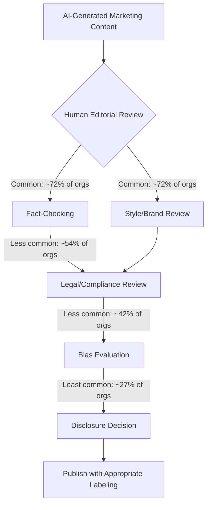

## AI Trust, Transparency, and Consumer Skepticism

### Overview

As generative AI and algorithmic decisioning have become embedded throughout the marketing systems covered in this chapter — content generation, orchestration, predictive scoring — consumer trust in AI-driven marketing has become a distinct strategic risk rather than a peripheral concern. Through 2026, industry research consistently documents a widening gap between AI *adoption* (which continues to rise) and AI *trust* (which is declining), creating a specific managerial challenge: marketing teams must capture AI's efficiency benefits while managing a genuinely skeptical and increasingly AI-literate consumer base.

**Key Points**

- Multiple 2026 studies document consumer trust in AI declining even as usage rises — described in industry commentary as a "velocity-quality tradeoff," where AI increases content volume without proportionally increasing perceived quality or trustworthiness.
- Disclosure of AI use produces genuinely mixed effects in the research literature: it can build trust through transparency, but can also activate consumer skepticism ("persuasion knowledge") and reduce perceived authenticity — the relationship is not straightforwardly positive.
- Trust erosion varies significantly by generation, context, and how AI use is disclosed and framed, meaning a single uniform "always disclose" or "never disclose" policy is unlikely to be optimal across all situations.

---

### The 2026 Trust Landscape: What the Data Shows

#### The Adoption-Trust Gap

Widely cited 2026 survey data illustrates a sharp divergence between usage and sentiment: the share of consumers who found AI more helpful than traditional search dropped from 82% in 2025 to 54% in 2026, a 28-point decline in twelve months, while the skeptic camp who actively rate AI as less helpful than search grew from 3% to 17%, nearly six times larger. Notably, Baby Boomers were found more likely than Gen Z to find AI helpful, with the audience segment carrying the most exposure to AI tools appearing the most disillusioned with them. [Fractl](https://www.frac.tl/ai-statistics/)[Fractl](https://www.frac.tl/ai-statistics/)

This decline in perceived helpfulness has coincided with a comparable decline in brand trust specifically tied to AI use: the share of consumers who said heavy AI use would decrease their trust in a favorite brand roughly doubled, from 20% in 2025 to 40% in 2026. Separate survey data corroborates this pattern, finding that only 14% of consumers said they would trust a brand more for using AI heavily, while Gen Z showed the highest likelihood of reduced trust at 54%, and women were more likely than men to penalize heavy AI marketing use. [Fractl](https://www.frac.tl/ai-statistics/)[ContentGrip](https://www.contentgrip.com/ai-trust-search-2026/)

#### Consumer Segments and Behavioral Distinctions

Research identifies meaningfully different consumer postures toward AI rather than a single uniform skeptical public:

- **"AI Holdouts"**: A segment that largely avoids AI when shopping and mostly distrusts AI to deliver quality customer service, with primary concerns centered on accuracy, invasiveness, and AI that feels overly personal or pressures purchase decisions. [Klaviyo](https://www.klaviyo.com/solutions/ai/consumer-trust-in-ai)
- **"Skeptics"**: A segment that actively distrusts brands for using AI-generated content, though research notes this segment (along with others) tends to overestimate how much brands actually rely on AI for content creation, suggesting a perception gap on top of a trust gap. [Klaviyo](https://www.klaviyo.com/solutions/ai/consumer-trust-in-ai)
- **Detection cues**: Consumers commonly identify AI-generated interactions through specific behavioral signals — responses arriving too quickly and responses sounding too formal or robotic are the two most common ways consumers distinguish AI from human interactions. [Klaviyo](https://www.klaviyo.com/solutions/ai/consumer-trust-in-ai)

---

### The Disclosure Paradox

#### The Consumer Demand for Labeling

Survey data shows overwhelming consumer preference for AI content labeling: 84% of consumers wanted written AI content labeled, 91% wanted video labeled, and 90% wanted images labeled. [ContentGrip](https://www.contentgrip.com/ai-trust-search-2026/)

#### The Supply-Side Disclosure Gap

Despite this demand, actual organizational disclosure practices lag substantially: only 20% of organizations always disclose AI use to their audiences, while 33% never disclose at all. In advertising specifically, 89% of advertisers who use generative AI to create ads at least sometimes disclose, but less than half always do — a rate essentially unchanged since 2024. [Fractl](https://www.frac.tl/ai-statistics/)[IAB](https://www.iab.com/insights/the-ai-gap-widens/)

#### Why Disclosure Isn't a Simple Trust Fix

The relationship between disclosure and trust is genuinely more complex than "more transparency always helps." Systematic review research finds that AI disclosure activates persuasion knowledge and erodes trust-related outcomes across diverse marketing contexts, though these effects are neither universal nor uniform — perceived authenticity operates as the primary mediating mechanism, moderated by factors including content type, consumer AI literacy, cultural context, and anthropomorphism cues. Applied research on the EU's AI-labeling requirements similarly finds that consumers tend to become more skeptical and less engaged when they know content is AI-generated, complicating the goal of using labeling to build trust. At the same time, disclosure isn't purely negative for engagement: clear disclosure was found to be the third-highest driver of consumer attention to AI-generated ads, behind high-quality visuals and humorous content. [Consumer Trust in AI-Generated Marketing Content: A Systematic Literature Review and Research Agenda | American Impact Review +2](https://americanimpactreview.com/article/e2026024)

**Key Points**

- The evidence base suggests disclosure timing, framing, and context matter more than the binary decision to disclose or not — over-disclosure in low-stakes contexts and under-disclosure in high-stakes contexts both carry distinct risks.
- Industry guidance increasingly frames disclosure as an ethics-and-context judgment rather than a fixed rule, cautioning that over-disclosure can weaken credibility and confuse audiences while under-disclosure risks both trust damage and legal exposure.

---

### Quality Control Gaps Behind the Trust Decline

Industry data suggests the erosion in AI trust is connected to genuine, measurable gaps in how AI content is quality-controlled before publication. While 72% of organizations report running human editorial review before publishing AI content, only 54% add fact-checking, only 42% add legal or compliance review, and just 27% conduct bias evaluation — a gap the same research frames as particularly consequential, since bias evaluation is described as the quality-control step that matters most for trust. [Fractl](https://www.frac.tl/ai-statistics/)

---

### Trust Risk in Algorithmic and Agentic Contexts

Beyond content generation, trust concerns extend to AI-driven decisioning and shopping experiences. A national survey found that a large majority of American consumers said they would lose trust in AI shopping platforms if the results they received were sponsored, reflecting persistent concern about trust and data transparency even as consumers use AI for shopping convenience. This connects directly to the orchestration and predictive scoring capabilities discussed earlier in this chapter: when AI systems make or influence purchase-relevant recommendations, consumers apply distinct trust scrutiny around whether the system's incentives are aligned with their interests or with advertiser payment. [Quad MX Solutions](https://www.quad.com/newsroom/americans-say-they-would-lose-trust-in-ai-shopping-if-results-were-sponsored)

Broader sentiment data reinforces the scale of this skepticism: Gartner research indicated that a substantial share of US consumers believe generative AI has worsened content quality, and roughly half would prefer to purchase from brands that avoid AI in customer-facing content altogether. [Buildez](https://buildez.ai/blog/ai-marketing-laws-2026-campaigns-ready-transparency)

---

### Building Trust: Emerging Practitioner Guidance

#### Context-Sensitive Disclosure

Rather than a rigid universal disclosure rule, emerging expert guidance argues that AI disclosure decisions should be driven by ethical considerations of context, consequence, and audience impact rather than rigid bureaucratic rules, cautioning that over-disclosure can weaken credibility while under-disclosure risks both trust erosion and legal repercussions. [Buildez](https://buildez.ai/blog/ai-marketing-laws-2026-campaigns-ready-transparency)

#### Human-in-the-Loop Safeguards

Practitioner guidance consistently emphasizes maintaining human oversight rather than fully automating customer-facing AI interactions: recommendations include ensuring a real person reviews campaign creative and messaging to avoid AI-driven brand missteps, maintaining full human-in-the-loop controls on AI marketing agents, and creating seamless handoffs from AI to human agents for complex service requests. [Klaviyo](https://www.klaviyo.com/solutions/ai/consumer-trust-in-ai)

#### Quality and Trust as Differentiation Strategy

Some industry analysis frames the current environment as a specific opportunity for brands willing to invest in quality: brands that treat quality as a strategic differentiator — including proprietary data, named experts, human-verified claims, transparent sourcing, and consistent high-quality brand voice — are positioned to be the ones consumers and AI systems alike surface when people go looking for answers. [Search Engine Land](https://searchengineland.com/ai-search-adoption-rises-consumer-trust-declines-study-480338)

**Example**

A financial services brand piloting AI-generated educational content establishes a tiered disclosure policy: purely stylistic AI assistance (grammar, formatting) in low-stakes blog content is not separately flagged, but any AI-generated content involving specific financial guidance is both fact-checked by a licensed advisor and explicitly labeled as AI-assisted with human review — reflecting the practitioner guidance that disclosure intensity should scale with the consequence and stakes of the content rather than applying uniformly.

---

### Trust Repair After Visible AI Missteps

Real-world backlash incidents illustrate the reputational risk of poorly executed or undisclosed AI content: a well-known 2023 attempt by a major beverage brand to remake its iconic holiday advertisement using generative AI was met with public backlash, with viewers describing the AI-crafted spot as "soulless" despite the company's promotion of the technology's efficiency. This example remains a frequently cited reference point in 2026 industry discussion of the reputational risk of prioritizing AI efficiency over perceived authenticity, particularly for emotionally resonant, brand-identity-defining content. [NIM e.V.](https://www.nim.org/en/publications/detail/transparency-without-trust)

---

### Limitations

- **Rapidly evolving evidence base**: Consumer AI trust sentiment is shifting quickly year-over-year (the sources cited here document a sharp single-year decline from 2025 to 2026), meaning specific percentage figures should be treated as a snapshot rather than a stable baseline, and should be reverified against current data before use in strategic planning. [Unverified: given the pace of change already documented across a single year in the cited research, figures will likely continue shifting and warrant reverification at time of use.]
- **Disclosure effects are context-dependent, not universal**: The research literature explicitly finds AI disclosure effects on trust are neither universal nor uniform across content types, audiences, and cultural contexts, meaning findings from one study or category should not be assumed to generalize directly to a different marketing context without validation.
- **Regulatory landscape in flux**: AI-specific marketing disclosure requirements (such as the EU's AI-labeling rule referenced in current research) are an active area of regulatory development; specific legal disclosure obligations vary by jurisdiction and should be verified against current regulation rather than assumed static. [Inference: given the described pace of AI marketing regulation development in 2026, specific compliance requirements are likely to continue evolving and require ongoing legal review rather than one-time policy-setting.]
- **Self-reported survey data limitations**: Much of the cited evidence relies on self-reported consumer survey data regarding trust and behavior, which — consistent with the general limitations of stated-preference survey research covered earlier in this course — may not perfectly predict actual downstream purchasing or engagement behavior.

---

### Applications in Marketing & Consumer Psychology

- **Persuasion knowledge activation**: AI disclosure can trigger consumers' learned skepticism toward persuasive intent ("persuasion knowledge"), a well-established consumer psychology concept now directly relevant to AI content strategy decisions.
- **Authenticity as a mediating psychological mechanism**: Perceived authenticity is identified as the primary pathway through which AI disclosure affects trust outcomes, connecting this topic directly to broader brand authenticity and consumer psychology theory.
- **Segment-specific trust strategy**: The identification of distinct consumer postures (Holdouts, Skeptics, more AI-accepting segments) suggests trust-building and disclosure strategy may benefit from segmentation treatment similar to other marketing decisions covered in this chapter, rather than a one-size-fits-all approach.
- **Connecting to chapter themes**: This topic closes the chapter's arc by directly addressing the ethical and reputational guardrails that must govern the predictive scoring, generative content, orchestration, and data collection capabilities covered in prior chapter items — technical capability alone does not guarantee consumer trust or adoption.

---

**Related Topics**

- Generative AI in content and campaign creation
- Privacy-first personalization and consent design
- Marketing automation and orchestration
- Persuasion knowledge and consumer skepticism theory
- Brand authenticity and trust research
- AI marketing regulation and disclosure law
- Crisis communication and reputational risk management
- Human-in-the-loop AI governance frameworks