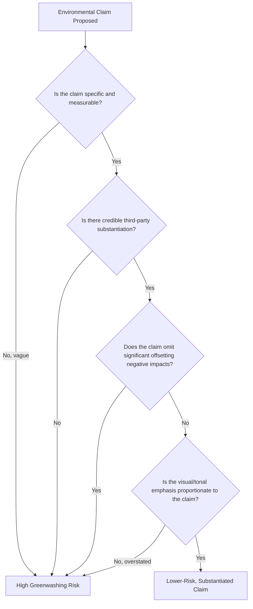
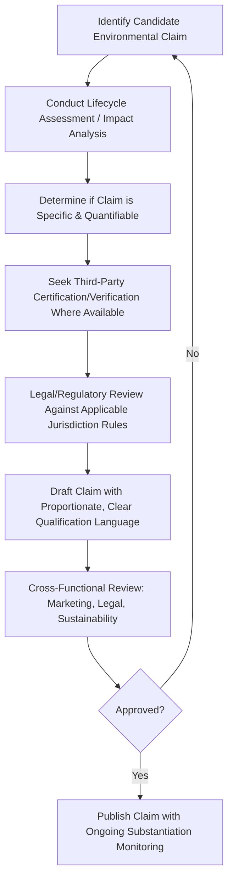

## Green Marketing and Environmental Claims

### Overview

Green marketing refers to the promotion of products, services, and brands based on genuine or claimed environmental benefit — reduced carbon footprint, recyclability, sustainable sourcing, biodegradability, and similar attributes. Environmental claims are the specific factual or implied statements used in this promotion, which are subject to increasing regulatory scrutiny, consumer skepticism, and reputational risk when they are exaggerated, unsubstantiated, or misleading — a pattern commonly termed greenwashing.

**Key Points**

- Green marketing sits at the intersection of genuine sustainability strategy and marketing communication; the credibility gap between the two is the central risk this topic addresses.
- Regulatory bodies in multiple jurisdictions have moved from general consumer protection guidance toward specific, codified rules governing environmental claim substantiation.
- Consumer skepticism toward environmental claims has grown alongside greater media and regulatory attention to greenwashing cases, mirroring the AI trust erosion pattern discussed in the prior chapter — claims made without credible substantiation increasingly damage rather than build trust.

---

### Types of Environmental Claims

#### Product-Level Claims

- **Recyclability claims**: Statements that a product or its packaging can be recycled, which regulatory guidance typically requires be substantiated by actual, accessible recycling infrastructure for the relevant market, not merely technical recyclability in principle.
- **Biodegradability/compostability claims**: Statements that a product breaks down naturally, which typically require specification of the conditions and timeframe under which this occurs (e.g., industrial composting facility vs. home composting vs. general environment) to avoid misleading generalization.
- **Recycled content claims**: Statements about the percentage of recycled material in a product, which require accurate substantiation of the actual proportion and sourcing of that recycled content.
- **Carbon neutral/net-zero claims**: Statements that a product's or company's net carbon emissions are zero, typically achieved through some combination of emissions reduction and carbon offset purchasing — a claim type that has drawn particular regulatory and journalistic scrutiny over the credibility and permanence of underlying offset mechanisms.

#### Company/Brand-Level Claims

- **Sustainability commitments and targets**: Forward-looking statements about future environmental goals (e.g., emissions reduction targets, renewable energy transition timelines).
- **Certifications and eco-labels**: Third-party verified marks (e.g., organic certification, Fair Trade, forest stewardship certification) intended to provide independently substantiated credibility beyond a brand's own claims.
- **General environmental positioning**: Broader brand messaging emphasizing environmental values without specific quantified claims (e.g., "eco-friendly," "sustainable," "earth-conscious") — often the category most vulnerable to regulatory action precisely because of its vagueness.

---

### Greenwashing: Definition and Common Patterns

Greenwashing refers to the practice of making environmental claims that are false, exaggerated, vague, or otherwise misleading relative to a product's or company's actual environmental impact — whether intentional or resulting from insufficient substantiation rigor.

#### Common Greenwashing Patterns

- **Vague or undefined claims**: Using terms like "eco-friendly," "green," or "natural" without specific, measurable substantiation of what makes the product environmentally preferable.
- **Irrelevant claims**: Highlighting an environmental attribute that is factually true but not meaningfully distinguishing (e.g., promoting a product as "CFC-free" for a category where CFCs have long been universally banned by regulation).
- **Hidden trade-offs**: Emphasizing one genuine environmental benefit while omitting other significant negative environmental impacts of the same product.
- **Lesser-of-two-evils framing**: Positioning a product as environmentally preferable within a fundamentally environmentally harmful category, without disclosing the broader category impact.
- **Unsubstantiated certifications/labels**: Using self-created or unverified "green" seals or badges designed to resemble legitimate third-party certification without underlying independent verification.
- **Disproportionate visual emphasis**: Using imagery (nature scenes, green color palettes, leaf iconography) to imply environmental credentials disproportionate to the actual substantiated claim being made.

---

### Regulatory Frameworks for Environmental Claims

#### General Regulatory Approach

Regulatory bodies across major markets have generally converged on similar core principles for environmental marketing claims, though specific codified rules and enforcement mechanisms vary by jurisdiction:

- **Substantiation requirement**: Claims must be supported by competent, reliable evidence available at the time the claim is made, not retrospectively justified.
- **Specificity requirement**: Claims should be as specific as possible about what is being claimed (e.g., a specific packaging component, not the entire product) to avoid misleadingly broad implications.
- **Clarity and qualification**: Any necessary qualifications or limitations on a claim (e.g., "recyclable in select markets only") must be presented clearly and not buried in disclaimers that consumers are unlikely to see or understand.
- **Comparative claim substantiation**: Claims of environmental superiority relative to a competitor or a brand's own prior product require substantiation of the specific basis for comparison.

#### Enforcement Trends

[Inference: given the pace of regulatory development in environmental claims globally — including expanding EU-level green claims directives and evolving national consumer protection guidance — specific current enforcement rules and thresholds should be verified against current regulatory guidance in the relevant jurisdiction at the time of any claim development, rather than assumed static from general historical patterns.]

**Key Points**

- Regulatory risk for environmental claims spans not just direct false-advertising liability but reputational and litigation risk from consumer advocacy groups, competitors, and increasingly sophisticated media scrutiny.
- Multiple jurisdictions have moved or are moving toward requiring independent, third-party-verifiable substantiation for environmental claims rather than accepting company self-certification alone. [Inference: the specific verification standards and timelines vary by jurisdiction and are subject to ongoing legislative development.]

---

### Building Credible Green Marketing

#### Substantiation-First Approach

- **Lifecycle assessment (LCA)**: A structured methodology for quantifying a product's environmental impact across its full lifecycle (raw material extraction, manufacturing, distribution, use, disposal), providing a more rigorous evidentiary basis for claims than isolated attribute-level assertions.
- **Third-party certification**: Pursuing recognized, independently audited certifications rather than relying solely on self-declared claims, providing external credibility that self-certification cannot.
- **Specific, quantified claims**: Preferring precise, measurable statements (e.g., "30% less plastic packaging by weight compared to our 2023 packaging") over broad, unquantified assertions (e.g., "environmentally friendly packaging").

#### Transparency and Proportionality

- **Proportionate messaging**: Ensuring the prominence and tone of environmental marketing matches the actual scale and significance of the underlying environmental improvement, avoiding the disproportionate visual/tonal emphasis pattern associated with greenwashing.
- **Acknowledging trade-offs**: Proactively disclosing known limitations or ongoing challenges in a brand's sustainability profile, which can paradoxically strengthen credibility relative to claims that imply blanket environmental virtue.
- **Progress narrative over perfection narrative**: Framing sustainability communication around documented, verifiable progress toward defined goals rather than implying an already-achieved ideal state that invites scrutiny and skepticism.

**Example**

An apparel brand wants to promote a new product line using recycled ocean plastic. Rather than broadly branding the line "eco-friendly," the brand publishes the specific percentage of recycled content (verified by a named third-party auditor), discloses the sourcing process, and separately and honestly notes that the garment's dyeing process still uses conventional water-intensive methods the company is working to address — a substantiated, proportionate, and trade-off-acknowledging approach that is more defensible than an unqualified "sustainable" claim covering the entire product.

---

### Consumer Skepticism and the Credibility Gap

#### Drivers of Skepticism

- **High-profile greenwashing exposures**: Media investigations and regulatory enforcement actions against prominent brands have increased general consumer awareness of and vigilance toward greenwashing patterns.
- **Claim proliferation without differentiation**: The widespread use of vague environmental terminology across a category can create consumer fatigue and blanket skepticism toward the entire category of claims, even when some are genuinely substantiated.
- **Perceived mismatch between marketing and core business model**: Consumers apply particular skepticism when environmental marketing claims appear inconsistent with a brand's fundamental business model or product category (e.g., environmental claims from a category associated with high inherent environmental impact).

#### Trust-Building Implications

This dynamic closely parallels the AI trust and disclosure patterns discussed in the prior chapter item: transparency alone does not guarantee trust, and claims perceived as promotional overreach can activate consumer skepticism ("greenwashing detection") in much the same way that AI disclosure can activate persuasion knowledge. Genuine substantiation, third-party verification, and proportionate messaging function as the environmental-claims equivalent of the fact-checking and bias-evaluation quality controls discussed for AI content in the prior chapter — necessary but often under-invested safeguards.

---

### Environmental Claims Development Process

---

### Limitations

- **Substantiation cost and complexity**: Rigorous lifecycle assessment and third-party certification require meaningful investment in time, expertise, and cost, which can be a genuine barrier for smaller organizations even when the underlying environmental improvement is real.
- **Jurisdictional fragmentation**: Global brands face varying environmental claim regulations across markets, requiring region-specific claim adaptation rather than a single global claims framework, adding complexity to multi-market campaign development. [Inference: the specific degree of fragmentation and its practical operational impact varies by company scale and market footprint.]
- **Genuine measurement uncertainty**: Some environmental impact metrics (e.g., certain carbon accounting methodologies, comparative lifecycle assessments across different product categories) involve inherent methodological uncertainty and ongoing scientific/standards development, meaning even good-faith claims can face legitimate substantiation challenges. [Inference: the degree of measurement uncertainty varies significantly by claim type and industry, with some metrics substantially more standardized than others.]
- **Evolving regulatory and standards landscape**: Given active regulatory development in this space globally, specific current substantiation standards, required disclosures, and enforcement thresholds should be verified against current regulatory guidance at the time of claim development. [Unverified: without a specific jurisdiction and current-date verification, precise regulatory requirements cannot be reliably characterized here.]

---

### Applications in Marketing & Consumer Psychology

- **Trust and brand equity**: Credible, substantiated environmental claims can build durable brand trust and support premium positioning, while exposed greenwashing carries outsized reputational damage relative to the marketing benefit initially sought.
- **Segment-specific responsiveness**: Consumer responsiveness to environmental claims varies by segment (values-driven consumers vs. price-primary consumers), suggesting environmental marketing may benefit from the same segmentation rigor applied to other marketing claims covered elsewhere in this course.
- **Values-signaling and identity-driven purchase behavior**: Environmental claims often function as a form of identity-expressive consumption, connecting to broader consumer psychology research on how purchases signal personal values — a dynamic that raises the stakes of claim authenticity, since a detected false claim can feel like a personal betrayal of stated values rather than a simple product disappointment.
- **Connecting to broader chapter themes**: This topic opens the chapter's focus on sustainability and conscious consumption, establishing the claims-integrity foundation that subsequent chapter items on genuine sustainable consumer behavior and well-being-oriented marketing will build upon.

---

**Related Topics**

- Sustainable consumer behavior and the attitude-behavior gap
- Corporate social responsibility (CSR) communication
- Certification and eco-labeling systems
- AI trust, transparency, and consumer skepticism (parallel disclosure dynamics)
- Lifecycle assessment methodology
- Regulatory compliance in marketing claims
- Values-based segmentation and identity-driven consumption
- Crisis communication for greenwashing exposure