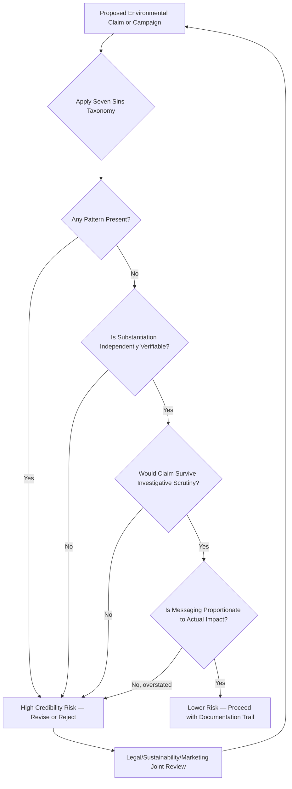

## Greenwashing and Credibility Risk

### Overview

Greenwashing is the practice of conveying a false or exaggerated impression of environmental responsibility through marketing communications, whether via explicit false claims, vague and unsubstantiated language, or selective emphasis that omits material negative environmental impacts. While the previous chapter item covered environmental claims construction broadly, this item focuses specifically on greenwashing as a credibility risk category: how it is identified, why it damages brand equity disproportionately relative to the marketing benefit sought, and how organizations manage and mitigate this risk systematically.

**Key Points**

- Greenwashing risk is not limited to deliberately false claims — a substantial share of greenwashing exposure arises from genuinely well-intentioned but insufficiently substantiated or disproportionately framed claims.
- The reputational damage from exposed greenwashing tends to be asymmetric: it is typically more damaging than the absence of any environmental claim at all, because it activates a perceived betrayal of stated values rather than simple disappointment.
- Credibility risk from greenwashing compounds with the broader AI trust erosion pattern covered in the prior chapter — both reflect a consumer environment where unsubstantiated claims face increasing scrutiny and skepticism by default.

---

### Taxonomy of Greenwashing Patterns

Building on the general greenwashing patterns introduced in the prior chapter item, this taxonomy (commonly adapted from frameworks such as TerraChoice's "Seven Sins of Greenwashing") organizes specific credibility failure modes for structured risk assessment:

| Pattern | Description | Illustrative Risk |
| --- | --- | --- |
| **Hidden trade-off** | Emphasizing one green attribute while ignoring other significant negative impacts | A product marketed as "recyclable" while its manufacturing process carries high carbon intensity |
| **No proof** | Claims lacking accessible supporting evidence or third-party verification | "Eco-friendly" claims with no available substantiation on request |
| **Vagueness** | Terms so broad or undefined that their meaning cannot be verified | "Natural," "green," "eco-conscious" used without specific definition |
| **Irrelevance** | Technically true but non-distinguishing claims | Promoting a product as free of a substance already banned industry-wide |
| **Lesser of two evils** | Truthful within a fundamentally harmful category, without disclosing category-level impact | Marketing "the greenest" option within an inherently high-impact product category |
| **Fibbing** | Outright false claims | Claiming certification that was never obtained |
| **Worshipping false labels** | Self-created seals or badges designed to resemble legitimate third-party certification | Brand-designed "green" icons without underlying independent audit |

---

### Why Greenwashing Damages Credibility Disproportionately

#### The Trust-Violation Asymmetry

Unlike ordinary product underperformance, exposed greenwashing is perceived as a values-based deception rather than a simple quality shortfall. Because environmental claims often function as identity-expressive signals (connecting to the values-based consumption psychology discussed in the prior chapter item), consumers who feel misled on this dimension frequently experience the exposure as a breach of trust extending beyond the specific product to the brand's overall integrity.

#### Spillover and Halo Effects

- **Category-level spillover**: High-profile greenwashing exposures can increase consumer skepticism toward an entire product category or industry, not just the specific offending brand — a negative halo effect that penalizes competitors making genuinely substantiated claims.
- **Cross-claim skepticism**: Once a brand is caught making one unsubstantiated environmental claim, consumers and media scrutiny often extend skepticism to the brand's other, potentially legitimate, claims — a single credibility failure can undermine an entire sustainability communication program.
- **Amplification through media and advocacy scrutiny**: Environmental claims face active monitoring from investigative journalists, environmental advocacy organizations, and increasingly sophisticated social media fact-checking communities, raising the probability and speed of exposure relative to many other marketing claim categories.

---

### Risk Assessment Framework

#### Pre-Launch Risk Screening Questions

- **Substantiation test**: Could this specific claim be defended with concrete, third-party-verifiable evidence if formally challenged by a regulator, journalist, or advocacy group?
- **Materiality test**: Does the claim represent a genuinely significant environmental improvement, or a marginal attribute being disproportionately emphasized?
- **Completeness test**: Does the messaging create a false overall impression by omitting known, material negative environmental impacts of the same product or company?
- **Comparability test**: If the claim involves comparison (to a competitor, to the brand's own prior product, to an industry baseline), is that comparison methodology transparent and defensible?
- **Plain-meaning test**: Would a reasonable consumer, without specialized knowledge, interpret the claim the way the brand intends it to be understood — or could the literal truth of a claim still create a misleading overall impression?

---

### Organizational Risk Mitigation Practices

#### Cross-Functional Governance

- **Joint marketing-sustainability-legal review**: Environmental claims require review spanning marketing (messaging and framing), the sustainability/ESG function (technical accuracy and lifecycle data), and legal/compliance (regulatory conformance) — a single-function sign-off process is a common source of greenwashing exposure.
- **Documented substantiation files**: Maintaining a retrievable evidentiary record for every environmental claim made, including the underlying data, methodology, and any third-party verification, to support rapid, credible response if a claim is publicly challenged.
- **Claims inventory and audit**: Periodic systematic review of all active environmental claims across a brand's marketing materials (not just new campaigns) to catch claims that may have become outdated, unsubstantiated, or inconsistent with updated product formulations.

#### Proactive Transparency as Risk Mitigation

- **Disclosing limitations alongside claims**: As discussed in the prior chapter item, proactively acknowledging known sustainability trade-offs or work-in-progress areas can reduce the "gotcha" exposure risk of a third party discovering and publicizing an omission.
- **Third-party verification investment**: Independently audited certification, while costly, substantially reduces greenwashing exposure risk relative to self-declared claims, since the credibility burden shifts partly to the recognized certifying body.
- **Response readiness planning**: Preparing crisis communication protocols specifically for greenwashing allegations, given the reputational stakes and media/advocacy scrutiny patterns unique to this claim category.

**Example**

A packaged food company preparing to launch a "sustainably sourced" claim for a key ingredient conducts a pre-launch review using the seven-sins taxonomy. The review identifies that while the specific ingredient does have a legitimate certification, the campaign's proposed imagery and headline implied broader whole-product sustainability the company could not substantiate. The claim is revised to specifically reference the certified ingredient by name rather than implying overall product sustainability, and the certification documentation is filed for rapid retrieval if challenged — converting a "vagueness" and "hidden trade-off" risk pattern into a narrower, defensible claim.

---

### Regulatory and Legal Dimensions of Greenwashing Risk

Building on the regulatory substantiation principles discussed in the prior chapter item, greenwashing specifically carries escalating enforcement risk as regulators in multiple jurisdictions have moved toward more codified, specific rules governing environmental claims, alongside growing use of consumer protection and false advertising statutes to pursue greenwashing cases through both regulatory action and private/class litigation. [Inference: specific current enforcement mechanisms, penalty structures, and active regulatory initiatives vary by jurisdiction and continue to develop; current legal counsel and regulatory guidance should be consulted for any specific claim rather than relying on general historical characterization.]

**Key Points**

- Legal exposure from greenwashing increasingly extends beyond direct regulatory action to reputational litigation risk from competitors (unfair competition claims) and consumer class actions in jurisdictions where such mechanisms are available.
- The reputational cost of a greenwashing controversy frequently exceeds any direct regulatory penalty, making credibility risk management a marketing and brand priority independent of strict legal compliance minimums.

---

### Limitations

- **Detection and enforcement inconsistency**: Not all greenwashing instances are detected or pursued, meaning the absence of past enforcement action is not evidence that a given claim is actually compliant or low-risk. [Inference: enforcement resource constraints and detection likelihood vary by jurisdiction, claim visibility, and advocacy group attention, and shouldn't be assumed uniform.]
- **Genuine good-faith ambiguity**: Some greenwashing exposure arises from legitimately difficult measurement and definitional questions (e.g., contested lifecycle assessment methodologies) rather than clear-cut deception, meaning risk mitigation cannot always achieve absolute certainty even with rigorous process.
- **Evolving taxonomy and standards**: The specific patterns and terminology used to describe greenwashing (such as the "seven sins" framework referenced here) originated in earlier industry work and continue to be adapted; current best-practice frameworks should be checked against contemporary regulatory and industry guidance. [Unverified: the precise current formulation and industry adoption status of specific greenwashing taxonomies should be verified against current sustainability marketing literature.]
- **Cost-benefit tension for smaller organizations**: Rigorous cross-functional review, third-party certification, and documentation processes described here require resource investment that may be genuinely difficult for smaller organizations to fully implement, even when the underlying environmental commitment is genuine.

---

### Applications in Marketing & Consumer Psychology

- **Trust repair strategy**: Organizations that experience a greenwashing exposure face a distinct trust-repair challenge — general apology and correction communication is often less effective than demonstrated, verifiable structural changes to claims substantiation practices.
- **Preemptive credibility signaling**: Brands can use greenwashing-risk-mitigation practices themselves (published substantiation methodologies, third-party audits, transparent claims inventories) as a positive credibility signal, differentiating from competitors with less rigorous practices.
- **Consumer skepticism calibration**: Understanding the seven-sins taxonomy equips marketers to anticipate how sophisticated consumers and advocacy groups will scrutinize proposed claims, enabling more defensible claim design rather than reactive crisis management.
- **Connecting to chapter themes**: This item extends the environmental claims foundation from the prior chapter item into a specific risk-management discipline, setting up subsequent chapter items on genuine sustainable consumer behavior and broader conscious consumption marketing to be grounded in credibility-first practice.

---

**Related Topics**

- Green marketing and environmental claims
- Sustainable consumer behavior and the attitude-behavior gap
- Corporate social responsibility (CSR) communication
- Crisis communication and reputational risk management
- Regulatory compliance in marketing claims
- Lifecycle assessment methodology
- AI trust, transparency, and consumer skepticism (parallel credibility dynamics)
- Brand authenticity and trust research