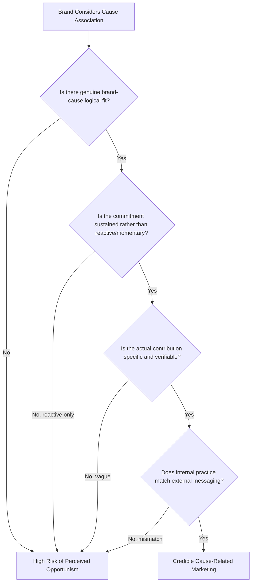

## Ethical and Cause-Related Consumption

### Overview

Ethical consumption refers to purchase decisions influenced by moral considerations beyond price and functional utility — labor practices, animal welfare, human rights, community impact, and broader social justice concerns. Cause-related marketing is the specific commercial practice of linking a brand or product to a social or charitable cause, typically through mechanisms like donation-per-purchase or cause partnership branding. Together, these disciplines examine how brands engage consumers' moral and social identity motivations, and the associated credibility and effectiveness risks that parallel the environmental claims and greenwashing dynamics covered earlier in this chapter.

**Key Points**

- Ethical consumption and cause-related marketing are conceptually related to but distinct from the environmental/green marketing covered earlier in this chapter — ethical consumption spans social, labor, and human-rights dimensions in addition to environmental ones.
- Cause-related marketing effectiveness depends heavily on perceived fit between the brand, the cause, and the consumer's own values — mismatched or opportunistic-seeming cause associations tend to backfire.
- As with green claims, ethical and cause-related marketing is vulnerable to its own credibility risk category, often termed "cause-washing" or "woke-washing," following similar failure patterns to greenwashing.

---

### Dimensions of Ethical Consumption

#### Labor and Human Rights

- **Fair trade and fair labor practices**: Purchase decisions favoring products certified or verified to ensure fair wages and safe working conditions in supply chains, particularly salient in categories with historically documented labor concerns (e.g., apparel, coffee, cocoa).
- **Supply chain transparency**: Consumer and regulatory expectation for visibility into sourcing and labor conditions throughout a product's production chain, not just the final manufacturing stage.

#### Animal Welfare

- **Cruelty-free and vegan claims**: Product formulation and testing claims related to animal treatment, subject to similar substantiation standards and certification systems as environmental claims.
- **Sourcing welfare standards**: Claims regarding the treatment of animals in food and material production (e.g., cage-free, grass-fed, humane certification).

#### Social Justice and Community Impact

- **Diversity, equity, and representation commitments**: Brand positioning and marketing content reflecting commitments to diverse representation and inclusive practice, both internally (workforce, supply chain) and externally (advertising representation).
- **Community and local economic impact**: Positioning around support for local economies, small producers, or specific community development initiatives.
- **Political and social cause alignment**: Brand association with specific social or political causes, ranging from broad-based, less contested positions to more polarizing issue alignment.

---

### Cause-Related Marketing Mechanisms

#### Common Structural Models

- **Donation-per-purchase (transactional cause marketing)**: A defined portion of proceeds from a specific purchase is donated to a partner cause or organization, typically communicated with specific terms (e.g., "$1 donated per unit sold, up to $X").
- **Cause partnership/co-branding**: A brand forms an ongoing formal partnership with a nonprofit or cause organization, integrating the cause into broader brand identity rather than a single transactional campaign.
- **Product-embedded cause model**: The cause is structurally embedded in the business model itself (e.g., a "buy one, give one" model where each purchase directly triggers a corresponding donated product) rather than a percentage-of-proceeds mechanism.
- **Cause-branded product lines**: Limited or ongoing product lines specifically created around a cause, distinct from a brand's core product range.

#### Effectiveness Drivers

- **Brand-cause fit**: The perceived logical or values-based connection between the brand/product category and the specific cause significantly affects consumer response — a natural, credible fit tends to outperform an arbitrary or opportunistic pairing.
- **Cause-consumer values alignment**: Effectiveness depends on alignment between the specific cause and the target consumer segment's own values, reinforcing the relevance of segmentation approaches discussed earlier in this course.
- **Clarity and specificity of contribution**: Clear, specific, and verifiable statements of the actual contribution (exact amount, recipient organization, mechanism) tend to be more credible and effective than vague cause association.
- **Perceived sincerity vs. opportunism**: Consumer response is shaped by whether the cause association is perceived as a sincere, sustained commitment versus an opportunistic, short-term marketing tactic — particularly salient for cause alignment introduced around high-visibility social or political moments.

**Example**

An outdoor apparel brand partners with an environmental conservation nonprofit, donating a percentage of sales from a specific product line to land conservation efforts, clearly stating the exact percentage and total historical donation amount on its website with third-party audit confirmation. The high logical fit between an outdoor apparel category and land conservation, combined with a multi-year sustained partnership (rather than a single campaign) and transparent, verifiable contribution reporting, supports credibility relative to a more arbitrary or short-term cause pairing.

---

### The Attitude-Behavior Gap in Ethical Consumption

A well-documented pattern in ethical consumption research is the divergence between consumers' stated ethical purchase intentions (frequently very high in survey research) and actual observed ethical purchase behavior (frequently substantially lower), directly connecting to the survey and behavioral data methodology themes discussed earlier in this course.

#### Common Explanations for the Gap

- **Social desirability bias in stated intent**: Consumers may overstate ethical purchase intention in surveys due to social desirability pressure, a specific instance of the general survey bias pattern discussed in the survey design chapter item.
- **Price and convenience trade-offs at point of purchase**: Ethical considerations often function as a secondary or tie-breaking factor rather than a primary purchase driver when price or convenience trade-offs become concrete at the moment of purchase, rather than abstract in a survey context.
- **Information and verification friction**: Consumers may lack easy access to reliable information about a product's actual ethical sourcing at the point of purchase, limiting the practical translation of stated values into behavior.
- **Habit and choice architecture**: Default purchase habits and the choice architecture of retail environments (placement, availability, pricing structure) can outweigh stated ethical preference in actual behavior.

**Key Points**

- This attitude-behavior gap directly mirrors the sustainability premium tolerance pattern discussed in the mixed-methods synthesis example earlier in this course — stated values and revealed purchase behavior frequently diverge, requiring behavioral and transactional data (not survey data alone) to accurately understand actual ethical consumption patterns.

---

### Cause-Washing and Credibility Risk

Paralleling the greenwashing risk category covered in the prior chapter item, ethical and cause-related marketing carries its own analogous credibility risk, sometimes termed cause-washing or, in the context of social/political cause alignment specifically, "woke-washing" or performative allyship.

#### Common Failure Patterns

- **Internal-external inconsistency**: External cause messaging that is inconsistent with a brand's actual internal practices (e.g., promoting diversity in advertising while lacking corresponding internal workforce diversity, or supporting a cause publicly while lobbying against related policy privately).
- **Momentary/reactive cause alignment**: Adopting cause messaging reactively in response to a trending social moment without sustained follow-through, which research and commentary suggest is often perceived as opportunistic once the moment passes.
- **Vague contribution claims**: Cause partnerships lacking specific, verifiable detail about the actual scale and mechanism of contribution, mirroring the "no proof" and "vagueness" patterns from the greenwashing taxonomy.
- **Disproportionate messaging emphasis**: Cause marketing that receives disproportionate promotional emphasis relative to the actual scale of the underlying contribution or commitment.

---

### Risk Mitigation Practices

- **Internal-external alignment audit**: Verifying that external cause messaging is consistent with actual internal policy and practice before launching related marketing, directly analogous to the substantiation-first approach recommended for environmental claims.
- **Sustained commitment over reactive campaigns**: Favoring multi-year, structurally embedded cause partnerships over short-term reactive campaigns tied to trending social moments, reducing perceived opportunism risk.
- **Specific, auditable contribution reporting**: Publishing specific, verifiable details of cause contributions (amounts, mechanisms, recipient organizations, third-party audit where feasible) rather than vague cause association.
- **Cross-functional review**: As with environmental claims, cause-related marketing benefits from review spanning marketing, corporate social responsibility/ESG functions, and legal, to ensure claims are both accurate and strategically coherent with broader company practice.

---

### Limitations

- **Measurement difficulty for social impact**: Unlike some environmental metrics with more established measurement standards, social and cause-related impact (e.g., community benefit, labor condition improvement) can be genuinely harder to quantify and independently verify, creating substantiation challenges distinct from but analogous to environmental claims. [Inference: the degree of measurement standardization varies substantially by specific cause category, with some social impact areas having more mature verification infrastructure than others.]
- **Polarization risk in cause alignment**: Cause and social-issue marketing, particularly around more contested political or social topics, carries a distinct risk profile from environmental claims — alienating segments of the consumer base who disagree with the specific cause position, a trade-off not symmetrically present in most environmental claims. [Inference: the specific business impact of polarizing cause alignment varies significantly by brand, category, and target consumer base, and is not uniform across contexts.]
- **Attitude-behavior gap complicates market sizing**: As discussed above, stated consumer support for ethical/cause-related products in survey research should not be directly extrapolated to actual purchase volume without corroborating behavioral or transactional data, per the mixed-methods synthesis principles covered earlier in this course.
- **Verification resource constraints**: Rigorous internal-external alignment auditing and sustained cause partnership investment require organizational resources that may be a genuine constraint for smaller organizations, even absent any bad intent.

---

### Applications in Marketing & Consumer Psychology

- **Identity-expressive consumption**: Ethical and cause-related purchases often function as identity signals, connecting to the same values-based consumption psychology discussed in the environmental claims items — purchases communicate the consumer's self-concept and social values to themselves and others.
- **Moral licensing effects**: [Inference: behavioral research in adjacent domains suggests that ethical consumption in one area can sometimes create a psychological "moral license" that reduces ethical behavior in unrelated areas, though the specific strength and consistency of this effect in consumer marketing contexts specifically should be treated as an area of ongoing research rather than an established, universally replicated finding.]
- **Segment-specific responsiveness**: As with environmental claims, responsiveness to ethical and cause-related marketing varies meaningfully by consumer segment values alignment, supporting the same segmentation-informed approach recommended throughout this course.
- **Connecting to chapter themes**: This item extends the credibility-risk framework established in the green marketing and greenwashing items to the broader domain of ethical and social-cause consumption, reinforcing that authenticity and substantiation — not just claim volume — drive durable brand trust across all forms of values-based marketing.

---

**Related Topics**

- Green marketing and environmental claims
- Greenwashing and credibility risk
- Corporate social responsibility (CSR) communication
- Values-based segmentation and identity-driven consumption
- Attitude-behavior gap research methodology
- Certification and third-party verification systems
- Brand authenticity and trust research
- Crisis communication and reputational risk management