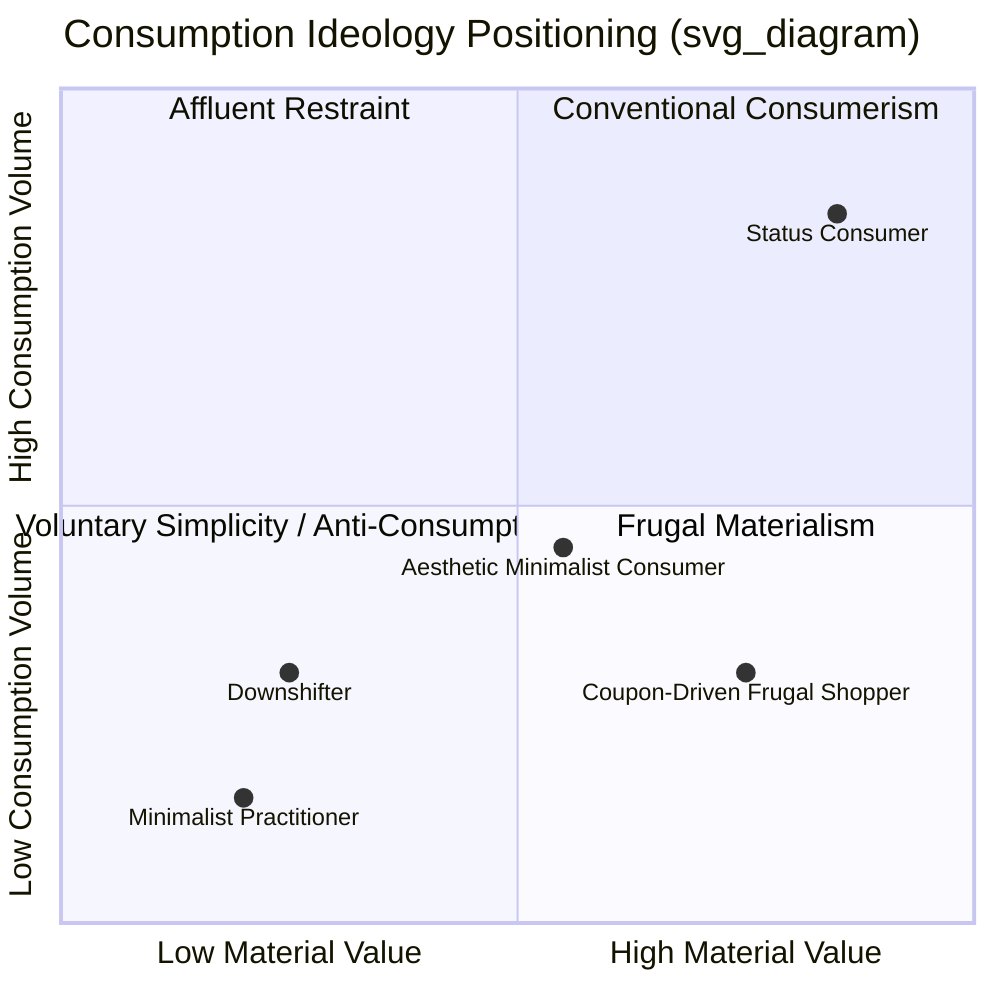

## Minimalism, Anti-Consumption, and Voluntary Simplicity

### Definitional Foundations

**Minimalism** refers to a lifestyle orientation and consumption philosophy centered on deliberately reducing material possessions, consumption volume, and acquisitive behavior in favor of perceived essentials. As a marketing-relevant construct, minimalism is best understood not as mere frugality but as an identity-driven consumption ideology, where reduction itself becomes a signal of values.

**Anti-consumption** is the broader academic umbrella term, defined as consumer resistance to, distaste for, or restriction of consumption, encompassing behaviors ranging from boycotts to voluntary simplicity to product-specific rejection. Anti-consumption is not the simple absence of consumption; it is an active, often ideologically motivated stance against consumption or against specific consumption practices.

**Voluntary simplicity (VS)** is the most academically established of the three terms, originating from Duane Elgin's work and defined as a lifestyle in which individuals deliberately minimize material consumption and expenditure in order to pursue non-material sources of satisfaction and meaning, such as personal growth, relationships, community involvement, or spiritual development.

Key conceptual distinctions:

- Minimalism emphasizes *reduction of stock* (possessions on hand)
- Anti-consumption emphasizes *rejection of flow* (acquisition behavior and consumerist ideology)
- Voluntary simplicity emphasizes *reallocation of purpose* (trading material goals for non-material ones)

These constructs overlap substantially but are not synonymous; a consumer can practice minimalism (few possessions) without holding anti-consumption ideology (they may still shop frequently, just curate ruthlessly), and vice versa.

### Historical and Intellectual Origins

**Pre-20th century roots:**

- Ancient philosophical traditions: Stoicism (Seneca, Epictetus) on detachment from external goods; Buddhist teachings on non-attachment; Christian ascetic traditions (monastic poverty)
- Henry David Thoreau's *Walden* (1854) is frequently cited as a foundational Western text, articulating deliberate simplification as a route to authentic living

**20th century formalization:**

- Richard Gregg coined "voluntary simplicity" in 1936, drawing on Gandhian economic philosophy
- Duane Elgin's *Voluntary Simplicity* (1981) systematized the concept for a mass American audience, framing it against post-war consumerism and the counterculture's critique of materialism
- E.F. Schumacher's *Small Is Beautiful* (1973) linked simplicity to ecological and economic critique

**Contemporary movement (1990s–present):**

- The "simplicity movement" gained renewed traction amid critiques of consumer culture (Juliet Schor's *The Overspent American*, 1998)
- Digital-era minimalism (2010s–present) popularized by figures such as Marie Kondo (organizational minimalism via the KonMari Method), Joshua Fields Millburn and Ryan Nicodemus ("The Minimalists"), and the FIRE (Financial Independence, Retire Early) movement's adjacent frugality ethic
- Social media has paradoxically become both a distribution channel and a monetization mechanism for anti-consumption content (aesthetic minimalism, decluttering content, "no-buy year" challenges)

### Theoretical Frameworks in Consumer Behavior

**Materialism-simplicity continuum:**

Consumer researchers (notably Richins and Dawson's Material Values Scale literature) position voluntary simplicity as the psychological and behavioral inverse of materialism. Where materialism treats possessions as central to identity, success, and happiness, simplicity treats reduced possession as central to authenticity and well-being.

**Identity and self-signaling theory:**

Minimalist consumption functions as a form of conspicuous non-consumption or "inconspicuous consumption" (Eckhardt, Belk, and Devinney's terminology applies loosely here). Rather than signaling status through acquisition, minimalists signal status/values through visible restraint, curated scarcity, and aesthetic austerity (e.g., the "capsule wardrobe" as a status marker within certain social strata).

**Terminal Materialism vs. Instrumental Materialism (Csikszentmihalyi & Rochberg-Halton framing, adapted):**

- Instrumental materialism: possessions valued for functional use in pursuing goals
- Terminal materialism: possessions valued for their own sake, often for status

  Voluntary simplicity practitioners typically retain instrumental materialism while rejecting terminal materialism.

**Push-pull motivational model:**

Academic literature (e.g., studies by Craig-Lees and Hill) frames adoption of voluntary simplicity via:

- **Push factors**: stress, debt, environmental guilt, burnout, dissatisfaction with consumerist lifestyle, financial precarity
- **Pull factors**: desire for autonomy, time affluence, environmental values, community, spiritual growth, aesthetic preference

**Self-Determination Theory (SDT) application:**

[Inference] Voluntary simplicity can be interpreted through SDT's three basic psychological needs — autonomy, competence, and relatedness — with practitioners reporting satisfaction gains in autonomy (freedom from consumerist obligation) and relatedness (community/family time reallocated from work-to-spend cycles), though direct empirical validation specifically through the SDT framework is comparatively thin.

### Typology of Anti-Consumption Behaviors

Anti-consumption research (Lee, Fernandez, and Hyman; Iyer and Muncy) typically segments behavior along two axes: the **target** of resistance (general consumption vs. specific brands/products) and the **motivation** (simplifying one's life vs. activism/ideology vs. market resistance).

| Type | Target | Primary Motivation |
| --- | --- | --- |
| Voluntary simplicity | General consumption | Life simplification, well-being |
| Boycotting | Specific brand/product | Ethical/political protest |
| Anti-brand/anti-loyalty | Specific brand | Rejection of brand meaning or corporate behavior |
| Culture jamming | Advertising/media systems | Ideological resistance to consumer culture |
| Downshifting | Career/income/consumption | Work-life rebalancing |
| Frugality | Spending | Economic prudence (not necessarily ideological) |

**Key distinction — frugality vs. voluntary simplicity:** Frugality is primarily economically motivated (saving money) and can coexist with materialistic values (a frugal person may still desire many possessions, just acquired cheaply). Voluntary simplicity is values-motivated and typically anti-materialistic in orientation, treating reduced consumption as intrinsically desirable rather than instrumentally economical.

### Behavioral and Psychological Manifestations

**Common practitioner behaviors:**

- Decluttering and possession audits (e.g., "the 100 Thing Challenge," KonMari)
- "No-buy" or "low-buy" periods/years
- Capsule wardrobes and uniform dressing
- Digital minimalism (reducing app usage, screen time, notification volume — per Cal Newport's framing)
- Experiential substitution (prioritizing experiences/relationships over goods, consistent with experiential vs. material purchase happiness research, e.g., Van Boven and Gilovich)
- Repair, reuse, and secondhand acquisition over new purchase
- Housing downsizing (tiny house movement as an extreme manifestation)

**Psychological correlates reported in the literature:**

- Reduced materialism scores correlating with higher subjective well-being (well-replicated finding in materialism research, e.g., Kasser's work on materialistic values and ill-being)
- [Inference] Minimalism practitioners may experience reduced decision fatigue due to fewer choice-relevant possessions, consistent with choice-overload research (Iyengar and Lepper), though this causal link is more often asserted in practitioner literature than directly tested in minimalism-specific studies
- Identity coherence: minimalist practice often functions as an extended-self narrative (Belk's extended self theory) where *what one excludes* becomes as identity-constitutive as what one includes

### Marketing and Managerial Implications

**The paradox of marketing to anti-consumption:**

Firms face an inherent tension: anti-consumption ideology is fundamentally skeptical of, or hostile to, marketing and consumerist messaging. Effective engagement requires reframing rather than direct promotional appeals.

**Strategic response patterns observed in practice:**

1. **Quality-over-quantity positioning**: Brands (e.g., Patagonia, Everlane) market durability, timelessness, and "buy less, buy better" messaging, converting anti-consumption sentiment into a premium justification rather than a purchase deterrent
2. **Anti-marketing as marketing**: Patagonia's "Don't Buy This Jacket" campaign (2011) is a canonical case — an ostensibly anti-consumption message that functioned as a highly effective brand-differentiation and long-term sales driver by building trust and premium brand equity
3. **Curated scarcity/capsule product lines**: Reducing SKU count and marketing "considered" or "edited" collections aligns brand architecture with minimalist consumer values
4. **Circular economy and resale integration**: Branded resale platforms (Patagonia Worn Wear, IKEA buyback programs) let firms monetize anti-consumption sentiment by capturing secondary market value rather than losing that transaction to third parties
5. **Service and experience substitution**: Shifting revenue models from product ownership to access/subscription/rental (aligning with reduced-ownership values while preserving revenue, e.g., clothing rental services)

**Risks for brands:**

- **Greenwashing/simplicity-washing accusations**: Superficial minimalist aesthetic (visual minimalism in packaging/branding) without substantive reduction in consumption-driving practices invites credibility backlash
- **Category cannibalization**: Messaging that too successfully discourages purchase can suppress core sales if not carefully balanced with a durability/premium-repurchase narrative
- **Segment misidentification**: Aesthetic minimalism (a design/style preference) is a much larger addressable market than ideological anti-consumption; conflating the two in targeting leads to messaging that alienates true anti-consumption practitioners as inauthentic

**Segmentation implication:** [Inference] It is analytically useful to separate "aesthetic minimalists" (drawn to minimalist visual/design language, still high-frequency consumers) from "ideological anti-consumers" (low-frequency, values-driven, marketing-resistant), since these segments require materially different value propositions and channel strategies, though the literature does not always draw this line with a standardized terminology.

### Relationship to Sustainability and Well-Being

Voluntary simplicity sits at the intersection of the chapter's broader themes because it is frequently framed — by both academics and practitioners — as simultaneously:

- An **environmental behavior** (reduced consumption lowers material throughput and associated ecological footprint)
- A **well-being intervention** (shifting focus from material to experiential/relational goals, consistent with hedonic adaptation research showing material purchases produce shorter-lived satisfaction gains than experiential ones)
- A **social critique** (challenging the growth-consumption paradigm of conventional macroeconomics, connecting to degrowth and post-growth economic theory)

$$SWB = f(M_{\text{material}}, E_{\text{experiential}}, R_{\text{relational}}), \quad \frac{\partial SWB}{\partial E} > \frac{\partial SWB}{\partial M} \text{ (per adaptation-based happiness research)}$$

Where $SWB$ denotes subjective well-being; this formalization is a simplified representation of the well-documented finding that experiential and relational sources of satisfaction show slower hedonic adaptation than material acquisition. [Inference] The equation is a pedagogical simplification of the underlying empirical literature, not a validated formal model from a single cited source.

### Conceptual Diagram: Consumption Ideology Positioning

### Illustrative Example

A mid-market apparel brand observes declining repeat-purchase frequency among a growing customer segment who explicitly cite "buying less" in post-purchase surveys. Two response strategies illustrate the theoretical tension above:

- **Misaligned response**: Increase promotional discounting frequency to stimulate volume — likely to further alienate this segment, who interpret aggressive discounting as evidence of poor-quality, disposable production
- **Aligned response**: Introduce a lifetime repair guarantee, publish garment durability data, and launch a certified-secondhand resale channel — converting anti-consumption sentiment into a differentiated value proposition and capturing revenue across the product's full lifecycle rather than only at first sale

### Critiques and Limitations

- **Privilege critique**: Voluntary simplicity is frequently critiqued as a lifestyle available primarily to those with pre-existing financial security ("voluntary" implies genuine choice, distinguishing it from involuntary poverty or frugality-by-necessity)
- **Measurement inconsistency**: Academic literature lacks a single standardized scale for anti-consumption comparable to the Material Values Scale for materialism, complicating cross-study comparison [Unverified as a fully current gap — scale development in this area continues to evolve]
- **Commercialization paradox**: The commercial success of minimalism-branded products (organizational products, capsule wardrobe services, minimalist tech) has led some scholars to argue the movement has been substantially absorbed into consumer culture itself rather than remaining external to it

**Related Topics**

- Materialism and the Material Values Scale
- Degrowth economics and post-growth consumer theory
- Experiential vs. material purchases and happiness research
- Circular economy business models and product-as-a-service
- Greenwashing and credibility signaling in sustainability marketing
- Hedonic adaptation and the Easterlin paradox
- Extended self theory and possession-identity linkages
- Digital minimalism and attention economy resistance