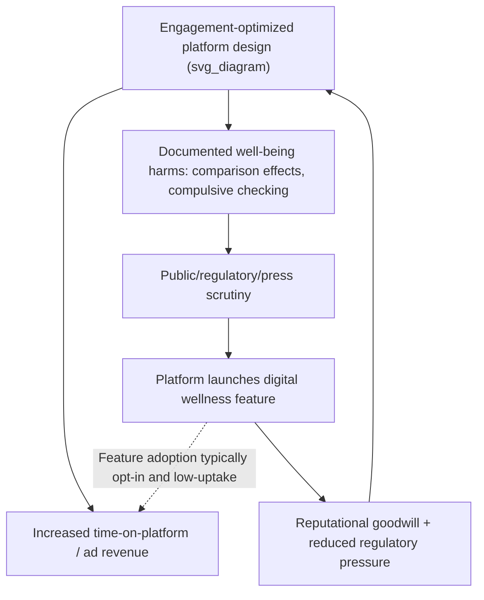

## Well-Being Marketing and Digital Wellness

### Definitional Foundations

**Well-being marketing** refers to marketing strategy and practice oriented toward promoting, signaling, or supporting consumer psychological, physical, or social well-being, either as a core value proposition of a product/service or as a brand positioning strategy layered atop conventional offerings. It sits within the broader transformative consumer research (TCR) tradition, which explicitly evaluates marketing's effects on consumer and societal welfare rather than treating consumption as inherently welfare-neutral.

**Digital wellness** (also "digital well-being" or "tech wellness") is a subdomain concerned specifically with mitigating the negative psychological and behavioral effects of digital technology use — smartphone overuse, social media comparison effects, notification-driven attention fragmentation, and "doomscrolling" — and the market response to these effects, including apps, device features, and brand positioning built around healthier technology relationships.

**Key conceptual tension**: digital wellness marketing is frequently produced and distributed by the same technology platforms whose engagement-maximizing business models are implicated in the well-being harms being addressed, creating a structural conflict of interest central to critical analysis of this space.

### Historical and Intellectual Origins

**Well-being marketing lineage:**

- Rooted in the broader "quality of life" marketing research tradition dating to the 1970s (e.g., work associated with the Journal of Macromarketing)
- Formalized under **Transformative Consumer Research (TCR)**, an initiative launched by the Association for Consumer Research (ACR) in the mid-2000s, explicitly directing consumer research toward improving consumer welfare
- Accelerated by broader "wellness economy" growth (Global Wellness Institute tracks this as a multi-trillion-dollar global sector spanning nutrition, fitness, mental wellness, and workplace wellness)

**Digital wellness lineage:**

- Emerged as a distinct discourse in the mid-2010s, catalyzed by:
  - Tristan Harris's critique of "attention engineering" and the founding of the Center for Humane Technology (2018)
  - Cal Newport's *Digital Minimalism* (2019), which popularized structured technology-reduction practices
  - Apple's introduction of **Screen Time** (iOS 12, 2018) and Google's **Digital Wellbeing** (Android 9, 2018) — a pivotal moment where major platform holders formally incorporated usage-reduction tooling into their own products
- Accelerated further by COVID-19 era research linking heavy social media use to anxiety and depression symptoms in adolescents and young adults, intensifying regulatory and public attention

### Theoretical Frameworks

**Self-Determination Theory (SDT) in digital contexts:**

Digital wellness marketing frequently invokes SDT's autonomy, competence, and relatedness needs, framing "healthy" technology use as autonomy-supportive (user controls their attention) versus "unhealthy" use as autonomy-thwarting (algorithmic engagement mechanics override user intention).

**Attention economy critique (foundational to the category):**

The core structural claim, associated with scholars such as Tim Wu (*The Attention Merchants*) and amplified by Harris, is that platforms monetized via advertising have a direct commercial incentive to maximize time-on-platform, structurally misaligning platform business models with user well-being. Digital wellness products/features exist partly as a market and reputational response to this critique.

**Hedonic vs. eudaimonic well-being distinction:**

Well-being marketing literature commonly distinguishes:

- **Hedonic well-being**: pleasure, positive affect, satisfaction (short-term mood states)
- **Eudaimonic well-being**: meaning, purpose, self-actualization, autonomy (Ryff's psychological well-being model)

  [Inference] Much mainstream well-being marketing (spa/relaxation framing) targets hedonic well-being, while a smaller but growing segment (purpose-driven brands, mindfulness apps with growth-oriented framing) targets eudaimonic well-being — though few campaigns cleanly map to only one category in practice.

**Social comparison theory (Festinger) applied to social media:**

Central to digital wellness critique: curated self-presentation on social platforms triggers upward social comparison, associated in a substantial body of research with reduced self-esteem and increased depressive symptomatology, particularly among adolescent users. This research base underpins both platform-level feature responses (e.g., hidden like counts) and third-party digital wellness product positioning.

### Market Segmentation and Product Categories

| Category | Examples | Primary Mechanism |
| --- | --- | --- |
| Platform-native wellness tools | Apple Screen Time, Android Digital Wellbeing, Instagram "Take a Break" prompts | Usage tracking, self-imposed limits, nudges |
| Third-party attention management apps | Freedom, Forest, One Sec | App/site blocking, friction insertion, gamified restraint |
| Mindfulness and mental wellness apps | Headspace, Calm | Guided meditation, sleep content, subscription-based |
| Digital detox retreats/programs | Camp Grounded, various retreat operators | Structured offline experiences |
| "Dumbphone" and minimalist device hardware | Light Phone, Punkt. | Hardware-level feature restriction |
| Corporate/workplace digital wellness programs | Employer-provided wellness stipends including mental health apps | B2B2C wellness benefit distribution |

### The Platform Paradox: A Central Analytical Framework

The defining strategic and ethical tension in this category is that dominant digital platforms are simultaneously:

1. **Diagnosed sources** of the well-being harms in question (via engagement-optimized design)
2. **Marketers of solutions** to those same harms (via wellness features)
3. **Beneficiaries of the associated reputational and regulatory goodwill**

This has been characterized in critical literature as analogous to a company selling both a product and its antidote — a dynamic distinct from most other CSR-adjacent marketing because the harm and remedy originate from the same commercial entity.

[Inference] The dotted feedback line reflects a commonly voiced critique — that opt-in wellness features tend to see low sustained adoption and therefore exert limited pressure on the underlying engagement-optimized design — but adoption/usage figures vary substantially by platform and are not uniformly documented across all major platforms.

### Managerial and Strategic Implications

**Authentic vs. performative well-being positioning:**

Consumer skepticism toward "wellness-washing" (superficial well-being messaging without substantive product change) parallels greenwashing dynamics in the sustainability domain. Credible well-being marketing typically requires:

- Structural product changes (not just messaging) — e.g., default-off autoplay, visible usage dashboards, notification batching
- Third-party validation (clinical studies, academic partnerships, e.g., Headspace's published research collaborations)
- Alignment between monetization model and stated well-being goals (subscription-based wellness apps face less structural conflict than ad-supported ones)

**Segmentation of consumer receptivity:**

- **Well-being-motivated segment**: actively seeking usage reduction, high willingness-to-pay for genuinely restrictive tools (e.g., hardware dumbphones, paid blocking apps)
- **Guilt/ambivalence segment**: aware of overuse, expresses desire to reduce, but exhibits continued high engagement (a well-documented intention-behavior gap consistent with broader self-control and temporal discounting research)
- **Unconcerned segment**: does not perceive digital use as a well-being issue; unlikely to respond to wellness-framed messaging

**Employer/B2B digital wellness market:**

Corporate wellness benefit purchasing has expanded to include mental health and digital wellness app subscriptions (e.g., enterprise Calm/Headspace licenses) as part of broader employee benefits and productivity-framed HR strategy, positioning digital wellness partly as a workplace productivity intervention rather than purely a consumer lifestyle choice.

### Illustrative Example

A meditation app targeting the "guilt/ambivalence" segment above might structure its marketing and product around:

- **Onboarding messaging**: reframing meditation not as "another app to check" but as a tool for *reducing* total screen time, directly addressing the paradox of adding a screen-based intervention for screen-related harm
- **Feature design**: session-end prompts that close the app rather than surface additional content, signaling structural (not just rhetorical) commitment to the well-being claim
- **Proof points**: published efficacy studies (e.g., peer-reviewed sleep or anxiety outcome research) used in marketing claims to differentiate from unsubstantiated wellness-washing competitors

This structural alignment — where the monetization model (subscription) does not depend on maximizing time-in-app — is frequently cited as a key credibility differentiator versus ad-supported "wellness" features embedded in engagement-driven platforms.

### Critiques and Open Debates

- **Individualization of structural problems**: Critics (aligned with critical marketing and TCR-adjacent scholarship) argue that digital wellness marketing often frames platform-driven harms as individual self-control failures requiring personal-responsibility solutions (use this app, set this limit) rather than addressing the underlying business-model incentives — a critique structurally similar to individualization critiques in the sustainability/recycling discourse
- **Regulatory context**: [Unverified — jurisdiction and policy-dependent] Various jurisdictions have moved toward regulating platform design features implicated in compulsive use (e.g., EU Digital Services Act provisions touching on dark patterns, various proposed U.S. state-level youth social media legislation); the regulatory landscape is actively evolving and specific provisions should be verified against current law rather than assumed static
- **Efficacy evidence gaps**: While correlational evidence linking heavy social media use to well-being harms is substantial, causal evidence on the effectiveness of specific digital wellness interventions (screen time limits, app blockers) in producing durable well-being improvement is comparatively mixed and an active area of ongoing research

**Related Topics**

- Transformative Consumer Research (TCR) as a research paradigm
- Attention economy and engagement-optimized design ethics
- Dark patterns and manipulative interface design
- Greenwashing/wellness-washing credibility signaling
- Self-Determination Theory in marketing contexts
- Social comparison theory and social media effects on adolescents
- Corporate wellness programs and workplace benefits marketing
- Intention-behavior gap and self-control in consumer decision-making