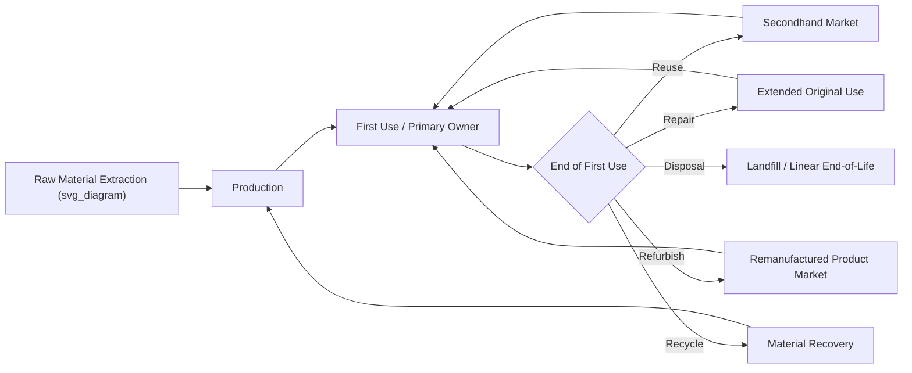

## Circular Economy and Secondhand Consumption Psychology

### Definitional Foundations

**Circular economy (CE)** is an economic model designed to eliminate waste and maximize resource utility through continuous cycles of reuse, repair, refurbishment, and recycling, contrasted against the traditional **linear economy** model of "take-make-dispose." In marketing terms, CE reframes the product lifecycle from a single linear purchase-to-disposal path into a looped system where value is recaptured across multiple ownership or use cycles.

**Secondhand consumption** refers to the acquisition of previously owned goods, spanning informal channels (garage sales, flea markets, peer-to-peer exchange), formal resale retail (thrift stores, consignment), and digital resale platforms (marketplace apps, brand-operated resale programs). Secondhand consumption psychology examines the distinct motivational, emotional, and identity processes that differentiate secondhand acquisition from new-goods purchasing.

**Key distinction**: Circular economy is a *systems-level* and *supply-side* framework (how firms and economies design product lifecycles), while secondhand consumption psychology is a *consumer-level* and *demand-side* framework (why individuals choose, feel about, and derive value from previously owned goods). Marketing practice must address both simultaneously — a viable circular business model requires consumers who are psychologically willing to participate in it.

### Historical and Intellectual Origins

**Circular economy conceptual lineage:**

- Draws on industrial ecology concepts from the 1970s–1980s (e.g., Walter Stahel's "cradle to cradle" thinking, later formalized by William McDonough and Michael Braungart in *Cradle to Cradle*, 2002)
- The **Ellen MacArthur Foundation** (founded 2010) is widely credited with mainstreaming and standardizing circular economy terminology and frameworks for business and policy audiences
- The EU's Circular Economy Action Plan (first adopted 2015, revised 2020) institutionalized CE principles into regional industrial policy, accelerating corporate adoption of circular business models

**Secondhand consumption psychology lineage:**

- Historically stigmatized in much of 20th-century Western consumer culture, associated with economic necessity rather than choice (a "poverty signal")
- Academic reappraisal began with consumer research on thrift shopping motivations (e.g., work by Bardhi and Arnould on secondhand markets and treasure-hunting behavior, early 2000s)
- Digital resale platforms (eBay from 1995; more recently ThredUp, Poshmark, Depop, Vinted, The RealReal) transformed secondhand from a stigmatized necessity-driven channel into a mainstream, and in some segments status-driven, consumption mode
- Sustainability consciousness (particularly among Gen Z and Millennial cohorts) has reframed secondhand purchasing as a values-expressive rather than purely economic behavior

### Theoretical Frameworks

**The R-frameworks (circularity strategy hierarchy):**

Circular economy strategies are commonly organized in a hierarchy (adapted from various "R-ladder" frameworks used in EU policy and academic literature), ordered from most to least resource-preserving:

1. **Refuse** — avoiding consumption/production entirely
2. **Reduce** — using fewer resources per unit
3. **Reuse** — using a product again for its original purpose (core to secondhand markets)
4. **Repair** — fixing to extend original lifespan
5. **Refurbish** — restoring an old product to good working order
6. **Remanufacture** — using parts of a discarded product in a new product with the same function
7. **Repurpose** — using a discarded product for a different function
8. **Recycle** — processing materials to obtain the same or lower quality
9. **Recover** — incineration for energy recovery (lowest circularity)

Secondhand consumption operates primarily at the **Reuse** level — the highest-value circularity strategy after avoidance/reduction, since it requires no reprocessing and preserves the most embedded resource and manufacturing value.

**Motivational typology for secondhand consumption:**

Consumer research (building on Guiot and Roux's influential secondhand shopping motivation scale) identifies distinct, co-occurring motivational clusters:

| Motivation Category | Description |
| --- | --- |
| Economic | Lower price relative to new-goods equivalent |
| Critical/ideological | Rejection of conventional retail/consumerist systems (aligns with anti-consumption) |
| Recreational | "Treasure hunting," the thrill of discovery, browsing enjoyment |
| Environmental | Explicit sustainability motivation, waste reduction |
| Nostalgic/identity | Vintage items conferring uniqueness, personal narrative, or historical connection |
| Ethical | Support for charitable retail models (thrift store proceeds) or labor/supply-chain concerns with new production |

**Perceived risk in secondhand markets:**

Secondhand purchasing carries elevated *perceived risk* dimensions relative to new-goods purchase, particularly:

- **Contamination/hygiene risk** — psychological discomfort with previous ownership, especially pronounced for certain categories (undergarments, mattresses) and comparatively minimal for others (books, vintage furniture)
- **Performance risk** — uncertainty about product condition/functionality absent manufacturer warranty
- **Social risk** — residual stigma concerns, though substantially diminished in current market conditions relative to prior decades

**Contamination sensitivity and disgust psychology:**

[Inference] Research on disgust sensitivity (drawing on broader psychological disgust literature, e.g., Rozin and Fallon's contagion principles) suggests secondhand resistance for certain product categories is partly explained by "law of contagion" intuitions — the belief that an object retains some essence of its previous owner — though this connection is more frequently theorized in adjacent psychological literature than directly tested within secondhand-consumption-specific studies.

**Identity and self-extension in secondhand acquisition:**

Building on Belk's extended self theory, secondhand goods (particularly vintage and unique items) can serve stronger self-expressive and identity-differentiation functions than mass-produced new goods, since scarcity and history confer a form of narrative authenticity difficult to replicate via new retail.

### Circular Business Model Archetypes

| Model | Description | Example Pattern |
| --- | --- | --- |
| Resale (brand-operated) | Brand facilitates resale of its own used products, often via trade-in credit | Patagonia Worn Wear, IKEA buyback |
| Resale (third-party platform) | Independent marketplace facilitates peer-to-peer or curated resale | ThredUp, The RealReal, Vinted |
| Product-as-a-service / rental | Consumer pays for temporary access rather than ownership | Clothing rental subscriptions, tool libraries |
| Take-back and remanufacturing | Firm collects end-of-life products for refurbishment/resale | Electronics manufacturer refurbished product lines |
| Repair-enablement | Firm facilitates or subsidizes repair to extend product life | Right-to-repair initiatives, branded repair services |
| Material recovery/recycling programs | Firm facilitates recycling of materials at end-of-life | Textile take-back bins, closed-loop recycling programs |

### Managerial and Strategic Implications

**Cannibalization concern and evidence:**

A central managerial question is whether brand-operated resale programs cannibalize new-product sales. [Inference] Emerging evidence and industry reporting from early adopters (e.g., Patagonia's public commentary on Worn Wear) suggests resale programs can function as a customer-acquisition and loyalty-building channel — attracting price-sensitive or values-driven customers who might not otherwise purchase the brand new — rather than purely cannibalizing existing full-price demand, though rigorous, generalizable causal estimates of net cannibalization versus incremental revenue effects across brands and categories remain limited in public literature.

**Reducing perceived risk to drive adoption:**

Effective circular/secondhand marketing systematically addresses the perceived-risk dimensions above:

- Standardized condition-grading systems (addressing performance risk)
- Professional cleaning/sanitization certification, particularly for high-contamination-sensitivity categories (addressing contamination risk)
- Authentication services for luxury resale (addressing counterfeit/quality risk, central to platforms like The RealReal)
- Return policies mirroring new-goods retail norms (addressing performance and social risk by normalizing the transaction)

**Status reframing:**

Contemporary marketing has actively worked to reposition secondhand and vintage consumption from a stigma-associated necessity behavior to an aspirational, taste-signaling behavior — particularly in fashion resale, where vintage/rare items can command premium pricing above original retail, inverting the traditional depreciation-based value logic of new goods.

**Segmentation for circular offerings:**

- **Sustainability-primary segment**: environmental motivation dominant; responsive to impact metrics (e.g., "this purchase saved X liters of water")
- **Value-primary segment**: economic motivation dominant; responsive to price-comparison and savings-framed messaging
- **Treasure-hunt/recreational segment**: responsive to curation, discovery-oriented platform design, and novelty
- **Status/authenticity segment**: responsive to rarity, provenance, and brand-heritage narrative (most relevant to luxury/vintage resale)

### Illustrative Example

A furniture retailer launching a circular buyback-and-resale program must address distinct psychological barriers by product sub-category: for a used sofa, contamination/hygiene risk is the dominant barrier (addressed via professional cleaning certification and clear condition photography); for a used bookshelf, performance risk around structural integrity is more salient (addressed via standardized condition grading); for vintage design pieces, the marketing challenge inverts entirely — the goal shifts from risk mitigation to provenance amplification, emphasizing design history and scarcity to justify premium pricing relative to new mass-market equivalents.

### Critiques and Open Debates

- **Rebound effect**: [Inference] Some critical literature raises the concern that money saved through secondhand/circular consumption may be reallocated to additional (potentially new-goods) consumption rather than net-reducing total consumption footprint — a variant of the broader "rebound effect" documented in energy-efficiency economics — though empirical quantification specific to secondhand consumption rebound effects is an emerging rather than settled research area
- **Scale limitations of circularity claims**: Critics note that resale and repair programs, while directionally positive, currently represent a small fraction of total production/consumption volume for most major retailers, raising "circular-washing" concerns analogous to greenwashing when circular initiatives are marketed disproportionately to their actual material impact
- **Equity dimensions**: The reframing of secondhand shopping as an aspirational, sustainability-signaling behavior among higher-income consumers has been critiqued for potentially increasing prices and reducing availability of affordable secondhand goods for consumers who rely on thrift/resale markets out of economic necessity rather than choice

**Related Topics**

- Ellen MacArthur Foundation circular economy framework and R-ladder taxonomies
- Perceived risk theory in consumer decision-making
- Extended self theory and possession-identity linkages
- Luxury resale authentication and brand equity protection
- Greenwashing and circular-washing credibility signaling
- Product-as-a-service and access-based consumption models
- Right-to-repair movement and regulatory context
- Anti-consumption and voluntary simplicity (adjacent chapter topic)