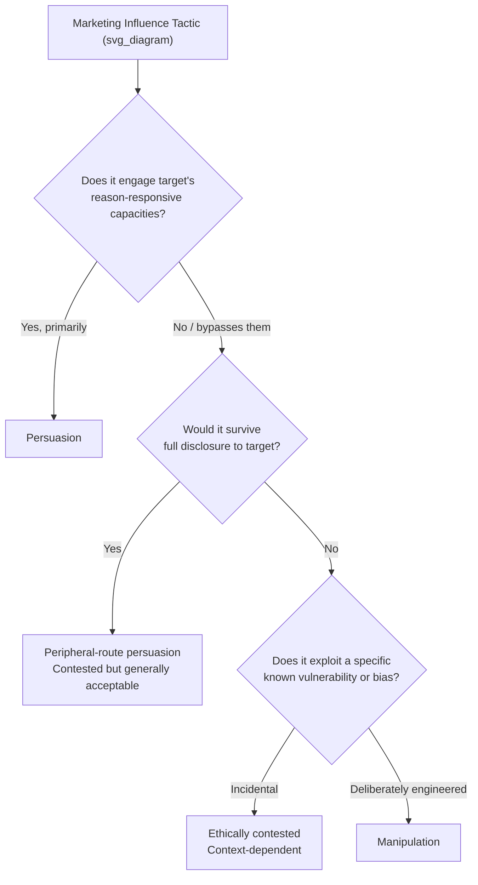

## Persuasion versus Manipulation: Drawing the Line

### Definitional Foundations

**Persuasion** is conventionally defined in social psychology and marketing ethics literature as an attempt to change a person's beliefs, attitudes, or behavior through appeals that engage the target's rational agency — that is, the persuadee retains the capacity to evaluate the message on its merits and freely accept or reject it.

**Manipulation** is defined, across the dominant philosophical and marketing-ethics treatments (e.g., Robert Noggle's influential work on manipulation, applied to marketing by scholars such as Michael Phillips and Michael Rhoads), as influence that bypasses, subverts, or exploits the target's rational agency rather than engaging it — the influenced party may not be aware influence is occurring, or may be influenced via a route that circumvents their capacity for reflective evaluation.

**Core distinguishing criterion (the "rational agency" test):**

The most widely used philosophical test for separating persuasion from manipulation is whether the influence attempt:

1. **Engages** the target's deliberative, reason-responsive capacities (persuasion), or
2. **Exploits or circumvents** those capacities via psychological vulnerabilities, cognitive biases, emotional triggers, or informational asymmetry the target cannot adequately evaluate (manipulation)

This is not a binary categorical distinction in practice but a **continuum**, and most academic treatments explicitly reject a sharp bright-line test in favor of degree-based and context-dependent assessment.

### Historical and Intellectual Origins

**Philosophical foundations:**

- Aristotelian rhetoric (*ethos*, *pathos*, *logos*) provides the earliest systematic framework distinguishing legitimate persuasive appeal from illegitimate manipulation, though Aristotle did not use modern manipulation terminology
- Kantian ethics provides the deepest philosophical grounding for the modern distinction: manipulation is often analyzed as a violation of the Kantian principle of treating persons as ends in themselves rather than merely as means, since manipulation treats the target's psychology as an object to be exploited rather than a rational agent to be engaged
- Robert Noggle's philosophical work (1996 onward) systematized manipulation as attempts to influence beliefs, desires, or emotions in ways that are not properly responsive to reasons — foundational to subsequent marketing ethics scholarship

**Marketing ethics formalization:**

- Marketing ethics scholarship (e.g., in the *Journal of Public Policy & Marketing*, *Journal of Business Ethics*) developed persuasion-knowledge frameworks explicitly to operationalize this philosophical distinction for advertising and sales contexts
- The **Persuasion Knowledge Model** (Friestad and Wright, 1994) is the single most influential marketing-specific framework, proposing that consumers develop "persuasion knowledge" — beliefs about how, why, and when marketers attempt to influence them — and that this knowledge determines whether a given tactic is *experienced* as legitimate persuasion or manipulation
- Regulatory formalization (e.g., FTC unfairness and deception doctrine in the U.S., UTPCPD/UCPD in the EU) has independently developed legal tests for manipulation that partially, but imperfectly, track the philosophical distinction

### Theoretical Frameworks

**The Persuasion Knowledge Model (PKM) — detailed structure:**

Friestad and Wright's model posits three interacting knowledge structures:

- **Persuasion knowledge**: consumer beliefs about persuasion tactics, agent motives, and effectiveness
- **Agent knowledge**: consumer beliefs about the specific persuasion agent's (marketer's) competence and trustworthiness
- **Topic knowledge**: consumer beliefs about the product/message subject matter

A tactic is more likely to be *perceived* as manipulative when it activates persuasion knowledge (the consumer recognizes an influence attempt) in a way that generates a negative "coping" response — that is, perceived manipulation is partly a function of *detection*, not only the tactic's intrinsic properties. This is a critical marketing-practice implication: identical tactics can be experienced as acceptable persuasion by an unaware consumer and as manipulation by a persuasion-knowledge-activated consumer.

**Dual-process cognition and manipulation vulnerability:**

Building on dual-process theories (Kahneman's System 1/System 2; the Elaboration Likelihood Model of Petty and Cacioppo), manipulation is frequently characterized as influence deliberately routed through System 1 (fast, heuristic, low-elaboration) processing in contexts where System 2 (slow, deliberative) processing would produce a different, more considered outcome — particularly when the marketer takes affirmative steps to *suppress* System 2 engagement (e.g., artificial urgency reducing deliberation time).

**Elaboration Likelihood Model (ELM) application:**

- **Central route persuasion** (high elaboration, argument-quality-driven) is generally treated as ethically unproblematic persuasion
- **Peripheral route persuasion** (low elaboration, driven by heuristic cues like source attractiveness or social proof) occupies the contested middle ground — using peripheral cues is not inherently manipulative, but doing so *specifically to prevent* central-route evaluation the consumer would otherwise engage in shifts the tactic toward manipulation under most ethical frameworks

**Taxonomy of ethically contested marketing tactics (ordered roughly by consensus severity):**

| Tactic | Mechanism | Consensus Ethical Status |
| --- | --- | --- |
| Argument-based comparative advertising | Provides verifiable information for evaluation | Generally accepted as persuasion |
| Emotional appeal (well-substantiated) | Engages affect alongside accurate information | Generally accepted, contested at the margins |
| Social proof / testimonials | Heuristic cue leveraging conformity bias | Contested; depends on authenticity and disclosure |
| Scarcity/urgency messaging (genuine) | Time-pressure heuristic, accurate scarcity | Contested; genuine scarcity generally more defensible than manufactured |
| Scarcity/urgency messaging (fabricated) | Manufactured time pressure to suppress deliberation | Widely regarded as manipulative |
| Dark patterns (e.g., confirmshaming, hidden costs, forced continuity) | Interface design exploiting cognitive limitations/inattention | Widely regarded as manipulative; increasingly subject to regulation |
| Subliminal advertising (as classically claimed) | Below-conscious-threshold stimuli | Widely regarded as manipulative in principle; empirical efficacy is separately contested |
| Exploitation of identified psychological vulnerability (e.g., targeting known addiction/compulsion patterns) | Direct exploitation of a specific incapacity | Near-universal consensus: manipulative |

### Key Diagnostic Criteria for Drawing the Line

Drawing on the convergence of philosophical and marketing-ethics literature, the following criteria are commonly applied, individually or in combination, to assess where a given tactic falls:

1. **Transparency/disclosure**: Would the target object to or feel deceived by the tactic if it were made fully transparent to them? (A test associated with the "publicity principle" in ethics — manipulative tactics typically cannot survive full disclosure without losing effectiveness)
2. **Reversibility of belief formation**: Does the influenced belief or preference survive rational scrutiny once the target reflects on it, or does it depend on the target *not* reflecting?
3. **Exploitation of a specific incapacity**: Does the tactic target a known cognitive bias, emotional vulnerability, addiction pattern, or informational asymmetry that the specific target cannot reasonably be expected to counteract?
4. **Intent and design**: Was the tactic specifically engineered to circumvent deliberation (e.g., A/B-tested dark patterns optimized for confusion), or is circumvention an incidental side effect of ordinary communication design?
5. **Power/information asymmetry**: Does the marketer possess substantially superior information about the tactic's psychological mechanism than the target does, such that the target cannot meaningfully consent to or resist the influence?

[Inference] These five criteria are a synthesis drawn from convergent themes across the philosophical manipulation literature (Noggle, Susser/Roessler/Nissenbaum on "online manipulation") and marketing ethics scholarship; they do not constitute a single canonically agreed-upon checklist codified in one source, and different scholars weight these criteria differently.

### Digital-Era Complications: Dark Patterns and Algorithmic Manipulation

Contemporary marketing ethics scholarship (Susser, Roessler, and Nissenbaum's work on "online manipulation," 2019) argues digital environments intensify manipulation risk relative to traditional media through:

- **Micro-targeting**: individualized message optimization based on granular behavioral/psychographic data, enabling exploitation of person-specific vulnerabilities at a scale impossible in mass media
- **A/B-tested optimization for compliance**: iterative testing explicitly optimizes for behavioral compliance rather than informed choice, and can inadvertently (or deliberately) converge on manipulative designs simply because they perform better, absent an ethical constraint in the optimization objective
- **Dark patterns**: a now well-documented and increasingly regulated category (see the UX/interface-design literature originating with Harry Brignull's 2010 "darkpatterns.org" taxonomy) including confirmshaming, roach-motel design (easy sign-up, difficult cancellation), forced continuity, and hidden information — several of which are now explicitly targeted by regulation (e.g., FTC enforcement actions, EU Digital Services Act and Unfair Commercial Practices Directive provisions)

[Unverified — jurisdiction-specific and evolving] Specific regulatory provisions governing dark patterns vary substantially by jurisdiction and are subject to ongoing legislative and enforcement development; current compliance requirements should be verified against up-to-date regulatory guidance rather than treated as static.

### Managerial and Strategic Implications

**Why the distinction matters commercially, not only ethically:**

- **Persuasion-knowledge backlash risk**: Per the PKM, once consumers detect a tactic as manipulative, they do not merely discount that specific message — they often generalize distrust to the brand and, in aggregated cases, to the category or industry, creating durable reputational and trust costs that outweigh short-term conversion gains
- **Regulatory exposure**: Tactics falling toward the manipulation end of the spectrum carry escalating legal risk under deception/unfairness doctrines (FTC Act Section 5 in the U.S.; UCPD in the EU), with dark-pattern-specific enforcement actions increasing markedly in recent years
- **Long-term brand equity vs. short-term conversion trade-off**: [Inference] Firms optimizing purely for short-term conversion metrics (common under aggressive growth-hacking or performance-marketing incentive structures) are structurally biased toward drift into manipulative tactic territory, since manipulative tactics often show strong short-run lift precisely because they suppress the deliberation that would otherwise reduce conversion — this is a plausible mechanism consistent with dark-pattern prevalence in growth-optimized digital products, though a precise causal/quantitative relationship between incentive structure and manipulation prevalence is not something this framework asserts as empirically established

**Practical ethical audit heuristics for practitioners:**

- The "full disclosure" test: could this tactic be explained to the customer, in plain language, without undermining its effectiveness or provoking objection?
- The "vulnerable user" test: would this tactic be acceptable if the average user were replaced with the most vulnerable plausible user in the target population (e.g., someone with lower financial literacy, an anxiety disorder, or limited digital fluency)?
- The "reversal" test: would the firm be comfortable if a competitor or journalist publicly documented the exact mechanism of this tactic?

### Illustrative Example

A subscription service uses a countdown timer claiming "Offer expires in 10 minutes" on its checkout page.

- If the offer *genuinely* expires in 10 minutes and this is accurately disclosed, the tactic functions as a persuasive scarcity cue engaging the target's legitimate time-preference reasoning — ethically closer to acceptable persuasion, though still worth scrutinizing under the vulnerable-user test for anxiety-driven impulse purchasing.
- If the timer *resets* on page reload or is not tied to any actual inventory or pricing change, the tactic manufactures false urgency specifically to suppress deliberation the consumer would otherwise engage in — this satisfies multiple manipulation criteria above (fails full disclosure, deliberately engineered to bypass reflection) and is increasingly subject to direct regulatory challenge as a deceptive dark pattern.

### Critiques and Open Debates

- **The continuum problem**: Critics of bright-line frameworks note that nearly all advertising involves *some* degree of emotional or heuristic appeal, making a strict "any bypass of rational agency is manipulation" standard practically unworkable; most contemporary scholarship therefore treats manipulation as a matter of degree and context rather than a binary category, complicating both academic consensus and regulatory codification
- **Paternalism concern**: Some economic and libertarian-leaning critiques argue that expansive manipulation frameworks risk excessive paternalism, treating consumers as incapable of exercising judgment even in cases of ordinary emotional or aesthetic appeal that most consumers would not themselves characterize as manipulative
- **Measurement challenge**: Because perceived manipulation is partly a function of persuasion-knowledge activation (per PKM), the same objective tactic can be empirically manipulative for one consumer segment and unproblematic for another, complicating uniform regulatory or ethical standard-setting across heterogeneous populations

**Related Topics**

- Persuasion Knowledge Model (Friestad and Wright) in depth
- Dark patterns taxonomy and regulatory enforcement trends
- Elaboration Likelihood Model and dual-process persuasion theory
- FTC Section 5 unfairness/deception doctrine and EU UCPD
- Nudge theory and libertarian paternalism (Thaler and Sunstein)
- Behavioral targeting, micro-targeting, and privacy ethics
- Vulnerable consumer protections in advertising regulation
- Greenwashing and wellness-washing as manipulation subtypes (cross-chapter linkage)