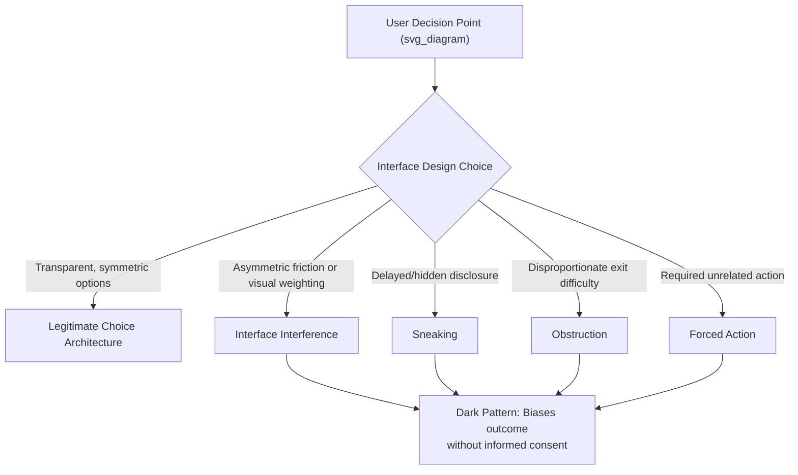

## Dark Patterns and Deceptive Interface Design

### Definitional Foundations

**Dark patterns** are user interface and user experience design choices that deliberately steer, coerce, or deceive users into taking actions that benefit the designing party — typically at the user's financial, informational, or temporal expense — by exploiting cognitive biases, attentional limitations, or interface conventions users rely on for efficient navigation. The term was coined by UX researcher Harry Brignull in 2010, who established the original taxonomy and public tracking site (darkpatterns.org).

**Deceptive interface design** is the broader regulatory and academic umbrella term (increasingly preferred in formal legal contexts, e.g., FTC materials) encompassing dark patterns alongside related manipulative design practices, used partly because "dark patterns" as a term originated in UX practitioner discourse rather than legal doctrine and required translation into actionable regulatory language.

**Relationship to the persuasion-manipulation distinction**: Dark patterns sit unambiguously on the manipulation side of the persuasion-manipulation continuum (see prior chapter item) — by near-universal definition and consensus, they are designed specifically to bypass or exploit user cognition rather than to engage it, distinguishing them from legitimate persuasive design (e.g., clear, honest calls-to-action).

### Historical and Intellectual Origins

**Origin and early taxonomy:**

- Harry Brignull's 2010 darkpatterns.org catalogued an initial set of named patterns (e.g., "Roach Motel," "Confirmshaming," "Privacy Zuckering") based on crowdsourced practitioner examples, establishing a shared vocabulary before formal academic or legal treatment existed
- The term deliberately borrowed "dark" framing to signal ethically illegitimate design, in contrast to conventional "light" UX practice focused on usability

**Academic formalization:**

- Mathur et al.'s large-scale empirical study (2019, "Dark Patterns at Scale") systematically scraped and categorized dark patterns across thousands of e-commerce sites, providing the first major quantitative evidence of prevalence and enabling academic taxonomy refinement
- Gray et al. (2018) proposed a strategies-based taxonomy organizing dark patterns by underlying manipulative mechanism (nagging, obstruction, sneaking, interface interference, forced action) rather than surface-level pattern names, improving cross-context generalizability
- The field has since been absorbed into HCI (human-computer interaction), consumer protection law, and behavioral economics literatures as a mainstream research area

**Regulatory formalization timeline:**

- FTC (U.S.) began explicit dark-pattern-focused enforcement and guidance in the early 2020s, including a dedicated 2022 staff report and subsequent enforcement actions
- EU: dark patterns are addressed both under the pre-existing Unfair Commercial Practices Directive (UCPD) and more explicitly under the Digital Services Act (DSA, fully applicable 2024) and Digital Markets Act (DMA), which contain direct dark-pattern provisions for online platforms
- California Consumer Privacy Act (CCPA) regulations explicitly define and prohibit dark patterns in the specific context of consent/opt-out mechanisms

  [Unverified — jurisdiction-specific and evolving] Given the pace of regulatory development in this area, specific current provisions and enforcement status should be verified against up-to-date sources for any jurisdiction-specific compliance question.

### Theoretical Frameworks

**Gray et al. strategies-based taxonomy (widely used organizing framework):**

| Strategy | Mechanism | Example Pattern |
| --- | --- | --- |
| Nagging | Repeated interruption to redirect user toward desired action | Repeated app permission or upgrade prompts |
| Obstruction | Making an undesired-by-the-firm action (e.g., cancellation) disproportionately difficult | Roach Motel (easy entry, difficult exit) |
| Sneaking | Concealing, disguising, or delaying disclosure of information relevant to user decision | Hidden costs added at final checkout step |
| Interface interference | Manipulating visual hierarchy/design to bias perception or action | Preselected options, visually de-emphasized "decline" buttons |
| Forced action | Requiring an unrelated or undesired action to access desired functionality | Forced account creation, forced social sharing to unlock content |

**Cognitive mechanisms exploited (mapping to behavioral economics):**

- **Default effects/status quo bias**: preselected checkboxes (e.g., pre-opted-in to marketing emails or add-on purchases) exploit the well-documented tendency to retain default options rather than actively change them
- **Framing effects**: asymmetric visual weighting of "accept" versus "decline" options exploits framing-dependent choice, a core finding of prospect theory (Kahneman and Tversky)
- **Loss aversion / confirmshaming**: guilt-inducing decline-option copy ("No thanks, I don't want to save money") exploits loss aversion and social-image concerns to discourage the non-default choice
- **Choice architecture asymmetry**: obstruction patterns (e.g., multi-step cancellation flows versus one-click signup) exploit friction asymmetry — a well-established finding that even small increases in transaction friction disproportionately suppress action relative to their apparent magnitude
- **Attentional scarcity**: sneaking patterns rely on the well-documented limits of sustained attention during multi-step processes (e.g., checkout flows), embedding costs or terms at points of predictably lowest user vigilance

**Named canonical patterns (illustrative, non-exhaustive):**

| Pattern Name | Description |
| --- | --- |
| Roach Motel | Easy to get into a commitment, disproportionately difficult to get out (e.g., one-click subscribe, multi-step phone-required cancellation) |
| Confirmshaming | Guilt- or shame-based copy on decline options to discourage opting out |
| Privacy Zuckering | Interface design that tricks users into sharing more personal data than intended |
| Sneak into Basket | Adding items/add-ons to a cart without explicit user action |
| Forced Continuity | Silently converting a free trial into a paid subscription without clear advance notice |
| Trick Questions | Ambiguous or double-negative phrasing designed to produce unintended responses |
| Hidden Costs | Revealing mandatory fees only at a late stage in the purchase flow (e.g., final checkout screen) |
| Disguised Ads | Advertisements designed to visually mimic organic content or navigation elements |

### Prevalence and Empirical Evidence

Mathur et al.'s 2019 large-scale scrape found dark patterns present across a substantial share of examined e-commerce websites, spanning multiple pattern categories simultaneously on many sites — providing the empirical foundation that shifted dark patterns from an anecdotal UX concern to a documented, measurable, industry-wide phenomenon. [Inference] Specific prevalence percentages from any single study should be treated as time- and sample-bound rather than a permanently current industry baseline, given both the study's specific scrape date and subsequent regulatory pressure that may have shifted practices in some markets; current-state prevalence claims should be checked against more recent research where precision matters.

### Managerial and Strategic Implications

**Short-term conversion lift versus long-term trust erosion:**

Dark patterns frequently demonstrate measurable short-term conversion or retention lift precisely because they suppress the deliberation that would otherwise reduce conversion (consistent with the persuasion-manipulation framework's prediction that manipulation "works" partly by preventing reflective evaluation). However, per the Persuasion Knowledge Model, once users detect the pattern, the resulting distrust frequently generalizes beyond the specific flow to overall brand trust, creating asymmetric risk: acute conversion gains against durable reputational and (increasingly) regulatory liability.

**Regulatory risk as a growing managerial constraint:**

Enforcement actions (FTC actions against forced-continuity subscription practices; EU DSA/DMA provisions on platform design; CCPA-specific dark pattern prohibitions in consent flows) have shifted dark patterns from a purely reputational risk to a direct legal compliance risk, requiring UX and legal/compliance functions to coordinate design review in ways not historically standard practice.

**Distinguishing legitimate persuasive design from dark patterns in practice:**

Not all friction or default-setting is a dark pattern — the determining factors (consistent with the diagnostic criteria in the prior chapter item) are:

- Whether the default/friction serves the user's own likely interest or only the firm's (e.g., a default privacy-protective setting is not a dark pattern even though it is a default; a default opt-in to data sharing that benefits only the firm is contested)
- Whether the mechanism would survive full disclosure to the user without provoking objection
- Whether asymmetry in effort/friction between opposing choices is proportionate or deliberately engineered

**Emerging design ethics practice:**

Organizations increasingly employ "dark pattern audits" during design review, using published taxonomies (Gray et al.; Mathur et al.) as structured checklists, alongside broader adoption of "ethical design" or "humane design" principles as a differentiation and risk-mitigation strategy, particularly in privacy-sensitive and subscription-based business models.

### Illustrative Example

A subscription meal-kit service's cancellation flow requires the following steps: log in, navigate to a non-obviously-labeled "Manage Membership" page (rather than "Cancel"), click through three confirmation screens each offering discount incentives to stay, and finally requires a phone call to a customer service line available only during limited business hours to complete cancellation — while the original signup flow required a single click. This exemplifies the **Roach Motel** pattern combined with **obstruction**: the structural asymmetry between entry and exit friction is disproportionate to any legitimate business need (e.g., fraud verification), fails the full-disclosure test (the company would not describe this flow neutrally as "equally easy to leave as to join"), and has been a specific target of FTC enforcement activity regarding negative-option and continuity subscription practices.

### Critiques and Open Debates

- **Definitional boundary disputes**: There is ongoing scholarly and regulatory debate about where legitimate persuasive design ends and dark patterns begin — for instance, whether default settings that merely reflect a firm's genuine business-model preference (rather than deliberate exploitation) should be classified as dark patterns, or whether the classification requires evidence of deceptive *intent* versus merely deceptive *effect*
- **Enforcement inconsistency across jurisdictions**: [Unverified — actively evolving] The absence of a single globally harmonized legal definition of dark patterns means the same design can be lawful in one jurisdiction and prohibited in another, creating compliance complexity for multinational digital businesses; specific cross-jurisdictional compliance requirements should be verified against current legal guidance
- **Automated detection limitations**: While researchers have developed automated dark-pattern-detection tools (extending Mathur et al.'s methodology), detecting patterns that rely on contextual or linguistic subtlety (e.g., confirmshaming copy, trick questions) remains a harder computational problem than detecting structural patterns (e.g., preselected checkboxes), leaving a gap between programmatic auditing capability and the full taxonomy's scope

**Related Topics**

- Persuasion Knowledge Model and manipulation detection (prior chapter item)
- Gray et al. and Mathur et al. dark pattern taxonomies in depth
- FTC Section 5 enforcement and negative-option/continuity subscription rules
- EU Digital Services Act and Digital Markets Act platform design provisions
- Nudge theory, choice architecture, and libertarian paternalism
- Default effects and status quo bias in behavioral economics
- Privacy-by-design and consent mechanism regulation (CCPA/GDPR-adjacent)
- Ethical/humane design practice and UX audit methodologies