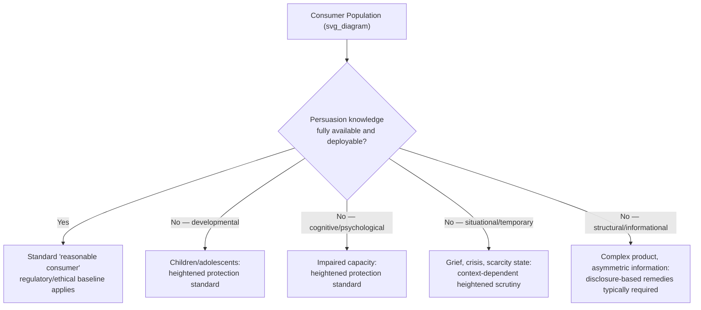

## Marketing to Vulnerable Populations

### Definitional Foundations

**Vulnerable consumers**, in marketing ethics and regulatory literature, are individuals or groups whose capacity for autonomous, informed, rational decision-making in a market context is diminished relative to the "average" or "reasonable" consumer assumed by conventional regulatory and ethical frameworks — whether due to developmental stage, cognitive/psychological characteristics, situational circumstance, or structural social position. Vulnerability in this context is a *relational and contextual* property (vulnerable to a specific type of marketing influence, in a specific situation) rather than a fixed, permanent trait of a person.

**Marketing to vulnerable populations** encompasses both the descriptive practice of targeting these groups (which may be entirely legitimate, e.g., diabetes management products marketed to diagnosed diabetics) and the ethically/legally contested subset of that practice involving exploitation of the vulnerability itself to reduce resistance, increase susceptibility to manipulation, or extract value the target would not consent to under conditions of full deliberative capacity.

**Key distinction — targeting vulnerable groups vs. exploiting vulnerability**: Marketing a genuinely needed product to a population that needs it (nutritional products to food-insecure populations) is categorically different from marketing a discretionary or harmful product by specifically leveraging the psychological characteristics that define the group's vulnerability (e.g., using children's difficulty distinguishing advertising from content to market low-nutrition food). The ethical and regulatory weight falls overwhelmingly on the latter.

### Historical and Intellectual Origins

**Regulatory lineage:**

- U.S. FTC's "reasonable consumer" standard historically assumed a rational, informationally-capable consumer baseline; explicit "vulnerable consumer" carve-outs (e.g., heightened scrutiny for advertising directed at children) developed incrementally through case law and rulemaking from the 1970s onward
- The FTC's 1978 attempt to restrict children's advertising (the so-called "KidVid" rulemaking) was a landmark early regulatory effort, ultimately curtailed by industry and congressional pushback, illustrating the long-standing political contestation around this area
- EU consumer protection law has more explicitly codified a tiered vulnerability standard: the Unfair Commercial Practices Directive (UCPD) assesses practices against the "average consumer" but explicitly requires a *more protective* standard when a practice is directed at, or reasonably foreseeably reaches, a "clearly identifiable group... particularly vulnerable" due to mental/physical infirmity, age, or credulity

**Academic and public health lineage:**

- Public health and consumer research on children's advertising (e.g., work by Deborah Roedder John on children's consumer socialization stages) established the developmental psychology basis for treating children as a categorically distinct vulnerability class rather than merely "smaller adults"
- Behavioral economics research on scarcity and cognitive load (notably Mullainathan and Shafir's *Scarcity*, 2013) provided a theoretical basis for treating financially stressed/low-income consumers as situationally vulnerable, independent of any permanent trait, since scarcity itself measurably narrows cognitive bandwidth available for deliberative evaluation
- Transformative Consumer Research (TCR) explicitly incorporated vulnerable consumer welfare as a core research priority from its mid-2000s founding

### Theoretical Frameworks

**Taxonomy of vulnerability types (synthesizing regulatory and academic categorizations):**

| Vulnerability Type | Basis | Example Population |
| --- | --- | --- |
| Developmental | Incomplete cognitive/psychological development | Children, adolescents |
| Cognitive/psychological | Diminished capacity due to condition | Individuals with cognitive impairment, certain mental health conditions, addiction |
| Situational/state-based | Temporary circumstance reducing deliberative capacity | Grief, acute financial distress, medical crisis, intoxication |
| Informational | Structural information asymmetry independent of personal capacity | Consumers navigating unfamiliar/complex financial or medical products |
| Socioeconomic | Structural resource constraint affecting decision bandwidth | Low-income, financially precarious consumers |
| Physical | Sensory, mobility, or health-based limitation affecting access to full information | Elderly consumers, consumers with disabilities |

[Inference] This taxonomy synthesizes overlapping categorizations used across regulatory (UCPD, FTC guidance) and academic (TCR, public health marketing) sources; no single canonical source uses precisely this six-category structure, and boundaries between categories are frequently blurred in practice (e.g., situational vulnerability can compound socioeconomic vulnerability).

**Children as a categorically distinct case — developmental psychology basis:**

Roedder John's consumer socialization framework identifies developmental stages relevant to advertising vulnerability:

- **Perceptual stage** (roughly ages 3–7): limited ability to distinguish advertising intent from program content; susceptibility driven primarily by inability to recognize persuasive intent at all
- **Analytical stage** (roughly ages 7–11): developing ability to recognize persuasive intent but limited capacity to apply skepticism consistently or resist affectively engaging appeals
- **Reflective stage** (roughly ages 11+): more adult-like capacity to recognize and critically evaluate persuasive intent, though full development continues into adolescence

This developmental basis underpins the near-universal regulatory consensus (reflected in most jurisdictions' advertising codes) that marketing directed at young children requires categorically different ethical and legal treatment than adult-directed marketing, since the "persuasion knowledge" that grounds the persuasion/manipulation distinction (see prior chapter items) is, by definition, underdeveloped or absent in this population.

**Scarcity and cognitive bandwidth theory (situational vulnerability):**

Mullainathan and Shafir's scarcity research demonstrates that financial scarcity measurably reduces available cognitive bandwidth for other decisions — not as a permanent trait but as a situational state induced by the scarcity condition itself. [Inference] This provides a strong theoretical basis for treating certain marketing practices targeted at financially stressed populations (e.g., aggressive payday lending marketing, high-pressure sales tactics timed to coincide with financial distress signals) as exploiting a genuine, measurable reduction in deliberative capacity — though direct experimental evidence isolating *marketing-specific* exploitation effects (as opposed to the general scarcity-cognition relationship) is a smaller and more targeted literature than the foundational scarcity research itself.

**Persuasion knowledge deficit as the unifying mechanism:**

Across nearly all vulnerability types in this taxonomy, the common underlying mechanism connecting back to the Persuasion Knowledge Model (Friestad and Wright, covered in the "Persuasion versus Manipulation" item) is a **deficit in persuasion knowledge or the capacity to deploy it** — whether due to developmental immaturity (children), impaired processing (cognitive/psychological vulnerability), reduced cognitive bandwidth (situational/socioeconomic vulnerability), or genuine informational asymmetry the target cannot close (informational vulnerability). This gives the vulnerability literature a direct theoretical bridge to the broader persuasion/manipulation and dark-patterns frameworks covered elsewhere in this chapter.

### Regulatory Frameworks in Practice

**EU Unfair Commercial Practices Directive (UCPD) — "particularly vulnerable" standard:**

The UCPD explicitly requires that when a commercial practice is directed at, or reasonably foreseeably reaches, a clearly identifiable vulnerable group, the practice's fairness is assessed from the perspective of the *average member of that vulnerable group*, not the general average consumer — a materially more protective standard than the general baseline.

**U.S. sector-specific vulnerability regulation (rather than a unified vulnerability doctrine):**

The U.S. approach is comparatively fragmented, addressing vulnerability through sector-specific rules rather than an overarching vulnerable-consumer standard:

- Children's Online Privacy Protection Act (COPPA) — specific protections for children's data collection
- FTC guidance and enforcement on advertising to children (self-regulatory, via the Children's Advertising Review Unit/CARU, supplemented by targeted FTC action)
- Truth in Lending Act and related financial regulations addressing informational and situational vulnerability in credit marketing

  [Unverified — evolving] Specific current regulatory requirements in fast-moving areas (e.g., AI-driven targeting of vulnerable groups, algorithmic advertising to minors on social platforms) should be checked against current regulatory guidance given active legislative attention in this space.

### Managerial and Strategic Implications

**Legitimate vs. exploitative targeting — a practical decision framework:**

Extending the diagnostic criteria from the persuasion/manipulation item, marketing to a vulnerable population is more likely to be ethically and legally defensible when:

- The product/service genuinely serves the population's disclosed need (rather than being discretionary or harmful)
- The marketing communication is calibrated to the population's actual comprehension capacity (simplified, clear, non-exploitative framing)
- The tactic would survive full disclosure to a neutral third party without provoking objection
- The firm does not specifically design the tactic to exploit the characteristic that defines the vulnerability (e.g., using a cognitively impaired population's difficulty with numerical comparison to obscure true cost, versus simply making information available in accessible formats)

**Reputational and regulatory risk asymmetry:**

Marketing practices perceived as exploiting vulnerable populations (predatory lending, aggressive marketing to grieving families, manipulative advertising to children) generate disproportionate reputational, legal, and regulatory consequences relative to comparable practices directed at general populations, reflecting both stronger legal protections and stronger normative social sanction — a risk-calculus firms increasingly must incorporate into targeting and creative review processes, particularly given expanding micro-targeting capability that makes precise vulnerability-based targeting technically easier than in the mass-media era.

**Emerging concern — algorithmic vulnerability inference:**

[Inference] Modern behavioral targeting infrastructure can infer situational vulnerability (e.g., detecting behavioral signals correlated with financial distress, grief, or health crisis) at a granularity and scale not previously possible, raising a distinct and comparatively new ethical/regulatory concern: firms may be able to identify and target vulnerability states even without the consumer disclosing them, a capability that existing vulnerability-protection frameworks (largely developed in a pre-programmatic-advertising era) were not originally designed to address. This is a genuinely emerging area rather than a settled regulatory or academic consensus point.

### Illustrative Example

A financial services firm uses behavioral ad-targeting data correlated with recent major life events (a proxy signal sometimes inferable from public social media activity or data broker information) to specifically target individuals who have recently experienced bereavement with high-interest short-term loan advertisements, timed to coincide with funeral-related expenses. This satisfies multiple markers of the exploitative rather than legitimate end of the vulnerability spectrum: it targets a *situational* vulnerability (acute grief, documented in psychological literature to impair deliberative decision-making) specifically because of the vulnerability rather than incidentally; it would very likely fail a full-disclosure test (the firm would be unlikely to describe the targeting logic transparently to the target); and it exploits, rather than accommodates, the population's diminished capacity.

### Critiques and Open Debates

- **Definitional breadth risk**: Overly broad vulnerability categorization (treating very large population segments — e.g., "all low-income consumers," "all elderly consumers" — as uniformly and permanently vulnerable) risks both paternalism and commercially unworkable regulatory scope; most rigorous frameworks emphasize the *situational and contextual* nature of vulnerability specifically to avoid this overreach
- **Self-regulation vs. binding regulation debate**: Industry self-regulatory bodies (e.g., CARU in the U.S. for children's advertising) are argued by critics to have structurally insufficient enforcement incentives relative to binding statutory regulation (e.g., the EU's more codified UCPD vulnerability standard), an ongoing point of comparative regulatory-policy debate
- **Intersectionality and compounding vulnerability**: Emerging scholarship increasingly examines how multiple vulnerability types compound (e.g., an elderly, low-income, cognitively declining consumer targeted by predatory financial marketing simultaneously implicates developmental/cognitive, socioeconomic, and physical vulnerability categories), a dimension existing single-category regulatory frameworks are not always well-equipped to address holistically

**Related Topics**

- Persuasion Knowledge Model and consumer socialization theory (Roedder John)
- Dark patterns and deceptive interface design (prior chapter item)
- Children's advertising regulation (COPPA, CARU, UCPD age-specific provisions)
- Scarcity and cognitive bandwidth theory (Mullainathan and Shafir)
- Behavioral targeting, data brokers, and algorithmic vulnerability inference
- Predatory lending marketing and financial services consumer protection
- Transformative Consumer Research (TCR) as a research paradigm
- Persuasion versus manipulation: drawing the line (prior chapter item)