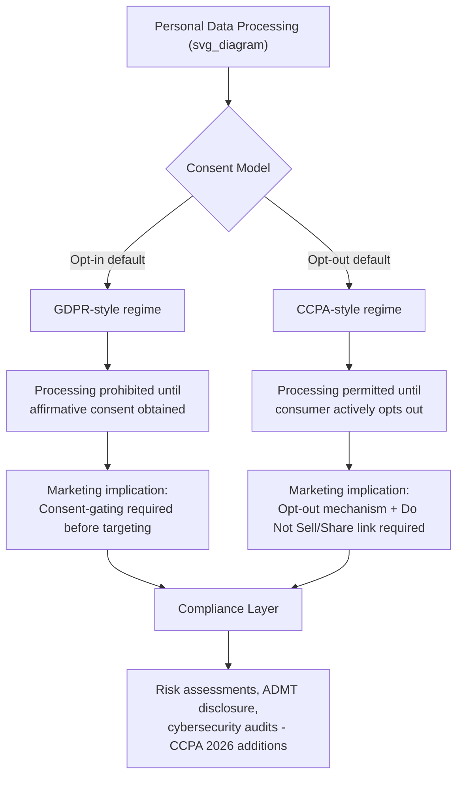

## Global Privacy and Consumer-Protection Frameworks

### Definitional Foundations

**Privacy and consumer-protection frameworks**, in the marketing ethics context, refer to the body of statutory, regulatory, and enforcement regimes governing how firms may collect, process, use, and share consumer personal data, and the associated consumer rights (access, correction, deletion, opt-out) these regimes create. For marketing practice specifically, these frameworks govern the legal boundary conditions within which behavioral targeting, personalization, and data-driven marketing tactics discussed elsewhere in this chapter (dark patterns, manipulation, vulnerable-population targeting) must operate.

**Key structural distinction across major regimes**: the fundamental design choice separating most frameworks is the **consent model** — whether personal data processing defaults to permitted-unless-restricted (**opt-out**) or prohibited-unless-affirmatively-consented (**opt-in**). This single structural choice cascades into most of the practical compliance and marketing-practice differences across jurisdictions.

### Historical and Intellectual Origins

**European lineage (the global benchmark-setter):**

- The EU's **General Data Protection Regulation (GDPR)**, effective May 2018, is widely regarded as the strictest and most influential global privacy framework, establishing an opt-in consent model, extraterritorial reach (applying to any organization processing EU residents' data regardless of company location), and penalties up to 4% of global annual turnover, having been the global benchmark for data privacy since taking effect in May 2018 and establishing a unified, comprehensive framework across all EU member states and EEA countries [Legiseye](https://legiseye.com/blog/us-vs-eu-data-privacy)
- GDPR's foundational principles include lawfulness/fairness/transparency, purpose limitation, and data minimization, requiring data to be processed lawfully with clear communication about its use, collected only for specified and legitimate purposes, and limited to what is necessary for that purpose [Legiseye](https://legiseye.com/blog/us-vs-eu-data-privacy)

**U.S. lineage (sectoral and increasingly state-driven):**

- The U.S. has historically lacked a comprehensive federal privacy statute, instead relying on sector-specific federal law (e.g., COPPA for children, HIPAA for health) combined with FTC Section 5 unfairness/deception enforcement
- California's **CCPA** (effective 2020), later expanded by the **CPRA**, established the first major U.S. comprehensive state-level framework, using an opt-out modelwhere businesses can collect and process personal information by default and consumers must actively opt out of data sales or sharing, in direct contrast to GDPR's general requirement of opt-in consent before processing begins [Legiseye](https://legiseye.com/blog/us-vs-eu-data-privacy)
- This state-level model has since proliferated rapidly: twenty states now have comprehensive consumer privacy laws on the books as of the current tracking period, with Indiana, Kentucky, and Rhode Island becoming the most recent additions, effective January 1, 2026 [Clym](https://www.clym.io/blog/us-privacy-law-comparison-map)

**Global proliferation beyond the EU/US axis:**

As of 2026, 144 countries have enacted national data privacy laws, with several non-Western frameworks now rivaling or exceeding GDPR's stringency in specific dimensions — China's PIPL matches or exceeds GDPR in areas including data localization requirements, mandatory cross-border transfer assessments, and fines reaching up to 5% of revenue. [CDP](https://cdp.com/basics/international-u-s-data-privacy-laws-and-regulations-you-need-to-know/)[CDP](https://cdp.com/basics/international-u-s-data-privacy-laws-and-regulations-you-need-to-know/)

### Comparative Framework Structure

| Dimension | GDPR (EU) | CCPA/CPRA (California) | China PIPL |
| --- | --- | --- | --- |
| Consent model | Opt-in | Opt-out (for sale/sharing) | Opt-in (generally stricter) |
| Extraterritorial reach | Yes — applies globally to any processor of EU resident data | California residents only | Broad, with strict data localization |
| Maximum penalty | Up to 4% of global annual turnover or €20M | $7,500 per intentional violation, scaling with volume | Up to 5% of revenue |
| Cross-border transfer restriction | Strict (adequacy decisions, SCCs, BCRs) | No restrictions — a California business may transfer personal information to any country | Strict, with mandatory assessments |
| Dedicated regulator | National DPAs + European Data Protection Board | California Privacy Protection Agency (CPPA) | Cyberspace Administration of China |

A GDPR-compliant program generally satisfies most CCPA/CPRA baseline requirements since GDPR is the stricter framework overall, but several CCPA/CPRA-specific obligations have no GDPR equivalent — including the "Do Not Sell or Share" mechanism, financial-incentive disclosure requirements, and automated decision-making technology (ADMT) opt-out rights, meaning full multi-jurisdictional compliance requires explicit attention to each regime's distinctive provisions rather than assuming the strictest framework provides blanket coverage. [Recording Law](https://www.recordinglaw.com/world-laws/world-data-privacy-laws/gdpr-vs-ccpa/)

### Theoretical Frameworks

**Notice-and-choice paradigm and its critique:**

Most privacy frameworks historically rested on a "notice-and-choice" theoretical foundation — the assumption that disclosing data practices and providing an opt-in/opt-out mechanism satisfies consumer autonomy interests. This paradigm has faced sustained academic critique (converging with the dark-patterns literature discussed earlier in this chapter) on grounds that:

- Consent mechanisms are frequently designed using interface-interference and sneaking patterns that undermine genuinely informed consent
- Information asymmetry between firms and consumers regarding the actual downstream uses of collected data makes fully informed consent practically unattainable for most consumers
- The cumulative burden of evaluating privacy notices across the many services an average consumer uses exceeds any realistic attention budget, a problem sometimes termed "consent fatigue"

**Fair Information Practice Principles (FIPPs):**

Most modern frameworks (GDPR, CCPA, and the broader global regulatory landscape) trace their substantive principles to the FIPPs tradition (originating in U.S. policy work from the 1970s): notice, choice/consent, access, security, and enforcement/accountability — providing a shared conceptual vocabulary even where specific legal implementation (opt-in vs. opt-out, penalty structure) diverges sharply.

**Privacy as a spectrum of legal-cultural values:**

[Inference] The GDPR/CCPA divergence is often explained in comparative law and policy literature as reflecting differing baseline philosophical treatments of data — EU law treating data protection as a fundamental rights matter (reflected in its opt-in default and constitutional-level grounding via the EU Charter of Fundamental Rights), versus U.S. law historically treating privacy more as a consumer-protection and market-transparency matter (reflected in disclosure-and-opt-out defaults) — though this is a broad characterization useful for orientation rather than a precise doctrinal claim, and both regimes have moved toward each other over time (CPRA's expansion toward GDPR-like obligations being a notable example).

### Recent Regulatory Developments (2025–2026)

The compliance landscape has shifted substantially toward **operational governance** requirements beyond baseline disclosure, particularly in California: California's CCPA regulation package, effective January 1, 2026, shifted the law from disclosure requirements toward operational governance, requiring businesses to complete a risk assessment before selling or sharing personal data, processing sensitive personal data, or deploying certain automated technologies. Enforcement has correspondingly intensified: California issued its largest CCPA fine to date in 2025, alongside new automated decision-making, cybersecurity audit, and risk assessment requirements effective January 2026. [CDP](https://cdp.com/basics/international-u-s-data-privacy-laws-and-regulations-you-need-to-know/)[Kiteworks](https://www.kiteworks.com/regulatory-compliance/global-data-privacy-laws-2026/)

At the U.S. state level generally, nineteen to twenty states now have comprehensive consumer privacy laws in effect as of January 2026, with Indiana, Kentucky, and Rhode Island most recently taking effect, and California, Colorado, Connecticut, Oregon, and Utah all implementing amendments expanding obligations across 2025 and 2026. This state-by-state proliferation, absent a unifying federal statute, has created significant compliance fragmentation: organizations operating across more jurisdictions experience measurably higher incident rates, driven by separate compliance programs, separate incident response plans, and disconnected audit logs across regions that produce inconsistent disclosures regulators actively document and penalize. [Kiteworks](https://www.kiteworks.com/regulatory-compliance/global-data-privacy-laws-2026/)[Kiteworks](https://www.kiteworks.com/regulatory-compliance/global-data-privacy-laws-2026/)

[Unverified — this is an active and fast-moving regulatory area] Given the pace of change evident even within 2025–2026 alone, any specific compliance deadline, penalty figure, or state-count claim above should be re-verified against current sources before being relied upon for an actual compliance decision, rather than treated as a stable long-term reference point.

### Managerial and Strategic Implications for Marketing Practice

**Consent architecture as a marketing-design constraint:**

The opt-in/opt-out divergence directly shapes marketing technology architecture: GDPR-covered operations must design consent-gating *before* tracking/targeting begins (pre-consent cookie walls, granular consent management platforms), while CCPA-style regimes permit default tracking subject to an accessible opt-out mechanism — meaning global marketing operations typically require geofenced, jurisdiction-aware consent experiences rather than a single global default, an approach exemplified by consent management platforms that use location-based detection to identify each visitor's regulatory context and serve the appropriate consent experience automatically, such that a California visitor sees a CCPA-compliant experience while a different state's visitor sees what that jurisdiction's law requires. [Clym](https://www.clym.io/blog/us-privacy-law-comparison-map)

**Automated decision-making and targeted advertising scrutiny:**

The 2026 California regulatory expansion specifically targets automated decision-making technology (ADMT) used in significant consumer decisions and large-scale profiling/targeted advertising with mandatory risk assessments, requiring businesses to conduct formal privacy risk assessments before engaging in processing that presents significant risk to consumers, including sensitive data use, large-scale profiling, and targeted advertising — directly implicating the behavioral micro-targeting practices discussed in the dark-patterns and manipulation items earlier in this chapter, since regulatory scrutiny increasingly treats sophisticated targeting infrastructure itself as a risk factor requiring proactive assessment rather than only after-the-fact enforcement. [Uscomplianceinstitute](https://uscomplianceinstitute.com/blogs/news/gdpr-vs-ccpa-explained-which-privacy-law-is-stricter-and-why-it-matters)

**Global Privacy Control (GPC) and browser-level signals:**

An emerging compliance dimension requires honoring browser-transmitted opt-out preference signals automatically, with California law requiring businesses to honor browser-based opt-out signals such as Global Privacy Control — shifting some compliance burden from individual site-level consent interfaces to browser/device-level infrastructure, with direct implications for how marketing technology stacks must ingest and respect these signals across a consumer's entire browsing context rather than per-site. [Legiseye](https://legiseye.com/blog/us-vs-eu-data-privacy)

**Cross-border data transfer as a distinct marketing operations constraint:**

Firms running global marketing data infrastructure (customer data platforms, cross-border personalization systems) face materially different transfer restrictions by regime: GDPR strictly regulates transfers of personal data outside the EEA, permitting transfers only to countries with an EU adequacy decision or through mechanisms such as Standard Contractual Clauses, Binding Corporate Rules, or the EU-US Data Privacy Framework, a materially heavier compliance burden than California's regime, which imposes no equivalent international transfer restriction. [Recording Law](https://www.recordinglaw.com/world-laws/world-data-privacy-laws/gdpr-vs-ccpa/)

### Illustrative Example

A global e-commerce marketer operating a unified customer data platform for personalized email and retargeting campaigns must architect distinct data-handling flows by visitor jurisdiction: an EU visitor's data requires prior opt-in consent before any tracking pixel fires and cannot be transferred to a non-adequate-country data warehouse without a valid transfer mechanism in place; a California visitor's data may be collected by default for marketing purposes but must be excluded from "sale or sharing" (including many third-party ad-network integrations) immediately upon the visitor exercising an opt-out, and any use of automated audience-scoring or lookalike-modeling technology touching that visitor's profile now falls under the 2026 California risk-assessment and ADMT disclosure requirements; a visitor in a state without comprehensive privacy legislation may, absent other applicable law (e.g., COPPA if a minor), receive the firm's baseline data practices with comparatively fewer jurisdiction-specific constraints — illustrating why "one global privacy policy" is generally an inadequate compliance strategy for any marketing operation with meaningful multi-jurisdictional reach.

### Critiques and Open Debates

- **Fragmentation cost versus harmonization benefit**: The proliferation of state-by-state and country-by-country frameworks, absent a unifying federal U.S. statute, is widely critiqued as imposing disproportionate compliance cost on smaller firms relative to large incumbents with dedicated compliance infrastructure — a dynamic reflected in documented higher incident rates among organizations operating across more jurisdictions, driven by separate and disconnected compliance programs rather than by any single jurisdiction's substantive requirements being unreasonable in isolation [Kiteworks](https://www.kiteworks.com/regulatory-compliance/global-data-privacy-laws-2026/)
- **Consent-fatigue and the limits of notice-and-choice**: As noted above, the proliferation of consent banners and disclosure mechanisms across an ever-growing number of digital touchpoints raises the question of whether the notice-and-choice paradigm can scale to genuinely informed consent at all, connecting directly to the dark-patterns critique that consent mechanisms themselves are frequently designed to minimize rather than maximize genuine deliberation
- **Enforcement asymmetry and effective versus nominal protection**: [Inference] Even robust statutory frameworks depend heavily on regulatory enforcement capacity and priorities; jurisdictions with comprehensive statutes but limited enforcement resources may provide substantially weaker practical consumer protection than the statutory text alone would suggest, though systematically comparing enforcement intensity across the full global landscape of 144+ national frameworks is beyond what current tracking sources comprehensively document

**Related Topics**

- Dark patterns in consent interface design (prior chapter item)
- FTC Section 5 unfairness/deception doctrine and cross-agency enforcement coordination
- Automated decision-making technology (ADMT) and algorithmic accountability
- Global Privacy Control and browser-level privacy signal infrastructure
- Cross-border data transfer mechanisms (SCCs, BCRs, adequacy decisions)
- Fair Information Practice Principles (FIPPs) as a comparative-law foundation
- Marketing to vulnerable populations and targeted-advertising risk assessment (prior chapter item)
- Customer data platform architecture and jurisdiction-aware consent management