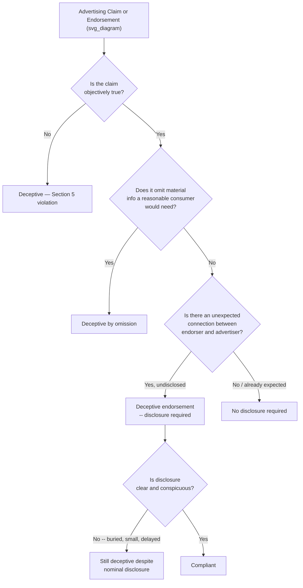

## Truth-in-Advertising and Disclosure Requirements

### Definitional Foundations

**Truth-in-advertising** law refers to the body of regulatory doctrine requiring that advertising claims be truthful, non-misleading, and substantiated before dissemination — the foundational legal baseline beneath the more specialized topics addressed elsewhere in this chapter (manipulation, dark patterns, vulnerable-population targeting, and privacy). In the U.S., this doctrine is anchored primarily in **Section 5 of the FTC Act**, which prohibits "unfair or deceptive acts or practices in or affecting commerce."

**Disclosure requirements** are the specific affirmative obligations imposed on advertisers to reveal material information — connections, limitations, risks, or context — that a reasonable consumer would need in order to avoid being misled by an otherwise-true claim or endorsement. Disclosure doctrine addresses the class of deception that arises not from false statements but from **material omission**: a literally true claim can still be legally deceptive if it omits information a reasonable consumer would consider relevant to their decision.

**Two core legal tests underlying most enforcement:**

1. **Deception test**: a representation, omission, or practice is deceptive if it is likely to mislead a reasonable consumer acting reasonably under the circumstances, and the representation is material (likely to affect the consumer's decision)
2. **Substantiation doctrine**: advertisers must possess a reasonable basis — typically competent and reliable scientific or other objective evidence — for any objective claim *before* making it, not merely be prepared to defend the claim if later challenged

### Historical and Intellectual Origins

**Foundational federal framework:**

- The FTC Act (1914, with Section 5 unfairness/deception authority significantly clarified through subsequent case law and FTC policy statements in the 1980s) established the core federal deception and unfairness doctrine still governing advertising today
- The FTC's authority extends across "TV, print, radio, online, podcasts, social media" and any other medium — the Endorsement Guides and truth-in-advertising doctrine apply medium-neutrally rather than being tied to any specific channel

**Endorsement Guides lineage — the most actively evolving disclosure doctrine:**

- The FTC's **Guides Concerning the Use of Endorsements and Testimonials in Advertising** (16 CFR Part 255) were last substantively revised in 2009 prior to a major 2023 update, undertaken specifically because the Commission sought public comment starting in May 2022 to reflect how advertisers now reach consumers through social media and online reviews, a channel landscape the 2009 version predated
- The finalized 2023 revision updated the Guides to reflect the ways advertisers now reach consumers to promote products and services, including through social media and reviews, marking the most significant modernization of endorsement disclosure doctrine in over a decade
- Most recently, the FTC published staff guidance in March 2025 specifically addressing AI-generated advertising content, extending truth-in-advertising and disclosure principles into a previously unaddressed technical context

### Theoretical Frameworks

**The "clear and conspicuous" disclosure standard:**

The FTC's operative standard for adequate disclosure requires that disclosures be difficult to miss and easy to understand — a formulation directly drawn from the FTC's own Endorsement Guides language. This standard has several practical sub-components frequently cited in FTC guidance and enforcement:

- **Proximity and placement**: the disclosure must appear before or alongside the claim it qualifies, not buried after extensive unrelated content — buried text, small fonts, or disclosures tucked after several hashtags do not meet the clear-and-conspicuous standard
- **Unavoidability**: the disclosure must appear where the audience encounters the endorsement, not require additional clicks or actions to discover
- **Platform-tool insufficiency**: built-in platform disclosure tools, such as a social media platform's native "Paid Partnership" tag, may not by themselves satisfy the standard if not sufficiently prominent or if consumers do not reliably understand what the tag signifies

**Materiality and the "unexpected connection" doctrine:**

Not every relationship between an endorser and an advertiser requires disclosure — the governing principle is whether the connection is *unexpected* by the audience. If the audience already reasonably expects a connection to exist, the lack of disclosure does not deceive them, and the Commission cannot require disclosure of every connection consistent with Section 5 doctrine. The frequently cited illustrative example: if a film star endorses a food product in a television commercial, disclosure of payment is unnecessary because audiences ordinarily already expect celebrities to be paid for such appearances. This materiality-contingent framing means disclosure obligations are context-dependent rather than governed by a single categorical rule, and FTC staff guidance itself acknowledges that guidance in this area cannot be fully definitive because it depends heavily on evolving consumer understanding and context.

**Liability allocation — advertiser and endorser both exposed:**

A structurally important feature of current doctrine: both the underlying advertiser and the individual endorser/influencer can be held liable for a given violation, but for analytically distinct reasons. If an advertiser lacks adequate substantiation for an implied claim, the advertiser is liable regardless of the endorser's own conduct; separately, the influencer and advertiser may both be liable if the influencer fails to disclose clearly and conspicuously that they were paid for the endorsement. This dual-liability structure creates an affirmative duty on advertisers to actively manage endorser compliance rather than simply disclaiming responsibility for third-party content: advertisers are expected to provide guidance to influencers on truthful, substantiated statements and disclosure of unexpected material connections, and to monitor influencer compliance, removing and halting continued publication of deceptive representations when discovered.

### Substantiation Requirements in Detail

Beyond endorsement-specific disclosure, advertisers must independently verify that all factual claims in their advertisements are truthful and substantiated — meaning that before making a claim, companies should possess a reasonable basis, often requiring scientific evidence or other objective support, established *prior* to publication rather than assembled defensively after a challenge arises. This substantiation requirement applies to objective, verifiable claims (efficacy, safety, performance comparisons) rather than to non-verifiable opinion or puffery, a distinction that itself generates recurring enforcement and litigation activity over where ordinary marketing enthusiasm ends and an actionable factual claim begins.

### Contemporary Enforcement Focus Areas (as of 2025–2026)

**Influencer and social media endorsement disclosure** remains the single most active enforcement growth area, reflecting the channel shift the 2023 Guides revision was designed to address. Enforcement guidance frames the underlying rationale plainly: if someone is paid, gifted, or otherwise connected to a brand they are promoting, their audience has a right to know, and hiding that relationship is treated as deceptive without qualification.

**Fake and incentivized reviews** are treated as a distinct, aggressively pursued deceptive-endorsement category, encompassing reviews purchased on third-party platforms, reviews incentivized with discounts or free products without disclosure, and fabricated reviews more broadly — reflecting the Commission's explicit 2023 Guides update addressing manipulated or fabricated consumer reviews as a named concern.

**AI-generated content disclosure** is the newest doctrinal extension, with March 2025 FTC staff guidance establishing three core principles for AI use in advertising: first, that the use of AI tools to generate or substantially modify advertising content should be disclosed to consumers; second, that claims made by AI-generated content must be truthful and substantiated exactly as claims made by human-created content, with the use of AI providing no excuse for false or misleading statements; and third, that if AI generates what appears to be a personal endorsement or testimonial, the AI's involvement must be clearly disclosed, with fully fake AI-generated reviews and testimonials treated as deceptive regardless of any disclosure attached to them — meaning disclosure cannot cure an entirely fabricated endorsement, only a genuine claim's insufficiently disclosed context.

**Heightened scrutiny for child-directed advertising** persists as a distinct compliance tier within disclosure doctrine, reflecting the same developmental-capacity rationale discussed in the vulnerable-populations item earlier in this chapter — regulatory guidance specifically calls for stricter expectations around disclosures that children can actually understand, not merely disclosures that satisfy the general reasonable-consumer standard.

**Enforcement penalty escalation**: [Inference] Publicly reported penalty figures and enforcement-action counts (e.g., specific dollar amounts or numbers of companies contacted in a given year) are time-bound to their reporting period and should be treated as illustrative of enforcement intensity trends rather than as a current, static reference figure, given both the pace of new enforcement actions and this being an active regulatory area; a documented example illustrating the scale such penalties can reach involved a multi-million-dollar fine against major media companies over undisclosed, scripted radio endorsements presented as genuine testimonials, with per-incident civil penalty authority separately available to the Commission for Endorsement Guide violations.

### Managerial and Strategic Implications

**Pre-publication compliance workflow as risk mitigation:**

FTC staff guidance explicitly recommends that companies pre-approve influencer content before publication rather than relying solely on after-the-fact monitoring, on the reasoning that review before posting is more effective than searching for problematic posts afterward; guidance further notes there is no one-size-fits-all standard, and companies unable to sustain regular post-publication monitoring should shift toward mandatory pre-approval processes instead.

**Structural disclosure design over reliance on platform defaults:**

Because native platform disclosure tools may be insufficient on their own, brands bear independent responsibility for ensuring disclosure prominence and comprehensibility rather than assuming platform-provided tagging mechanisms alone satisfy the clear-and-conspicuous standard — this has direct implications for creative and legal review workflows, requiring case-by-case evaluation of placement, font size, and timing relative to platform-specific viewing patterns (e.g., ephemeral story formats versus persistent feed posts).

**Convergence with the manipulation and dark-patterns frameworks:**

Truth-in-advertising and disclosure doctrine functions as the foundational legal layer beneath the more conceptually elaborated manipulation and dark-patterns frameworks discussed earlier in this chapter — a dark pattern that conceals material cost information, or a manipulative tactic that creates false urgency, is frequently *also* independently actionable as a straightforward deceptive-practices violation under core Section 5 doctrine, meaning practitioners should treat these frameworks as overlapping and mutually reinforcing compliance lenses rather than as addressing entirely separate legal risks.

### Illustrative Example

A skincare brand sends a free product sample to a social media creator with no additional compensation attached. Under current Endorsement Guides doctrine, even an unsolicited free gift constitutes a material connection requiring disclosure: the brand should ask the creator to clearly and conspicuously disclose the gift in any resulting posts, specify how the disclosure should be presented, and request that the brand be tagged — with the brand bearing an ongoing obligation to monitor the resulting tagged posts for compliance rather than treating the initial instruction as sufficient on its own. If the creator's resulting post also includes an efficacy claim ("cleared my skin in a week") without the brand possessing substantiation for that specific outcome, the brand faces independent liability for the unsubstantiated claim regardless of whether the gift-disclosure itself was handled correctly — illustrating the dual-liability structure in practice.

### Critiques and Open Debates

- **Guidance versus binding rule status**: The Endorsement Guides themselves are not formal regulations but rather agency guidance — non-compliance does not itself constitute a per se violation, but signals to the Commission that an investigation into potentially unfair or deceptive practices under the broader FTC Act may be warranted, a two-step enforcement structure that some practitioners and commentators argue creates interpretive uncertainty relative to a directly binding rule
- **Contextual dependency limits predictability**: FTC staff have explicitly acknowledged that guidance in this area cannot be fully definitive because determining whether disclosure is needed, and whether a given disclosure is sufficient, depends heavily on context, evolving consumer understanding, and behavior that may change over time — creating an inherent tension between the legal system's need for predictable compliance standards and the fact-specific, evolving nature of what "reasonable consumer" understanding actually looks like across new media formats
- **Rulemaking-versus-guidance critique**: Some public commenters on the 2023 Endorsement Guides revision argued the Commission was effectively using non-binding Guides to regulate industry practice (e.g., customer review moderation) in a manner more properly suited to formal rulemaking procedure, and raised related questions about the interaction between endorsement-disclosure expectations and platform immunity doctrines (e.g., Section 230 of the Communications Decency Act) governing user-generated review moderation — an area of unresolved doctrinal tension rather than settled law

**Related Topics**

- Persuasion versus manipulation and the reasonable-consumer standard (earlier chapter item)
- Dark patterns and deceptive interface design (earlier chapter item)
- FTC substantiation doctrine and the objective-claim versus puffery distinction
- Influencer marketing compliance workflows and pre-approval processes
- AI-generated content disclosure and synthetic endorsement regulation
- Global privacy and consumer-protection frameworks (earlier chapter item, comparative regulatory lens)
- Marketing to vulnerable populations and child-directed disclosure standards
- Section 230 and platform liability for user-generated review content