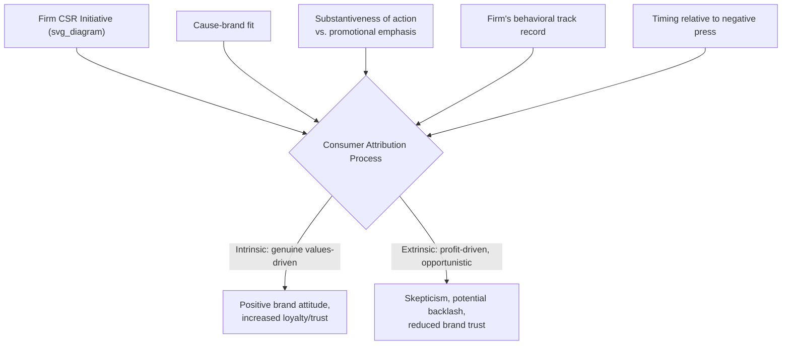

## Corporate Social Responsibility and Stakeholder Ethics

### Definitional Foundations

**Corporate Social Responsibility (CSR)** refers to the voluntary integration of social, environmental, and ethical considerations into corporate strategy and operations, beyond what is legally mandated, encompassing a firm's obligations to constituencies affected by its activities beyond shareholders alone. In marketing specifically, CSR manifests both as a substantive operational commitment (supply chain labor standards, environmental practices, community investment) and as a communicated positioning strategy (cause marketing, purpose-driven branding, sustainability messaging) — a distinction central to nearly all critical analysis in this domain.

**Stakeholder theory**, most closely associated with R. Edward Freeman's foundational 1984 work *Strategic Management: A Stakeholder Approach*, provides CSR's dominant organizing theoretical framework: the claim that management has ethical and strategic obligations to all parties affected by or able to affect the firm's objectives — including employees, customers, suppliers, communities, and the environment — not merely to shareholders, directly challenging the narrower **shareholder primacy** model associated with Milton Friedman's 1970 doctrine that "the social responsibility of business is to increase its profits."

**Key conceptual tension underlying this entire topic**: whether CSR represents a genuine reprioritization of corporate purpose toward broader social welfare, or whether it functions instrumentally as a means to shareholder-value maximization via reputation, risk mitigation, and customer loyalty — a tension that recurs across nearly every theoretical and managerial debate addressed below.

### Historical and Intellectual Origins

**Pre-stakeholder-theory foundations:**

- Early 20th-century corporate philanthropy and "corporate conscience" discourse (e.g., Andrew Carnegie's "Gospel of Wealth," 1889) established a philanthropic, largely separate-from-core-operations model of business social obligation
- Howard Bowen's *Social Responsibilities of the Businessman* (1953) is widely credited as the founding academic text of modern CSR scholarship, framing social responsibility as an obligation businesspeople owe society given the broad societal impact of their decisions

**The shareholder-primacy counter-doctrine:**

- Milton Friedman's 1970 *New York Times Magazine* essay articulated the most influential counter-position: that corporate executives spending shareholder resources on social causes beyond profit maximization constitutes an illegitimate tax the executive has no democratic mandate to impose, a position that dominated much of mainstream corporate governance theory through the late 20th century

**Stakeholder theory formalization and CSR pyramid frameworks:**

- Freeman's 1984 stakeholder framework provided the theoretical architecture subsequently used to justify expanded CSR obligations on both ethical and strategic-instrumental grounds
- Archie Carroll's **CSR Pyramid** (1991) became one of the most widely taught organizing frameworks, decomposing CSR into four hierarchical layers of obligation

**Contemporary evolution — from CSR to ESG and purpose-driven branding:**

- The 2000s–2010s saw CSR terminology increasingly absorbed into or supplemented by **ESG (Environmental, Social, Governance)** frameworks, driven substantially by the investment community's need for standardized, quantifiable non-financial performance metrics rather than by marketing or ethics scholarship
- The Business Roundtable's 2019 "Statement on the Purpose of a Corporation," signed by nearly 200 major U.S. CEOs, explicitly repudiated strict shareholder primacy in favor of a formal multi-stakeholder commitment — a highly visible, though contested, institutional milestone in the shareholder-versus-stakeholder debate

### Theoretical Frameworks

**Carroll's CSR Pyramid (four-layer hierarchy):**

| Layer | Obligation Type | Description |
| --- | --- | --- |
| Economic | Foundational, required | Be profitable; the base obligation enabling all others |
| Legal | Required | Obey laws and regulations governing business conduct |
| Ethical | Expected, not required | Act in ways consistent with societal moral norms, even absent legal mandate |
| Philanthropic | Desired, discretionary | Contribute resources to community welfare and quality of life |

Carroll's framework's key insight for marketing is that firms are frequently evaluated (by consumers, media, and activists) primarily on the *ethical* and *philanthropic* layers even though the *economic* layer remains foundational — meaning a firm perceived as ethically deficient (e.g., documented labor abuses) faces reputational damage regardless of philanthropic spending, since the pyramid is not fully substitutable across layers.

**Instrumental vs. normative stakeholder theory:**

Stakeholder theory scholarship (following Donaldson and Preston's influential 1995 taxonomy) distinguishes:

- **Instrumental stakeholder theory**: stakeholder engagement is justified because it improves financial performance (a business-case argument)
- **Normative stakeholder theory**: stakeholders have intrinsic moral claims on the firm regardless of financial consequences (an ethics-first argument)
- **Descriptive stakeholder theory**: an empirical account of how firms actually behave toward stakeholders, without prescriptive claims either way

[Inference] Most contemporary corporate CSR communication blends instrumental and normative framing simultaneously (e.g., "doing well by doing good" messaging), which is analytically useful to recognize since instrumental framing is more vulnerable to the skepticism/authenticity critiques discussed below — a firm that justifies CSR purely in profit terms undermines the moral-authenticity claim central to consumer trust in the initiative.

**Attribution theory and consumer skepticism toward CSR motives:**

Consumer behavior research applies attribution theory (originating with Fritz Heider, adapted extensively to CSR contexts by scholars such as Forehand and Grier) to explain when CSR marketing succeeds versus backfires: consumers attribute a firm's CSR initiative either to genuine value-driven motives (intrinsic attribution) or to profit-driven, strategic motives (extrinsic attribution). Extrinsic attribution substantially weakens or reverses the positive brand effects CSR campaigns are designed to produce, and is more likely to occur when:

- The CSR cause bears low relevance/fit to the firm's core business (perceived opportunism)
- The messaging is heavily self-promotional relative to the substantive action taken
- The firm has a documented history of behavior inconsistent with the claimed values
- The timing of the CSR announcement coincides suspiciously with negative press or crisis management needs

### CSR Communication and Marketing Strategy Typologies

| Strategy | Description | Primary Risk |
| --- | --- | --- |
| Cause-related marketing | Linking purchase to a charitable donation or cause (e.g., percentage-of-sale donation) | Perceived as transactional rather than genuine commitment |
| Purpose-driven branding | Embedding social/environmental purpose into core brand identity and product design | High authenticity bar; vulnerable to any inconsistency |
| Corporate philanthropy | Direct donations, foundations, sponsorships, largely separate from product marketing | Limited direct consumer-facing brand association unless actively communicated |
| Sustainability/ESG reporting | Public disclosure of environmental and social performance metrics | Greenwashing accusations if metrics are selectively favorable or unverified |
| Employee-facing CSR (internal stakeholder focus) | Labor practices, diversity initiatives, workplace culture commitments | Less visible to consumer market but affects employer brand and, increasingly, consumer perception via media coverage |
| Activist/advocacy branding | Public position-taking on contested social/political issues | Alienates opposing-view consumer segments; requires genuine follow-through to avoid backlash |

### The Authenticity and Greenwashing Problem

CSR's central marketing-ethics vulnerability is the gap between **communicated commitment** and **substantive practice** — a dynamic structurally identical to the greenwashing and wellness-washing critiques discussed in earlier chapter items. Key diagnostic markers commentators and researchers use to distinguish substantive CSR from image-management CSR include:

- Whether CSR claims are independently verifiable/audited versus self-reported
- Whether the firm's core business model and revenue drivers are structurally aligned with the stated values, or whether CSR functions as a peripheral offset to an otherwise unchanged core business
- Whether commitments include measurable, time-bound targets with public accountability mechanisms, versus vague aspirational language
- Whether the firm's political/lobbying activity is consistent with its public CSR positioning (a frequently cited inconsistency in critical analysis — firms publicly supporting environmental causes while lobbying against related regulation)

**Cause-brand fit as a strategic and ethical variable:**

Marketing research on cause-related marketing effectiveness (building on the attribution-theory literature above) consistently finds that campaigns pairing a cause with high logical or thematic relevance to the firm's core business (e.g., an outdoor apparel company supporting environmental conservation) are both more persuasively effective and less vulnerable to opportunism accusations than low-fit pairings (e.g., an unrelated product category attaching itself to an unrelated popular cause primarily for marketing benefit).

### Managerial and Strategic Implications

**Stakeholder mapping as a practical CSR planning tool:**

Firms operationalize stakeholder theory through stakeholder mapping exercises assessing each stakeholder group's *power* (ability to influence firm outcomes) and *legitimacy/urgency* (moral or practical claim strength) — commonly drawing on the Mitchell, Agle, and Wood (1997) stakeholder salience framework — to prioritize engagement resources across employees, customers, investors, regulators, communities, and advocacy groups rather than treating all stakeholder claims as equally weighted.

**Integration versus bolt-on CSR:**

[Inference] A recurring practitioner and academic distinction separates CSR that is integrated into core value-chain decisions (product design, sourcing, operations) from CSR that is "bolted on" as a separate marketing or philanthropic function disconnected from core operations — integrated approaches are generally regarded as more resistant to authenticity critique and more durable through leadership or strategic changes, though this is a normative/practitioner framing rather than a uniformly quantified empirical finding across firms and industries.

**Political and social issue engagement ("woke-washing" and polarization risk):**

Firms engaging in activist or advocacy branding face a documented strategic trade-off: taking a public position on a contested social or political issue can strengthen loyalty and brand differentiation among aligned consumers while generating active opposition among others, requiring firms to explicitly weigh audience alignment, genuine internal commitment (avoiding the "woke-washing" critique — performative alignment without substantive action), and reputational risk tolerance before engaging, rather than treating activist positioning as a low-risk marketing tactic.

**Crisis and reactive CSR:**

CSR communications issued in direct response to a scandal or crisis face the highest attribution-skepticism risk per the framework above, since timing itself signals likely extrinsic (reputation-management) motivation; crisis communication literature generally recommends substantive corrective action and transparency over rapid CSR-messaging deployment as the more credible response path.

### Illustrative Example

An athletic apparel company with documented past criticism over supply-chain labor practices launches a new sustainability marketing campaign emphasizing recycled materials. Applying the frameworks above: the firm's prior track record primes consumers toward extrinsic attribution regardless of the current campaign's substantive merit; the campaign's credibility depends heavily on whether it is accompanied by independently verifiable labor and environmental audit data (addressing the greenwashing/authenticity gap) rather than marketing language alone; and cause-brand fit is naturally high (an apparel company addressing material sourcing sustainability is thematically well-matched to its core business), which provides a persuasive advantage the firm would not have if it instead ran a loosely related campaign on an unrelated social cause — illustrating how track record, verification, and fit interact to determine whether the same campaign reads as credible CSR or as reputational damage control.

### Critiques and Open Debates

- **Instrumental co-optation critique**: Critical management scholars argue that framing CSR primarily in instrumental (business-case) terms risks reducing stakeholder ethics to a reputation-management tool rather than a genuine reprioritization of corporate purpose, potentially undermining the normative moral claims stakeholder theory was originally developed to advance
- **Measurement and standardization gaps**: Despite ESG's rise as a quantification framework, substantial disagreement persists across rating agencies and academic literature about which metrics validly capture genuine CSR performance versus disclosure quality or public relations sophistication, complicating both academic research and practical greenwashing detection
- **Shareholder primacy resurgence and skepticism of stated commitments**: The 2019 Business Roundtable stakeholder statement has faced subsequent academic and journalistic scrutiny questioning whether signatory firms' actual capital allocation, executive compensation structures, and lobbying activity substantively changed following the statement, or whether it functioned primarily as a public relations commitment without binding operational consequence — an ongoing empirical and normative debate rather than a settled question
- **Political polarization of CSR itself**: The category of "acceptable" CSR activity has become increasingly contested along political lines in various markets, with some commentators and investors explicitly challenging ESG-oriented CSR frameworks as ideologically motivated rather than value-neutral business practice — a genuinely disputed area where firms face materially different stakeholder expectations depending on their specific market and consumer base, addressed here descriptively rather than by taking a position on the underlying dispute

**Related Topics**

- Greenwashing and wellness-washing credibility signaling (cross-chapter linkage)
- Attribution theory and consumer skepticism toward marketing claims
- ESG metrics, standardization, and investor-driven disclosure frameworks
- Cause-related marketing and cause-brand fit research
- Carroll's CSR Pyramid and Freeman's stakeholder theory in depth
- Business Roundtable stakeholder capitalism statement and its aftermath
- Truth-in-advertising and substantiation requirements applied to sustainability claims
- Circular economy and secondhand consumption psychology (earlier chapter, adjacent sustainability linkage)