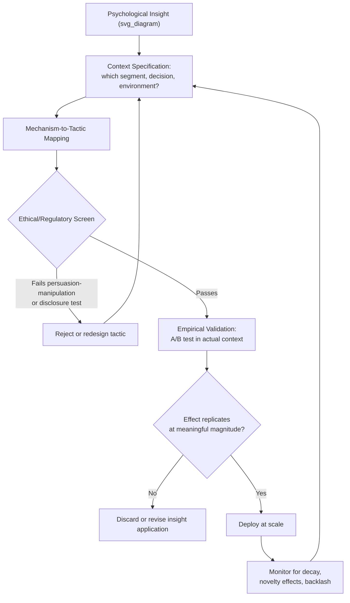

## Translating Psychological Insight into Strategy

### Definitional Foundations

**Translating psychological insight into strategy** refers to the applied discipline of converting academic and behavioral-science findings — about cognition, emotion, motivation, social influence, and decision-making — into actionable, implementable marketing strategy, distinct from either pure psychological theory (the domain of earlier chapters in this curriculum) or pure tactical execution (specific campaign or creative work). This is fundamentally a **bridging** competency: the gap this topic addresses is the well-documented distance between "knowing a psychological principle exists" and "correctly, ethically, and effectively operationalizing it within a specific business context."

**Key structural distinction**: psychological *insight* describes a validated pattern of human cognition or behavior (e.g., loss aversion, social proof, anchoring); strategic *translation* requires additionally answering context-specific questions the underlying research does not answer on its own — which insight applies to this specific decision, at what strength, for which segment, in tension with which competing insight, and within what ethical and regulatory bounds (directly connecting to the ethics chapter preceding this one).

### Historical and Intellectual Origins

**Academic-to-applied translation lineage:**

- Behavioral economics' mainstream rise (Kahneman and Tversky's prospect theory, 1979; subsequent popularization through Kahneman's *Thinking, Fast and Slow*, 2011, and Thaler and Sunstein's *Nudge*, 2008) created substantial practitioner demand for applying laboratory-validated cognitive biases to real-world business decisions, including marketing
- The emergence of dedicated "behavioral marketing" and "applied behavioral science" consultancies and internal corporate functions (e.g., "nudge units" in both public policy and private-sector contexts, following the UK Behavioural Insights Team model established 2010) formalized this translation work as a distinct professional practice rather than an implicit byproduct of marketing strategy generally
- Marketing academia's own applied wings (e.g., the Journal of Consumer Psychology's explicit practitioner-relevance orientation, relative to more theory-focused outlets) reflect an long-standing institutional recognition that psychological findings require deliberate translation work rather than automatic strategic applicability

**The replication crisis as a formative constraint on this discipline:**

The broader psychology replication crisis (prominently surfacing from the early 2010s onward, following high-profile failed replications of well-known social psychology findings) has had a direct and lasting effect on applied marketing psychology specifically: practitioners translating psychological insight into strategy must now navigate a landscape where some historically popular findings (e.g., certain priming effects, some specific "nudge" magnitude claims) have weaker or contested replication evidence than assumed a decade ago, making source-evaluation and evidence-quality assessment a necessary component of translation work rather than an optional academic nicety.

### Theoretical Frameworks

**The insight-to-strategy pipeline (a synthesized applied framework):**

Applied behavioral marketing practice can be organized into a sequential pipeline, each stage introducing distinct translation challenges:

1. **Insight identification**: selecting a psychologically validated principle relevant to the strategic problem (e.g., identifying loss aversion as relevant to a churn-prevention strategy)
2. **Context specification**: determining the specific consumer segment, decision context, and competitive environment in which the insight applies, since most psychological effects are moderated by context rather than universal in strength or direction
3. **Mechanism-to-tactic mapping**: converting the abstract psychological mechanism into a concrete marketing tactic (e.g., loss aversion → framing a subscription cancellation as "losing access to X" rather than merely ending a service)
4. **Ethical and regulatory screening**: evaluating the resulting tactic against the persuasion-manipulation framework, dark-patterns taxonomy, and applicable disclosure/vulnerability doctrine developed in the preceding chapter — a step frequently omitted in less mature applied-psychology practice, with material legal and reputational consequences
5. **Empirical validation**: testing the translated tactic in the specific business context (A/B testing, controlled experimentation) rather than assuming laboratory-validated effect sizes transfer directly, since effect magnitudes (and sometimes direction) are known to vary substantially across contexts, populations, and stakes levels
6. **Iteration and boundary-condition learning**: refining the tactic based on context-specific results, building an internal evidence base about which insights translate reliably within the firm's specific customer base and category

**Effect-size skepticism and the "lab-to-field" gap:**

[Inference] A recurring theme in applied behavioral science critique (echoing broader replication-crisis concerns) is that laboratory-demonstrated effect sizes for cognitive biases frequently do not transfer at comparable magnitude to real-world, higher-stakes, or more heterogeneous field contexts — sometimes termed a "lab-to-field" or "voltage" gap in applied behavioral science discourse — meaning translation work should treat published effect sizes as a directional hypothesis to test rather than a magnitude to expect, though the degree of this gap varies substantially by specific finding and is not a uniform discount factor applicable across all psychological principles.

**Competing-insight resolution:**

Applied strategy frequently confronts situations where multiple valid psychological principles point toward conflicting tactical recommendations (e.g., scarcity messaging may increase urgency-driven conversion while simultaneously triggering skepticism/reactance in a persuasion-knowledge-activated segment, per the Persuasion Knowledge Model discussed in the ethics chapter). Resolving such conflicts requires either empirical testing to determine which effect dominates in the specific context, or segment-level differentiation (applying different tactics to segments with differing persuasion-knowledge levels or psychological profiles) rather than assuming a single principle universally governs the decision.

### Organizational Translation Structures

| Structure | Description | Primary Advantage |
| --- | --- | --- |
| Embedded behavioral science team | Internal specialists partnered directly with marketing/product teams | Deep context knowledge; faster iteration |
| Centralized "nudge unit" | Dedicated cross-functional unit consulted across multiple business lines | Consistency, shared evidence base, ethical oversight centralization |
| External behavioral consultancy | Contracted specialist expertise for specific projects | Access to cutting-edge research; less ongoing organizational overhead |
| Academic partnership/research collaboration | Formal partnership with university researchers for rigorous field experimentation | Higher methodological rigor; publishable, externally validated findings |
| Ad hoc / marketer-led application | Individual marketers applying self-taught behavioral principles without dedicated specialist support | Fast, low-overhead; highest risk of misapplication or ethical oversight gaps |

[Inference] Organizations with more centralized or specialist-embedded structures are generally better positioned to enforce the ethical screening step in the pipeline above consistently, since ad hoc application by individual marketers without dedicated psychological or ethics training is the structural context in which the manipulation, dark-pattern, and vulnerable-population risks discussed in the prior chapter are most likely to emerge inadvertently rather than by deliberate design — this is a plausible structural inference rather than a directly measured organizational-design finding.

### Managerial and Strategic Implications

**Evidence-quality triage as a core translation skill:**

Given the replication-crisis context, practitioners translating psychological findings into strategy should apply basic evidence-quality heuristics before committing resources: preferring findings with multiple independent replications over single-study results, being appropriately cautious with popularized findings that gained traction primarily through management-book or media exposure rather than sustained academic scrutiny, and distinguishing well-established robust effects (e.g., basic loss aversion, anchoring) from more contested or context-fragile ones (e.g., some specific priming paradigms).

**Segmentation as the primary practical lever for insight application:**

Because most psychological effects are moderated by individual differences (persuasion knowledge, cultural background, product category familiarity, situational vulnerability per the earlier chapter's framework), effective translation strategy typically requires applying insights differentially across segments rather than uniformly — e.g., scarcity-based urgency messaging may be appropriately deployed toward low-persuasion-knowledge or genuinely time-constrained segments while being counterproductive or ethically fraught toward highly persuasion-aware or situationally vulnerable segments.

**Integration with the ethics framework as a non-optional step:**

This topic's placement immediately following the ethics, manipulation, and regulation chapter is structurally significant: effective strategic translation is not merely a technical optimization problem (does this tactic increase conversion) but requires the ethical screening step from the pipeline above as a standard, non-negotiable stage — a psychological insight that is well-validated and even effective at driving short-term metrics may still fail the persuasion-manipulation, dark-pattern, or vulnerability screens developed earlier in this curriculum, and mature applied practice treats that screening as integral to translation work rather than as an external constraint imposed after strategy is already finalized.

**Measurement discipline over intuition-driven application:**

The pipeline framework's emphasis on empirical validation (stage 5) reflects a broader managerial principle: psychological insight should inform testable hypotheses about strategy, not be treated as self-evidently applicable simply because the underlying research is credible — the appropriate translation posture is "this principle suggests tactic X might work here; let's test it," not "this principle is validated, therefore tactic X will work here."

### Illustrative Example

A subscription software company wants to reduce voluntary churn. A marketer identifies loss aversion (people weight losses more heavily than equivalent gains) as a relevant insight and proposes reframing the cancellation flow to emphasize "what you'll lose" (saved data, historical usage, accumulated features) rather than neutral cancellation confirmation. Applying the translation pipeline: context specification reveals this audience skews toward experienced software users with reasonably high persuasion knowledge, suggesting a subtle, factually accurate framing will outperform an emotionally manipulative one; mechanism-to-tactic mapping produces a specific design (a factual summary screen of the user's accumulated data and usage history, not exaggerated or fabricated claims); the ethical screening step confirms this passes the persuasion-manipulation test (it provides genuinely relevant decision information rather than manufacturing false urgency or obstructing the cancellation path itself, which would risk crossing into the "Roach Motel" dark pattern discussed in the ethics chapter); empirical validation via A/B testing measures actual cancellation-flow completion and reactivation rates rather than assuming the textbook loss-aversion effect size applies at this specific stage of an already-committed cancellation decision; and the firm monitors for decay or backlash (e.g., complaints that the flow feels manipulative) post-launch rather than treating the initial test result as a permanent, static outcome.

### Critiques and Open Debates

- **Over-reliance on popularized behavioral economics**: Critics within both academic psychology and applied marketing practice have raised concern that management and marketing audiences frequently absorb behavioral economics findings through secondary, simplified sources (popular books, conference talks, consultancy marketing materials) rather than primary literature, increasing the risk of applying findings whose actual evidentiary strength, boundary conditions, or replication status are less robust than the popularized version suggests
- **Tension between rigor and organizational speed**: The empirical validation stage of the translation pipeline requires time and resources that can conflict with fast-moving marketing organizational cycles, creating a structural pressure toward skipping rigorous field-testing in favor of directly deploying insight-inspired tactics at scale — a pressure that, per the ethics-chapter connection above, is also the context in which inadequately screened tactics are most likely to drift toward manipulation or dark-pattern territory
- **Insight overapplication and diminishing/negative returns**: [Inference] As specific psychological tactics (e.g., countdown timers, "X people are viewing this" social-proof indicators) become widely adopted across an entire product category, consumer persuasion-knowledge adaptation (per the Persuasion Knowledge Model) may erode their effectiveness over time or convert previously neutral tactics into recognized, distrust-triggering manipulation signals — suggesting that translation work is not a one-time application but requires ongoing reassessment as the competitive and consumer-awareness landscape evolves, though the specific decay rate of any given tactic's effectiveness is an empirical question requiring case-by-case measurement rather than a generalizable constant

**Related Topics**

- Persuasion Knowledge Model and consumer detection of applied tactics (ethics chapter)
- Persuasion versus manipulation diagnostic criteria (ethics chapter)
- Behavioral economics foundations: prospect theory, dual-process cognition, nudge theory
- A/B testing and field experimentation methodology in marketing
- Replication crisis in psychology and evidence-quality assessment
- Segmentation strategy and persuasion-knowledge-based targeting
- Organizational design for behavioral science integration ("nudge units")
- Dark patterns and ethical screening as a strategic translation gate (ethics chapter)