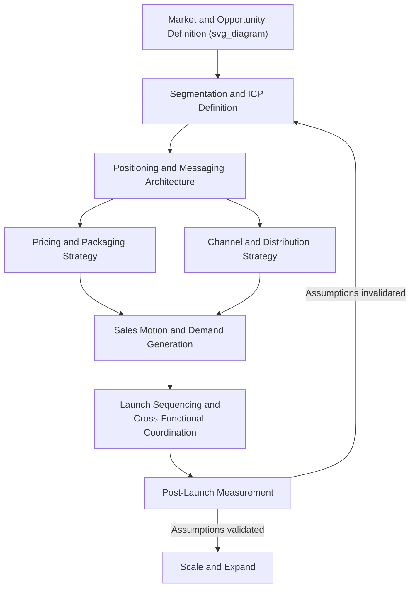

## Building an Integrated Go-to-Market Plan

### Definitional Foundations

A **go-to-market (GTM) plan** is the coordinated, cross-functional strategy specifying how a firm will deliver a value proposition to a defined target market and achieve adoption, distinguishing it from adjacent but narrower concepts: a GTM plan is broader than a marketing communications plan (it encompasses pricing, distribution, and sales motion, not only messaging) and broader than a product launch plan (it applies to new products, market entries, and repositioning of existing offerings alike, not solely to net-new launches).

**"Integrated"** in this context carries a specific meaning distinct from general strategic coherence: it denotes the deliberate alignment of the plan's constituent elements — target segment, positioning, channel, pricing, sales motion, and customer success/retention mechanics — such that each element reinforces rather than contradicts or duplicates the others, and such that separate functional owners (marketing, sales, product, customer success) operate from a shared strategic logic rather than independently optimized functional plans that happen to launch simultaneously.

### Historical and Intellectual Origins

**STP framework as foundational lineage:**

The core analytical backbone of GTM planning traces to the **Segmentation-Targeting-Positioning (STP)** framework, formalized in marketing strategy literature substantially through the work of Philip Kotler and colleagues from the 1970s onward, establishing the now-standard sequence of dividing a heterogeneous market into segments, selecting which segment(s) to serve, and defining a differentiated position relative to competitors for the chosen segment.

**Marketing mix integration lineage:**

The classical **4Ps framework** (Product, Price, Place, Promotion), originating with E. Jerome McCarthy's 1960 formulation building on earlier marketing-mix concepts from Neil Borden, provided the foundational integration logic that GTM planning extends — the core insight that these levers must be designed coherently together rather than independently, since misalignment (e.g., a premium-positioned product distributed through discount channels) undermines the intended market position.

**SaaS and technology-sector GTM formalization:**

Contemporary GTM planning practice, particularly the specific terminology and structured methodology now common in B2B and technology contexts, developed substantially through venture capital and startup operating literature from the 2000s–2010s (e.g., Geoffrey Moore's *Crossing the Chasm*, 1991, on early-market-to-mainstream-market GTM sequencing; subsequent SaaS-specific GTM motion frameworks distinguishing product-led, sales-led, and marketing-led growth models). This lineage introduced GTM-specific concepts — ideal customer profile (ICP) definition, sales motion selection, and channel-partner strategy — that extend beyond the classical STP/4Ps foundation with more operationally granular, execution-oriented planning components.

### Theoretical Frameworks

**The GTM planning sequence (a synthesized integrated framework):**

1. **Market and opportunity definition**: sizing the addressable market (TAM/SAM/SOM analysis) and validating genuine unmet demand or a defensible improvement over existing alternatives
2. **Segmentation and ideal customer profile (ICP) definition**: identifying which specific sub-segments offer the best combination of need-intensity, willingness-to-pay, and reachability, producing a specific enough profile to guide targeting decisions rather than an overly broad "everyone could benefit" definition
3. **Positioning and messaging architecture**: defining the differentiated value proposition relative to alternatives (including the "do nothing" alternative) for the chosen ICP, and translating that positioning into a messaging hierarchy usable consistently across channels
4. **Pricing and packaging strategy**: setting price levels, structures (subscription, usage-based, one-time), and packaging tiers that are coherent with the positioning (e.g., premium positioning requires pricing that signals rather than undermines the premium claim) and with target-segment willingness-to-pay
5. **Channel and distribution strategy**: selecting the specific paths to reach the target segment (direct sales, self-serve digital, channel partners, retail distribution) appropriate to the segment's buying behavior and the product's complexity/price point
6. **Sales motion and demand-generation alignment**: defining how leads are generated, qualified, and converted (e.g., product-led self-serve trial versus enterprise sales-led motion) in a manner consistent with the chosen channel and pricing structure
7. **Launch sequencing and cross-functional coordination**: establishing the specific timeline, internal readiness milestones (sales enablement, support readiness, inventory/capacity), and external launch communications, ensuring internal functions are prepared before external demand generation begins
8. **Post-launch measurement and iteration**: defining the specific leading and lagging metrics (activation rate, sales cycle length, customer acquisition cost, retention) that will indicate whether the GTM plan's assumptions are validated, and the governance process for adjusting the plan based on early results

**Coherence as the central quality criterion:**

The dominant theoretical claim distinguishing genuinely "integrated" GTM strategy from a collection of separately-competent functional plans is **internal coherence** — each element of the plan should be logically derivable from, and mutually reinforcing with, the others. A commonly used diagnostic: if the pricing strategy, channel choice, or sales motion could be swapped for a substantially different approach without requiring any other element of the plan to change, this suggests the elements were not designed with genuine interdependency, indicating weaker integration than a plan where each choice constrains and is constrained by the others.

**Product-led, sales-led, and hybrid GTM motion selection:**

A significant strategic branch point in contemporary (particularly B2B/SaaS) GTM planning is the choice among:

- **Product-led growth (PLG)**: the product itself (via free trial, freemium tier, or self-serve onboarding) drives acquisition and conversion with minimal direct sales involvement, most viable for lower-price-point, lower-complexity, individual- or small-team-adopted products
- **Sales-led growth**: dedicated sales representatives drive the buying process through direct engagement, most viable for higher-price-point, higher-complexity, or multi-stakeholder enterprise purchase decisions
- **Hybrid/PLG-plus-sales**: self-serve entry with sales-assisted expansion for larger accounts, an increasingly common model that requires deliberate handoff design between self-serve and sales-assisted motions to avoid the coherence-undermining gaps described above

[Inference] The choice among these motions is generally treated in practitioner literature as substantially determined by product complexity, price point, and buyer-group size rather than being a free strategic choice independent of the product itself — attempting a pure PLG motion for a genuinely complex, high-stakes enterprise purchase (or a heavy sales-led motion for a low-price-point individual-adoption product) is a commonly cited coherence failure, though the specific threshold at which a product's complexity or price necessitates one motion over another is a matter of practitioner judgment rather than a precisely quantified rule.

### Cross-Functional Ownership and Coordination Structure

| Function | Primary GTM Responsibility | Key Coordination Dependency |
| --- | --- | --- |
| Product Marketing | Positioning, messaging architecture, competitive differentiation | Must align with actual product capability (Product) and sales narrative (Sales) |
| Product Management | Feature/packaging decisions, roadmap sequencing relative to launch | Must reflect validated segment needs (Marketing research) and pricing feasibility (Pricing/Finance) |
| Sales | Sales motion execution, deal-level customer engagement | Requires enablement materials and qualified lead flow consistent with ICP (Marketing) |
| Demand Generation/Growth Marketing | Lead generation, campaign execution across channels | Must target the defined ICP consistently with positioning, not a broader or different audience for volume's sake |
| Customer Success/Support | Onboarding, retention, expansion | Must be resourced and prepared consistent with the volume and complexity implied by the chosen sales motion |
| Pricing/Finance | Price-point setting, packaging tier economics | Must validate willingness-to-pay assumptions against actual segment research, not solely internal cost-plus logic |

**The coordination failure mode this structure is designed to prevent**: [Inference] a commonly cited practitioner failure pattern involves marketing generating demand from a broader or different audience than the ICP sales and product were designed around, producing high lead volume but poor conversion and retention — a symptom of functional plans executed in parallel without the shared strategic logic integration is meant to establish, though the frequency or severity of this specific failure mode across organizations is better documented in practitioner and consulting literature than in rigorously measured academic research.

### Managerial and Strategic Implications

**Sequencing internal readiness before external launch:**

A frequently underweighted component of GTM planning is ensuring internal functions (sales enablement materials, customer support training, inventory or infrastructure capacity) are genuinely ready before demand-generation activity begins, since generating market interest ahead of organizational readiness to serve it produces a poor first-customer experience that can be more damaging to long-term positioning than a modestly delayed launch.

**Positioning against the "do nothing" alternative, not only named competitors:**

Effective positioning work within a GTM plan must account for the reality that in many categories, especially genuinely novel products, the primary competitive alternative is not a named competitor but the prospective customer's status quo behavior or existing informal workaround — meaning messaging architecture should address why change is worth the switching cost at all, not solely why this option beats a specific named alternative.

**Metrics selection aligned to GTM motion:**

The specific leading indicators used to validate GTM plan assumptions should differ by chosen motion — a product-led motion should prioritize activation and self-serve conversion metrics, while a sales-led motion should prioritize qualified pipeline generation and sales cycle length — applying a mismatched metrics framework (e.g., judging an enterprise sales-led launch primarily on self-serve signup volume) produces a distorted read on whether the underlying GTM strategy is actually succeeding.

### Illustrative Example

A mid-market B2B software company is launching a new product line adjacent to its existing offering. Applying the sequence above: market and opportunity definition confirms a genuine gap in the addressable market rather than only internal enthusiasm for the product; ICP definition narrows the target to a specific buyer persona within existing customer accounts (favoring an expansion motion) rather than an entirely new market segment requiring net-new customer acquisition; positioning is built around a specific, differentiated capability relative to both named competitors and the "continue using a manual/spreadsheet-based workaround" status quo alternative; pricing is packaged as an add-on tier consistent with an expansion-within-existing-accounts strategy rather than requiring a separate standalone sales process; channel strategy leverages the existing customer success and account management relationship rather than requiring new-channel development; and the sales motion is deliberately hybrid — self-serve trial activation for smaller existing accounts, with sales-assisted expansion conversations for larger accounts — reflecting genuine variation in deal complexity across the existing customer base rather than forcing a single motion across a heterogeneous set of accounts.

### Critiques and Open Debates

- **Over-planning versus iterative/lean GTM approaches**: Lean startup methodology (Eric Ries and related practitioner literature) has raised a countervailing critique of heavily pre-planned GTM approaches, arguing that in genuinely novel or uncertain markets, extensive upfront planning risks encoding untested assumptions into a rigid plan, and that a more iterative, rapid-experimentation approach to segment, positioning, and channel discovery may better suit high-uncertainty contexts than the sequential planning framework above — suggesting the appropriate degree of upfront GTM planning rigor is itself contingent on market and product novelty/uncertainty rather than uniformly high in all cases
- **Coordination cost versus integration benefit trade-off**: [Inference] While cross-functional integration is generally presented as unambiguously beneficial in GTM planning literature, achieving genuine integration carries real coordination costs (time, meetings, consensus-building across functions with different incentives and timelines) that can meaningfully slow time-to-market — a trade-off that practitioner literature generally acknowledges exists but does not offer a precise, generalizable formula for resolving across different organizational sizes and market-timing pressures
- **PLG-versus-sales-led debate as an area of live practitioner disagreement**: While the general complexity/price-point heuristic for motion selection described above is widely cited, there is ongoing practitioner debate about how aggressively companies with historically sales-led models should adopt product-led elements (and vice versa), with reasonable disagreement about the transferability of high-profile PLG success cases to different product categories and buyer contexts

**Related Topics**

- Segmentation-Targeting-Positioning (STP) framework in depth
- Ideal customer profile (ICP) definition methodology
- Product-led growth versus sales-led growth motion selection
- Pricing and packaging strategy for SaaS and subscription models
- Crossing the Chasm and early-market-to-mainstream sequencing (Geoffrey Moore)
- Translating psychological insight into strategy (preceding chapter item — messaging/positioning linkage)
- Cross-functional organizational design for marketing execution
- Lean startup methodology and iterative market validation