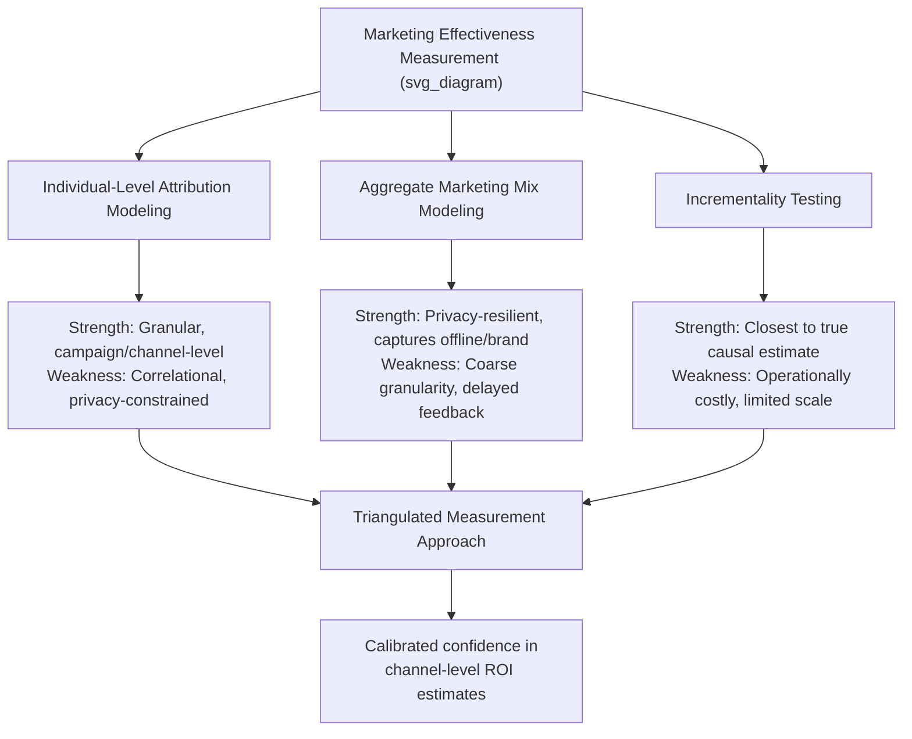

## Measuring Marketing Effectiveness and ROI

### Definitional Foundations

**Marketing effectiveness measurement** refers to the discipline of quantifying whether and how much marketing activity contributes to business outcomes, spanning a spectrum from immediate, easily attributable digital response metrics to long-term, harder-to-isolate brand-equity effects. **Marketing ROI (return on investment)** is the specific financial framing of this discipline, most simply expressed as incremental value generated per unit of marketing spend, but the apparent simplicity of this ratio conceals substantial methodological difficulty in correctly measuring both the numerator (true incremental value attributable to marketing) and, less obviously, the denominator (fully loaded marketing cost).

**Core measurement tension underlying this entire topic**: the metrics easiest to measure precisely (click-through rates, last-touch conversions, immediate response rates) are frequently the metrics *least* representative of marketing's actual causal contribution to business value, while the metrics most representative of true causal contribution (incremental sales lift, long-term customer lifetime value effects, brand equity) are the hardest to measure with precision — a tension sometimes summarized as "not everything that can be measured matters, and not everything that matters can be easily measured."

$$ROI_{\text{marketing}} = \frac{V_{\text{incremental}} - C_{\text{fully-loaded}}}{C_{\text{fully-loaded}}}$$

Where $V_{\text{incremental}}$ denotes the value that would *not* have occurred absent the marketing activity (the genuinely difficult quantity to isolate) and $C_{\text{fully-loaded}}$ denotes total marketing cost including media spend, production, and relevant overhead — not media spend alone, a common measurement shortcut that inflates apparent ROI.

### Historical and Intellectual Origins

**Early marketing measurement — the attribution problem's origin:**

- John Wanamaker's oft-cited (and likely apocryphal in exact wording, though consistently attributed across marketing literature) observation that "half the money I spend on advertising is wasted; the trouble is I don't know which half" is the conventional historical touchstone marking marketing's long-standing measurement problem, predating any of the methodological solutions discussed below by roughly a century
- Mid-20th-century marketing mix modeling origins trace to early econometric applications to advertising response (particularly agricultural and consumer packaged goods sales-response modeling from the 1950s–1960s), representing the first systematic statistical approach to isolating marketing's causal contribution from other sales drivers

**Digital attribution era:**

- The rise of digital advertising and web analytics from the late 1990s–2000s created the technical capability for granular, click-level attribution, initially popularizing **last-click attribution** models due to their computational simplicity and direct traceability, despite well-recognized conceptual limitations discussed below
- Multi-touch attribution modeling matured through the 2010s as marketing technology platforms developed capability to track consumers across multiple touchpoints, attempting to address last-click attribution's known distortions

**Post-privacy-regulation and post-cookie-deprecation shift:**

The privacy regulatory developments discussed in the ethics chapter (GDPR, CCPA, and the broader 2020s privacy framework proliferation), combined with browser-level third-party cookie deprecation trends, have materially constrained granular individual-level tracking capability that much digital attribution modeling historically relied upon, driving renewed practitioner and academic interest in aggregate statistical approaches (marketing mix modeling) and privacy-preserving measurement techniques (e.g., aggregated conversion APIs, differential privacy approaches) as partial substitutes for individual-level attribution.

### Theoretical Frameworks

**Attribution model taxonomy:**

| Model | Mechanism | Primary Limitation |
| --- | --- | --- |
| Last-click/last-touch | Credits the final touchpoint before conversion | Ignores upper-funnel influence; systematically overvalues bottom-funnel/branded-search activity |
| First-click/first-touch | Credits the initial touchpoint | Ignores all subsequent influence; overvalues awareness-stage channels |
| Linear | Distributes credit equally across all touchpoints | Assumes equal influence regardless of touchpoint type/timing, rarely true |
| Time-decay | Weights recent touchpoints more heavily | Improves on last-click but still arbitrary in decay-rate assumption |
| U-shaped/W-shaped | Weights first touch, lead-conversion touch, and/or opportunity-creation touch more heavily | Requires defined funnel stages; less applicable to non-linear buying journeys |
| Data-driven/algorithmic attribution | Uses statistical modeling (e.g., Markov chains, Shapley value) on actual conversion path data to assign credit | Requires substantial data volume; still correlational rather than strictly causal without experimental validation |

**The fundamental limitation of all attribution modeling**: [Inference] regardless of sophistication, attribution modeling assigns credit based on *correlation* between touchpoint exposure and conversion within observed data, not on a causal counterfactual (what would have happened absent that touchpoint) — meaning even sophisticated data-driven attribution remains vulnerable to confounding (e.g., a touchpoint correlated with conversion because it reaches consumers who were already going to convert, rather than because it caused the conversion), a distinction the marketing measurement literature increasingly emphasizes as attribution's core epistemic weakness relative to genuinely experimental approaches.

**Marketing Mix Modeling (MMM) — the aggregate-statistical alternative:**

MMM uses aggregate time-series regression (relating sales volume to marketing spend by channel, alongside control variables such as pricing, seasonality, and macroeconomic factors) to estimate each channel's average incremental contribution, offering key advantages over individual-level attribution: it does not require individual-level tracking (making it more resilient to privacy-driven cookie/tracking restrictions), and it captures channels attribution models often miss entirely (offline media, brand advertising with delayed effects). Its primary limitation is aggregation-level granularity — MMM typically cannot inform individual-level or campaign-level tactical decisions the way attribution modeling can, making the two approaches complementary rather than substitutable for most mature measurement practices.

**Incrementality testing as the methodologically strongest approach:**

**Incrementality testing** (geo-holdout experiments, matched-market tests, or randomized controlled "ghost ad"/public service announcement substitution tests) directly estimates causal incremental lift by comparing outcomes between an exposed group/market and a genuinely comparable unexposed control, providing the closest approximation to a true experimental counterfactual available in marketing measurement. This is widely regarded in contemporary measurement literature as the methodologically strongest available approach precisely because it addresses the core correlation-versus-causation limitation inherent to both attribution modeling and MMM, though it requires deliberately withholding marketing exposure from a control group — an operational and sometimes organizational-buy-in cost that limits how frequently and broadly it can be deployed relative to always-on attribution or MMM measurement.

**Short-term activation versus long-term brand-building measurement:**

A foundational strategic-measurement debate, substantially shaped by Les Binet and Peter Field's influential empirical work (analyzing IPA Effectiveness Databank case studies), distinguishes:

- **Short-term activation effects**: immediate, easily measurable sales response to promotional or performance-marketing activity, typically showing faster but more transient and often lower-total-magnitude ROI
- **Long-term brand-building effects**: cumulative effects of brand advertising on price sensitivity reduction, mental availability, and baseline demand, typically showing slower-to-materialize but larger cumulative ROI over multi-year time horizons, and correspondingly harder to measure within typical short-term campaign reporting cycles

Binet and Field's research proposed that most effective long-run marketing budget allocation involves a substantial brand-building component even though its ROI is harder to demonstrate within any single reporting period — a finding frequently cited to counter organizational pressure toward exclusively short-term-attributable, performance-marketing-weighted budget allocation.

### Managerial and Strategic Implications

**Triangulation over single-method reliance:**

Given each measurement approach's distinct strengths and limitations (attribution's granularity but correlational weakness, MMM's privacy-resilience but coarseness, incrementality testing's causal rigor but operational cost and limited scale), mature measurement practice generally combines multiple methods and treats convergent findings across methods as higher-confidence than any single method's output in isolation, rather than relying on one measurement approach as a sole source of truth.

**Metric selection aligned to decision type, echoing the GTM motion-metrics alignment principle:**

Similar to the earlier GTM planning item's point about aligning metrics to chosen growth motion, effectiveness measurement should be matched to the specific decision being informed — daily/weekly budget-pacing decisions may reasonably rely on faster, cruder attribution signals, while annual channel-mix budget allocation decisions warrant the more rigorous (and slower, more resource-intensive) incrementality testing or MMM approaches, since applying the wrong measurement rigor level to a given decision either wastes resources on over-precise measurement for a low-stakes decision or under-informs a high-stakes one.

**Organizational incentive effects on measurement choice**: [Inference] a recurring practitioner observation is that measurement approaches favoring easily-attributable, short-term channels (e.g., last-click attribution favoring branded search and retargeting) can create a self-reinforcing organizational bias toward defunding harder-to-measure but genuinely effective upper-funnel and brand-building activity, simply because the measurement system itself structurally undercounts their contribution — this is a widely discussed risk in the measurement literature (directly related to Binet and Field's findings above) rather than a universally documented empirical regularity across all organizations, since the degree to which any specific firm's budget allocation is actually distorted by measurement-system bias depends on that firm's specific governance and decision-making processes.

**Customer lifetime value (CLV) as a complementary long-horizon lens:**

Beyond channel-level ROI, effectiveness measurement increasingly incorporates customer lifetime value analysis, evaluating marketing spend against the full projected value of acquired customers over their relationship with the firm rather than only the value of the immediate converting transaction — particularly relevant for subscription and repeat-purchase business models where a customer acquired at an apparently unfavorable immediate-transaction ROI may nonetheless represent a strongly favorable investment on a full-lifetime basis.

### Illustrative Example

A retailer runs both a performance-marketing retargeting campaign and a brand-awareness video campaign simultaneously. Last-click attribution analysis shows the retargeting campaign driving substantially higher measured ROI, since retargeted users were already deep in the purchase consideration process and often would have converted regardless (an attribution artifact rather than necessarily a true incrementality difference). A geo-holdout incrementality test — running the brand campaign in some matched markets while withholding it in comparable control markets — reveals the brand campaign's true incremental sales lift is understated by standard attribution, and that overall category demand (benefiting both the retailer's paid search and organic traffic) rises measurably in exposed markets relative to controls over a several-month horizon, consistent with Binet and Field's long-term brand-building framework. Triangulating both measurement approaches, rather than relying on attribution data alone, produces a materially different — and more accurate — recommended budget allocation across the two campaign types than either method would suggest in isolation.

### Critiques and Open Debates

- **The unmeasurable-effects problem**: Even sophisticated multi-method triangulation cannot fully resolve certain categories of marketing effect — e.g., diffuse cultural or word-of-mouth effects, long-delayed brand-equity accumulation spanning many years, or category-expansion effects benefiting an entire industry rather than a single firm distinctly — leading some marketing effectiveness scholars to caution against treating even well-triangulated ROI estimates as a complete accounting of marketing's total value contribution
- **Short-termism institutionalized by reporting cycles**: Corporate financial reporting cycles (quarterly earnings pressure in particular) create structural incentive toward measurement and budget-allocation approaches favoring short-term-attributable spend, a tension the Binet and Field brand-building research directly engages but does not fully resolve at the level of individual firm governance and incentive structure, meaning the theoretical case for balanced short/long-term investment does not automatically translate into organizational practice absent deliberate governance intervention
- **Privacy-driven measurement degradation as an ongoing, unresolved transition**: [Unverified — actively evolving] The combined effect of the privacy regulatory developments (covered in the ethics chapter) and browser/platform-level tracking restrictions on the practical accuracy and availability of individual-level attribution data is an actively evolving landscape rather than a settled new equilibrium, and current best-practice measurement architecture recommendations should be checked against up-to-date sources given how quickly platform capabilities and restrictions in this specific area continue to shift

**Related Topics**

- Marketing Mix Modeling (MMM) methodology and statistical foundations
- Incrementality testing and geo-holdout experimental design
- Binet and Field's IPA Effectiveness Databank research on brand-building versus activation
- Customer lifetime value (CLV) modeling and its integration with acquisition ROI
- Global privacy and consumer-protection frameworks (ethics chapter — measurement/tracking constraint linkage)
- Building an integrated go-to-market plan (preceding chapter item — metrics-to-motion alignment)
- Data-driven/algorithmic attribution (Markov chain and Shapley value approaches) in depth
- Marketing budget allocation governance and organizational incentive design