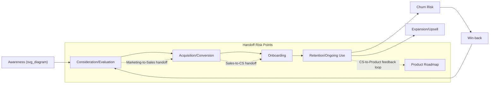

## Cross-Functional Alignment Across the Customer Lifecycle

### Definitional Foundations

**Cross-functional alignment across the customer lifecycle** refers to the deliberate coordination of organizationally distinct functions — typically marketing, sales, product, and customer success/support — around a shared understanding of, and consistent execution across, the customer's full journey from initial awareness through acquisition, onboarding, retention, expansion, and potential churn/win-back. This topic extends and generalizes the coordination principles introduced in the go-to-market planning item earlier in this chapter, applying them across the *entire* post-launch customer relationship rather than only the launch moment itself.

**Core distinguishing problem this topic addresses**: most organizations structure functions (marketing, sales, product, customer success) around internal operational logic — distinct budgets, incentive structures, reporting lines, and success metrics — while the customer experiences the relationship as a single continuous journey with no awareness of, or interest in, internal organizational boundaries. Cross-functional alignment is the discipline of closing this structural mismatch.

### Historical and Intellectual Origins

**Customer lifecycle concept lineage:**

- The conceptual lineage traces to the classical **marketing/sales funnel** model (variants of AIDA — Attention, Interest, Desire, Action — dating to late 19th/early 20th-century sales theory, notably associated with E. St. Elmo Lewis), which initially modeled only the pre-purchase journey
- The **relationship marketing** movement (emerging substantially in the 1980s–1990s, associated with scholars such as Leonard Berry and, in a B2B context, the Nordic School of service marketing) extended strategic attention beyond the initial transaction to the ongoing customer relationship, providing the conceptual foundation for lifecycle thinking that includes retention and loyalty stages, not solely acquisition
- **Customer Relationship Management (CRM)** technology adoption from the late 1990s–2000s onward (Siebel, then Salesforce and successors) provided the operational infrastructure making cross-functional, lifecycle-spanning data visibility and coordination technically feasible at scale, a necessary (though insufficient on its own) precondition for genuine cross-functional alignment
- SaaS/subscription business model proliferation (2000s–2010s) substantially intensified organizational attention to post-sale lifecycle stages specifically, since subscription revenue models make retention and expansion (rather than one-time acquisition alone) central to business viability, elevating customer success from a support cost-center function to a strategically central one in many organizations

### Theoretical Frameworks

**The customer lifecycle stage model (a synthesized framework):**

Contemporary lifecycle frameworks typically decompose the customer relationship into the following stages, each with distinct primary functional ownership and distinct cross-functional dependency:

| Stage | Primary Owner | Key Cross-Functional Dependency |
| --- | --- | --- |
| Awareness | Marketing (brand, demand generation) | Must reflect actual product capability (Product) to avoid overpromising |
| Consideration/Evaluation | Marketing and Sales | Sales messaging must be consistent with marketing positioning; product must support evaluation (trials, demos) |
| Acquisition/Conversion | Sales (or self-serve Product for PLG motions) | Pricing/packaging alignment (Finance); handoff quality to onboarding (Customer Success) |
| Onboarding | Customer Success/Product | Must fulfill expectations set during acquisition (Sales/Marketing); requires product usability investment |
| Retention/Ongoing Use | Customer Success/Product | Requires visibility into usage data to identify at-risk accounts; must feed back to Product roadmap |
| Expansion/Upsell | Sales or Customer Success (varies by GTM motion) | Requires accurate usage/value data; must align with original positioning rather than feeling like a bait-and-switch |
| Churn/Win-back | Customer Success and Marketing | Requires shared understanding of churn causes across functions to avoid repeating the same acquisition-stage overpromises |

**The "handoff problem" as the central structural failure mode:**

[Inference] The most frequently cited practical alignment failure in applied marketing/business literature occurs at stage transitions — particularly the marketing-to-sales handoff (lead quality and expectation-setting misalignment) and the sales-to-customer-success handoff (onboarding expectations not matching what was promised during the sales process) — because these transitions require information and expectation continuity across functions with genuinely different incentive structures (e.g., a sales function incentivized on closed deals has some incentive tension with fully transparent expectation-setting if honest disclosure might reduce close rates), a structural tension various commercial frameworks explicitly aim to counteract, though the empirical prevalence of this specific failure mode is documented more thoroughly in consulting/practitioner literature than in rigorously controlled academic research.

**Revenue Operations (RevOps) as a structural alignment response:**

A significant organizational-design development directly addressing this handoff problem is the emergence of **Revenue Operations (RevOps)** as a formal cross-functional discipline — typically a dedicated function or team responsible for unifying marketing, sales, and customer success operations, data systems, and processes under a shared strategic and operational framework, rather than leaving alignment to informal inter-departmental coordination. RevOps' rise reflects an organizational-design recognition that alignment achieved through goodwill and informal coordination alone tends to degrade at scale, requiring dedicated structural ownership.

**Shared metrics and incentive design as alignment mechanisms:**

Beyond structural/organizational solutions like RevOps, a distinct theoretical lever for alignment is deliberate **shared metric design** — establishing lifecycle-spanning metrics (e.g., net revenue retention, which depends jointly on acquisition quality, onboarding effectiveness, and ongoing account management) that multiple functions are jointly accountable for, rather than each function optimizing solely for stage-siloed metrics (e.g., marketing optimizing purely for lead volume, sales purely for initial deal closure, customer success purely for support ticket resolution time) that can each be locally maximized while producing a poor aggregate customer experience and poor lifetime value outcomes.

### Common Misalignment Patterns and Their Root Causes

| Misalignment Pattern | Symptom | Typical Root Cause |
| --- | --- | --- |
| Marketing-sales lead quality conflict | Sales complains leads are unqualified; marketing points to volume/MQL targets met | Misaligned or absent shared definition of a "qualified lead" |
| Overpromise-underdeliver handoff | High churn shortly after onboarding | Sales/marketing messaging exceeds actual product capability, incentivized by close-rate pressure |
| Product roadmap disconnected from retention data | Recurring churn reasons persist across product releases | No structured feedback loop from Customer Success/support data into Product prioritization |
| Expansion motion feels transactional to customers | Low upsell acceptance despite genuine usage growth | Expansion conversations treated as a sales event disconnected from ongoing relationship management |
| Win-back campaigns repeat original overpromising | Reactivated customers churn again at similar rates | Marketing lacks visibility into actual churn reasons documented by Customer Success |

### Managerial and Strategic Implications

**Data infrastructure as a necessary but insufficient precondition:**

Unified CRM and customer data infrastructure (a single source of truth for customer status, usage, and history accessible across functions) is a necessary technical precondition for lifecycle alignment, but data availability alone does not guarantee aligned behavior — functions with continued access to unified data but persistently misaligned incentive structures or success metrics can still operate in a functionally siloed manner despite technically shared visibility, meaning technology investment must be paired with the organizational-design and incentive-alignment work discussed above rather than treated as a sufficient solution on its own.

**Service-level agreements (SLAs) between functions as an alignment mechanism:**

A practical mechanism frequently used to formalize the handoff points identified above involves establishing explicit internal SLAs between adjacent functions — e.g., a formal, mutually agreed definition of what constitutes a marketing-qualified lead ready for sales follow-up, or a defined onboarding-readiness checklist sales must confirm before handing an account to customer success — converting an informal and frequently contested handoff into an explicit, measurable commitment each function can be held accountable to.

**Closing the retention-to-product feedback loop:**

Sustained cross-functional alignment requires not only forward-flowing coordination (marketing to sales to customer success) but also backward-flowing feedback — specifically, structured mechanisms for customer success and support teams' frontline knowledge of recurring churn reasons and usage friction to reach product development prioritization processes, since without this explicit feedback loop, retention problems with root causes in product design tend to persist indefinitely regardless of downstream retention-team effort.

**Connecting to earlier chapter frameworks**: this topic's emphasis on shared metrics and incentive design directly parallels the GTM planning item's coherence principle (each element should be logically interdependent with the others) and the effectiveness-measurement item's point about organizational incentive effects on measurement choice — all three items converge on the broader theme that structural and incentive design, not merely goodwill or stated strategic intent, determines whether integrated, coherent execution actually occurs in practice.

### Illustrative Example

A B2B software company observes healthy new-customer acquisition numbers alongside a concerning net revenue retention decline. Investigation reveals: sales representatives, incentivized primarily on new-deal closure rather than post-sale retention outcomes, have been positioning certain advanced features as fully available at the base pricing tier during sales conversations, when those features actually require a higher-tier upgrade; onboarding teams, unaware of these specific sales conversations (no shared visibility into deal-level sales notes), discover the mismatch only when customers request the promised features; and customer success teams document the resulting frustration and early churn in support tickets that never reach either sales leadership or product management in a structured way. Applying the frameworks above, the fix requires multiple coordinated interventions rather than a single functional fix: an explicit SLA requiring sales to accurately represent tier-specific features (addressing the handoff problem at its incentive-design root, potentially requiring a shift in sales compensation structure toward retention-inclusive metrics); shared CRM visibility into deal-specific commitments made during sales conversations, accessible to onboarding teams; and a structured feedback channel routing support-ticket churn-reason data to both sales leadership (to correct the pattern going forward) and product management (to evaluate whether the pricing/packaging tier structure itself needs revision) — illustrating that this is a genuinely cross-functional structural fix, not a training or communication issue resolvable within any single function alone.

### Critiques and Open Debates

- **RevOps as a genuine structural solution versus a relabeling of existing coordination challenges**: Some organizational-design commentary raises the question of whether formalizing a dedicated RevOps function genuinely resolves underlying incentive misalignment across marketing, sales, and customer success, or whether it primarily adds an additional coordination layer without addressing the root incentive-structure tensions (e.g., sales compensation still weighted toward closed-deal volume) that generate misalignment in the first place — suggesting RevOps' effectiveness may depend heavily on whether it is granted genuine authority to influence upstream incentive design, not merely downstream process coordination
- **Alignment cost versus functional specialization benefit**: [Inference] Extensive cross-functional alignment mechanisms (shared metrics, joint accountability structures, SLA negotiation overhead) carry real coordination costs that can, past some point, undermine the efficiency benefits of functional specialization in the first place — the marketing strategy literature generally does not offer a precise, generalizable formula for the optimal degree of cross-functional integration versus specialized autonomy, treating this as contingent on business model, company size, and product complexity rather than universally maximizable
- **Measurement of alignment itself remains underdeveloped**: While net revenue retention and similar lifecycle-spanning metrics provide indirect evidence of alignment quality, there is comparatively limited standardized methodology in either academic or practitioner literature for directly measuring "cross-functional alignment" as a construct in its own right, meaning organizations largely infer alignment quality from downstream outcome metrics and qualitative signals (e.g., internal survey data, handoff complaint frequency) rather than from a validated direct measurement instrument

**Related Topics**

- Building an integrated go-to-market plan (preceding chapter item — coherence principle extended across the full lifecycle)
- Measuring marketing effectiveness and ROI (preceding chapter item — net revenue retention as a lifecycle metric)
- Revenue Operations (RevOps) organizational design in depth
- Customer Relationship Management (CRM) systems and unified data infrastructure
- Relationship marketing and the Nordic School of service marketing
- Sales compensation design and incentive-structure alignment
- Customer lifetime value (CLV) and its relationship to retention/expansion strategy
- Churn analysis methodology and win-back campaign design