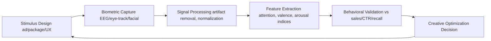
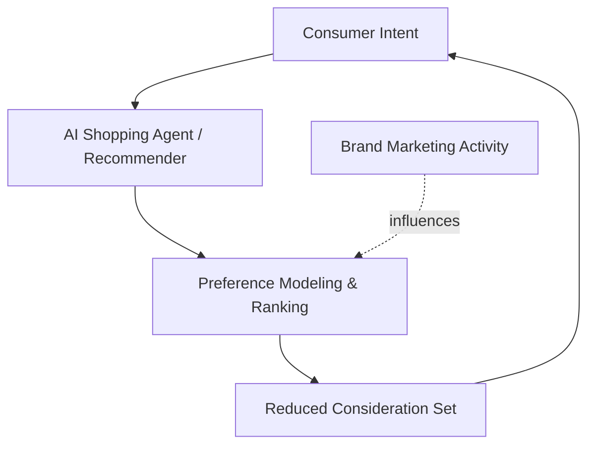

## Emerging Frontiers in Marketing Psychology

### Overview

This domain covers the leading edge of research and applied practice where cognitive science, behavioral economics, neuroscience, and computational methods intersect with marketing decision-making. These frontiers extend beyond classical persuasion models (e.g., Cialdini's principles, elaboration likelihood model) into areas enabled by new measurement technology, AI-driven personalization, and evolving consumer contexts (digital-first attention, synthetic media, algorithmic mediation of choice).

**Key Points**

- Emerging frontiers are defined by three drivers: (1) new measurement tools (neuro/biometric, passive behavioral data), (2) new decision environments (AI agents, algorithmic feeds, synthetic content), and (3) new theoretical refinements (dual-process nuance, embodied cognition, predictive processing)
- Many findings in this space are still under replication scrutiny; claims should be treated with appropriate epistemic caution
- Applied practice increasingly blends psychological theory with machine learning to predict and shape behavior at scale

---

### 1. Neuromarketing and Biometric Measurement

#### 1.1 Core Techniques

| Method | What It Measures | Maturity |
| --- | --- | --- |
| EEG (electroencephalography) | Cortical arousal, engagement, memory encoding correlates | Established in research; growing commercial use |
| fMRI | Deep-brain reward/valuation activity (e.g., ventral striatum, vmPFC) | Research-grade, expensive, low ecological validity |
| Eye-tracking | Visual attention, fixation duration, saccade patterns | Mature, widely commercialized |
| Facial coding (FACS-based) | Micro-expressions mapped to discrete emotions | Commercial tools widely available; accuracy varies by context |
| Galvanic skin response (GSR) | Autonomic arousal (valence-agnostic) | Established, used alongside other measures |
| Voice/prosody analysis | Emotional tone from vocal features | Emerging, used in call-center and video ad testing |

**Key Points**

- [Inference] Biometric signals are generally treated as arousal/attention proxies rather than direct predictors of purchase intent; combining multiple channels ("multimodal fusion") tends to outperform single-channel measures in predictive validity studies, though effect sizes vary considerably across studies and products
- vmPFC (ventromedial prefrontal cortex) activity is commonly cited in neuroeconomics literature as correlating with subjective value computation during purchase decisions
- [Unverified] Claims from individual neuromarketing vendors about ROI uplift (e.g., "37% lift in recall") should be treated skeptically absent independent replication, as these figures are typically proprietary and unpublished

#### 1.2 Applied Workflow

**Example**

A package-design test might combine eye-tracking (first fixation location, time-to-brand-recognition) with facial coding (valence at moment of price reveal) to identify which of three shelf designs maximizes both attention capture and positive affect before A/B testing in-market.

---

### 2. Behavioral Economics Extensions

#### 2.1 Beyond Classical Heuristics

Classical behavioral economics (anchoring, loss aversion, framing) is well-established. Emerging frontiers extend this into:

- **Choice overload and assortment psychology**: refined models showing overload effects are moderated by category familiarity and decision-task complexity, not universal
- **Temporal discounting in digital contexts**: how infinite scroll and micro-transactions exploit present-bias differently than traditional retail
- **Scarcity and social proof at algorithmic scale**: dynamically generated scarcity signals ("3 left," "12 people viewing") raise questions about authenticity and regulatory exposure (e.g., FTC dark-pattern enforcement)
- **Ego depletion and decision fatigue**: [Unverified] the original ego-depletion literature has faced significant replication failures in the broader psychology literature; marketing applications built on strong depletion assumptions warrant caution

#### 2.2 Dark Patterns and Regulatory Boundary

$$\text{Persuasion} \xrightarrow{\text{intensity}} \text{Manipulation} \xrightarrow{\text{legal threshold}} \text{Dark Pattern}$$

**Key Points**

- Regulators (FTC in the US, EU under the Digital Services Act and Unfair Commercial Practices Directive) have increasingly codified specific dark-pattern categories: confirmshaming, roach motels, drip pricing, forced continuity
- [Inference] The boundary between "persuasive design" and "dark pattern" is increasingly defined by disclosure adequacy and reversibility of the choice, rather than by the psychological mechanism used
- Practitioners should treat regulatory risk as a first-class design constraint, not an afterthought

---

### 3. AI-Mediated Consumer Psychology

#### 3.1 Algorithmic Curation and the "Choice Architecture" Shift

Recommendation systems (collaborative filtering, embedding-based retrieval, LLM-driven conversational commerce) now act as intermediary choice architects between brand and consumer.

**Key Points**

- Marketing psychology now must account for a non-human intermediary that has its own "persuasion susceptibility" — optimizing content for algorithmic legibility (structured data, clear entity signals) alongside human persuasion
- [Speculation] As LLM-based shopping agents become more common, brand psychology may shift from targeting human emotional triggers toward targeting the retrieval and ranking criteria of AI agents — sometimes termed "agentic SEO" or "answer engine optimization" — though empirical frameworks for this are still nascent
- Parasocial dynamics with AI chatbots/brand personas are an active research area, examining whether trust and rapport formed with conversational AI transfers to brand attitudes

#### 3.2 Hyper-Personalization and the Privacy-Relevance Tradeoff

**Key Points**

- Personalization increases perceived relevance and message effectiveness up to a threshold, after which "creepiness" (privacy violation perception) causes reactance and trust erosion — often called the **personalization-privacy paradox**
- [Inference] The inflection point of this curve is highly context-dependent (category sensitivity, data source transparency, prior relationship with brand) rather than a fixed universal threshold
- Post-cookie measurement (contextual targeting, first-party data, clean rooms) is reshaping which personalization tactics remain psychologically effective versus operationally feasible

---

### 4. Synthetic Media and Trust Psychology

#### 4.1 AI-Generated Content Effects

- **Source discounting**: consumers increasingly apply a credibility discount to content they suspect (correctly or not) is AI-generated
- **Uncanny valley in marketing creative**: applies not just to visual realism but to conversational AI (chatbots, voice assistants) where near-human fluency without full authenticity can generate discomfort
- **Disclosure effects**: [Inference] research on AI-content disclosure suggests mandatory labeling can reduce trust and engagement metrics in the short term, but omitting disclosure carries reputational and regulatory risk if discovered

#### 4.2 Synthetic Influencers and Parasocial Extension

**Example**

Virtual influencers (CGI or AI-persona brand ambassadors) test whether parasocial relationship theory — traditionally built on perceived authenticity and reciprocity with human creators — holds when the "relationship" partner is known to be synthetic. Early findings are mixed and category-dependent (fashion/gaming audiences show more tolerance than categories requiring high interpersonal trust, e.g., financial services).

---

### 5. Embodied and Sensory Marketing Psychology

#### 5.1 Multisensory Integration

| Sense | Mechanism | Example Application |
| --- | --- | --- |
| Olfactory | Direct limbic system access, strong memory encoding | Ambient scent in retail increasing dwell time |
| Haptic | Touch increases psychological ownership | "Touch this" prompts in e-commerce/AR try-on |
| Auditory (sonic branding) | Rapid, implicit brand recognition | Audio logos, algorithmically generated adaptive soundscapes |
| Proprioceptive/AR | Embodied simulation of product use | AR furniture placement increasing purchase confidence |

**Key Points**

- Embodied cognition theory holds that mental representations are partly grounded in sensorimotor experience; AR/VR product trials are theorized to activate more vivid mental ownership than 2D imagery
- [Unverified] Specific effect-size claims (e.g., "AR try-on increases conversion by X%") are highly vendor- and category-dependent and should be sourced from independently verifiable case studies rather than taken as generalizable constants

---

### 6. Predictive Processing and Attention Economics

#### 6.1 The Predictive Brain Framework

An emerging theoretical lens (from cognitive neuroscience) models the brain as a prediction-error minimization system rather than a passive stimulus-responder.

$$\text{Surprise} \propto -\log P(\text{stimulus} \mid \text{prior expectation})$$

**Key Points**

- [Inference] Under this framework, disruptive or pattern-breaking creative (e.g., unexpected ad formats) generates measurable attention gains because it produces higher "prediction error," though translating this neuroscience framework into marketing metrics is still an emerging and somewhat contested application
- This connects to older "mere exposure" and "optimal distinctiveness" theories but offers a more mechanistic account of why novelty captures attention
- Attention economics more broadly treats consumer attention as a scarce, tradeable resource, with metrics like "attention-adjusted CPM" emerging in ad-tech to move beyond simple impression counts

---

### 7. Research Methodology Frontiers

#### 7.1 Passive and Longitudinal Behavioral Data

- Shift from self-report surveys (prone to social desirability bias and imperfect introspective access) toward passive behavioral trace data (clickstream, dwell time, purchase sequences)
- **Digital phenotyping**: inferring psychological states (mood, stress, purchase readiness) from passive smartphone/behavioral signals — raises significant ethical and consent questions
- Combining longitudinal panel data with causal inference methods (difference-in-differences, synthetic control) to move beyond correlational neuromarketing claims

#### 7.2 Illustration: Multimodal Signal Fusion Architecture (svg_diagram)

<svg xmlns="http://www.w3.org/2000/svg" viewBox="0 0 720 380">
<text x="360" y="28" text-anchor="middle" font-size="16" font-weight="bold" fill="#1a1a1a">Multimodal Signal Fusion Architecture (svg_diagram)</text>
<rect x="30" y="60" width="140" height="50" rx="6" fill="#e8f0fe" stroke="#3b5bdb" />
<text x="100" y="90" text-anchor="middle" font-size="12" fill="#1a1a1a">EEG Signal</text>
<rect x="30" y="130" width="140" height="50" rx="6" fill="#e8f0fe" stroke="#3b5bdb" />
<text x="100" y="160" text-anchor="middle" font-size="12" fill="#1a1a1a">Eye-Tracking</text>
<rect x="30" y="200" width="140" height="50" rx="6" fill="#e8f0fe" stroke="#3b5bdb" />
<text x="100" y="230" text-anchor="middle" font-size="12" fill="#1a1a1a">Facial Coding</text>
<rect x="30" y="270" width="140" height="50" rx="6" fill="#e8f0fe" stroke="#3b5bdb" />
<text x="100" y="300" text-anchor="middle" font-size="12" fill="#1a1a1a">GSR</text>
<rect x="260" y="150" width="160" height="70" rx="6" fill="#fff3bf" stroke="#e8a800" />
<text x="340" y="180" text-anchor="middle" font-size="12" fill="#1a1a1a">Feature-Level</text>
<text x="340" y="196" text-anchor="middle" font-size="12" fill="#1a1a1a">Fusion Model</text>
<rect x="500" y="150" width="180" height="70" rx="6" fill="#d3f9d8" stroke="#2f9e44" />
<text x="590" y="180" text-anchor="middle" font-size="12" fill="#1a1a1a">Predicted Engagement /</text>
<text x="590" y="196" text-anchor="middle" font-size="12" fill="#1a1a1a">Purchase Propensity</text>
<line x1="170" y1="85" x2="260" y2="175" stroke="#666" stroke-width="1.5" />
<line x1="170" y1="155" x2="260" y2="180" stroke="#666" stroke-width="1.5" />
<line x1="170" y1="225" x2="260" y2="190" stroke="#666" stroke-width="1.5" />
<line x1="170" y1="295" x2="260" y2="200" stroke="#666" stroke-width="1.5" />
<line x1="420" y1="185" x2="500" y2="185" stroke="#666" stroke-width="1.5" marker-end="url(#arrow)" />
</svg>

---

### 8. Ethical and Regulatory Frontier

**Key Points**

- Neurorights and cognitive liberty: emerging legal/ethical discourse (e.g., Chile's 2021 constitutional neurorights amendment) on whether biometric/neural marketing data warrants special protected-category status
- Algorithmic manipulation regulation: EU AI Act includes provisions restricting AI systems that exploit vulnerabilities or use subliminal techniques to materially distort behavior
- [Inference] Practitioner risk exposure is shifting from "is this technique effective" to "is this technique defensible under emerging manipulation-focused regulation," requiring marketing psychology teams to work more closely with legal/compliance functions than in prior decades

---

### Related Topics

- Behavioral segmentation using passive biometric data
- Dark pattern taxonomy and regulatory compliance frameworks
- Answer engine optimization / AI-agent-directed marketing
- Parasocial relationship theory and virtual influencers
- Predictive processing theory applied to creative testing
- Privacy-preserving personalization (clean rooms, federated learning)
- Sonic branding and multisensory brand architecture
- Neurorights and cognitive liberty law