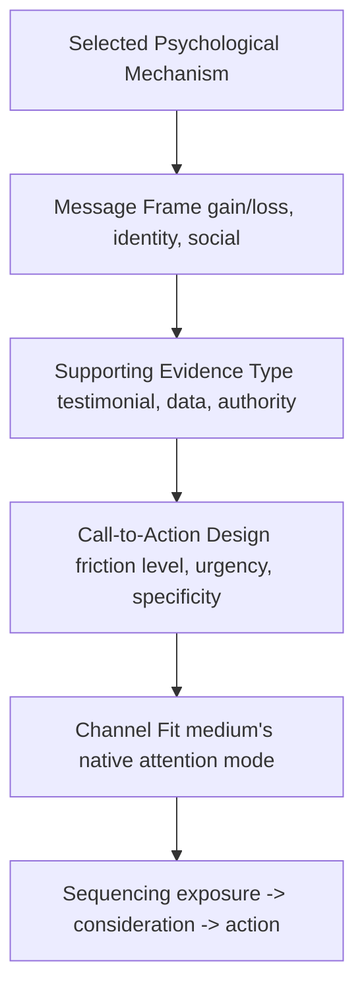
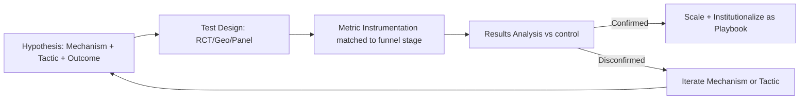

## Capstone: Designing a Psychologically Grounded Campaign

### Overview

This capstone integrates the theoretical and applied material from prior chapters — cognitive biases, dual-process theory, emotional processing, social influence, and emerging measurement/AI-mediated frontiers — into a single end-to-end campaign design methodology. The deliverable is a repeatable framework for building a campaign whose strategic choices are explicitly traceable to psychological mechanisms, rather than to intuition or convention alone.

**Key Points**

- A "psychologically grounded" campaign differs from a conventional one in that every major decision (message framing, channel sequencing, creative execution, timing, measurement) has an explicit behavioral rationale and a falsifiable hypothesis
- The capstone process has five phases: Diagnose, Hypothesize, Design, Execute, Validate
- Psychological grounding does not replace commercial objectives (reach, conversion, LTV) — it is a method for improving the odds that creative and media choices causally produce those outcomes

---

### 1. Phase 1 — Diagnose: Behavioral Audit of the Decision Context

#### 1.1 Mapping the Consumer Decision Journey to Psychological State

Before any creative work begins, map where in the decision journey the target behavior sits, since the dominant psychological lever differs by stage.

**Key Points**

- Early-funnel stages (Unaware/Aware) are dominated by System 1 processing — attention, affect, and fluency dominate over deliberation
- Mid-funnel (Considering/Intending) increasingly engages System 2 — comparative evaluation, risk assessment, and social validation become salient
- Late-funnel (Acting/Advocacy) is often decided by friction and post-decisional consistency motives rather than new persuasion

#### 1.2 Behavioral Audit Checklist

- **Category-level biases**: What heuristics dominate this product category (e.g., price-quality inference in premium goods, default bias in subscriptions)?
- **Competitive frame**: What anchor points has the competitive set already established in the consumer's mind?
- **Barrier diagnosis**: Is the primary barrier informational (lack of awareness), motivational (low perceived relevance), or volitional (intention-behavior gap)?
- **Regulatory/ethical constraints**: Which persuasion techniques are foreclosed by category regulation (e.g., health claims, financial services suitability rules) or platform policy?

---

### 2. Phase 2 — Hypothesize: From Psychological Theory to Testable Campaign Hypotheses

#### 2.1 The Hypothesis Structure

Each campaign hypothesis should follow a structured form linking mechanism to measurable outcome:

$$\text{If } M \text{ (mechanism)} \text{ is activated via } T \text{ (tactic)}, \text{ then } O \text{ (outcome)} \text{ will change by } \Delta \text{ among } S \text{ (segment)}$$

**Example**

"If **loss aversion** (mechanism) is activated via a **limited-time enrollment deadline framed as losing a founding-member rate** (tactic), then **conversion rate** (outcome) will increase among **price-sensitive prospects who abandoned checkout** (segment), relative to a gain-framed control."

#### 2.2 Mechanism Selection Matrix

| Consumer Barrier | Candidate Mechanism | Typical Tactic |
| --- | --- | --- |
| Low awareness | Mere exposure, distinctiveness/prediction-error | Pattern-interrupt creative, repeated light-touch exposure |
| Low perceived relevance | Self-referencing, identity signaling | Personalized messaging, in-group cues |
| High perceived risk | Social proof, authority, risk reversal | Reviews/testimonials, guarantees, expert endorsement |
| Price sensitivity | Anchoring, framing, mental accounting | Reference-price anchors, bundling, "per day" reframing |
| Intention-behavior gap | Implementation intentions, friction reduction | If-then prompts, one-click actions, default opt-ins |
| Post-purchase drop-off | Cognitive dissonance resolution, endowment | Onboarding reinforcement, usage-confirmation messaging |

**Key Points**

- [Inference] Selecting more than two or three primary mechanisms per campaign tends to dilute creative focus and complicate attribution; disciplined campaigns typically commit to a dominant mechanism per funnel stage rather than stacking many simultaneously, though this is a practical design heuristic rather than a strict empirical law
- Each hypothesis should specify a control condition or counterfactual to permit later validation (Phase 5)

---

### 3. Phase 3 — Design: Translating Mechanism into Creative and Channel Strategy

#### 3.1 Message Architecture

#### 3.2 Channel-Mechanism Fit

- **High-attention, low-dwell channels** (short-form video, social feed): favor fast-acting System 1 mechanisms — novelty, emotional salience, sonic/visual branding
- **High-dwell, high-intent channels** (search, comparison sites, owned website): favor System 2-compatible content — structured comparisons, risk-reversal statements, detailed social proof
- **Relationship/retention channels** (email, app push, loyalty programs): favor consistency and identity-reinforcement mechanisms — habit loops, milestone recognition, commitment reinforcement

**Key Points**

- Channel-mechanism mismatch (e.g., dense comparative data in a six-second video ad) is a common execution failure that undermines an otherwise sound psychological hypothesis
- Sequencing matters: exposing a System 2 mechanism (detailed proof) before sufficient System 1 attention/interest has been built typically yields poor engagement, since deliberation requires prior motivation to attend

#### 3.3 Creative Execution Guardrails

- Distinguish **persuasion** from **dark pattern**: the mechanism should increase message effectiveness through genuine relevance or valid social information, not through concealment, false scarcity, or reversal-of-consent design (see prior chapter on regulatory boundaries)
- Pre-test creative against the *specific* mechanism claim (e.g., if the hypothesis is anchoring-based, pre-test whether the anchor is actually noticed and believed, not just whether the ad is "liked")
- Build in **disclosure and compliance review** as a design-phase step, not a legal-approval afterthought, particularly for AI-generated content, biometric data use, or category-regulated claims

---

### 4. Phase 4 — Execute: Operational Integration

#### 4.1 Cross-Functional Dependencies

| Function | Role in Psychologically Grounded Execution |
| --- | --- |
| Creative/Brand | Encodes mechanism into message and visual system |
| Media/Programmatic | Ensures channel-mechanism fit and correct sequencing/frequency |
| Data/Analytics | Instruments the specific outcome metric tied to each hypothesis |
| Legal/Compliance | Validates claims and consent design against regulatory boundary |
| CRM/Lifecycle | Carries the mechanism through post-click/post-purchase journey |

**Key Points**

- A common execution failure is "hypothesis drift" — the tested creative concept is diluted or altered during production/legal review in ways that neutralize the intended psychological mechanism; maintaining a mechanism brief alongside the creative brief helps prevent this
- Frequency and timing should be calibrated to the mechanism: e.g., mere-exposure effects benefit from spaced repetition, while urgency/scarcity framing depends on a genuine and short time window to remain credible

---

### 5. Phase 5 — Validate: Measurement and Causal Attribution

#### 5.1 Experimental Design Options

| Design | Use Case | Strength |
| --- | --- | --- |
| A/B / Randomized controlled test | Digital channels with individual-level randomization | Strongest causal inference |
| Geo-holdout | Channels without individual targeting (TV, OOH) | Causal at aggregate/regional level |
| Pre/post with synthetic control | Single-market launches without holdout feasibility | Moderate — controls for macro trend |
| Matched-panel longitudinal | Long-term brand/attitude shifts | Captures delayed/cumulative effects |

#### 5.2 Metric Selection by Mechanism

**Key Points**

- Attention/novelty mechanisms → early metrics: view-through rate, scroll-stop rate, recall lift
- Risk-reduction/social-proof mechanisms → mid-funnel metrics: consideration lift, time-on-comparison-content, assisted conversions
- Friction-reduction/implementation-intention mechanisms → late-funnel metrics: cart-to-purchase rate, form completion rate, latency to action
- Consistency/identity mechanisms → retention metrics: repeat purchase rate, churn, advocacy/referral rate
- [Inference] Using a single aggregate metric (e.g., overall ROAS) to validate a mechanism-specific hypothesis typically produces weak or noisy signal, since the mechanism's effect is usually concentrated at one funnel stage rather than uniformly distributed across the journey

#### 5.3 Validation Workflow

---

### 6. Illustration: Full Capstone Framework (svg_diagram)

<svg xmlns="http://www.w3.org/2000/svg" viewBox="0 0 760 340">
<text x="380" y="26" text-anchor="middle" font-size="16" font-weight="bold" fill="#1a1a1a">Psychologically Grounded Campaign Framework (svg_diagram)</text>
<rect x="20" y="60" width="130" height="60" rx="6" fill="#e8f0fe" stroke="#3b5bdb" />
<text x="85" y="85" text-anchor="middle" font-size="12" fill="#1a1a1a">1. Diagnose</text>
<text x="85" y="102" text-anchor="middle" font-size="10" fill="#444">Behavioral audit</text>
<rect x="180" y="60" width="130" height="60" rx="6" fill="#fff3bf" stroke="#e8a800" />
<text x="245" y="85" text-anchor="middle" font-size="12" fill="#1a1a1a">2. Hypothesize</text>
<text x="245" y="102" text-anchor="middle" font-size="10" fill="#444">Mechanism to outcome</text>
<rect x="340" y="60" width="130" height="60" rx="6" fill="#ffe3e3" stroke="#e03131" />
<text x="405" y="85" text-anchor="middle" font-size="12" fill="#1a1a1a">3. Design</text>
<text x="405" y="102" text-anchor="middle" font-size="10" fill="#444">Creative + channel fit</text>
<rect x="500" y="60" width="130" height="60" rx="6" fill="#d3f9d8" stroke="#2f9e44" />
<text x="565" y="85" text-anchor="middle" font-size="12" fill="#1a1a1a">4. Execute</text>
<text x="565" y="102" text-anchor="middle" font-size="10" fill="#444">Cross-functional rollout</text>
<rect x="620" y="150" width="130" height="60" rx="6" fill="#e5dbff" stroke="#7048e8" />
<text x="685" y="175" text-anchor="middle" font-size="12" fill="#1a1a1a">5. Validate</text>
<text x="685" y="192" text-anchor="middle" font-size="10" fill="#444">Causal measurement</text>
<line x1="150" y1="90" x2="180" y2="90" stroke="#666" stroke-width="1.5" marker-end="url(#a2)" />
<line x1="310" y1="90" x2="340" y2="90" stroke="#666" stroke-width="1.5" marker-end="url(#a2)" />
<line x1="470" y1="90" x2="500" y2="90" stroke="#666" stroke-width="1.5" marker-end="url(#a2)" />
<line x1="630" y1="120" x2="670" y2="150" stroke="#666" stroke-width="1.5" marker-end="url(#a2)" />
<path d="M 685 210 Q 400 280 85 120" fill="none" stroke="#999" stroke-width="1.5" stroke-dasharray="5,4" marker-end="url(#a2)" />
<text x="380" y="270" text-anchor="middle" font-size="11" fill="#666">Iterate: disconfirmed hypotheses return to Diagnose/Hypothesize</text>
</svg>

---

### 7. Worked Capstone Example

**Example**

**Context**: A mid-market SaaS company launching a productivity tool faces high trial signups but low trial-to-paid conversion.

1. **Diagnose**: Behavioral audit reveals users understand the product (awareness is not the barrier) but underestimate long-term value relative to the switching effort required from incumbent tools — an intention-behavior gap compounded by status quo bias
2. **Hypothesize**: "If **implementation intentions** are activated via **a structured 3-step onboarding checklist with specific if-then prompts**, then **trial-to-paid conversion** will increase among **trial users who have not completed core setup by day 3**, relative to generic reminder emails"
3. **Design**: Onboarding email sequence reframed from generic "don't forget to upgrade" messaging to specific implementation prompts ("When you finish your first project on [date], set your billing reminder"); paired with endowment-framing copy referencing data/work already invested in the platform
4. **Execute**: CRM/lifecycle team implements triggered sequence; legal reviews claims around any comparative "switching cost" statements
5. **Validate**: RCT against existing reminder sequence, with day-14 conversion rate as the primary metric and setup-completion rate as a leading indicator; disconfirmation would prompt re-diagnosis of whether status quo bias or price sensitivity is the dominant barrier

---

### 8. Common Capstone Failure Modes

**Key Points**

- **Mechanism-outcome mismatch**: selecting a mechanism plausible in theory but untethered to the diagnosed barrier (e.g., applying scarcity framing when the actual barrier is trust, not urgency)
- **Untestable hypotheses**: vague hypotheses lacking a specified segment, control, or metric, making Phase 5 validation impossible after the fact
- **Overfitting to a single study**: [Inference] treating a single lab or field study as generalizable proof of a mechanism without accounting for population, category, and cultural moderators tends to produce fragile campaign strategy; effect sizes for classic biases vary substantially by context and should be treated as directionally informative rather than fixed constants
- **Ethical drift under performance pressure**: incrementally intensifying persuasion tactics toward manipulation as teams chase short-term lift, without revisiting the dark-pattern/regulatory boundary established in Phase 3

---

### Conclusion

A psychologically grounded campaign is distinguished not by the sophistication of any single tactic but by the traceability of the full chain: diagnosed barrier → selected mechanism → designed creative/channel execution → operational fidelity → causally validated outcome. This closes the loop between marketing psychology as a body of theory and marketing psychology as an applied, falsifiable discipline.

### Next Steps

- Build a mechanism-tagged creative testing library for ongoing campaigns
- Develop a standing experimentation roadmap prioritizing hypotheses by expected impact and testing feasibility
- Establish a cross-functional "behavioral review" checkpoint alongside legal/brand review in the campaign approval process
- Extend the framework to lifecycle/retention marketing and B2B/enterprise buying-committee dynamics
- Revisit Phase 5 validation data quarterly to update the mechanism selection matrix with organization-specific effect sizes