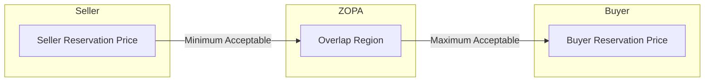

## Defining Negotiation and Its Core Elements

### Definition of Negotiation

Negotiation is a process through which two or more interdependent parties, each with distinct interests and preferences, communicate and exchange proposals in order to reach a joint decision that neither could achieve unilaterally, or could achieve only at greater cost. It is fundamentally a mechanism for resolving conflicts of interest through voluntary agreement rather than through unilateral action, coercion, or third-party imposition.

Several formal definitions from the field converge on the same essential structure:

- **Fisher, Ury & Patton (Getting to Yes)**: Negotiation is "back-and-forth communication designed to reach an agreement when you and the other side have some interests that are shared and others that are opposed."
- **Lewicki, Barry & Saunders**: Negotiation is an interpersonal decision-making process necessary whenever parties cannot achieve objectives through unilateral action.
- **Raiffa (The Art and Science of Negotiation)**: Frames negotiation as a joint decision-making process under conditions of partially aligned and partially opposed interests, formalized through the lens of decision analysis and game theory.

**Key Points**

- Negotiation requires at least two parties with a perceived conflict of interest.
- Parties must be interdependent — one party's outcome is affected by the other's choices.
- The process is voluntary; either party generally retains the option to walk away (absent this, it becomes coercion rather than negotiation).
- The outcome is a joint decision, distinguishing negotiation from unilateral decision-making or arbitration (where a third party decides).

### Core Elements of Negotiation

#### 1. Parties and Interdependence

Negotiation requires two or more parties whose outcomes are linked. Interdependence can be:

- **Zero-sum (distributive)**: one party's gain is another's loss.
- **Mixed-motive (integrative)**: parties have both competing and compatible interests, allowing for joint value creation.

Pure independence (no interdependence) eliminates the need to negotiate; pure conflict with no possible mutual gain reduces negotiation to a contest of power.

#### 2. Interests vs. Positions

A foundational distinction, popularized by Fisher and Ury, is between:

- **Positions**: the stated, surface-level demands a party brings to the table (e.g., "I want $50,000 for this contract").
- **Interests**: the underlying needs, concerns, fears, and motivations that generate the position (e.g., cash flow stability, risk aversion, reputational concerns).

Effective negotiation analysis operates at the level of interests, since multiple positions can often satisfy the same interest, opening space for creative, mutually beneficial solutions.

#### 3. BATNA (Best Alternative to a Negotiated Agreement)

BATNA is the course of action a party will pursue if the current negotiation fails to produce an agreement. It is the single most important source of negotiating power, because it sets the standard against which any proposed agreement is measured.

- A party should never accept a deal worse than its BATNA.
- Improving one's own BATNA (or worsening the counterparty's perceived BATNA) is a primary lever of negotiation strategy.
- BATNA is dynamic — it can change during the negotiation as new information emerges.

$$\text{Accept Agreement} \iff U(\text{Agreement}) > U(\text{BATNA})$$

where $U(\cdot)$ denotes the party's subjective utility.

#### 4. Reservation Price (Resistance Point)

The reservation price is the worst outcome a party is willing to accept before walking away — the point derived directly from BATNA. For a seller, it is the minimum acceptable price; for a buyer, the maximum.

#### 5. ZOPA (Zone of Possible Agreement)

The ZOPA is the range of outcomes between the parties' reservation prices within which any agreement is mutually acceptable. It exists only when the buyer's maximum exceeds the seller's minimum.

If the seller's reservation price exceeds the buyer's, there is a **negative bargaining zone**, and no rational agreement is possible without one party revising its position or BATNA.

#### 6. Target Point (Aspiration Point)

The outcome a party hopes to achieve — typically more ambitious than the reservation price. Research (Galinsky & Mussweiler) indicates that higher aspirations, anchored appropriately, tend to correlate with better outcomes, though excessively aggressive targets risk impasse. [Inference — the magnitude of this effect is context- and study-dependent]

#### 7. Value Claiming vs. Value Creating

- **Distributive (claiming) negotiation**: dividing a fixed pie; one party's gain is the other's loss.
- **Integrative (creating) negotiation**: expanding the pie through information exchange, trade-offs across issues of differing priority, and logrolling (trading concessions on low-priority issues for gains on high-priority ones).

Most real-world negotiations are "mixed-motive," requiring parties to both create and claim value — a tension sometimes called the **Negotiator's Dilemma**.

#### 8. Information Asymmetry

Parties typically have private information about their own interests, priorities, and BATNA that the other side does not fully observe. Strategic communication (signaling, questioning, selective disclosure) is largely about managing this asymmetry to both protect one's position and identify integrative trade-offs.

#### 9. Communication Process

Negotiation unfolds through iterative rounds of offers, counteroffers, arguments, and concessions. Core process elements include:

- **Anchoring**: the effect of an initial offer on the eventual settlement point.
- **Concession patterns**: the rate and size of movement from initial offers toward agreement, often signaling reservation price and priorities.
- **Framing**: how gains and losses are presented, influencing risk attitudes (per Prospect Theory — Kahneman & Tversky).

#### 10. Agreement and Commitment

Negotiation concludes with either impasse or an agreement, which requires mechanisms for durability: mutual understanding of terms, enforceability, and (in many contexts) formalization (contracts, MOUs).

### Diagram: Core Elements and Their Relationships

<svg xmlns="http://www.w3.org/2000/svg" viewBox="0 0 800 480" font-family="Arial, sans-serif">
<text x="400" y="30" font-size="18" font-weight="bold" text-anchor="middle" fill="#1a1a1a">Core Elements of Negotiation (svg_diagram)</text>
<rect x="40" y="60" width="220" height="90" rx="8" fill="#e8f0fe" stroke="#4a72c4" stroke-width="1.5" />
<text x="150" y="90" font-size="14" font-weight="bold" text-anchor="middle" fill="#1a1a1a">Parties</text>
<text x="150" y="112" font-size="12" text-anchor="middle" fill="#333">Interdependent, with</text>
<text x="150" y="128" font-size="12" text-anchor="middle" fill="#333">distinct interests</text>
<rect x="300" y="60" width="220" height="90" rx="8" fill="#fdf2e3" stroke="#d99a3f" stroke-width="1.5" />
<text x="410" y="90" font-size="14" font-weight="bold" text-anchor="middle" fill="#1a1a1a">Interests vs. Positions</text>
<text x="410" y="112" font-size="12" text-anchor="middle" fill="#333">Underlying needs vs.</text>
<text x="410" y="128" font-size="12" text-anchor="middle" fill="#333">stated demands</text>
<rect x="560" y="60" width="200" height="90" rx="8" fill="#e9f7ef" stroke="#3fa564" stroke-width="1.5" />
<text x="660" y="90" font-size="14" font-weight="bold" text-anchor="middle" fill="#1a1a1a">BATNA</text>
<text x="660" y="112" font-size="12" text-anchor="middle" fill="#333">Best fallback if</text>
<text x="660" y="128" font-size="12" text-anchor="middle" fill="#333">talks fail</text>
<line x1="260" y1="105" x2="300" y2="105" stroke="#888" stroke-width="1.5" marker-end="url(#arrow)" />
<line x1="520" y1="105" x2="560" y2="105" stroke="#888" stroke-width="1.5" marker-end="url(#arrow)" />
<rect x="150" y="200" width="220" height="90" rx="8" fill="#fbe9ee" stroke="#c4507a" stroke-width="1.5" />
<text x="260" y="230" font-size="14" font-weight="bold" text-anchor="middle" fill="#1a1a1a">Reservation Price</text>
<text x="260" y="252" font-size="12" text-anchor="middle" fill="#333">Worst acceptable</text>
<text x="260" y="268" font-size="12" text-anchor="middle" fill="#333">outcome, from BATNA</text>
<rect x="420" y="200" width="220" height="90" rx="8" fill="#eee8fb" stroke="#7d5fc4" stroke-width="1.5" />
<text x="530" y="230" font-size="14" font-weight="bold" text-anchor="middle" fill="#1a1a1a">ZOPA</text>
<text x="530" y="252" font-size="12" text-anchor="middle" fill="#333">Overlap of both parties'</text>
<text x="530" y="268" font-size="12" text-anchor="middle" fill="#333">reservation prices</text>
<line x1="660" y1="150" x2="530" y2="200" stroke="#888" stroke-width="1.5" marker-end="url(#arrow)" />
<line x1="260" y1="290" x2="480" y2="290" stroke="#888" stroke-width="1.5" />
<line x1="480" y1="290" x2="480" y2="245" stroke="#888" stroke-width="1.5" marker-end="url(#arrow)" />
<rect x="60" y="340" width="320" height="100" rx="8" fill="#e8f0fe" stroke="#4a72c4" stroke-width="1.5" />
<text x="220" y="368" font-size="14" font-weight="bold" text-anchor="middle" fill="#1a1a1a">Distributive (Claiming)</text>
<text x="220" y="390" font-size="12" text-anchor="middle" fill="#333">Fixed pie; win-lose</text>
<text x="220" y="406" font-size="12" text-anchor="middle" fill="#333">allocation of value</text>
<rect x="420" y="340" width="320" height="100" rx="8" fill="#e9f7ef" stroke="#3fa564" stroke-width="1.5" />
<text x="580" y="368" font-size="14" font-weight="bold" text-anchor="middle" fill="#1a1a1a">Integrative (Creating)</text>
<text x="580" y="390" font-size="12" text-anchor="middle" fill="#333">Trade-offs across issues</text>
<text x="580" y="406" font-size="12" text-anchor="middle" fill="#333">expand joint value</text>
<line x1="530" y1="290" x2="220" y2="340" stroke="#888" stroke-width="1.5" marker-end="url(#arrow)" />
<line x1="530" y1="290" x2="580" y2="340" stroke="#888" stroke-width="1.5" marker-end="url(#arrow)" />
</svg>

### Worked Example

Two parties negotiate the sale of a used car.

- Seller's reservation price: $8,000 (below this, seller prefers to sell to a dealer instead — that's the seller's BATNA).
- Buyer's reservation price: $9,500 (above this, buyer prefers a comparable car elsewhere — that's the buyer's BATNA).
- **ZOPA**: $8,000–$9,500, an $1,500 range of possible agreement.
- Seller's target/aspiration point: $9,200. Buyer's target: $8,300.
- Opening offers: Buyer opens at $7,500 (anchoring below even the seller's reservation price, a common tactic); seller counters at $9,800 (anchoring above buyer's reservation price).
- Through successive concessions, the parties converge toward, say, $8,700 — within the ZOPA, and reflecting the relative bargaining power, information, and concession patterns of each side.

If negotiation revealed an integrative dimension — e.g., the buyer values immediate possession while the seller values a delayed payment schedule for tax reasons — the parties could logroll: agree on a price near $8,900 in exchange for a payment plan, creating joint value beyond simple price-splitting.

### Distinguishing Negotiation from Related Concepts

| Concept | Key Distinction |
| --- | --- |
| Negotiation | Parties jointly reach a voluntary agreement |
| Mediation | Neutral third party facilitates but does not decide |
| Arbitration | Neutral third party renders a binding decision |
| Litigation | Court imposes a binding decision via formal legal process |
| Persuasion | One party seeks to change another's beliefs, not necessarily reach joint agreement |

**Related Topics**

- Distributive vs. Integrative Bargaining Strategies
- Game-Theoretic Foundations of Negotiation (Nash Bargaining Solution)
- Anchoring and Framing Effects in Offer Formation
- Multi-Issue Negotiation and Logrolling
- Historical Evolution: From Game Theory (von Neumann & Morgenstern) to Behavioral Negotiation Theory
- Power, BATNA Manipulation, and Perceived Alternatives
- Cross-Cultural Variation in Negotiation Norms