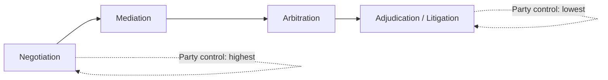
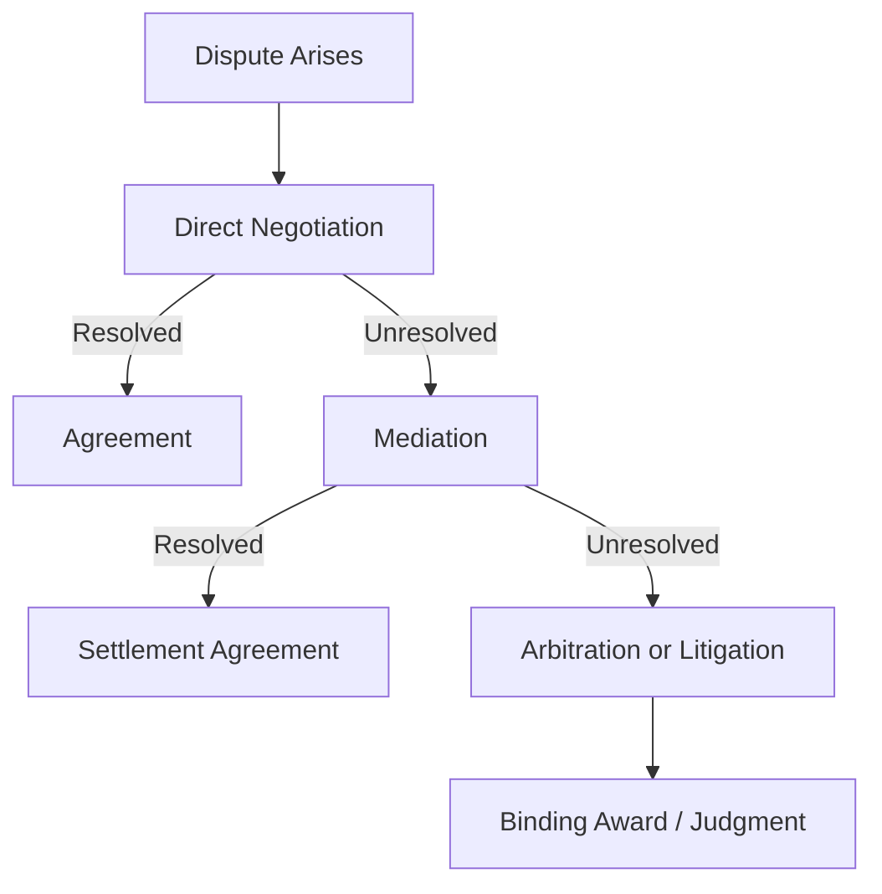

## Negotiation Compared With Mediation, Arbitration, and Adjudication

### Overview: The Dispute Resolution Spectrum

Negotiation, mediation, arbitration, and adjudication form a spectrum of dispute resolution mechanisms, distinguished primarily along two dimensions: **who controls the outcome** (the parties themselves vs. a third party) and **how binding the result is** (voluntary vs. enforceable). These mechanisms are collectively referred to as the ADR (Alternative Dispute Resolution) continuum when contrasted with formal litigation, though adjudication itself sits at the litigation end of that continuum.

**Key Points**

- Control over outcome decreases monotonically from negotiation to adjudication.
- Formality and procedural structure increase monotonically from negotiation to adjudication.
- Bindingness is generally absent in negotiation and mediation (unless codified into a contract) and present by design in arbitration and adjudication.
- Cost and time investment typically rise along the same axis, though this varies by jurisdiction and case complexity. [Inference — relative cost/time ordering is well-documented as a general tendency but not a fixed rule across all cases]

### Negotiation

**Definition**: A direct, bilateral or multilateral process in which the disputing parties themselves communicate to reach a voluntary joint agreement, without the involvement of a third-party decision-maker.

**Core characteristics**:

- Full party control over both process and outcome.
- No binding force unless and until the parties formalize an agreement (e.g., signed contract).
- Flexible procedure — no fixed rules of evidence, timeline, or format.
- Can be distributive (claiming value) or integrative (creating value).
- Requires ongoing willingness of both parties to continue; either may exit at any time (absent contractual obligation to negotiate in good faith).

**When typically used**: Commercial deal-making, labor-management relations, everyday interpersonal and organizational disputes, precontractual bargaining, and as the first-attempted mechanism before escalating to third-party processes.

### Mediation

**Definition**: A structured negotiation process facilitated by a neutral third party (the mediator), who assists communication and option-generation but has no authority to impose a decision.

**Core characteristics**:

- The mediator manages *process* (agenda, communication flow, reality-testing of positions) but not *substance* — the mediator does not decide the outcome.
- Outcome remains voluntary; either party can walk away, and the mediator cannot force acceptance.
- Mediator may use techniques such as caucusing (private separate sessions), reframing, and generating options for mutual gain.
- Confidentiality is typically a defining procedural feature, often protected by rule or statute (e.g., Uniform Mediation Act in various U.S. states, or Article 9 of the Singapore Convention framework internationally).
- If parties reach agreement, it is usually then formalized into a binding contract or consent order — the enforceability comes from that subsequent instrument, not the mediation itself.

**Distinguishing factor from negotiation**: The presence of a neutral facilitator who has no decision-making power but who structures and often accelerates the process, especially valuable when direct communication has broken down or power/emotional asymmetries impede progress.

### Arbitration

**Definition**: A private adjudicative process in which the disputing parties submit their dispute to one or more neutral arbitrators, who render a decision (the "award") after hearing evidence and argument. The award is typically final and binding.

**Core characteristics**:

- Parties lose direct control over the outcome; the arbitrator(s) decide.
- Binding by default in most jurisdictions and enforceable through statutory frameworks — e.g., the U.S. Federal Arbitration Act, and internationally the New York Convention (1958) on the Recognition and Enforcement of Foreign Arbitral Awards, ratified by over 170 states.
- Parties retain some control over *process design* prior to the dispute: choice of arbitrator(s), applicable rules (e.g., ICC, AAA, UNCITRAL Model Law, LCIA), seat/venue, and scope of arbitrable issues — usually specified in an arbitration clause within the underlying contract.
- Procedurally more formal than mediation (structured hearings, evidence submission) but generally less formal and more flexible than court litigation.
- Limited grounds for judicial appeal or review, contributing to speed and finality but also criticized for reduced error-correction.
- Can be binding or non-binding (rare; non-binding arbitration functions more like an advisory opinion, functionally closer to mediation in effect).

**Distinguishing factor from mediation**: The arbitrator *decides* the dispute rather than merely facilitating agreement; parties surrender outcome control in exchange for finality and procedural efficiency relative to courts.

### Adjudication (Litigation)

**Definition**: The resolution of a dispute through the formal court system, in which a judge (and, in some systems, a jury) applies the law to the facts and issues a binding, publicly enforceable judgment.

**Core characteristics**:

- Least party control: procedure, evidentiary rules, and timeline are governed by codified law and court rules, not party agreement.
- Decisions are binding and directly enforceable through the state's coercive power (e.g., writs of execution, garnishment).
- Generally public (proceedings and judgments are part of the public record), in contrast to the confidentiality typical of mediation and arbitration.
- Subject to appellate review, providing an error-correction mechanism absent (or limited) in arbitration.
- Establishes precedent in common-law systems, affecting parties beyond those in the immediate dispute — a systemic function the other three mechanisms do not serve.
- Typically the most time- and cost-intensive mechanism, though this varies significantly by jurisdiction, court backlog, and case complexity. [Inference — general tendency, not a universal constant]

### Comparative Table

| Dimension | Negotiation | Mediation | Arbitration | Adjudication |
| --- | --- | --- | --- | --- |
| Third party present | No | Yes (facilitator) | Yes (decision-maker) | Yes (judge/jury) |
| Who decides outcome | Parties | Parties | Arbitrator(s) | Court |
| Bindingness | Only if contracted | Only if contracted | Binding by default | Binding, state-enforced |
| Confidentiality | Typically private | Typically confidential | Usually confidential | Generally public |
| Procedural formality | Lowest | Low–moderate | Moderate–high | Highest |
| Appeal/review | N/A | N/A | Very limited | Available |
| Precedential effect | None | None | None (generally) | Yes (common law systems) |
| Relative cost/time | Lowest | Low | Moderate | Highest [Inference — typical ordering] |

### Interaction Between Mechanisms in Practice

These mechanisms are frequently combined rather than used in isolation:

- **Med-Arb**: mediation is attempted first; if unsuccessful, the same or a different neutral proceeds to binding arbitration on unresolved issues.
- **Negotiated settlement during litigation**: the large majority of filed lawsuits in many jurisdictions settle through negotiation (often mediation-assisted) before reaching trial. [Inference — settlement rates vary substantially by jurisdiction and case type, but the general pattern of high pre-trial settlement is well documented in U.S. civil litigation studies]
- **Multi-tiered dispute resolution clauses**: commercial contracts often specify an escalation ladder — direct negotiation, then mediation, then arbitration — as sequential preconditions before either party may proceed to the next tier.

### Worked Example

A supplier and a manufacturer dispute a $200,000 late-delivery penalty clause.

1. **Negotiation**: The parties' account managers discuss directly; the manufacturer argues force majeure, the supplier disputes it applies. No agreement — positions are entrenched and each side questions the other's good faith.
2. **Mediation**: Both parties, per their contract's escalation clause, engage a mediator. The mediator holds separate caucuses, uncovers that the manufacturer's actual concern is preserving the ongoing relationship, not just the $200,000, and proposes a phased payment plan combined with a revised future delivery schedule — a settlement neither had proposed directly. Suppose this fails because the supplier's board rejects any concession on the penalty amount itself.
3. **Arbitration**: Per the same contract's arbitration clause, the dispute proceeds to a single arbitrator under ICC rules. Evidence on the force majeure claim is submitted; the arbitrator issues a binding award requiring partial payment of $120,000.
4. **Adjudication** (if no arbitration clause existed, or if grounds for vacatur applied): The dispute would instead proceed to court, where a judge applies contract law, potentially with appellate review available to either party.

**Conclusion**

Negotiation, mediation, arbitration, and adjudication are best understood not as mutually exclusive alternatives but as points on a single continuum trading off party autonomy against decisional finality and enforceability. Negotiation theory studies the first and most fundamental of these mechanisms, but its core concepts (BATNA, interests vs. positions, ZOPA) remain analytically relevant even when a dispute escalates toward the third-party mechanisms, since a party's willingness to accept a mediated settlement or contest an arbitration is itself shaped by its alternatives and reservation point.

**Related Topics**

- Multi-Tiered (Escalation) Dispute Resolution Clauses
- The Role of BATNA in Mediation and Arbitration Contexts
- International Commercial Arbitration Frameworks (UNCITRAL, ICC, New York Convention)
- Med-Arb and Hybrid ADR Processes
- Confidentiality Privileges in Mediation
- Negotiating "In the Shadow of the Law" (litigation as a BATNA)
- Judicial Settlement Conferences and Court-Annexed ADR