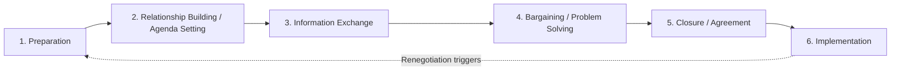

## The Negotiation Process: Phases and Stages

### Overview

Negotiation theory conceptualizes negotiation not as a single event but as a sequential process unfolding across distinct phases, each with characteristic tasks, behaviors, and risks. While various scholars propose slightly different stage models, most converge on a common underlying structure: preparation, relationship/agenda-building, information exchange, bargaining, and closure/implementation. Understanding this temporal structure allows negotiators to diagnose where a stalled negotiation is failing and to apply phase-appropriate tactics.

**Key Points**

- Phase models are heuristic, not rigid — real negotiations often loop back (e.g., new information in bargaining triggers renewed information exchange).
- Under-investment in the Preparation phase is one of the most consistently cited causes of poor outcomes across negotiation research. [Inference — this is a widely repeated practitioner and pedagogical finding rather than a single precisely quantified statistic]
- Different classic models (e.g., Gulliver's eight-phase model, Greenhalgh's seven-stage model, the simpler four-stage model common in business texts) vary mainly in granularity, not in the underlying logic.

### Phase 1: Preparation

**Purpose**: Establish the analytical and strategic foundation before any direct interaction with the counterparty.

**Core Tasks**:

- Identify your own interests (not just positions) and rank their priority.
- Estimate the counterparty's likely interests, constraints, and priorities.
- Determine your BATNA and reservation price; estimate the counterparty's BATNA.
- Research market data, precedents, benchmarks, or comparable agreements to support objective criteria.
- Define your target/aspiration point and your opening offer.
- Identify the issues to be negotiated and consider whether the negotiation is single-issue (likely distributive) or multi-issue (potential for integrative trade-offs).
- Plan concession strategy — the sequence and magnitude of likely concessions.
- Decide on team composition, roles, and authority limits (who has authority to agree to what).
- Consider logistics: location, timing, agenda, and who initiates.

**Example**: A hiring manager preparing to negotiate a job offer estimates the candidate's likely BATNA (a competing offer), determines the department's approved salary band (own reservation price = band ceiling), and prepares non-salary levers (signing bonus, remote flexibility, title) to use if salary alone cannot close the gap.

### Phase 2: Relationship Building and Agenda Setting

**Purpose**: Establish the interpersonal and procedural framework for the interaction.

**Core Tasks**:

- Build rapport and trust, particularly important in relational or long-term-partnership negotiations (less critical in one-shot, purely transactional deals).
- Agree on process: agenda, ground rules, time allocation, who speaks first, confidentiality expectations.
- Establish norms of communication (e.g., whether the negotiation will be principled/interest-based or more adversarial).
- Clarify authority and scope — confirm both sides have the standing to reach a binding agreement.

**Distinguishing Note**: In some frameworks (e.g., Gulliver's model), this phase is separated into "arranging the agenda" as its own distinct stage from relationship-building; in simpler four-stage business models, it is often folded into an initial "opening" stage together with Phase 1's tail end.

### Phase 3: Information Exchange (Diagnosis)

**Purpose**: Surface each party's interests, priorities, and constraints to identify both the zone of possible agreement and any integrative opportunities.

**Core Tasks**:

- Ask diagnostic questions to uncover underlying interests behind stated positions.
- Share (selectively) one's own priorities to encourage reciprocal disclosure.
- Listen actively; probe for information about the counterparty's constraints, alternatives, and priority ordering across issues.
- Identify differences in valuation, risk tolerance, time preference, or forecasts between the parties — these differences are often the raw material for integrative trade-offs (per the logic of "differences that create joint value").
- Test and calibrate initial assumptions made during Preparation against real signals from the counterparty.

**Key Points**

- This phase is frequently rushed or skipped by less experienced negotiators eager to move straight to offers — a documented driver of purely distributive, suboptimal outcomes. [Inference — general pattern from negotiation pedagogy and behavioral studies, not a fixed universal rate]
- Skilled negotiators in experimental studies (e.g., Neale & Bazerman's research on negotiator cognition) tend to ask more questions and spend proportionally more time in information exchange before bargaining.

### Phase 4: Bargaining and Problem Solving

**Purpose**: Generate, exchange, and evaluate specific proposals, converging toward an agreement (or impasse).

**Core Tasks**:

- Make and respond to offers and counteroffers.
- Employ anchoring (setting the first offer to influence the reference point for subsequent bargaining).
- Manage concessions strategically — pattern, pace, and framing of concessions signal information about reservation price and priorities.
- Where multiple issues exist, use logrolling/trade-offs (conceding on lower-priority issues in exchange for gains on higher-priority ones) to expand joint value.
- Use objective criteria (market data, precedent, expert standards) to legitimize proposals and reduce purely positional haggling.
- Manage impasses through reframing, introducing new issues, bringing in additional resources, or temporarily tabling contentious points.

**Example**: In a supplier price negotiation, rather than bargaining solely over unit price, the buyer discovers (via Phase 3) that the supplier values predictable order volume more than price per unit. The parties trade a slightly higher unit price for a 12-month volume commitment — a logroll that leaves both sides better off than a pure price-only negotiation.

$$\text{Concession}_t = O_t - O_{t-1}$$

where $O_t$ is a party's offer at round $t$; the trajectory of $\text{Concession}_t$ over time is frequently analyzed to infer a counterparty's proximity to its reservation price (diminishing concessions often signal approach to the limit).

### Phase 5: Closure and Agreement

**Purpose**: Convert a tentative convergence of interests into a finalized, mutually understood, and (where appropriate) binding commitment.

**Core Tasks**:

- Summarize and confirm all agreed terms explicitly, checking for misunderstandings across issues.
- Address any remaining minor issues before finalizing (often through small, face-saving concessions).
- Formalize the agreement in writing where appropriate (contract, MOU, term sheet).
- Manage psychological closure — signaling the end of bargaining to avoid one party attempting further concessions post-agreement ("nibbling").

**Key Points**

- Ambiguity left unresolved at closure is a common source of later disputes and renegotiation.
- The "closing" moment carries behavioral risk: reactive devaluation (undervaluing a concession simply because the other side offered it) and buyer's/seller's remorse can both destabilize a seemingly settled deal.

### Phase 6: Implementation and Post-Agreement Management

**Purpose**: Execute the agreed terms and manage the ongoing relationship, particularly relevant for multi-period or relational contracts.

**Core Tasks**:

- Monitor compliance with agreed terms.
- Address implementation disputes, which may trigger a return to negotiation (renegotiation) if circumstances change materially.
- Evaluate the negotiation process itself for lessons applicable to future negotiations (post-negotiation debrief).

**Distinguishing Note**: This phase is frequently omitted from simpler models focused purely on reaching agreement, but is emphasized in relational and organizational negotiation literature, since many negotiated agreements (labor contracts, supply agreements, joint ventures) require ongoing performance rather than a single discrete exchange.

### Comparative View of Classic Phase Models

| Model | Number of Stages | Notable Feature |
| --- | --- | --- |
| Simple Business Model | 4 (Preparation, Opening, Bargaining, Closing) | Common in introductory/practitioner texts |
| Gulliver (1979) | 8 (search for arena, agenda-setting, exploring the field, narrowing differences, preliminaries to final bargaining, final bargaining, ritual affirmation, execution) | Anthropological/processual, emphasizes ritual and cyclical movement |
| Greenhalgh (1987) | 7 (preparation, relationship building, information gathering, information using, bidding, closing, implementation) | Closely aligns with the six-phase synthesis above; widely used in negotiation pedagogy |
| Walton & McKersie (1965) | Not stage-based; distinguishes negotiation into four sub-processes (distributive, integrative, attitudinal structuring, intra-organizational bargaining) occurring throughout | Foundational for distinguishing negotiation *types* rather than strict *chronological* stages |

### Diagram: Effort and Information Flow Across Phases

<svg xmlns="http://www.w3.org/2000/svg" viewBox="0 0 780 380" font-family="Arial, sans-serif">
<text x="390" y="28" font-size="17" font-weight="bold" text-anchor="middle" fill="#1a1a1a">Negotiation Phases: Relative Emphasis Over Time (svg_diagram)</text>
<line x1="60" y1="320" x2="740" y2="320" stroke="#333" stroke-width="1.5" />
<line x1="60" y1="320" x2="60" y2="60" stroke="#333" stroke-width="1.5" />
<text x="400" y="355" font-size="12" text-anchor="middle" fill="#333">Time / Process Progression</text>
<text x="30" y="190" font-size="12" text-anchor="middle" fill="#333" transform="rotate(-90 30 190)">Relative Intensity</text>
<polyline points="80,260 160,150 240,180" fill="none" stroke="#4a72c4" stroke-width="2.5" />
<text x="120" y="270" font-size="11" text-anchor="middle" fill="#4a72c4">Preparation</text>
<polyline points="240,180 320,120 400,140" fill="none" stroke="#d99a3f" stroke-width="2.5" />
<text x="300" y="270" font-size="11" text-anchor="middle" fill="#d99a3f">Info Exchange</text>
<polyline points="400,140 480,90 560,110" fill="none" stroke="#3fa564" stroke-width="2.5" />
<text x="480" y="270" font-size="11" text-anchor="middle" fill="#3fa564">Bargaining</text>
<polyline points="560,110 640,200 700,260" fill="none" stroke="#c4507a" stroke-width="2.5" />
<text x="650" y="290" font-size="11" text-anchor="middle" fill="#c4507a">Closure</text>
<circle cx="80" cy="260" r="3.5" fill="#4a72c4" />
<circle cx="160" cy="150" r="3.5" fill="#4a72c4" />
<circle cx="240" cy="180" r="3.5" fill="#d99a3f" />
<circle cx="320" cy="120" r="3.5" fill="#d99a3f" />
<circle cx="400" cy="140" r="3.5" fill="#3fa564" />
<circle cx="480" cy="90" r="3.5" fill="#3fa564" />
<circle cx="560" cy="110" r="3.5" fill="#c4507a" />
<circle cx="640" cy="200" r="3.5" fill="#c4507a" />
<circle cx="700" cy="260" r="3.5" fill="#c4507a" />
</svg>

### Worked Example: Full Process Walkthrough

A startup founder negotiates a term sheet with a venture capital investor.

1. **Preparation**: Founder researches comparable valuations for similarly staged startups, calculates the minimum acceptable equity dilution (reservation price), and identifies BATNA as continuing to bootstrap or approaching a competing investor.
2. **Relationship Building/Agenda**: Initial calls establish rapport; both sides agree to discuss valuation, board composition, and liquidation preference as the three primary issues, in that order.
3. **Information Exchange**: The investor reveals a strong preference for board control provisions (governance-driven), while the founder learns the investor is less rigid on valuation than expected, but firm on a 1x non-participating liquidation preference.
4. **Bargaining**: The founder trades a board seat concession (lower priority for the founder) for a higher valuation (higher priority) — a logroll. Multiple rounds of term sheet redlines follow.
5. **Closure**: Both sides sign a term sheet; ambiguous language on pro-rata rights is clarified before signature to avoid future disputes.
6. **Implementation**: Legal teams draft definitive agreements; any deviation from term sheet terms during due diligence triggers a mini-renegotiation of specific clauses.

**Conclusion**

The phase structure of negotiation provides a diagnostic and strategic scaffold: most negotiation failures can be traced to a skipped or under-executed phase — most commonly insufficient preparation or premature bargaining before adequate information exchange. Recognizing which phase a stalled negotiation is actually in (rather than assuming failure is due to incompatible substantive positions) is often the key to unlocking progress.

**Related Topics**

- Anchoring Effects and First-Offer Strategy in the Bargaining Phase
- Diagnostic Questioning Techniques for Information Exchange
- Logrolling and Multi-Issue Trade-off Construction
- Renegotiation Triggers and Contractual Change-in-Circumstance Clauses
- Walton & McKersie's Four Sub-Processes of Labor Negotiation
- Cognitive Biases Affecting Each Negotiation Phase (Anchoring, Reactive Devaluation, Overconfidence)