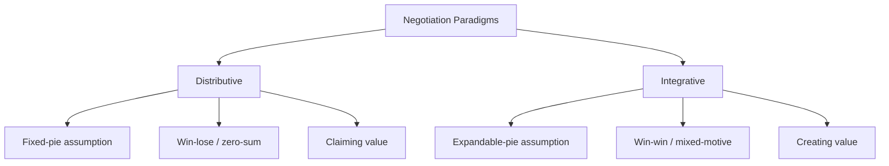

## Distributive and Integrative Paradigms Compared

### Overview

Distributive and integrative negotiation represent the two foundational paradigms in negotiation theory, first systematically distinguished by Walton and McKersie (1965) in *A Behavioral Theory of Labor Negotiations*. They describe fundamentally different assumptions about the structure of the underlying conflict: whether resources are fixed (distributive) or expandable through joint effort (integrative). Nearly all subsequent negotiation frameworks — including principled negotiation, the Negotiator's Dilemma, and modern behavioral negotiation research — build directly on this foundational distinction.

**Key Points**

- The terms describe the *structure of the negotiation problem*, not fixed personality traits or negotiation "styles" — the same negotiator moves between both modes depending on context.
- Most real-world negotiations are mixed-motive: they contain both distributive and integrative dimensions simultaneously.
- The paradigm chosen affects tactics, information-sharing behavior, and the psychological framing each party adopts.

### The Distributive Paradigm

**Definition**: Distributive negotiation (also called competitive, positional, or win-lose negotiation) treats the negotiation as a fixed-sum allocation problem: whatever one party gains, the other necessarily loses.

**Underlying Assumptions**:

- Total value available is fixed and known (or assumed to be fixed).
- Parties' interests are diametrically opposed on the issue(s) at hand.
- There is a single issue, or multiple issues are treated independently rather than as a package for trade-offs.

**Characteristic Behaviors and Tactics**:

- **Anchoring**: setting an aggressive first offer to shift the counterparty's reference point.
- **Information withholding**: concealing one's reservation price and true priorities, since revealing them cedes bargaining leverage.
- **Concession patterns**: small, decreasing concessions to signal approach to a limit.
- **Commitment tactics**: publicly committing to a position to constrain one's own future flexibility and thereby pressure the other side ("I've told my board I won't go below X").
- **Framing and threats**: emphasizing the counterparty's cost of walking away.

**Formal Structure**: In a single-issue distributive negotiation over price $P$, with seller reservation price $R_s$ and buyer reservation price $R_b$ (where $R_b > R_s$), any agreement $P \in [R_s, R_b]$ is a Pareto-efficient allocation of the fixed surplus $R_b - R_s$ — the negotiation is purely about *how* that fixed surplus is divided, not about growing it.

$$\text{Seller's share} = P - R_s, \quad \text{Buyer's share} = R_b - P$$

**When distributive framing is appropriate**: Single-issue transactions with no ongoing relationship (e.g., a one-time garage sale item, a used car sold to a stranger), where there is genuinely no additional value to create.

### The Integrative Paradigm

**Definition**: Integrative negotiation (also called collaborative, interest-based, or win-win negotiation) treats the negotiation as a joint problem-solving exercise in which the total value available can be expanded before it is divided.

**Underlying Assumptions**:

- Parties have some compatible interests alongside their competing ones.
- Multiple issues exist, and parties place different relative priorities on them.
- Differences between the parties (in valuation, risk tolerance, time horizon, forecasts, or resources) can be *sources* of joint value rather than mere obstacles.

**Mechanisms for Creating Value**:

1. **Logrolling**: trading concessions across issues of differing priority — conceding on a low-priority issue to gain on a high-priority one.
2. **Bridging**: inventing new options that satisfy both parties' underlying interests, rather than compromising on the original positions.
3. **Cost-cutting**: reducing one party's cost of agreeing to the other's preferred terms (e.g., offering to help implement a difficult condition rather than merely accepting it).
4. **Non-specific compensation**: one party gets its way on an issue, and the other is compensated with something unrelated to that issue.
5. **Expanding the pie**: adding entirely new resources or issues to the negotiation that were not initially on the table.

**Characteristic Behaviors and Tactics**:

- **Active information sharing**: revealing priorities (though not necessarily reservation price) to enable the discovery of trade-offs.
- **Diagnostic questioning**: probing to understand the counterparty's true interests and constraints.
- **Joint brainstorming**: generating multiple options before evaluating or committing to any one of them (per Fisher & Ury's principle of "inventing options for mutual gain").
- **Use of objective criteria**: appealing to fair, external standards to resolve disagreements without positional battles.

**Formal Illustration**: Consider two issues, price and delivery timeline, where Party A values price 70% / timeline 30%, and Party B values price 30% / timeline 70% (inverse priorities). A pure single-issue distributive split on price alone leaves value unrealized; a logroll — A gets favorable price terms, B gets favorable delivery terms — can move both parties closer to their respective aspiration points simultaneously, illustrated on a negotiation "frontier":

$$U_A(x) + U_B(x) \leq V_{max}$$

where integrative bargaining seeks agreements $x$ closer to the Pareto frontier $V_{max}$, rather than agreements that leave joint value unclaimed.

### The Negotiator's Dilemma

Most real negotiations require *both* creating and claiming value, producing a strategic tension identified by Lax and Sebenius (1986):

- Fully cooperative, transparent behavior (ideal for creating value) makes a party vulnerable to exploitation by a more competitive counterpart (who claims a disproportionate share of the jointly created value).
- Fully competitive, guarded behavior (protective for claiming value) can prevent the discovery of integrative trade-offs altogether, leaving joint value unrealized.

This dilemma has a structure analogous to the **Prisoner's Dilemma** in game theory: mutual cooperation produces the best joint outcome, but each party has an individual incentive to defect (behave distributively) if it expects the other to cooperate.

|  | Counterparty Cooperates (shares info) | Counterparty Competes (withholds info) |
| --- | --- | --- |
| **You Cooperate** | Joint value created and reasonably shared | You risk exploitation; counterparty claims disproportionate share |
| **You Compete** | You may claim disproportionate share of created value | Value-creating opportunities missed; likely suboptimal, contentious outcome |

**Key Points**

- Skilled integrative negotiators manage this dilemma through reciprocal, incremental information-sharing (testing trust gradually) rather than either full disclosure or full concealment.
- Trust-building mechanisms (reputation, repeated interaction, third-party facilitation) reduce the risk of exploitation and make cooperative, integrative behavior more sustainable.

### Comparative Table

| Dimension | Distributive | Integrative |
| --- | --- | --- |
| Pie assumption | Fixed | Expandable |
| Outcome structure | Win-lose (zero-sum) | Win-win (positive-sum), where possible |
| Information sharing | Guarded/strategic concealment | Active, reciprocal disclosure |
| Number of issues | Single, or issues treated independently | Multiple, linked for trade-offs |
| Primary tactics | Anchoring, commitment, concession management | Logrolling, bridging, joint brainstorming |
| Relationship orientation | Often short-term/transactional | Often longer-term/relational |
| Risk | Impasse, relationship damage | Exploitation by a competitive counterpart |
| Theoretical origin | Classical bargaining theory, game theory | Walton & McKersie; Fisher & Ury's principled negotiation |

### The Fixed-Pie Bias

A key behavioral finding relevant to this paradigm distinction is the **fixed-pie bias** (documented extensively by Bazerman and Neale): negotiators tend to *assume* a negotiation is purely distributive even when integrative potential exists, because they mistakenly assume the counterparty's interests are the mirror image of their own. This bias:

- Leads negotiators to overlook available logrolling opportunities.
- Is reduced through explicit information exchange and diagnostic questioning in the early phases of negotiation.
- Persists even among experienced negotiators absent deliberate counteracting effort. [Inference — this is a robust experimental finding across many replications, though the magnitude varies by study design and context]

### Diagram: Distributive vs. Integrative Outcome Space

<svg xmlns="http://www.w3.org/2000/svg" viewBox="0 0 760 420" font-family="Arial, sans-serif">
<text x="380" y="28" font-size="17" font-weight="bold" text-anchor="middle" fill="#1a1a1a">Distributive vs. Integrative Outcome Space (svg_diagram)</text>

<text x="190" y="55" font-size="14" font-weight="bold" text-anchor="middle" fill="`#c4507a`">Distributive</text>

<line x1="80" y1="360" x2="320" y2="360" stroke="#333" stroke-width="1.5" />

<line x1="80" y1="360" x2="80" y2="90" stroke="#333" stroke-width="1.5" />

<text x="200" y="395" font-size="11" text-anchor="middle" fill="#333">Party A's Share</text>

<text x="45" y="230" font-size="11" text-anchor="middle" fill="#333" transform="rotate(-90 45 230)">Party B's Share</text>

<line x1="90" y1="350" x2="300" y2="120" stroke="`#c4507a`" stroke-width="2.5" />

<circle cx="195" cy="235" r="4" fill="`#c4507a`" />

<text x="195" y="255" font-size="10" text-anchor="middle" fill="#333">Any point on line = fixed total</text>

<text x="570" y="55" font-size="14" font-weight="bold" text-anchor="middle" fill="`#3fa564`">Integrative</text>

<line x1="440" y1="360" x2="700" y2="360" stroke="#333" stroke-width="1.5" />

<line x1="440" y1="360" x2="440" y2="90" stroke="#333" stroke-width="1.5" />

<text x="570" y="395" font-size="11" text-anchor="middle" fill="#333">Party A's Share</text>

<text x="405" y="230" font-size="11" text-anchor="middle" fill="#333" transform="rotate(-90 405 230)">Party B's Share</text>

<path d="M450,350 Q570,80 690,120" fill="none" stroke="`#3fa564`" stroke-width="2.5" />

<line x1="470" y1="330" x2="600" y2="220" stroke="#999" stroke-width="1.5" stroke-dasharray="4,3" />

<circle cx="600" cy="220" r="4" fill="#999" />

<circle cx="640" cy="150" r="4" fill="`#3fa564`" />

<text x="600" y="245" font-size="9" text-anchor="middle" fill="#666">Sub-optimal (distributive-only) deal</text>

<text x="660" y="140" font-size="9" text-anchor="middle" fill="`#3fa564`">Pareto-improved deal</text>

<line x1="600" y1="220" x2="640" y2="150" stroke="`#3fa564`" stroke-width="1.5" stroke-dasharray="2,2" marker-end="url(#arrow2)" />

</svg>

### Worked Example

Two companies negotiate a joint venture agreement covering equity split, IP ownership, and governance rights.

**Distributive framing (naive approach)**: Both parties fixate solely on equity percentage, treating it as the only issue — a zero-sum battle over, say, 50/50 vs. 60/40. Each round of concessions produces resentment and slow progress; the negotiation nearly stalls at 55/45.

**Integrative reframing**: Through diagnostic questioning, the parties discover:

- Company A cares most about long-term IP ownership (to protect its core technology for future products).
- Company B cares most about near-term governance control (to satisfy its own board's oversight requirements) and is relatively indifferent to IP, since it plans to exit within 5 years.

A logroll emerges: Company A retains full IP ownership; Company B receives majority board control and a slightly larger equity share. Both parties achieve their higher-priority interest, producing an outcome closer to the Pareto frontier than the original 50/50 or 60/40 distributive framing — with the equity issue itself becoming secondary once the higher-priority interests were surfaced and traded.

**Conclusion**

The distributive/integrative distinction is not a claim that some negotiations are purely one or the other, but an analytical lens for identifying, within any given negotiation, which issues are genuinely fixed-sum and which contain unexploited potential for joint value creation. Effective negotiators diagnose this structure early (primarily during the information-exchange phase) and adapt their tactics — competitive and guarded where the pie is genuinely fixed, collaborative and information-sharing where trade-offs are possible — while managing the Negotiator's Dilemma inherent in mixing both modes within a single interaction.

**Related Topics**

- The Negotiator's Dilemma and Prisoner's Dilemma Analogies
- Logrolling, Bridging, and Non-Specific Compensation Techniques
- The Fixed-Pie Bias and Its Cognitive Origins
- Walton & McKersie's Four Sub-Processes of Labor Negotiation
- Pareto Efficiency and the Negotiation Frontier
- Trust-Building and Incremental Information Disclosure Strategies
- Principled Negotiation (Fisher & Ury's Getting to Yes Framework)