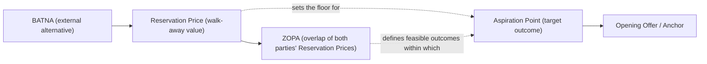

## Core Vocabulary: BATNA, ZOPA, Reservation Price, and Aspiration Point

### Overview

Negotiation theory relies on a small set of precisely defined terms that describe the structural conditions under which a deal becomes possible, and the thresholds that guide a negotiator's behavior within that structure. These four terms — BATNA, Reservation Price, ZOPA, and Aspiration Point — form the analytical backbone of nearly every subsequent framework in the field, including distributive bargaining, integrative negotiation, and anchoring theory. They originate primarily from the Harvard Negotiation Project (Fisher, Ury, and Patton's *Getting to Yes*, 1981) and from game-theoretic bargaining models developed in economics.

### BATNA (Best Alternative to a Negotiated Agreement)

**Definition**

BATNA is the most advantageous course of action a party can take if the current negotiation fails to produce an agreement. It is not a fallback "plan" in the abstract sense — it is the single best available alternative, evaluated concretely.

**Key Points**

- Coined by Roger Fisher and William Ury in *Getting to Yes*.
- BATNA is external to the negotiation table — it exists independent of what the counterparty offers.
- It functions as the true source of a negotiator's power: leverage comes not from stubbornness or aggression, but from the quality of one's alternative.
- A strong BATNA reduces dependence on reaching agreement; a weak BATNA increases pressure to concede.
- BATNA should be actively developed and improved before and during a negotiation, not treated as fixed.

**Worked Example**

A candidate negotiating salary has a competing offer of $95,000. This competing offer is the candidate's BATNA. If the employer will not offer at least an amount the candidate values more than $95,000 (accounting for non-monetary factors), the candidate's rational course is to walk away and accept the competing offer instead.

**Common Misconception**

BATNA is often confused with a "walk-away point" expressed in the same currency as the deal (e.g., a price). BATNA is the alternative course of action itself (e.g., "accept the other job offer," "keep the house on the market," "go to litigation"); the *value* of that alternative, translated into the negotiation's terms, is the Reservation Price.

### Reservation Price

**Definition**

The Reservation Price (also called the "reservation value," "resistance point," or informally the "walk-away point") is the specific value — usually monetary — at which a negotiator is indifferent between accepting a negotiated agreement and pursuing their BATNA instead.

**Key Points**

- Derived directly from BATNA: Reservation Price = the negotiation-table value of the BATNA.
- For a seller, the Reservation Price is a floor — the minimum acceptable price.
- For a buyer, the Reservation Price is a ceiling — the maximum acceptable price.
- Any offer worse than the Reservation Price is rationally rejected in favor of the BATNA.
- Reservation Price is private information in most real-world negotiations; concealing it (while probing the counterpart's) is a standard tactical objective.

**Worked Example**

Continuing the salary example: if the candidate values the competing $95,000 offer, plus its benefits package, at a combined $98,000 equivalent, then $98,000 is the candidate's Reservation Price for the current negotiation. Any offer below $98,000 (adjusted for equivalent non-salary terms) should be rejected in favor of the BATNA.

$$\text{Reservation Price} = f(\text{BATNA value, risk, timing, non-monetary factors})$$

### ZOPA (Zone of Possible Agreement)

**Definition**

ZOPA is the range of outcomes between the two parties' Reservation Prices within which a mutually acceptable agreement can theoretically be reached. It exists only when the buyer's maximum (ceiling) is greater than or equal to the seller's minimum (floor).

**Key Points**

- Also referred to as the "bargaining range" or "contract zone" in economics.
- A **positive ZOPA** exists when buyer's ceiling ≥ seller's floor — a deal is possible.
- A **negative ZOPA** exists when buyer's ceiling < seller's floor — no rational agreement is possible without a change in underlying alternatives or added value creation.
- ZOPA width itself does not determine how gains are split; that is determined by negotiation skill, information asymmetry, anchoring, and leverage — this is the classic "claiming value" problem in distributive bargaining.
- In integrative negotiation, parties can sometimes expand or reshape the ZOPA itself by introducing additional issues (multi-issue trades), rather than only dividing a fixed single-issue range.

**Worked Example (Single-Issue, Price)**

- Seller's Reservation Price (floor): $400,000
- Buyer's Reservation Price (ceiling): $430,000
- ZOPA: $400,000 to $430,000 (a $30,000 positive zone)

Any agreed price within this $30,000 band is rational for both parties, though each will attempt to close the deal near the opposite end of the range from their own Reservation Price.

**Negative ZOPA Example**

- Seller's floor: $450,000
- Buyer's ceiling: $430,000
- No positive ZOPA exists (a $20,000 gap). No rational single-issue deal is achievable unless one party's BATNA changes, additional issues are introduced, or new value is created.

### Aspiration Point

**Definition**

The Aspiration Point (also called the "target price" or "target point") is the outcome a negotiator hopes and plans to achieve — a realistic, ambitious goal set above (for the party seeking a higher price) or below (for the party seeking a lower price) the Reservation Price.

**Key Points**

- Distinct from Reservation Price: Reservation Price is the minimum acceptable outcome; Aspiration Point is the desired outcome.
- Research in negotiation psychology (notably Adam Galinsky's work on anchoring) consistently finds that negotiators with higher, specific, and justifiable aspiration points achieve better objective outcomes than those with vague or modest goals. [Inference — effect sizes and consistency vary across studies, contexts, and negotiator experience levels; this should not be read as a universal guarantee.]
- An effective Aspiration Point is typically justified by an external reference (market comparables, cost data, precedent) rather than an arbitrary number, since a justifiable anchor is harder for the counterpart to dismiss and easier for the negotiator to defend without loss of credibility.
- Setting the Aspiration Point too close to the Reservation Price tends to produce weaker outcomes (less room to concede while still landing favorably); setting it unrealistically far beyond credible bounds risks damaging credibility or provoking impasse.

**Worked Example**

In the salary negotiation, if the candidate's Reservation Price is $98,000, a well-calibrated Aspiration Point might be $115,000 — informed by market salary data for the role, the candidate's specific qualifications, and internal equity considerations at the target company. Opening near or above this Aspiration Point (rather than near the Reservation Price) leverages the anchoring effect while remaining defensible.

### Relationship Between the Four Concepts

The four terms form a causal and structural chain:

**Numeric Line Illustration (svg_diagram)**

<svg xmlns="http://www.w3.org/2000/svg" viewBox="0 0 700 220">
<text x="350" y="25" text-anchor="middle" font-size="16" font-weight="bold" fill="#1a1a1a">BATNA-Derived Bargaining Range (svg_diagram)</text>
<line x1="50" y1="120" x2="650" y2="120" stroke="#333" stroke-width="2" />
<line x1="150" y1="100" x2="150" y2="140" stroke="#c0392b" stroke-width="2" />
<text x="150" y="160" text-anchor="middle" font-size="12" fill="#c0392b">Seller Reservation</text>
<text x="150" y="175" text-anchor="middle" font-size="12" fill="#c0392b">Price ($400k)</text>
<line x1="500" y1="100" x2="500" y2="140" stroke="#2980b9" stroke-width="2" />
<text x="500" y="160" text-anchor="middle" font-size="12" fill="#2980b9">Buyer Reservation</text>
<text x="500" y="175" text-anchor="middle" font-size="12" fill="#2980b9">Price ($430k)</text>
<rect x="150" y="110" width="350" height="20" fill="#27ae60" fill-opacity="0.25" stroke="#27ae60" stroke-width="1.5" />
<text x="325" y="105" text-anchor="middle" font-size="13" font-weight="bold" fill="#27ae60">ZOPA ($30k)</text>
<line x1="470" y1="70" x2="470" y2="140" stroke="#8e44ad" stroke-width="2" stroke-dasharray="4,3" />
<text x="470" y="60" text-anchor="middle" font-size="12" fill="#8e44ad">Buyer Aspiration ($410k)</text>
<line x1="180" y1="70" x2="180" y2="140" stroke="#d35400" stroke-width="2" stroke-dasharray="4,3" />
<text x="180" y="55" text-anchor="middle" font-size="12" fill="#d35400">Seller Aspiration</text>
<text x="180" y="70" text-anchor="middle" font-size="12" fill="#d35400">($420k)</text>
</svg>

### Practical Application Sequence

1. **Estimate BATNA first** — before entering any negotiation, identify the genuinely best alternative course of action (not a wish, but a realistic fallback).
2. **Translate BATNA into a Reservation Price** — convert the alternative into a comparable value in the negotiation's terms.
3. **Estimate the counterpart's Reservation Price** — through research, questions, or inference, to assess whether a ZOPA likely exists.
4. **Set an Aspiration Point** — anchored to defensible external data, positioned ambitiously but credibly beyond the Reservation Price.
5. **Negotiate within the estimated ZOPA**, using the Aspiration Point to anchor opening offers and the Reservation Price as the hard floor/ceiling for acceptance.

### Common Pitfalls

- **Confusing BATNA with Reservation Price**: BATNA is the *action*; Reservation Price is the *value* of that action expressed in negotiation terms.
- **Failing to improve BATNA before negotiating**: a negotiator's leverage is a direct function of BATNA quality — walking in without having strengthened alternatives weakens the entire position.
- **Revealing Reservation Price prematurely**: doing so collapses the negotiator's share of the ZOPA, since the counterpart can then anchor offers just barely inside that boundary.
- **Setting Aspiration Points without justification**: an anchor unsupported by external reference points is more easily dismissed and can undermine credibility for the rest of the negotiation. [Inference — the magnitude of this effect is context-dependent and varies with negotiator experience and relationship dynamics.]
- **Assuming ZOPA is symmetric or fair**: a positive ZOPA guarantees a deal is *possible*, not that gains will be split evenly; distribution within the ZOPA depends on tactics, information, and relative BATNA strength.

**Related Topics**

- Distributive vs. Integrative Bargaining
- Anchoring and First-Offer Effects
- Multi-Issue Negotiation and Value Creation (Expanding the Pie)
- Information Asymmetry and Reservation Price Concealment Tactics
- Interests vs. Positions (Fisher & Ury Framework)
- Negotiator's Dilemma (Value Creation vs. Value Claiming)