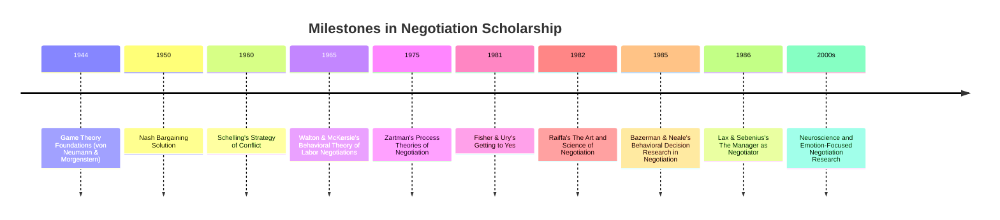

## Historical Milestones in Negotiation Scholarship

### Overview

Negotiation scholarship developed across several overlapping intellectual traditions — game theory, labor relations, social psychology, decision analysis, and law — before converging into the interdisciplinary field recognized today. Tracing this evolution clarifies why modern negotiation theory blends formal mathematical models with behavioral and interpersonal insight rather than resting on a single paradigm.

Note: the diagram above uses Mermaid `timeline` syntax purely as inert plaintext per the required fencing rules; it is not rendered.

**Key Points**

- Early formal foundations (1940s–1960s) came primarily from mathematical game theory and economics.
- The 1960s–1980s saw the rise of behavioral and process-oriented theories, particularly from labor relations and social psychology.
- The 1980s onward produced an integrative "negotiation analysis" school combining formal modeling with practical, prescriptive advice.
- Since the 2000s, research has increasingly incorporated cognitive/behavioral economics, neuroscience, and cross-cultural study.

### Foundational Game-Theoretic Era (1940s–1950s)

**Von Neumann and Morgenstern, *Theory of Games and Economic Behavior* (1944)**

Established the mathematical foundations of game theory, including the formalization of strategic interaction, utility theory, and cooperative games — providing the abstract scaffolding later applied to bargaining problems.

**John Nash, "The Bargaining Problem" (1950) and the Nash Bargaining Solution**

Nash provided the first axiomatic solution to the two-person bargaining problem, characterizing a unique outcome satisfying properties of Pareto efficiency, symmetry, invariance to affine transformations of utility, and independence of irrelevant alternatives. The Nash Bargaining Solution maximizes the product of each party's utility gain over their disagreement point (analogous to BATNA):

$$\max_{(u_A, u_B) \in S} (u_A - d_A)(u_B - d_B)$$

where $S$ is the feasible set of joint utility outcomes and $(d_A, d_B)$ is the disagreement (no-agreement) point. This remains a foundational reference model in formal negotiation analysis, even though real negotiators rarely follow it exactly. [Inference — the empirical deviation of real bargaining behavior from the Nash solution is well documented, though degree varies by context]

### The Strategic and Behavioral Turn (1960s)

**Thomas Schelling, *The Strategy of Conflict* (1960)**

Schelling, a Nobel laureate economist, introduced concepts central to modern negotiation strategy: **commitment tactics** (the strategic value of limiting one's own options to gain leverage), **focal points** (Schelling points — solutions parties converge on due to shared expectations even absent communication), and the strategic use of **credible threats and promises**. This work bridged formal game theory and real-world strategic behavior, including its application to international relations and deterrence.

**Walton and McKersie, *A Behavioral Theory of Labor Negotiations* (1965)**

A landmark work originating from labor relations research, this book introduced the foundational **distributive vs. integrative bargaining** distinction still central to negotiation theory today, along with two additional sub-processes: **attitudinal structuring** (managing the relationship and attitudes between parties) and **intra-organizational bargaining** (the internal negotiation each side's representatives must conduct with their own constituents). This four-process framework remains one of the most cited theoretical structures in the field.

### Process and Anthropological Approaches (1970s)

**I. William Zartman and process theories of negotiation**

Zartman and collaborators developed process-oriented and stage models of negotiation, particularly influential in international relations and diplomatic negotiation, emphasizing concepts such as the **"ripeness" of a conflict for negotiated resolution** (the idea that negotiations succeed only when both parties perceive a mutually hurting stalemate and a way out).

**P.H. Gulliver, *Disputes and Negotiations: A Cross-Cultural Perspective* (1979)**

An anthropological contribution proposing an eight-phase processual model of negotiation, notable for cross-cultural comparative analysis and its emphasis on negotiation as an evolving, cyclical social process rather than a linear sequence of discrete offers.

### The Harvard Negotiation Project and Principled Negotiation (1980s)

**Roger Fisher and William Ury, *Getting to Yes* (1981)**

Arguably the most widely read negotiation text ever published, this book codified **principled negotiation**, built on four core prescriptions:

1. Separate the people from the problem.
2. Focus on interests, not positions.
3. Invent options for mutual gain before deciding.
4. Insist on using objective criteria.

It also popularized the term **BATNA** (Best Alternative to a Negotiated Agreement) as a central practical concept, translating academic bargaining theory into an accessible, prescriptive framework for practitioners, mediators, and educators.

**Howard Raiffa, *The Art and Science of Negotiation* (1982)**

Raiffa, a pioneer of decision analysis, offered a rigorous formalization of negotiation combining game theory, decision theory, and behavioral observation. He introduced influential distinctions such as the difference between **symmetric prescriptive/descriptive analysis** (what one *should* do vs. what parties actually *do*) and helped found what later became known as **negotiation analysis** as a distinct academic discipline, bridging economics and behavioral science.

**David Lax and James Sebenius, *The Manager as Negotiator* (1986)**

Introduced the concept of the **Negotiator's Dilemma** — the strategic tension between creating value (requiring cooperative information-sharing) and claiming value (requiring competitive guardedness) — along with a systematic treatment of negotiation from a managerial and organizational perspective, including attention to the "negotiation within the negotiation" (managing one's own side/organization).

### Behavioral Decision Research (1980s–1990s)

**Max Bazerman and Margaret Neale, *Negotiating Rationally* (1992) and related research**

Applied Kahneman and Tversky's behavioral decision research and **Prospect Theory** directly to negotiation, documenting systematic cognitive biases affecting negotiators, including:

- The **fixed-pie bias** (assuming negotiations are more purely distributive than they are).
- **Anchoring effects** from initial offers.
- **Overconfidence** in the likelihood of favorable outcomes (e.g., trial verdicts, arbitration awards).
- **Reactive devaluation** (undervaluing a concession simply because it came from the counterparty).
- **Framing effects** (gain-framed vs. loss-framed proposals altering risk-taking behavior), directly drawing on Kahneman and Tversky's Prospect Theory (1979), for which Kahneman later received the Nobel Memorial Prize in Economic Sciences (2002).

This behavioral turn shifted negotiation scholarship from purely prescriptive/rational models toward descriptive study of how negotiators actually behave — including systematic deviations from rational-actor predictions.

### Expansion into Multiparty, Cross-Cultural, and Emotional Dimensions (1990s–2000s)

- **Multiparty and coalition negotiation research** extended bilateral models to settings with three or more parties, introducing coalition theory and voting/bargaining power indices (e.g., Shapley value applications).
- **Cross-cultural negotiation research** (e.g., work associated with scholars such as Jeanne Brett) examined how cultural dimensions (individualism/collectivism, direct/indirect communication norms, egalitarian/hierarchical structures) systematically affect negotiation behavior and outcomes.
- **Emotion and negotiation research** (e.g., work associated with Keith Allred and later scholars) moved beyond purely cognitive bias research to study the functional and dysfunctional roles of emotions such as anger, anxiety, and gratitude in bargaining interactions.

### Contemporary Directions (2000s–Present)

- **Neuroscience of negotiation and decision-making**: fMRI and physiological studies examining trust, fairness perception (e.g., research building on the Ultimatum Game), and reward processing during bargaining.
- **Computational and algorithmic negotiation**: growth of automated negotiation agents in multi-agent systems and AI research, applying formal bargaining theory to software agents negotiating on behalf of humans or autonomously.
- **Online and virtual negotiation research**: examining how digital communication channels (email, video, chat) affect trust formation, information exchange, and outcomes compared to face-to-face negotiation.
- **Behavioral field experiments**: increasing use of real-world field data (e.g., real estate transactions, labor disputes, e-commerce bargaining platforms) to test laboratory-derived theories at scale.

### Comparative Table of Major Theoretical Contributions

| Era | Key Scholar(s) | Core Contribution |
| --- | --- | --- |
| 1944 | von Neumann & Morgenstern | Formal game theory foundations |
| 1950 | Nash | Axiomatic bargaining solution |
| 1960 | Schelling | Commitment tactics, focal points, strategic threats |
| 1965 | Walton & McKersie | Distributive/integrative distinction; four sub-processes |
| 1979 | Gulliver | Cross-cultural, processual/anthropological stage model |
| 1981 | Fisher & Ury | Principled negotiation; BATNA popularized |
| 1982 | Raiffa | Negotiation analysis; decision-analytic formalization |
| 1986 | Lax & Sebenius | Negotiator's Dilemma; managerial negotiation |
| 1980s–90s | Bazerman & Neale | Behavioral biases in negotiation |
| 1990s–2000s | Brett, Allred, others | Cross-cultural and emotion-focused research |
| 2000s–present | Multiple | Neuroscience, computational agents, field experiments |

### Worked Example: Tracing a Single Concept's Lineage

The concept of **BATNA** illustrates how these traditions interconnect:

- Its formal root lies in the **disagreement point** $d$ in Nash's (1950) bargaining solution — the payoff each party receives absent agreement.
- Schelling's (1960) work on the strategic value of limiting one's own alternatives foreshadowed the *strategic manipulation* of one's perceived BATNA.
- Fisher and Ury (1981) popularized and named the concept for a practitioner audience, embedding it in mainstream negotiation training and legal/business education.
- Raiffa (1982) and subsequent negotiation analysts formalized its calculation and role within broader decision-analytic negotiation frameworks (e.g., explicit expected-value BATNA calculations under uncertainty).

This lineage exemplifies the field's broader pattern: concepts originate in formal mathematical theory, are adapted and named for practical application, and are subsequently re-formalized and empirically tested by behavioral researchers.

**Conclusion**

Negotiation scholarship's history reflects a repeated pattern of cross-pollination between formal/mathematical modeling (game theory, decision analysis) and empirical/behavioral study (labor relations, social psychology, cognitive science). No single school fully displaced its predecessors; instead, contemporary negotiation theory integrates the axiomatic rigor of Nash and Raiffa, the strategic insight of Schelling, the practical accessibility of Fisher and Ury, and the empirical grounding of Bazerman and Neale into a single, applied interdisciplinary field.

**Related Topics**

- The Nash Bargaining Solution and Axiomatic Bargaining Theory
- Schelling's Focal Points and Commitment Tactics
- Walton & McKersie's Four Sub-Processes Revisited
- Prospect Theory and Framing Effects in Negotiation
- Cross-Cultural Negotiation Research (Brett's Cultural Dimensions Framework)
- Computational and Multi-Agent Negotiation Systems
- The Ultimatum Game and Experimental Bargaining Research