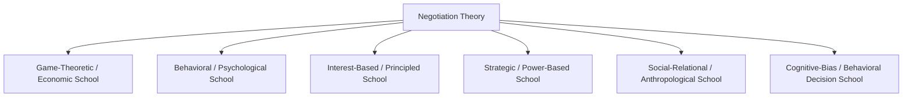
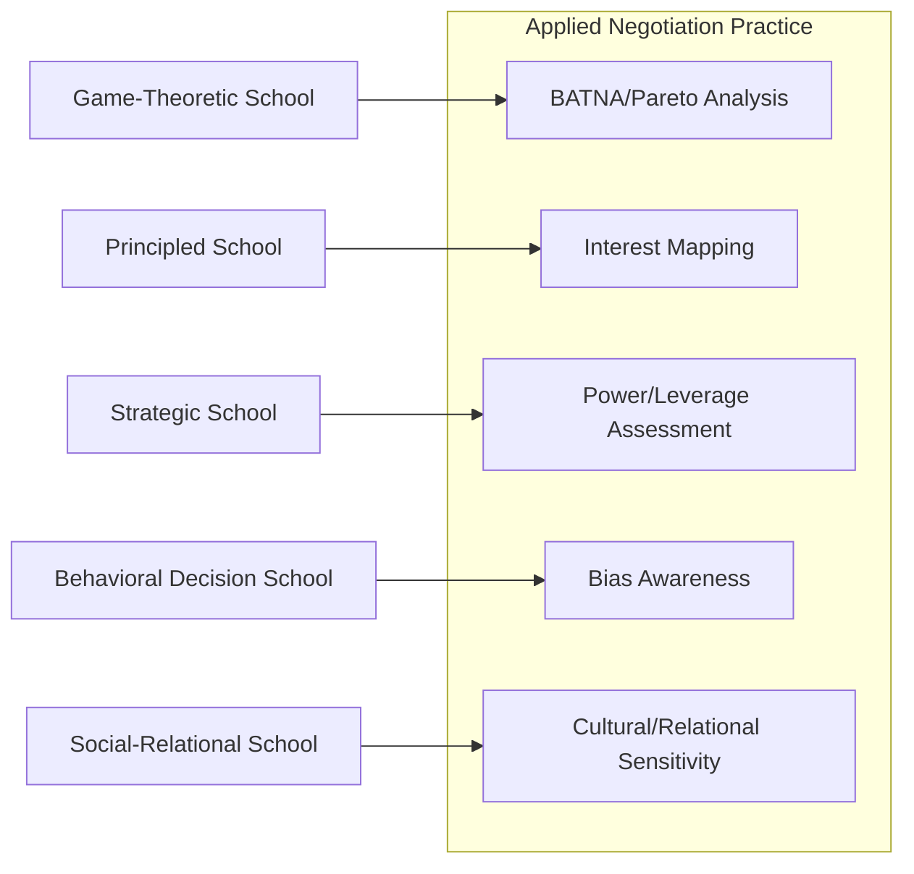

## Major Schools of Thought in Negotiation Theory

### Overview

Negotiation theory is not a single unified discipline but a confluence of several distinct schools of thought, each originating from a different parent discipline and each emphasizing different assumptions about rationality, the role of relationships, and what negotiators should optimize for. Understanding these schools clarifies why negotiation training materials sometimes appear contradictory (e.g., "always know your BATNA" vs. "focus on relationship and trust") — the apparent tension often reflects differing school-level assumptions rather than genuine inconsistency.

**Key Points**

- Schools differ chiefly in their assumed model of the negotiator: perfectly rational utility-maximizer, boundedly rational and bias-prone individual, relationship-embedded social actor, or strategic power-player.
- Most contemporary practitioner frameworks (e.g., principled negotiation) are hybrids, borrowing selectively from multiple schools.
- No single school is "correct" in all contexts — their relative usefulness depends on the negotiation's structure (one-shot vs. relational, single-issue vs. multi-issue, high-trust vs. adversarial).

### The Game-Theoretic / Economic School

**Core assumption**: Negotiators are rational, self-interested utility-maximizers; negotiation outcomes can be predicted and prescribed using formal mathematical models of strategic interaction.

**Foundational figures and contributions**:

- **John Nash**: the Nash Bargaining Solution, an axiomatic characterization of the "fair" cooperative bargaining outcome.
- **Thomas Schelling**: strategic use of commitment, credible threats, and focal points, extending game theory into applied strategic behavior.
- **Howard Raiffa**: decision-analytic extensions incorporating uncertainty and multiple issues, helping found the sub-discipline of **negotiation analysis**.

**Characteristic tools**: Utility functions, Pareto frontiers, disagreement points (BATNA-equivalents), expected value calculations under uncertainty, and formal solution concepts (Nash equilibrium, Nash bargaining solution).

**Strengths**: Provides rigorous, generalizable predictions; clarifies the theoretical boundary of efficient (Pareto-optimal) agreements; useful for structuring complex multi-issue trade-offs analytically.

**Limitations**: Assumes rationality and common knowledge of payoffs that real negotiators frequently violate; often underspecifies *process* (how parties actually communicate and converge) in favor of *outcome* prediction.

### The Interest-Based / Principled Negotiation School

**Core assumption**: Positional bargaining is inefficient and relationship-damaging; negotiators should focus on underlying interests and jointly search for mutually beneficial solutions before deciding.

**Foundational figures and contributions**:

- **Roger Fisher and William Ury** (Harvard Negotiation Project): *Getting to Yes* codified four core prescriptions — separate people from the problem, focus on interests not positions, invent options for mutual gain, and insist on objective criteria.
- **Bruce Patton** and later collaborators extended this into related frameworks addressing difficult conversations and emotional dimensions of negotiation.

**Characteristic tools**: Interest-mapping, brainstorming sessions decoupled from commitment, BATNA/reservation price analysis (adapted from the economic school but applied prescriptively), objective-criteria anchoring (market data, precedent, expert judgment).

**Strengths**: Highly practical and accessible; explicitly designed to preserve relationships alongside substantive outcomes; widely adopted in business education, mediation training, and diplomacy.

**Limitations**: Can understate the role of genuine power asymmetries and purely distributive situations where interests are truly and irreducibly opposed; critics argue it can be naively optimistic about the availability of integrative solutions in every negotiation. [Inference — this is a commonly cited critique in academic literature rather than a settled empirical conclusion]

### The Strategic / Power-Based School

**Core assumption**: Negotiation outcomes are substantially determined by the relative power, leverage, and alternatives available to each party; tactics for building, signaling, and exploiting power are the central object of study.

**Foundational figures and contributions**:

- **Thomas Schelling**: commitment tactics and the strategic value of *reducing* one's own options to gain credibility.
- Later power and influence scholars (e.g., work building on Robert Cialdini's influence research, though Cialdini's work originates in social psychology broadly rather than negotiation specifically) examined tactics such as reciprocity, scarcity framing, and social proof as applied to bargaining contexts.

**Characteristic tools**: BATNA improvement/degradation strategies, deadline and scarcity tactics, coalition-building to shift relative power, information control, and commitment devices.

**Strengths**: Realistic in adversarial, low-trust, or genuinely zero-sum contexts; explains outcomes that purely interest-based frameworks struggle to account for (e.g., outcomes driven by raw leverage rather than creative problem-solving).

**Limitations**: Can encourage manipulative or exploitative tactics that damage long-term relationships and reputation; less useful in repeated-interaction or highly interdependent relational contexts where trust has ongoing value.

### The Behavioral Decision / Cognitive-Bias School

**Core assumption**: Real negotiators are boundedly rational and systematically deviate from the predictions of formal game-theoretic models due to identifiable cognitive biases; understanding these biases improves both prediction and prescription.

**Foundational figures and contributions**:

- **Max Bazerman and Margaret Neale**: systematic documentation of negotiator biases including the fixed-pie bias, overconfidence, anchoring, and framing effects.
- **Daniel Kahneman and Amos Tversky**: Prospect Theory, providing the foundational psychological model (loss aversion, reference dependence, probability weighting) underlying many negotiation-specific biases.

**Characteristic tools**: Experimental and laboratory methodology, debiasing techniques, awareness training for anchoring and framing effects, structured decision aids to counteract overconfidence.

**Strengths**: Empirically grounded, with extensive experimental replication; directly actionable for improving individual negotiator judgment and training design.

**Limitations**: Primarily descriptive/diagnostic rather than fully prescriptive — identifying a bias does not always yield a clear tactical alternative; findings can be context- and population-dependent. [Inference — generalizability across cultural and demographic contexts is an active area of ongoing research rather than fully settled]

### The Social-Relational / Anthropological School

**Core assumption**: Negotiation is fundamentally a social and cultural process embedded in relationships, norms, rituals, and identity, not merely an economic transaction; understanding negotiation requires attention to relational context, culture, and process over time.

**Foundational figures and contributions**:

- **P.H. Gulliver**: cross-cultural, processual, and ritualistic dimensions of negotiation, drawn from anthropological fieldwork on dispute resolution across diverse societies.
- **Jeanne Brett** and cross-cultural negotiation researchers: systematic study of how cultural dimensions (individualism/collectivism, egalitarianism/hierarchy, direct/indirect communication) shape negotiation behavior and expectations.
- Relational contract theory scholars examining negotiation as embedded within ongoing, multi-period relationships rather than discrete, isolated events.

**Characteristic tools**: Ethnographic and comparative case study methods, cultural-dimension frameworks, attention to face-saving, ritual, and identity-related concerns often invisible to purely economic models.

**Strengths**: Explains cross-cultural variation in negotiation style and expectations that universalist economic or interest-based models can miss; captures the importance of long-term relationship maintenance in many real-world (especially international and commercial) negotiations.

**Limitations**: Less amenable to precise, generalizable prediction; findings are often context-specific and harder to translate into simple prescriptive rules.

### Comparative Table

| School | Parent Discipline | Core Unit of Analysis | Primary Strength | Primary Limitation |
| --- | --- | --- | --- | --- |
| Game-Theoretic / Economic | Economics, Mathematics | Utility, disagreement point | Rigorous, generalizable prediction | Assumes rationality often violated in practice |
| Interest-Based / Principled | Law, Management, Conflict Resolution | Interests vs. positions | Practical, relationship-preserving | May understate genuine power/zero-sum conflict |
| Strategic / Power-Based | Political Science, Strategy | Leverage, alternatives | Realistic in adversarial contexts | Risk of manipulative tactics, relationship damage |
| Behavioral Decision / Cognitive-Bias | Psychology, Behavioral Economics | Cognitive biases, heuristics | Empirically grounded, actionable | Primarily diagnostic, context-dependent |
| Social-Relational / Anthropological | Anthropology, Sociology | Culture, relationship, ritual | Explains cross-cultural variation | Less generalizable/predictive |

### How the Schools Interact in Practice

Modern negotiation pedagogy and professional practice rarely adhere to a single school in pure form. A typical contemporary negotiation training program synthesizes:

- **From the economic school**: rigorous BATNA/reservation-price analysis and Pareto-frontier thinking for structuring multi-issue trade-offs.
- **From the principled school**: interest-mapping and option-generation techniques.
- **From the strategic school**: awareness of power dynamics and tactical commitment devices, used judiciously.
- **From the behavioral school**: bias-awareness training (anchoring, fixed-pie bias, overconfidence) to improve judgment quality.
- **From the social-relational school**: sensitivity to cultural context and relationship-maintenance considerations, particularly in cross-border or long-term commercial negotiations.

### Worked Example

An international joint-venture negotiation between a U.S. technology firm and a Japanese manufacturing partner illustrates the schools operating together:

- **Game-theoretic lens**: Both firms' negotiation teams internally calculate reservation prices for equity share and licensing royalty rates, mapping the feasible Pareto set of agreements.
- **Principled lens**: The teams jointly explore underlying interests — the U.S. firm cares about IP protection; the Japanese firm cares about long-term market access and employment stability — surfacing a logroll opportunity.
- **Strategic lens**: The U.S. firm is aware that the Japanese firm has fewer alternative Western partners currently available (a relative BATNA weakness), but chooses not to exploit this fully, anticipating a long-term relationship.
- **Behavioral lens**: Negotiators on both sides are trained to recognize anchoring effects from initial royalty-rate proposals and to avoid overconfidence about their own market projections.
- **Social-relational lens**: The negotiation process deliberately allocates extended time for relationship-building (consistent with documented Japanese business negotiation norms emphasizing trust before substantive bargaining), and face-saving considerations shape how concessions are framed and communicated.

**Conclusion**

The major schools of negotiation thought are complementary lenses rather than competing, mutually exclusive theories. Effective negotiators and negotiation scholars draw on the economic school's rigor, the principled school's practicality, the strategic school's realism about power, the behavioral school's empirical grounding, and the social-relational school's cultural sensitivity — selecting emphasis according to the specific structure, stakes, and relational context of the negotiation at hand.

**Related Topics**

- The Nash Bargaining Solution and Formal Bargaining Models
- Principled Negotiation and the Harvard Negotiation Project
- Schelling's Strategic Theory of Commitment
- Cognitive Biases in Negotiation (Fixed-Pie Bias, Anchoring, Overconfidence)
- Cross-Cultural Negotiation Frameworks (Brett's Cultural Dimensions)
- Relational Contract Theory and Long-Term Negotiated Relationships
- Integrating Multiple Negotiation Frameworks in Practitioner Training