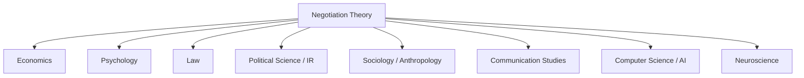

## Negotiation as an Interdisciplinary Field of Study

### Overview

Negotiation theory occupies a distinctive position among academic fields: it has no single disciplinary home, instead drawing simultaneously on economics, psychology, law, political science, sociology/anthropology, communication studies, and (increasingly) computer science and neuroscience. This interdisciplinary character is not incidental but constitutive — negotiation as a real-world phenomenon simultaneously involves rational strategic calculation, psychological and emotional processes, social and cultural context, legal and institutional structure, and communicative interaction, such that any single-discipline account is necessarily incomplete.

**Key Points**

- Each contributing discipline supplies a different unit of analysis: utility and incentives (economics), cognition and emotion (psychology), rules and enforceability (law), power and interstate bargaining (political science), culture and ritual (anthropology), message design (communication studies), and computational strategy (computer science).
- Business schools (notably Harvard, Wharton, Northwestern/Kellogg, and MIT/Sloan) played a central institutional role in synthesizing these disciplinary threads into a coherent applied field beginning in the late 20th century.
- The interdisciplinary character explains why negotiation curricula typically combine formal analytical tools (BATNA/ZOPA calculations) with experiential role-play exercises and cross-cultural case studies.

### Contribution from Economics

Economics supplies the formal, quantitative backbone of negotiation theory, primarily through **game theory** and **decision analysis**.

**Key contributions**:

- Formal modeling of strategic interaction (Nash equilibrium, bargaining games, auction theory as a related mechanism-design field).
- The concept of **utility** as a unifying metric for comparing heterogeneous interests across parties and issues.
- **Mechanism design** — the study of how to structure rules/institutions (e.g., auction formats, allocation mechanisms) to produce desirable negotiated or market outcomes, connecting negotiation theory to broader market design.
- **Information economics**, including signaling and screening models relevant to how negotiators reveal or conceal private information about reservation prices and priorities.

**Distinctive methodology**: Formal mathematical proof and axiomatic derivation (e.g., Nash's bargaining solution), alongside laboratory and field experiments in experimental economics.

### Contribution from Psychology

Psychology, particularly cognitive and social psychology, supplies the behavioral and interpersonal dimensions largely absent from pure economic models.

**Key contributions**:

- **Cognitive/behavioral decision research**: documentation of systematic biases (anchoring, fixed-pie bias, overconfidence, framing effects) via Kahneman, Tversky, Bazerman, and Neale.
- **Social psychology of persuasion and influence**: reciprocity, commitment/consistency, social proof, and authority effects relevant to concession-making and offer framing.
- **Emotion research**: the functional and dysfunctional roles of specific emotions (anger, anxiety, gratitude, guilt) in shaping concessions, trust, and impasse.
- **Interpersonal and group dynamics**: research on trust formation, rapport, and the effects of communication medium (face-to-face vs. virtual) on negotiation outcomes.

**Distinctive methodology**: Controlled laboratory experiments, often using simplified bargaining games or negotiation simulations with randomized manipulation of variables (e.g., framing condition, information availability).

### Contribution from Law

Legal scholarship contributes both the institutional context within which many negotiations occur and a distinct theoretical tradition examining negotiation as a professional practice.

**Key contributions**:

- **Contract theory and enforceability**: analysis of how negotiated agreements are formalized, interpreted, and enforced, and how anticipated legal consequences shape negotiation behavior ("bargaining in the shadow of the law," per Mnookin and Kornhauser's influential 1979 framework analyzing divorce negotiation).
- **Alternative Dispute Resolution (ADR) scholarship**: comparative analysis of negotiation, mediation, arbitration as distinct legal mechanisms, and the design of court-annexed ADR programs.
- **Legal negotiation pedagogy**: law schools (prominently Harvard Law School, home of the Program on Negotiation) have been central institutional incubators of negotiation theory, given negotiation's centrality to legal practice (settlement negotiation, plea bargaining, transactional deal-making).
- **Ethics of negotiation**: legal and professional-responsibility scholarship examining the boundaries of permissible tactics (e.g., puffery vs. fraud in negotiation representations).

### Contribution from Political Science and International Relations

Political science, particularly the subfield of international relations, contributes theory on negotiation at the level of states, coalitions, and large-scale conflict resolution.

**Key contributions**:

- **Strategic bargaining and deterrence theory**: Thomas Schelling's foundational work bridging game theory and international strategic behavior (commitment, credible signaling, brinkmanship).
- **Diplomatic and treaty negotiation process theory**: I. William Zartman's concept of **"ripeness"** — the idea that negotiated settlement of conflicts becomes possible only when parties perceive a mutually hurting stalemate alongside a viable way out.
- **Multiparty and coalition negotiation**: extensions of bilateral bargaining theory to multilateral treaty negotiations (e.g., climate change accords, trade agreements), incorporating coalition formation and voting power analysis.

### Contribution from Sociology and Anthropology

These disciplines contribute attention to negotiation as embedded social practice, shaped by culture, ritual, and group identity rather than purely individual strategic calculation.

**Key contributions**:

- **Cross-cultural negotiation research** (e.g., Jeanne Brett's comparative work): systematic study of how cultural dimensions — individualism/collectivism, egalitarianism/hierarchy, direct/indirect communication styles — shape negotiation expectations, tactics, and outcomes across societies.
- **Anthropological process theory** (P.H. Gulliver): negotiation as a culturally embedded, ritualized social process, studied through ethnographic and comparative case methods across diverse traditional and modern societies.
- **Organizational sociology**: study of negotiation within organizational hierarchies, including intra-organizational bargaining (per Walton and McKersie) between negotiators and their own constituents.

### Contribution from Communication Studies

Communication studies examines the micro-level linguistic and interactional processes through which negotiation is conducted.

**Key contributions**:

- **Discourse and conversation analysis**: close study of turn-taking, question framing, and persuasive language patterns within actual negotiation transcripts.
- **Nonverbal communication research**: the role of tone, pacing, silence, and (in face-to-face settings) body language in signaling concession willingness or firmness.
- **Framing theory**: how the linguistic presentation of proposals (gain-framed vs. loss-framed, consistent with Prospect Theory) shapes counterpart perception and response.

### Contribution from Computer Science and Artificial Intelligence

An increasingly significant contributor, computer science has developed formal computational models of negotiation relevant both to automated systems and to testing human negotiation theory at scale.

**Key contributions**:

- **Automated negotiation agents**: software agents that negotiate on behalf of users or autonomously in multi-agent systems (e.g., automated procurement, supply chain coordination, and e-commerce bargaining platforms).
- **Formal negotiation protocols**: precise specification of offer-exchange rules, deadlines, and concession algorithms for artificial agents, often drawing directly on the game-theoretic bargaining models developed in economics.
- **Computational modeling of behavioral biases**: simulation-based testing of how biases identified in human behavioral research (e.g., fixed-pie bias) manifest and can be corrected in automated or human-agent hybrid negotiation systems.

### Contribution from Neuroscience

A more recent contributor, cognitive and social neuroscience has begun to examine the biological substrates of negotiation-relevant behavior.

**Key contributions**:

- **Neuroimaging studies of trust and fairness perception**, often building on experimental paradigms such as the **Ultimatum Game**, examining brain regions associated with reward processing, fairness evaluation, and emotional regulation during bargaining.
- **Physiological stress-response research** examining how cortisol and related stress markers correlate with negotiation performance and risk-taking behavior.
- This subfield remains comparatively young relative to the economic, psychological, and legal traditions, with findings still undergoing replication and refinement. [Inference — the relative maturity assessment reflects the field's publication history and is a reasonable characterization rather than a precisely measurable claim]

### Comparative Table: Disciplinary Contributions

| Discipline | Primary Unit of Analysis | Signature Concepts | Representative Methodology |
| --- | --- | --- | --- |
| Economics | Utility, incentives | Nash Bargaining Solution, BATNA, Pareto efficiency | Formal proof, experimental economics |
| Psychology | Cognition, emotion | Fixed-pie bias, anchoring, framing, Prospect Theory | Controlled laboratory experiments |
| Law | Rules, enforceability | Bargaining in the shadow of the law, ADR | Doctrinal analysis, case study |
| Political Science / IR | Power, state interests | Ripeness, deterrence, coalition bargaining | Historical case analysis, formal modeling |
| Sociology / Anthropology | Culture, social structure | Cross-cultural dimensions, ritual process | Ethnography, comparative case study |
| Communication Studies | Language, interaction | Discourse analysis, framing | Conversation/discourse analysis |
| Computer Science / AI | Computational strategy | Automated negotiation agents, protocols | Algorithm design, simulation |
| Neuroscience | Neural/physiological process | Fairness perception, reward processing | Neuroimaging, physiological measurement |

### Institutional Synthesis: The Harvard Negotiation Project and Beyond

The interdisciplinary integration of negotiation theory was substantially advanced by dedicated academic centers designed explicitly to bridge these disciplines:

- The **Harvard Program on Negotiation (PON)**, founded in the early 1980s as a University consortium including Harvard Law School, Harvard Business School, MIT, and Tufts' Fletcher School, deliberately brought together legal scholars (Fisher, later Sander), business school researchers, and international relations specialists.
- Business schools including **Wharton, Northwestern's Kellogg School, MIT Sloan, and Stanford GSB** developed parallel negotiation research centers integrating behavioral decision research with management practice.
- This institutional pattern — deliberately interdisciplinary research centers rather than single-department programs — reflects the field's recognition, from its formative period onward, that no single discipline's tools were sufficient to fully characterize negotiation as a phenomenon.

### Worked Example: A Single Negotiation Analyzed Through Multiple Disciplinary Lenses

A cross-border merger negotiation between a European pharmaceutical company and a U.S. biotech firm can be simultaneously analyzed as:

- **Economic lens**: Formal valuation modeling determines each side's reservation price for the acquisition premium; game-theoretic analysis of the bidding process if a competing acquirer emerges.
- **Psychological lens**: Negotiators are coached to recognize anchoring effects from the initial valuation offer and to manage overconfidence in their own due-diligence projections.
- **Legal lens**: Antitrust review requirements and cross-border regulatory approval processes shape the negotiation's timeline and contingency structure ("bargaining in the shadow of" competition law).
- **Political/IR-adjacent lens**: Government investment-screening regimes (e.g., national security review of foreign acquisitions) introduce a quasi-political dimension affecting deal structure and negotiating leverage.
- **Sociological/cultural lens**: Differences in European and U.S. corporate governance norms and communication styles shape negotiation pacing and decision-making authority structures.
- **Communication lens**: Careful framing of layoff and restructuring provisions (loss-framed vs. gain-framed language) affects how each side's board and employees perceive the deal's fairness.

No single disciplinary lens fully explains the negotiation's dynamics or outcome; the interdisciplinary field exists precisely to integrate these simultaneously operative dimensions.

**Conclusion**

Negotiation's interdisciplinary character is not a weakness to be resolved by eventual consolidation into a single parent discipline, but a structural reflection of negotiation's nature as simultaneously an economic, psychological, legal, political, social, communicative, and (increasingly) computational phenomenon. The field's major institutional and theoretical advances have consistently come from deliberate cross-disciplinary synthesis — a pattern likely to continue as computational and neuroscientific methods further mature.

**Related Topics**

- The Harvard Program on Negotiation: Institutional History
- Bargaining in the Shadow of the Law (Mnookin & Kornhauser)
- Automated and AI-Driven Negotiation Agents
- Cross-Cultural Negotiation Dimensions (Brett's Framework)
- The Ultimatum Game and Neuroscience of Fairness
- Discourse and Conversation Analysis in Bargaining Transcripts
- Mechanism Design and Auction Theory as Related Fields