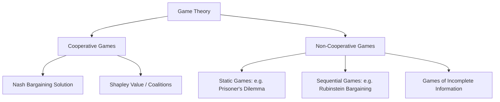

## Introduction to Game Theory for Negotiators


### Overview

Game theory is the mathematical study of strategic interaction — situations in which the outcome for each participant depends not only on their own choices but on the choices of others. For negotiators, game theory provides a formal vocabulary for analyzing bargaining as a structured strategic problem: identifying players, their available strategies, the payoffs associated with different outcomes, and the equilibrium behaviors that rational, self-interested actors would be expected to adopt. While real negotiators frequently deviate from purely rational predictions (see behavioral decision research), game theory remains the essential analytical starting point for understanding *why* certain bargaining structures produce certain classes of outcomes.



**Key Points**

- Game theory divides broadly into **cooperative** games (binding agreements possible; focus on how to divide jointly achievable outcomes) and **non-cooperative** games (no binding commitments; focus on individually optimal strategies given others' strategies).
- Most classical negotiation theory (Nash, Raiffa) uses cooperative game theory; non-cooperative game theory (Rubinstein, Nash equilibrium analysis) explains *why* certain bargaining outcomes emerge from strategic interaction without an external enforcer.
- A negotiator does not need to solve formal games mathematically in real time — the value of game theory is in structuring intuition about incentives, credible threats, and equilibrium outcomes.

### Core Building Blocks

#### Players, Strategies, and Payoffs

Every game-theoretic model requires:

- **Players**: the decision-making parties (e.g., buyer and seller).
- **Strategies**: the complete set of possible actions/plans available to each player (e.g., possible offers, whether to accept or reject a given offer).
- **Payoffs**: the utility each player receives for each combination of strategies chosen by all players.

**Key Points**

- Payoffs are typically expressed in utility terms, not raw dollar amounts, since parties may have different risk attitudes or non-monetary interests (reputation, relationship, precedent-setting).
- The specification of the **payoff matrix** (for simultaneous games) or **game tree** (for sequential games) is itself often the hardest and most consequential modeling step in applying game theory to a real negotiation.

#### Nash Equilibrium

A **Nash equilibrium** is a set of strategies, one for each player, such that no player can improve their payoff by unilaterally changing their own strategy, given the strategies chosen by all other players.

$$\forall i,\ u_i(s_i^*, s_{-i}^*) \geq u_i(s_i, s_{-i}^*) \quad \text{for all } s_i$$

where $s_i^*$ is player $i$'s equilibrium strategy and $s_{-i}^*$ denotes the equilibrium strategies of all other players.

**Interpretation for negotiators**: A Nash equilibrium represents a mutually consistent set of expectations — if both parties believe the other will play their equilibrium strategy, neither has an incentive to deviate. It does not guarantee a *good* or *fair* outcome — multiple equilibria can exist, some highly favorable to one side.

### Illustrative Non-Cooperative Game: The Prisoner's Dilemma

The Prisoner's Dilemma is the canonical example illustrating why individually rational choices can produce a jointly worse outcome than mutual cooperation — directly analogous to the **Negotiator's Dilemma** (the tension between creating and claiming value).

|  | Counterparty Cooperates | Counterparty Defects |
| --- | --- | --- |
| **You Cooperate** | (3, 3) — Mutual gain | (0, 5) — You are exploited |
| **You Defect** | (5, 0) — You exploit | (1, 1) — Mutual loss |

In a single-round game, defection is a **dominant strategy** for each player (it yields a higher payoff regardless of the other's choice), producing the (1,1) Nash equilibrium — worse for both than mutual cooperation at (3,3). This structure explains why negotiators, even when integrative gains are possible, may default to guarded, competitive (distributive) behavior absent trust-building mechanisms.

**Key Points**

- **Repeated interaction** changes this dynamic substantially: in an infinitely (or indefinitely) repeated Prisoner's Dilemma, cooperative equilibria become sustainable through strategies such as **Tit-for-Tat** (cooperate first, then mirror the counterpart's previous move), since the shadow of future retaliation deters short-term defection.
- This is a key theoretical explanation for why long-term business relationships sustain more integrative, trust-based negotiation behavior than one-shot transactions.

### Sequential Bargaining: The Rubinstein Model

Ariel Rubinstein's (1982) alternating-offers bargaining model is the foundational non-cooperative model explaining *how* parties converge on a specific division of value through a sequential offer-counteroffer process, rather than merely characterizing the set of possible efficient outcomes (as Nash's cooperative solution does).

**Setup**: Two players alternate making offers on how to divide a fixed surplus (normalized to 1). Each round of delay imposes a cost, modeled via a discount factor $\delta \in (0,1)$ reflecting impatience or the cost of time.

**Key Result**: Under complete information, the model has a unique subgame-perfect equilibrium in which agreement is reached immediately (no delay), with the division determined by the relative discount factors (impatience) of the two parties:

$$x^* = \frac{1 - \delta_B}{1 - \delta_A \delta_B}$$

where $x^*$ is Player A's equilibrium share, and $\delta_A$, $\delta_B$ are the discount factors of Players A and B respectively. As both discount factors approach 1 (negligible impatience/cost of delay), the split approaches an even division — a non-cooperative game-theoretic derivation that converges toward the same intuition as Nash's cooperative bargaining solution.

**Interpretation for negotiators**: **Patience is a source of bargaining power.** A party less harmed by delay (lower discount rate applied to future payoffs, i.e., more patient) can credibly hold out for a larger share. This formalizes the practical intuition that deadlines and urgency asymmetrically disadvantage the more time-pressured party — directly connecting to BATNA strength (a strong BATNA effectively lowers the cost of delay/disagreement).

```mermaid
sequenceDiagram
    participant A as Player A
    participant B as Player B
    A->>B: Offer 1 (Round 1)
    B-->>A: Reject
    B->>A: Counteroffer (Round 2, discounted)
    A-->>B: Reject
    A->>B: Counteroffer (Round 3, further discounted)
    Note over A,B: Equilibrium reached immediately in theory;<br/>delay is costly for both under complete information
```

### Games of Incomplete Information

Real negotiations rarely feature complete information — parties typically do not know each other's true reservation price, priorities, or BATNA with certainty. Game theory addresses this through **Bayesian games**, in which players hold probabilistic beliefs about unknown parameters (a counterpart's "type") and update these beliefs based on observed actions.

**Key concepts**:

- **Signaling**: a party takes a costly, informative action to credibly reveal private information (e.g., a seller providing a warranty signals genuine confidence in product quality — the "Market for Lemons" logic from Akerlof, 1970, applies directly to negotiation contexts with quality uncertainty).
- **Screening**: a party designs a menu of options such that the counterpart's choice among them reveals their private type (e.g., offering multiple contract structures with different price/quantity trade-offs to distinguish high-value from low-value buyers).
- **Bayesian Nash Equilibrium**: an equilibrium concept for games of incomplete information, in which each player's strategy is optimal given their beliefs about other players' types and strategies.

**Relevance to negotiation practice**: Explains why negotiators use techniques such as revealing information incrementally and reciprocally (testing trust) rather than either full immediate disclosure or complete concealment — a game-theoretic grounding for the "Negotiator's Dilemma" management strategies discussed in behavioral negotiation literature.

### Cooperative Game Theory: The Nash Bargaining Solution Revisited

Unlike non-cooperative models (which derive outcomes from strategic interaction and equilibrium reasoning), **cooperative game theory** assumes parties can make binding agreements and asks: given a feasible set of joint outcomes and a disagreement point, what division satisfies reasonable fairness axioms?

Nash's (1950) solution selects the outcome maximizing the product of utility gains over the disagreement point $(d_A, d_B)$ (the BATNA-equivalent payoffs):

$$(u_A^*, u_B^*) = \arg\max_{(u_A, u_B) \in S} (u_A - d_A)(u_B - d_B)$$

subject to four axioms: Pareto efficiency, symmetry, invariance to affine utility transformations, and independence of irrelevant alternatives. This provides a normative benchmark — what a "fair" cooperative division should look like — against which real, non-cooperative bargaining outcomes (e.g., Rubinstein's model) can be compared.

### Coalitions and Multiparty Bargaining: The Shapley Value

When more than two parties are involved and sub-coalitions can form, the **Shapley value** (Lloyd Shapley, 1953) provides a cooperative game-theoretic method for fairly allocating the total value created by a coalition based on each member's average marginal contribution across all possible orderings in which the coalition could form.

$$\phi_i(v) = \sum_{S \subseteq N \setminus \{i\}} \frac{|S|!\,(|N|-|S|-1)!}{|N|!} \left[ v(S \cup \{i\}) - v(S) \right]$$

where $v(S)$ is the value achievable by coalition $S$, and $\phi_i(v)$ is player $i$'s fair allocation. This is directly relevant to multiparty negotiations such as joint ventures with three or more partners, or international agreements involving coalition blocs.

### Worked Example: Applying Game Theory to a Two-Party Deal

Two firms negotiate a licensing agreement for a patent, with a jointly created surplus (if licensed) of $10 million.

- **Disagreement point (BATNA-equivalent)**: Firm A's BATNA (licensing to a different partner) yields $1M in expected value; Firm B's BATNA (developing a substitute technology) yields $2M.
- **Nash Bargaining Solution**: Applying the formula, the surplus above the disagreement point ($10M - $1M - $2M = $7M) is split evenly under the symmetric Nash solution, giving Firm A a total of $1M + $3.5M = $4.5M and Firm B $2M + $3.5M = $5.5M.
- **Rubinstein dynamic consideration**: If Firm A is under greater time pressure (e.g., facing an expiring patent window, hence a higher effective discount rate/impatience), the sequential-bargaining model predicts Firm A will accept a smaller share than the symmetric Nash prediction, since its cost of delay is higher.
- **Incomplete information consideration**: If Firm B is uncertain whether Firm A's stated BATNA of $1M is genuine or a bluff, Firm A might signal credibility by providing verifiable documentation of the alternative licensing offer — a costly signal that only a firm genuinely holding that alternative would find worthwhile to produce.

### Comparative Table: Key Models and Their Uses

| Model/Concept | Type | Core Question Answered | Key Negotiation Insight |
| --- | --- | --- | --- |
| Nash Equilibrium | Non-cooperative | What stable strategies are mutually consistent? | Multiple equilibria may exist; not all are fair or efficient |
| Prisoner's Dilemma | Non-cooperative, static | Why does individually rational behavior undermine joint gain? | Explains guarded/distributive default behavior; repetition enables cooperation |
| Rubinstein Bargaining | Non-cooperative, sequential | How does alternating-offer bargaining converge on a split? | Patience (low discount rate) confers bargaining power |
| Nash Bargaining Solution | Cooperative | What is the axiomatically fair division of joint surplus? | Provides a normative benchmark tied directly to BATNA |
| Bayesian Games / Signaling | Non-cooperative, incomplete info | How do parties act under uncertainty about each other's type? | Explains incremental information disclosure and costly signaling |
| Shapley Value | Cooperative, multiparty | How should coalition value be fairly divided among 3+ parties? | Formal basis for multiparty/joint-venture value allocation |

**Conclusion**

Game theory equips negotiators with a formal language for reasoning about incentives, credible commitments, the value of patience and alternatives, and the strategic implications of asymmetric information — concepts that recur throughout negotiation practice even when not explicitly calculated. While no negotiator solves a full Bayesian game in real time at the table, the structural insights (dominant strategies, the value of BATNA as a disagreement point, the power of patience in sequential bargaining, and the logic of costly signaling) directly inform practical BATNA development, concession strategy, and information-sharing decisions covered throughout negotiation theory.

**Related Topics**

- The Nash Bargaining Solution: Full Axiomatic Derivation
- Rubinstein's Alternating-Offers Model and Extensions
- Signaling and Screening in Asymmetric-Information Negotiations
- Repeated Games and Tit-for-Tat Strategies in Relational Contracting
- The Shapley Value and Multiparty Coalition Bargaining
- Auction Theory and Mechanism Design as Related Game-Theoretic Fields
- Behavioral Deviations from Game-Theoretic Predictions (Ultimatum Game Experiments)