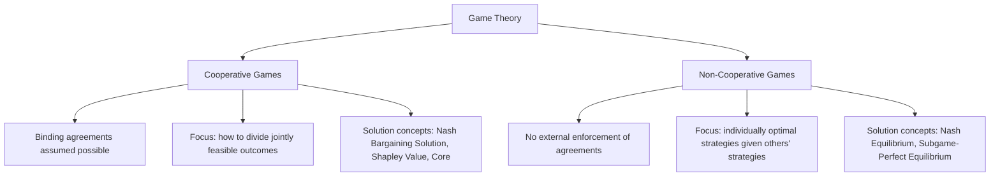
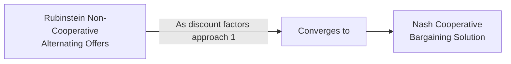

## Cooperative Versus Non-Cooperative Games

### Overview

The distinction between cooperative and non-cooperative game theory is the most fundamental methodological divide within game-theoretic bargaining theory, determining which analytical tools are appropriate for a given negotiation context. The distinction turns on a single question: **can the parties make binding, externally enforceable commitments?** This single assumption cascades into entirely different modeling approaches, solution concepts, and predictions.

**Key Points**

- Cooperative game theory takes coalition formation and binding commitment as given, and asks a purely **allocative** question: how should the achievable joint value be divided?
- Non-cooperative game theory takes strategic interaction without enforcement as the starting point, and asks a **behavioral/predictive** question: what strategies will self-interested players actually choose, given they cannot bindingly commit in advance?
- Most real-world contract negotiations sit in between: the *negotiation process itself* is non-cooperative (no binding commitment during bargaining), but the *resulting contract*, once signed, converts the interaction into an enforceable, cooperative-game-like commitment.

### Non-Cooperative Game Theory

**Defining assumption**: Players cannot make binding commitments to one another outside of what is directly specified within the game's own rules. Each player independently chooses a strategy to maximize their own payoff, taking into account the strategies available to (and rationally expected from) others.

**Primary solution concept — Nash Equilibrium**: A strategy profile where no player benefits from unilaterally deviating, given the strategies of others.

$$u_i(s_i^*, s_{-i}^*) \geq u_i(s_i, s_{-i}^*) \quad \forall s_i,\ \forall i$$

**Key extensions relevant to negotiation**:

- **Subgame-Perfect Equilibrium (SPE)**: refines Nash equilibrium for sequential (extensive-form) games by requiring that strategies be optimal at every possible decision point, not just along the equilibrium path — used to solve sequential bargaining models such as Rubinstein's alternating-offers game.
- **Bayesian Nash Equilibrium**: extends the concept to games of incomplete information, where players hold probabilistic beliefs about others' private information (e.g., a counterpart's true reservation price).

**Representative negotiation models**:

- **Rubinstein's alternating-offers bargaining model** (1982): derives a unique, immediate-agreement equilibrium division from sequential, non-cooperative offer-counteroffer behavior, driven by each party's relative patience (discount factor).
- **The Prisoner's Dilemma**: illustrates how individually rational, non-cooperative strategy choices (defection) can produce a jointly inferior outcome compared to mutual cooperation — directly analogous to the Negotiator's Dilemma between value-claiming and value-creating behavior.

**When this framework applies to negotiation**: During the live bargaining process itself, before any contract is signed — offers, counteroffers, threats, and concessions are not binding until final agreement, so parties' behavior is best modeled non-cooperatively even when the eventual goal is a cooperative (jointly binding) outcome.

### Cooperative Game Theory

**Defining assumption**: Players *can* make binding, enforceable agreements (whether through legal contract, credible reputation mechanisms, or an assumed external enforcement authority). The central question shifts from "what will each party do strategically?" to "given that any feasible joint outcome can be committed to, how should the achievable value be divided?"

**Primary solution concept — Nash Bargaining Solution**: For two-party bargaining, selects the unique division maximizing the product of utility gains above the disagreement point $(d_A, d_B)$, subject to four fairness axioms (Pareto efficiency, symmetry, invariance to utility scaling, independence of irrelevant alternatives):

$$(u_A^*, u_B^*) = \arg\max_{(u_A,u_B)\in S} (u_A - d_A)(u_B - d_B)$$

**Key extensions relevant to negotiation**:

- **The Core**: for multiparty coalition games, the set of allocations such that no sub-coalition could do better by breaking away and forming its own agreement — a stability concept central to multiparty joint ventures and alliance negotiations.
- **The Shapley Value**: a unique allocation rule based on each player's average marginal contribution across all possible orders of coalition formation, providing a "fair division" benchmark for multiparty settings (e.g., splitting costs or profits among three or more joint-venture partners).

**When this framework applies to negotiation**: Analyzing the *outcome space* of a negotiation once binding agreement is assumed achievable — e.g., structuring a final contract's terms, or dividing verified, jointly created surplus among coalition members in a multiparty deal.

### Structural Comparison

| Dimension | Cooperative Game Theory | Non-Cooperative Game Theory |
| --- | --- | --- |
| Commitment assumption | Binding agreements possible | No external enforcement |
| Central question | How to divide feasible joint value? | What strategies emerge from strategic interaction? |
| Primary solution concept | Nash Bargaining Solution, Shapley Value, Core | Nash Equilibrium, Subgame-Perfect Equilibrium |
| Modeling unit | Coalitions and their achievable value $v(S)$ | Individual strategies and payoff functions |
| Typical negotiation application | Dividing surplus after agreement is assumed feasible; multiparty allocation | Modeling live bargaining, offers/counteroffers, threats, incomplete information |
| Predictive vs. normative | Primarily normative (what division is "fair"?) | Primarily predictive (what will rational players actually do?) |

### The Bridge: How the Two Frameworks Interact in Real Negotiation

A useful way to see the two approaches as complementary rather than competing is to note that **non-cooperative bargaining models can be used to derive the same outcomes cooperative models assume**. Rubinstein's alternating-offers model (non-cooperative) converges, as both parties' discount factors approach 1 (negligible cost of delay), to the same even split predicted by the symmetric Nash Bargaining Solution (cooperative) — a result often described as providing a **non-cooperative foundation for cooperative bargaining theory**. This convergence is theoretically significant because it shows the "fair division" axioms of cooperative theory are not arbitrary — they can be derived from plausible non-cooperative strategic behavior under specific conditions.

**Key Points**

- This convergence result does not hold generally for all parameter values or all extensions of the model — it is a limiting-case result. [Inference — a precisely established theoretical result in the specific Rubinstein model, but its generalization to more complex bargaining settings depends on the model's assumptions]
- In practice, negotiators often move between these two lenses within a single negotiation: reasoning strategically and non-cooperatively during live bargaining (anticipating the counterpart's next move, managing threats and deadlines), then shifting to a cooperative-allocation mindset once a framework agreement is reached and the remaining task is dividing specified, jointly verified value.

### Worked Example: A Three-Party Joint Venture

Three companies (A, B, and C) are negotiating a joint venture, with the following value each possible coalition could generate on its own (in $ millions):

| Coalition | Value $v(S)$ |
| --- | --- |
| {A} | 2 |
| {B} | 3 |
| {C} | 1 |
| {A,B} | 8 |
| {A,C} | 6 |
| {B,C} | 7 |
| {A,B,C} | 15 |

**Cooperative framing (appropriate once binding agreement is assumed feasible)**: The question becomes how to divide the $15M three-way surplus. Using the **Shapley value**, each party's fair share is computed as their average marginal contribution across all six possible orderings in which the coalition could form — accounting for the fact that, e.g., Company B contributes disproportionately large marginal value when joining first (since {B} alone is worth more than {A} or {C} alone, and {A,B}/{B,C} pairs are worth more than {A,C}). This produces a normative division reflecting each party's genuine contribution to joint value, rather than an equal three-way split.

**Non-cooperative framing (appropriate during the actual negotiation process)**: Before any agreement is signed, each company can credibly threaten to instead form a smaller coalition (e.g., Company A could threaten to partner only with Company C, worth $6M, if Company B's demanded share is too large). This is where **the Core** becomes relevant as a stability check: any proposed three-way division must give each possible sub-coalition (and each individual party) at least as much as they could secure by defecting to that alternative coalition, or the three-way agreement will be unstable and prone to renegotiation or breakdown — directly analogous to a BATNA analysis extended to multiparty coalition contexts.

### Common Misapplications to Avoid

- **Applying cooperative-solution "fairness" concepts (like an equal split) during live, non-cooperative bargaining** without accounting for actual relative power, patience, and BATNA strength — the Nash Bargaining Solution assumes symmetry only under specific conditions and is not automatically the "fair" outcome real parties will or should reach.
- **Treating a live negotiation as fully cooperative before any binding commitment exists** — assuming the counterpart will honor an informal, non-binding understanding without recognizing the non-cooperative incentive to renege absent enforcement (relevant to contract drafting practices such as requiring signed term sheets or deposits to convert informal understandings into binding commitments).
- **Ignoring coalition/Core stability in multiparty deals** — a proposed division that satisfies overall efficiency but fails the Core condition for some sub-coalition is likely to be renegotiated or to collapse before signing, regardless of its aggregate fairness.

**Conclusion**

The cooperative/non-cooperative distinction is not merely a technical taxonomy but a practical diagnostic: it tells a negotiator which set of theoretical tools is appropriate at a given stage of a negotiation. During live, unenforceable bargaining — offers, counteroffers, threats, signaling — non-cooperative game theory (Nash equilibrium, subgame-perfect equilibrium, Rubinstein-style sequential models) is the right lens. Once agreement is assumed achievable and the task becomes dividing a specified joint surplus fairly and stably — particularly in multiparty settings — cooperative game theory (Nash Bargaining Solution, Shapley Value, the Core) provides the appropriate tools, with the two frameworks connected by formal convergence results that ground cooperative "fairness" concepts in plausible non-cooperative strategic foundations.

**Related Topics**

- Rubinstein's Alternating-Offers Model in Depth
- The Nash Bargaining Solution: Axioms and Derivation
- The Shapley Value: Formula and Multiparty Applications
- The Core and Coalition Stability in Multiparty Negotiations
- Subgame-Perfect Equilibrium in Sequential Bargaining
- Contract Enforcement as a Bridge from Non-Cooperative to Cooperative Outcomes
- Bayesian Games and Incomplete Information in Non-Cooperative Bargaining