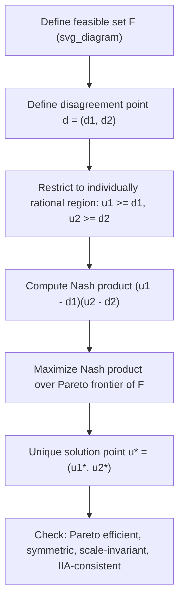

## The Nash Bargaining Solution

### Overview

The Nash Bargaining Solution (NBS) is a cooperative game-theoretic model developed by John Nash in 1950 that predicts the unique outcome of a two-party (or n-party) bargaining problem, given a set of axioms that any "reasonable" agreement should satisfy. It answers the question: given a set of feasible joint outcomes and a fallback point if negotiation fails, what division of value will rational bargainers agree to?

Unlike non-cooperative bargaining models (e.g., the Rubinstein alternating-offers model), the NBS does not model the bargaining process itself — offers, counteroffers, timing. Instead, it is an axiomatic solution concept: it specifies properties the outcome should have and proves that exactly one outcome satisfies all of them.

### The Bargaining Problem Formalized

A two-person bargaining problem is defined by a pair $(F, d)$:

- $F \subset \mathbb{R}^2$: the feasible set of achievable utility pairs $(u_1, u_2)$ that the two parties can jointly attain through agreement
- $d = (d_1, d_2)$: the disagreement point (also called the threat point or Best Alternative to a Negotiated Agreement, BATNA), representing the utilities each party receives if no agreement is reached

Standard technical assumptions on $F$:

- **Convexity**: $F$ is convex (achievable via lotteries/randomization over outcomes, or divisible goods)
- **Closed and bounded**: $F$ is compact
- **Non-empty and individually rational region exists**: there exists at least one point in $F$ where both parties do at least as well as at $d$

A bargaining solution is a function $f(F, d)$ that selects a single point in $F$ for every valid problem $(F, d)$.

### The Four Nash Axioms

Nash proved that exactly one solution function satisfies all four of the following axioms simultaneously.

**1. Pareto Efficiency**

The solution must be Pareto optimal: there is no other feasible point $(u_1', u_2') \in F$ such that $u_1' \geq u_1$ and $u_2' \geq u_2$, with at least one strict inequality. No value is left "on the table."

**2. Symmetry**

If the bargaining problem is symmetric — meaning $d_1 = d_2$ and $F$ is symmetric under swapping the players' utilities — then the solution must give both players equal utility gains. Identical bargaining power and identical positions imply identical outcomes.

**3. Invariance to Affine Transformations (Scale Invariance)**

If a player's utility function is rescaled by a positive affine transformation $u_i' = a_i u_i + b_i$ (with $a_i > 0$), the solution point transforms the same way. This reflects the fact that von Neumann-Morgenstern utility is only defined up to positive affine transformation — utility numbers themselves have no intrinsic meaning beyond ordering and risk attitudes.

**4. Independence of Irrelevant Alternatives (IIA)**

If $S \subseteq T$ are two feasible sets with the same disagreement point $d$, and the solution for the larger set $T$ happens to lie in the smaller set $S$, then that same point must also be the solution for $S$. Removing feasible alternatives that were never going to be chosen should not change the outcome.

This axiom is the most philosophically contested of the four (see Limitations below).

### The Nash Product and the Solution Formula

Nash's theorem states that the unique solution satisfying all four axioms is the point that maximizes the **Nash product** (also called the Nash welfare function):

$$\max_{(u_1, u_2) \in F} (u_1 - d_1)(u_2 - d_2)$$

subject to $u_1 \geq d_1$ and $u_2 \geq d_2$.

**Intuition**: each party's payoff is measured as a *surplus* over their disagreement point. The solution maximizes the product of these surpluses, not their sum. This product formulation is what generates the axioms above — in particular, it is the unique functional form invariant to independent affine rescaling of each player's utility.

For $n$ players, this generalizes to:

$$\max_{u \in F} \prod_{i=1}^{n} (u_i - d_i)$$

**Asymmetric (Generalized) Nash Bargaining Solution**

Dropping the symmetry axiom and replacing it with differential bargaining power $\alpha_1, \alpha_2$ (with $\alpha_1 + \alpha_2 = 1$) yields the generalized/asymmetric NBS:

$$\max_{(u_1, u_2) \in F} (u_1 - d_1)^{\alpha_1}(u_2 - d_2)^{\alpha_2}$$

Here $\alpha_i$ represents relative bargaining power, patience, or outside-option strength. This form is widely used in applied economics (e.g., wage bargaining, licensing negotiations) because pure 50/50 symmetric splits are often empirically unrealistic.

### Worked Example: Linear Pareto Frontier

Suppose two parties are dividing a fixed surplus of 100, so the feasible set is $u_1 + u_2 \leq 100$, $u_1, u_2 \geq 0$, and the disagreement point is $d = (0, 0)$.

Maximize $(u_1 - 0)(u_2 - 0) = u_1 u_2$ subject to $u_1 + u_2 = 100$ (Pareto boundary).

Substitute $u_2 = 100 - u_1$:

$$\max_{u_1} \; u_1(100 - u_1)$$

Taking the derivative and setting it to zero:

$$\frac{d}{du_1}\left[100u_1 - u_1^2\right] = 100 - 2u_1 = 0 \implies u_1 = 50$$

So $u_1 = u_2 = 50$: an even split, consistent with the symmetry axiom since $d_1 = d_2$ and the problem is symmetric.

**Example with asymmetric disagreement point**

Now suppose $d = (20, 10)$ with the same total-100 constraint. Maximize:

$$(u_1 - 20)(u_2 - 10) \quad \text{s.t.} \quad u_1 + u_2 = 100$$

Substitute $u_2 = 100 - u_1$:

$$\max_{u_1} (u_1 - 20)(90 - u_1)$$

Expand: $-u_1^2 + 110u_1 - 1800$. Derivative: $-2u_1 + 110 = 0 \implies u_1 = 55$.

So $u_1 = 55$, $u_2 = 45$. Each party's **surplus over disagreement** is equal: $55 - 20 = 35$ and $45 - 10 = 35$. This illustrates the general result for this linear (transferable utility) case: **the NBS splits the surplus-over-disagreement equally**, even though the final payoffs are unequal. The party with the better outside option (higher $d_i$) ends up with a higher final payoff, but the *gain from bargaining* is split evenly.

### Split-the-Difference Rule (Special Case)

For bargaining problems with a linear (transferable utility) Pareto frontier $u_1 + u_2 = c$, the NBS reduces to the **split-the-difference rule**:

$$u_i^* = d_i + \frac{1}{2}\left(c - d_1 - d_2\right)$$

Each party gets their disagreement payoff plus half of the total surplus available beyond both disagreement points combined. This is the formula demonstrated numerically above and is the most commonly cited "plain English" version of Nash bargaining in applied and business contexts.

### Diagram: Nash Bargaining Solution Geometry

**Geometric picture (SVG)**

<svg xmlns="http://www.w3.org/2000/svg" viewBox="0 0 480 380" font-family="sans-serif">
<text x="240" y="20" text-anchor="middle" font-size="14" font-weight="bold">Nash Bargaining Solution Geometry (svg_diagram)</text>
<line x1="60" y1="330" x2="440" y2="330" stroke="black" stroke-width="1.5" />
<line x1="60" y1="330" x2="60" y2="40" stroke="black" stroke-width="1.5" />
<text x="450" y="335" font-size="12">u1</text>
<text x="45" y="35" font-size="12">u2</text>
<path d="M 60 330 Q 250 60 420 90" fill="none" stroke="#2563eb" stroke-width="2" />
<text x="330" y="80" font-size="11" fill="#2563eb">Feasible set boundary (Pareto frontier)</text>
<circle cx="150" cy="260" r="4" fill="#dc2626" />
<text x="158" y="255" font-size="11" fill="#dc2626">d = (d1, d2) disagreement point</text>
<line x1="150" y1="260" x2="150" y2="330" stroke="#dc2626" stroke-dasharray="3,3" />
<line x1="150" y1="260" x2="60" y2="260" stroke="#dc2626" stroke-dasharray="3,3" />
<path d="M 150 260 Q 160 200 200 170" fill="none" stroke="#16a34a" stroke-width="1" stroke-dasharray="4,2" />
<circle cx="255" cy="140" r="5" fill="#16a34a" />
<text x="263" y="140" font-size="11" fill="#16a34a" font-weight="bold">u* = Nash Bargaining Solution</text>
<text x="80" y="170" font-size="10" fill="#555">Hyperbola: (u1-d1)(u2-d2)=k</text>
<path d="M 100 300 Q 180 220 300 160" fill="none" stroke="#999" stroke-width="1" stroke-dasharray="2,2" />
</svg>

The green point is the tangency between the highest attainable Nash-product hyperbola (contours of constant $(u_1-d_1)(u_2-d_2)$) and the Pareto frontier of $F$. This tangency condition is the geometric signature of the NBS: the solution lies where an isoquant of the Nash product is tangent to the feasible frontier.

### Relationship to Other Bargaining Concepts

| Concept | Relation to NBS |
| --- | --- |
| Rubinstein alternating-offers bargaining | [Inference] As the time between offers shrinks to zero and discount factors approach 1, the unique subgame-perfect equilibrium of the non-cooperative alternating-offers game converges to the Nash Bargaining Solution (Binmore-Rubinstein-Wolinsky result), giving the NBS a non-cooperative "Nash program" microfoundation |
| Kalai-Smorodinsky solution | An alternative axiomatic solution that replaces IIA with a monotonicity axiom; generally gives a different (often more "equitable" in a different sense) split than NBS |
| Egalitarian (Kalai) solution | Maximizes the minimum utility gain; equalizes payoff gains rather than their product |
| Utilitarian solution | Maximizes the unweighted sum $u_1 + u_2$; ignores fairness/symmetry considerations entirely |
| Shapley value | A cooperative solution concept for $n$-player coalitional games with transferable utility; conceptually related but derived from a different axiom set (additivity across games rather than IIA) |

### Applications

- **Wage and labor negotiations**: modeling union-firm bargaining over wages, with the firm's profit and worker's wage as the two payoffs and strike outcomes as the disagreement point
- **Divorce and property division**: legal and economic models use NBS-style equal-surplus-split reasoning as a normative benchmark
- **International trade and treaty negotiation**: dividing gains from trade agreements relative to no-agreement tariffs
- **Business partnerships and joint ventures**: profit-sharing formulas anchored to each party's outside option
- **Patent licensing**: royalty rate negotiations, often explicitly using the generalized (asymmetric) NBS with bargaining-power parameters calibrated from market data

### Limitations and Critiques

- **IIA is behaviorally fragile**: experimental bargaining studies frequently find that real negotiators' agreements are sensitive to the shape of the full feasible set, not just the disagreement point and final outcome, violating IIA. [Unverified] The magnitude of this violation varies substantially by experimental design and population studied.
- **Assumes cooperative, binding agreements**: NBS presumes parties can commit to and enforce the agreed split; it says nothing about the negotiation process, deception, or incomplete information.
- **Requires cardinal utility and a well-defined disagreement point**: in practice, quantifying $d_i$ (the true BATNA) and $u_i$ on a cardinal scale is often the hardest applied step, and estimates are frequently contested by the parties themselves.
- **Bargaining power ($\alpha_i$) is exogenous in the generalized version**: the model does not explain *where* bargaining power comes from (patience, risk aversion, outside options, information) — the Nash program and Rubinstein-style non-cooperative foundations were developed partly to address this gap.
- **Convexity assumption**: real feasible sets (e.g., indivisible goods, discrete deal terms) are often non-convex, requiring randomization or side-payments to restore the model's applicability.

### Next Steps

- **Related Topics**: Rubinstein Alternating-Offers Bargaining Model; The Nash Program (linking cooperative and non-cooperative game theory); Kalai-Smorodinsky Bargaining Solution; BATNA and Reservation Value Analysis; Asymmetric Information in Bargaining (Myerson-Satterthwaite); Coalitional Games and the Shapley Value; Zeuthen-Harsanyi Bargaining Model; Risk Aversion and Its Effect on Bargaining Outcomes