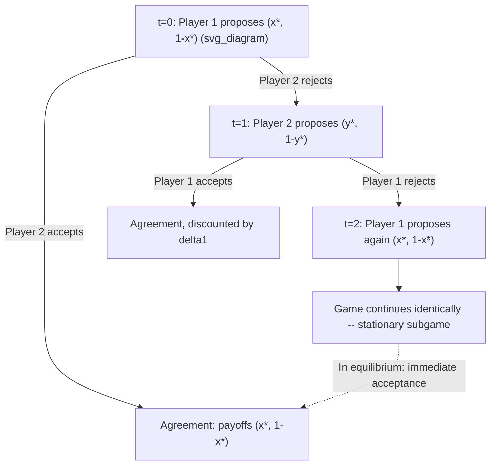

## Rubinstein's Alternating-Offers Model

### Overview

Rubinstein's Alternating-Offers Model (Ariel Rubinstein, 1982) is a non-cooperative, extensive-form game that models bargaining as an explicit sequential process of offers and counteroffers, rather than as an axiomatic outcome. Two players alternate making proposals for how to divide a surplus (typically normalized to size 1). The key innovation is that Rubinstein proved this game has a **unique subgame-perfect equilibrium (SPE)**, resolving the indeterminacy problem that plagued earlier bargaining models — where infinitely many splits could be supported as Nash equilibria if players could threaten arbitrary rejections.

This model forms the non-cooperative counterpart to the Nash Bargaining Solution and is the centerpiece of the "Nash program": using explicit strategic models to provide microfoundations for cooperative solution concepts.

### The Game Setup

Two players, 1 and 2, bargain over the division of a pie of size 1.

**Timing**:

- At $t = 0$, Player 1 proposes a split $(x, 1-x)$ where $x \in [0,1]$ is Player 1's share
- Player 2 either **accepts** (game ends, payoffs realized) or **rejects** (game continues)
- If rejected, at $t = 1$, Player 2 makes a counteroffer $(y, 1-y)$
- Player 1 accepts or rejects, and so on, alternating indefinitely if no agreement is reached

**Discounting**: Each player has a discount factor $\delta_i \in (0,1)$, reflecting impatience or the cost of delay. If agreement on split $(x, 1-x)$ is reached at time $t$, payoffs are:

$$u_1 = \delta_1^t x, \qquad u_2 = \delta_2^t (1-x)$$

Discounting is what makes delay costly and is the mechanism that pins down a unique equilibrium — without it (or without any other friction), the game reduces to the indeterminate repeated-game case.

### The Unique Subgame-Perfect Equilibrium

**Result**: There exists a unique SPE. Player 1's equilibrium offer (as first proposer) gives Player 1 the share:

$$x^* = \frac{1 - \delta_2}{1 - \delta_1 \delta_2}$$

and Player 2 accepts immediately. Player 2's share is:

$$1 - x^* = \frac{\delta_2(1-\delta_1)}{1 - \delta_1 \delta_2}$$

**Derivation logic (one-shot deviation / stationarity argument)**:

Because the game is stationary (the subgame starting at any even period looks identical to the game at $t=0$, and likewise for odd periods), the equilibrium offers can be characterized by two numbers: $x^*$ (what Player 1 offers/gets as proposer) and $y^*$ (what Player 2 offers, giving Player 1 the residual, as proposer).

The key equilibrium conditions are that each player must be exactly indifferent between accepting the other's offer now and rejecting to become the proposer next period (any offer must leave the responder with **exactly** their continuation value, since a rational proposer never leaves surplus on the table):

$$1 - x^* = \delta_2 (1 - y^*) \quad \text{(Player 2 indifferent between accepting } x^* \text{ and waiting to counteroffer)}$$

$$y^* = \delta_1 x^* \quad \text{(Player 1 indifferent between accepting Player 2's offer and waiting to counteroffer)}$$

Solving these two equations simultaneously yields:

$$x^* = \frac{1-\delta_2}{1-\delta_1\delta_2}$$

**Worked numerical example**: Let $\delta_1 = 0.9$, $\delta_2 = 0.8$.

$$x^* = \frac{1 - 0.8}{1 - (0.9)(0.8)} = \frac{0.2}{1 - 0.72} = \frac{0.2}{0.28} \approx 0.714$$

Player 1 gets approximately 71.4% of the pie, Player 2 gets approximately 28.6%, and agreement is reached **immediately** in equilibrium (no actual delay occurs on the equilibrium path — the threat of delay, not delay itself, disciplines the offers).

### Comparative Statics: The Role of Patience

| Parameter change | Effect on $x^*$ (Player 1's share) |
| --- | --- |
| $\delta_1 \to 1$ (Player 1 infinitely patient), $\delta_2$ fixed | $x^* \to 1$; Player 1 captures nearly the entire pie |
| $\delta_2 \to 1$ (Player 2 infinitely patient), $\delta_1$ fixed | $x^* \to 0$; Player 1's share collapses |
| $\delta_1 = \delta_2 = \delta$ | $x^* = \frac{1}{1+\delta}$, which is always $> \frac{1}{2}$ for $\delta < 1$ — the **first proposer has an advantage** |
| $\delta_1 = \delta_2 \to 1$ (both infinitely patient, symmetric) | $x^* \to \frac{1}{2}$: the first-mover advantage vanishes and the split converges to an even 50/50 division |

**Key intuitive result**: bargaining power in this model derives entirely from **relative patience** (or equivalently, relative cost of delay), not from any explicit "threat" or coercive action. A player who cares less about delay can afford to hold out for a better share.

### Convergence to the Nash Bargaining Solution

[Inference — established result, Binmore-Rubinstein-Wolinsky 1986] As the time interval between offers shrinks toward zero (offers can be made almost continuously) and both discount factors approach 1 at a common rate reflecting a shared discount rate $r$, or more generally as $\delta_1, \delta_2 \to 1$ with the ratio $\frac{\ln \delta_1}{\ln \delta_2}$ held fixed, the unique SPE split converges to the (generalized) Nash Bargaining Solution, with bargaining-power weights determined by relative discount rates:

$$x^* \to \frac{\ln \delta_2}{\ln \delta_1 + \ln \delta_2} \quad \text{(in the symmetric-friction limit)}$$

This is the formal bridge of the "Nash program": it shows that the axiomatically-derived NBS can be **implemented** as the equilibrium of a plausible, explicit, non-cooperative negotiation protocol, rather than assumed as a black-box cooperative outcome.

### Diagram: Game Tree and Equilibrium Structure

<svg xmlns="http://www.w3.org/2000/svg" viewBox="0 0 500 300" font-family="sans-serif">
<text x="250" y="20" text-anchor="middle" font-size="14" font-weight="bold">Alternating Offers Timeline (svg_diagram)</text>
<line x1="40" y1="150" x2="460" y2="150" stroke="black" stroke-width="1.5" />
<circle cx="80" cy="150" r="5" fill="#2563eb" />
<text x="65" y="130" font-size="11">t=0</text>
<text x="50" y="180" font-size="10">P1 offers x*</text>
<circle cx="200" cy="150" r="5" fill="#dc2626" />
<text x="185" y="130" font-size="11">t=1</text>
<text x="165" y="180" font-size="10">P2 offers y* (if rejected)</text>
<circle cx="320" cy="150" r="5" fill="#2563eb" />
<text x="305" y="130" font-size="11">t=2</text>
<text x="280" y="180" font-size="10">P1 offers x* again</text>
<text x="420" y="150" font-size="20">...</text>
<path d="M 80 150 L 200 150" stroke="#16a34a" stroke-width="3" stroke-dasharray="0" />
<text x="90" y="110" font-size="11" fill="#16a34a" font-weight="bold">Equilibrium: accepted immediately at t=0</text>
</svg>

### Why the Equilibrium Is Unique: The One-Deviation / "Shrinking the Gap" Proof Idea

Rubinstein's original uniqueness proof uses a clever bounding argument:

1. Let $\overline{M}_1$ be the supremum and $\underline{M}_1$ the infimum of Player 1's payoff across all SPEs.
2. In any SPE, Player 2 (as responder) must accept any offer strictly better than what Player 2 could get by rejecting and becoming proposer next period; this bounds Player 1's offer from above and below using $\overline{M}_1$ and $\underline{M}_1$ recursively (since the subgame after rejection is identical to the original game).
3. These recursive bounds force $\overline{M}_1 = \underline{M}_1$, i.e., the equilibrium payoff is a single point, not an interval — hence uniqueness.

This technique (sometimes called the "gap" or "gap-shrinking" argument) is a hallmark proof method for uniqueness in infinite-horizon stationary bargaining games and generalizes to related models with outside options or risk of breakdown.

### Extensions and Variants

| Variant | Key modification | Effect on equilibrium |
| --- | --- | --- |
| **Outside options** | Each player can exit to a fixed outside-option payoff at any point instead of continuing to bargain | If the outside option exceeds what the alternating-offers equilibrium would give a player, it becomes binding and raises that player's share (the "outside option principle") |
| **Risk of breakdown** (Binmore) | With probability $p$ each period, negotiation exogenously ends in disagreement instead of continuing | As $p \to 0$ this converges to the discounting model; relative risk of breakdown plays the role relative impatience plays in the baseline model |
| **Fixed bargaining costs** | Players pay a fixed cost per period of delay instead of discounting utility multiplicatively | Produces a similar unique-SPE structure but with additive rather than multiplicative surplus shrinkage |
| **Incomplete information** | Players uncertain about the other's valuation, discount factor, or type | [Unverified] Uniqueness generally breaks down; equilibria typically involve delay (costly signaling), connecting to the broader literature on bargaining under asymmetric information (e.g., Myerson-Satterthwaite impossibility) |
| **$n$-player extensions** | More than two bargainers, possibly with coalition formation | [Inference] Substantially more complex; equilibrium characterization depends heavily on the specific proposer-selection and coalition-formation protocol assumed |

### Relationship to the Nash Bargaining Solution

| Dimension | Nash Bargaining Solution | Rubinstein Alternating-Offers |
| --- | --- | --- |
| Approach | Cooperative / axiomatic | Non-cooperative / strategic (extensive-form) |
| Primitives | Feasible set $F$, disagreement point $d$ | Discount factors $\delta_1, \delta_2$, offer protocol |
| Solution concept | Unique point satisfying 4 axioms | Unique subgame-perfect equilibrium |
| Process modeled? | No — treats bargaining as a black box | Yes — explicit sequence of offers/rejections |
| Source of "bargaining power" | Exogenous (in generalized/asymmetric version, via $\alpha_i$) | Endogenous — derived from relative patience/discount rates |
| Connection | NBS is the limiting case of the alternating-offers SPE as frictions vanish | Provides the non-cooperative "implementation" of NBS |

### Applications

- **Labor and wage negotiations**: modeling strike costs as the discounting/delay friction
- **International treaty and trade negotiations**: relative national "patience" (political urgency, election cycles) as a determinant of negotiated terms
- **Real estate and price negotiation**: buyer/seller alternating counteroffers with time-on-market costs as the discount factor
- **Corporate M&A negotiations**: modeling deal-timeline pressure as a source of bargaining leverage
- **Legal settlement bargaining**: litigation cost accrual per round modeled as the discounting mechanism

### Limitations and Critiques

- **Rigid protocol assumption**: the model assumes a fixed, commonly-known alternating structure (who moves when); real negotiations often have more flexible or contested procedural rules. [Unverified] Sensitivity of the equilibrium split to relaxing strict alternation is an active area of extension in the literature.
- **Common knowledge of discount factors**: the baseline model assumes both players know both $\delta_1$ and $\delta_2$; introducing private information about patience substantially complicates the analysis and typically destroys the sharp uniqueness result.
- **No modeling of emotions, fairness norms, or reference points**: purely payoff-maximizing rationality is assumed; behavioral bargaining research documents systematic deviations (e.g., anchoring, fairness-based rejections as in ultimatum-game experiments).
- **Infinite horizon assumption**: the stationarity that drives uniqueness relies on an infinite (or at least sufficiently long and stationary) horizon; finite-horizon alternating-offer games have different equilibrium structures, typically solved by backward induction from a known end date.

### Next Steps

- **Related Topics**: The Nash Bargaining Solution; The Nash Program (cooperative-noncooperative game theory bridge); Ultimatum Game and Behavioral Deviations; Outside Options and the Outside Option Principle; Bargaining Under Incomplete Information (Myerson-Satterthwaite Theorem); Repeated Games and the Folk Theorem; Subgame Perfect Equilibrium and Backward Induction