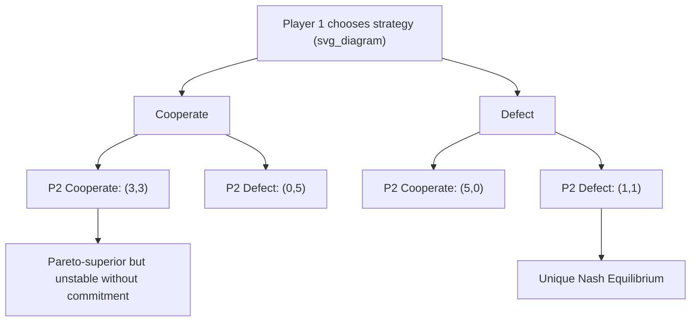

## The Prisoner's Dilemma and Strategic Interdependence


### Overview

The Prisoner's Dilemma (PD) is the canonical game in non-cooperative game theory illustrating how individually rational decisions can produce a collectively suboptimal outcome. It formalizes **strategic interdependence**: the idea that a rational actor's optimal choice depends on what others are expected to choose, and vice versa — a mutual dependency that classical (non-strategic) decision theory cannot capture. In negotiation theory, the PD is foundational because it demonstrates why cooperation (e.g., honest information-sharing, joint value-creation, honoring informal agreements) is often individually tempting to abandon even when mutual cooperation would benefit both parties.

### Canonical Payoff Structure

Two players, each independently choosing to **Cooperate (C)** or **Defect (D)**, without communication or binding commitment.

|  | Player 2: Cooperate | Player 2: Defect |
| --- | --- | --- |
| **Player 1: Cooperate** | $(R, R)$ | $(S, T)$ |
| **Player 1: Defect** | $(T, S)$ | $(P, P)$ |

Where:

- $R$ = Reward for mutual cooperation
- $T$ = Temptation to defect (unilateral defection payoff)
- $S$ = Sucker's payoff (cooperating while the other defects)
- $P$ = Punishment for mutual defection

**Defining condition** (this ordering is what makes it a Prisoner's Dilemma):

$$T > R > P > S$$

A common numerical example:

|  | Cooperate | Defect |
| --- | --- | --- |
| **Cooperate** | $(3, 3)$ | $(0, 5)$ |
| **Defect** | $(5, 0)$ | $(1, 1)$ |

Here $T=5, R=3, P=1, S=0$, satisfying $T > R > P > S$.

An additional common requirement for the **repeated** version is $2R > T + S$, ensuring that alternating exploitation is not more efficient than sustained mutual cooperation.

### Why Defection Is the Dominant Strategy

**Dominant strategy** definition: a strategy that yields a strictly higher payoff regardless of what the opponent does.

Check Player 1's best response to each of Player 2's choices:

- If Player 2 cooperates: Player 1 gets $R=3$ from cooperating vs. $T=5$ from defecting → defect is better
- If Player 2 defects: Player 1 gets $S=0$ from cooperating vs. $P=1$ from defecting → defect is better

Since defection strictly dominates cooperation regardless of the opponent's action, **(Defect, Defect)** is the unique Nash Equilibrium — no player can improve their payoff by unilaterally deviating.

$$\text{NE} = (D, D) \rightarrow (P, P) = (1, 1)$$

This is Pareto-dominated by $(C, C) \rightarrow (3, 3)$: both players would be strictly better off if they could jointly commit to cooperation, yet rational, self-interested, non-communicating play leads them to the worse outcome. This gap between individually rational and collectively rational outcomes is the central lesson of the game.

### Formal Solution Concepts Applied

**Strict dominance elimination**: since Defect strictly dominates Cooperate for both players, iterated elimination of dominated strategies immediately yields $(D,D)$ as the unique surviving outcome — no iteration is even required beyond one round.

**Nash Equilibrium verification**:

$$u_1(D, D) = P \geq u_1(C, D) = S \quad \checkmark$$


$$u_2(D, D) = P \geq u_2(D, C) = S \quad \checkmark$$

Both conditions hold given $P > S$, confirming $(D,D)$ is a Nash Equilibrium, and it is the *only* one in the one-shot game.

### Diagram: Payoff and Equilibrium Structure



<svg xmlns="http://www.w3.org/2000/svg" viewBox="0 0 480 320" font-family="sans-serif">
<text x="240" y="20" text-anchor="middle" font-size="14" font-weight="bold">Prisoner's Dilemma Payoff Space (svg_diagram)</text>
<line x1="60" y1="270" x2="420" y2="270" stroke="black" stroke-width="1.5" />
<line x1="60" y1="270" x2="60" y2="40" stroke="black" stroke-width="1.5" />
<text x="430" y="275" font-size="12">u1</text>
<text x="45" y="35" font-size="12">u2</text>
<circle cx="220" cy="150" r="5" fill="#16a34a" />
<text x="230" y="145" font-size="11" fill="#16a34a">(C,C) = (3,3) Pareto optimal</text>
<circle cx="340" cy="230" r="5" fill="#dc2626" />
<text x="350" y="235" font-size="11" fill="#dc2626">(D,D) = (1,1) Nash Equilibrium</text>
<circle cx="140" cy="270" r="5" fill="#555" />
<text x="90" y="290" font-size="10">(C,D)=(0,5)</text>
<circle cx="380" cy="100" r="5" fill="#555" />
<text x="330" y="90" font-size="10">(D,C)=(5,0)</text>
<line x1="220" y1="150" x2="340" y2="230" stroke="#999" stroke-dasharray="4,3" />
<text x="235" y="200" font-size="10" fill="#999">Mutual defection dominates</text>
</svg>

### Strategic Interdependence: The Core Conceptual Contribution

Strategic interdependence refers to decision situations where **each party's optimal action is a function of the other party's expected action**, in contrast to parametric (non-strategic) decisions where the environment is fixed and unresponsive. The PD isolates this concept in its purest form:

- Absent interdependence, a player would simply pick whichever action has the highest expected payoff evaluated against a fixed environment
- With interdependence, the "environment" is another intentional actor whose choice depends recursively on beliefs about *your* choice
- Game theory resolves this circularity via equilibrium concepts (Nash Equilibrium and refinements) rather than direct optimization

In negotiation contexts, strategic interdependence manifests as: whether to disclose private information, whether to make concessions, whether to honor a handshake agreement before contracts are signed, and whether to invest in trust-building measures — all of which carry PD-like temptation-to-defect structures when the other party's reciprocal behavior cannot be perfectly verified or enforced.

### The Repeated Prisoner's Dilemma and Cooperation

The stark defect-defect prediction is specific to the **one-shot** game. Repetition changes the strategic calculus substantially.

**Finitely repeated PD**: [Well-established backward-induction result] If the game is repeated a known, finite number of times, backward induction unravels cooperation entirely. In the last round, defection is dominant (identical to the one-shot game, since there's no future to protect). Anticipating this, the second-to-last round also collapses to mutual defection, and by induction, defection is the unique subgame-perfect equilibrium in *every* round — this is known as the **chain-store paradox** / backward induction paradox.

**Infinitely (or indefinitely) repeated PD**: With no known final round (or a constant per-round continuation probability $\delta$), cooperation *can* be sustained as a subgame-perfect equilibrium via the **Folk Theorem**, provided players are sufficiently patient. A canonical supporting strategy is:

- **Grim Trigger**: Cooperate until the opponent defects once, then defect forever
- **Tit-for-Tat**: Cooperate on the first move; thereafter, replicate the opponent's previous move

**Condition for cooperation to be sustainable under Grim Trigger** (against Grim Trigger itself): a player cooperates as long as the discounted value of continued cooperation exceeds the one-time gain from defecting followed by permanent punishment:

$$\frac{R}{1-\delta} \geq T + \frac{\delta P}{1-\delta}$$

Solving for the discount factor threshold:

$$\delta \geq \frac{T - R}{T - P}$$

Using the numerical example ($T=5, R=3, P=1$):

$$\delta \geq \frac{5-3}{5-1} = \frac{2}{4} = 0.5$$

So if both players value future payoffs enough (discount factor at least 0.5 in this example), sustained mutual cooperation is a valid subgame-perfect equilibrium — cooperation becomes rational precisely because defection triggers a credible, costly future punishment.

### Diagram: Cooperation Sustainability Condition

```mermaid
flowchart LR
    A["One-shot PD (svg_diagram)"] -->|No future consequences| B["Unique NE: (D,D)"]
    C["Finitely repeated PD, known horizon"] -->|Backward induction| B
    D["Infinitely / indefinitely repeated PD"] -->|delta >= (T-R)/(T-P)| E["Cooperation sustainable via Grim Trigger / Tit-for-Tat"]
    D -->|delta below threshold| B
```

### Relevance to Negotiation Theory

| PD Concept | Negotiation Application |
| --- | --- |
| Temptation to defect ($T$) | Reneging on an informal agreement once the counterpart has already made concessions |
| Sucker's payoff ($S$) | Unilateral disclosure of reservation price/BATNA exploited by the other side |
| Mutual defection equilibrium | Adversarial, positional bargaining that leaves joint value uncaptured (failure to "expand the pie") |
| Repeated-game cooperation | Reputation effects in long-term business relationships; why repeat dealings sustain trust that one-shot transactions cannot |
| Grim Trigger / Tit-for-Tat | Real-world reciprocity norms and retaliation-based enforcement of informal deal terms |
| Discount factor $\delta$ | The shadow of the future — how much parties value the ongoing relationship relative to a one-time gain |

This is why negotiation theorists emphasize **integrative bargaining** (converting a PD-like zero/negative-sum dynamic into a positive-sum one via information exchange, trust-building mechanisms, and enforceable contracts) as a way to escape the mutual-defection trap that pure non-cooperative, one-shot logic predicts.

### Limitations and Critiques

- **Fixed, known, common-knowledge payoffs**: real negotiations rarely have cleanly quantified, mutually known payoff matrices; ambiguity about the other party's true payoffs changes the strategic analysis substantially.
- **Binary action space**: the stark C/D dichotomy is a simplification; real bargaining involves continuous concessions, partial disclosure, and graduated trust-building that the basic PD does not capture.
- **Behavioral deviations from prediction**: [Unverified — experimental magnitude varies widely by population and stakes] Experimental economics robustly finds cooperation rates in one-shot PD games well above the 0% predicted by the Nash equilibrium, attributed to social preferences (altruism, reciprocity, fairness norms) not captured in the standard payoff-maximizing model.
- **Assumes no external enforcement**: the dilemma dissolves if a third-party enforcement mechanism (contracts, legal recourse, reputation systems, escrow) can credibly punish defection — much of institutional and contract design theory addresses exactly this workaround.

### Next Steps

- **Related Topics**: The Nash Bargaining Solution; Rubinstein's Alternating-Offers Model; The Folk Theorem and Repeated Games; Tit-for-Tat and Evolution of Cooperation (Axelrod); Trust and Reputation Mechanisms in Negotiation; Integrative vs. Distributive Bargaining; Backward Induction and the Chain-Store Paradox; Mechanism Design and Enforcement in Contracts